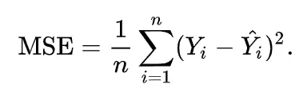
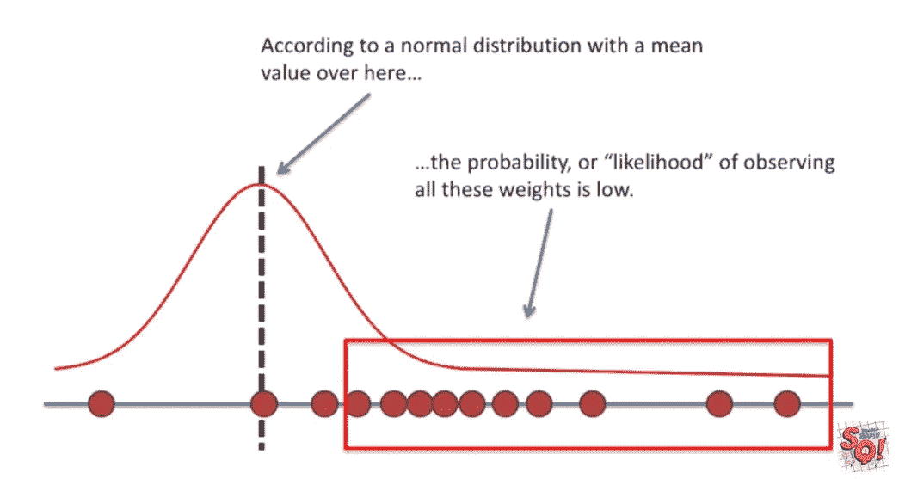

# 线性回归的 MSE 与 MLE

> 原文：<https://medium.com/analytics-vidhya/mse-vs-mle-for-linear-regression-f4ce3f6b990e?source=collection_archive---------2----------------------->


特里·维里斯迪斯在 [Unsplash](https://unsplash.com?utm_source=medium&utm_medium=referral) 上的照片

什么是 MSE？

[估计器](https://en.wikipedia.org/wiki/Estimator)的**均方误差** ( **MSE** )或**均方偏差** ( **MSD** )(用于估计未观察量的过程)测量[误差](https://en.wikipedia.org/wiki/Error_(statistics))的平方的[平均值](https://en.wikipedia.org/wiki/Expected_value)——即估计值与实际值之间的平均平方差



MLE 是什么？



来源:[Josh Starmer 的 stat quest](https://www.youtube.com/watch?v=XepXtl9YKwc&t=197s)

**最大似然估计** ( **MLE** )是一种通过[最大化](https://en.wikipedia.org/wiki/Mathematical_optimization)一个[似然函数](https://en.wikipedia.org/wiki/Likelihood_function)来[估计](https://en.wikipedia.org/wiki/Estimation_theory)一个[概率分布](https://en.wikipedia.org/wiki/Probability_distribution)的[参数](https://en.wikipedia.org/wiki/Statistical_parameter)的方法，使得在假定的[统计模型](https://en.wikipedia.org/wiki/Statistical_model)下[观测数据](https://en.wikipedia.org/wiki/Realization_(probability))最有可能。

基本上我们

1.  首先假设数据来自某个分布
2.  然后，我们随机选择一些分布参数
3.  然后，我们计算假设分布下观测数据的似然性
4.  然后，我们使用优化算法，如梯度下降，通过最大化似然性来找到我们假设分布的最佳参数

[延伸阅读](https://en.wikipedia.org/wiki/Maximum_likelihood_estimation)

# 线性回归的 MSE 与 MLE

本文的目标是从经验上看 MSE 得出的估计值是否与 MLE 方法得出的估计值相似(相同)

# 生成数据

```
## Random X from normal distribution
 x <- rnorm(100 , mean = 20)## Let this be the "True" Phenomenon b0 <- 10
 b1 <- 20 y <- b1*x + b0 + rnorm(100)## Convert to dataframe
 df <- data.frame(x = x , y = y)
 head(df)## x y
 ## 1 21.02084 430.5484
 ## 2 19.60804 401.8297
 ## 3 21.19639 434.3705
 ## 4 19.05572 392.9510
 ## 5 18.55657 381.0414
 ## 6 21.69841 445.1470
```

# MSE 估计

```
model <- lm(data = df , formula = y ~ x)
 summary(model)
```

模型摘要

```
## 
 ## Call:
 ## lm(formula = y ~ x, data = df)
 ## 
 ## Residuals:
 ## Min 1Q Median 3Q Max 
 ## -2.4102 -0.7222 -0.1791 0.7138 2.7849 
 ## 
 ## Coefficients:
 ## Estimate Std. Error t value Pr(>|t|) 
 ## (Intercept) 10.800 2.249 4.803 5.63e-06 ***
 ## x 19.964 0.112 178.206 < 2e-16 ***
 ## — -
 ## Signif. codes: 0 ‘***’ 0.001 ‘**’ 0.01 ‘*’ 0.05 ‘.’ 0.1 ‘ ‘ 1
 ## 
 ## Residual standard error: 1.095 on 98 degrees of freedom
 ## Multiple R-squared: 0.9969, Adjusted R-squared: 0.9969 
 ## F-statistic: 3.176e+04 on 1 and 98 DF, p-value: < 2.2e-16
```

*   我们看到我们的模型在使用 MSE 估计真实参数方面做得很好——截距估计为 10.8，b1 估计为 19.964

```
## (Intercept) 10.800 
 ## x 19.964 
```

# 最大似然估计

```
loglikelihood <- function(b0 , b1){
 -sum(dnorm(df$y — df$x*b1 — b0 , log=TRUE))
 #-sum(log(R))
 } library(stats4)
mle(loglikelihood, start = list(b0 = 1 , b1 = 1))## 
 ## Call:
 ## mle(minuslogl = loglikelihood, start = list(b0 = 1, b1 = 1))
 ## 
 ## Coefficients:
 ## b0 b1 
 ## 10.80034 19.96405
```

# 这是魔法还是什么？？！！！

我们看到 MLE 估计等于 MSE 估计！

为什么？

这是[的数学证明](https://www.jessicayung.com/mse-as-maximum-likelihood/)