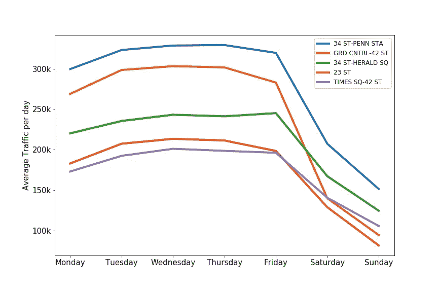
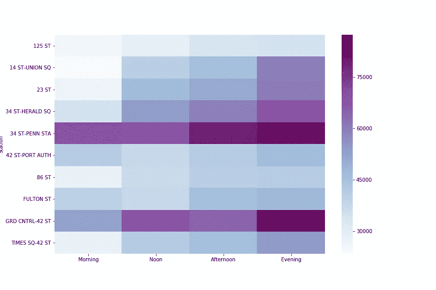
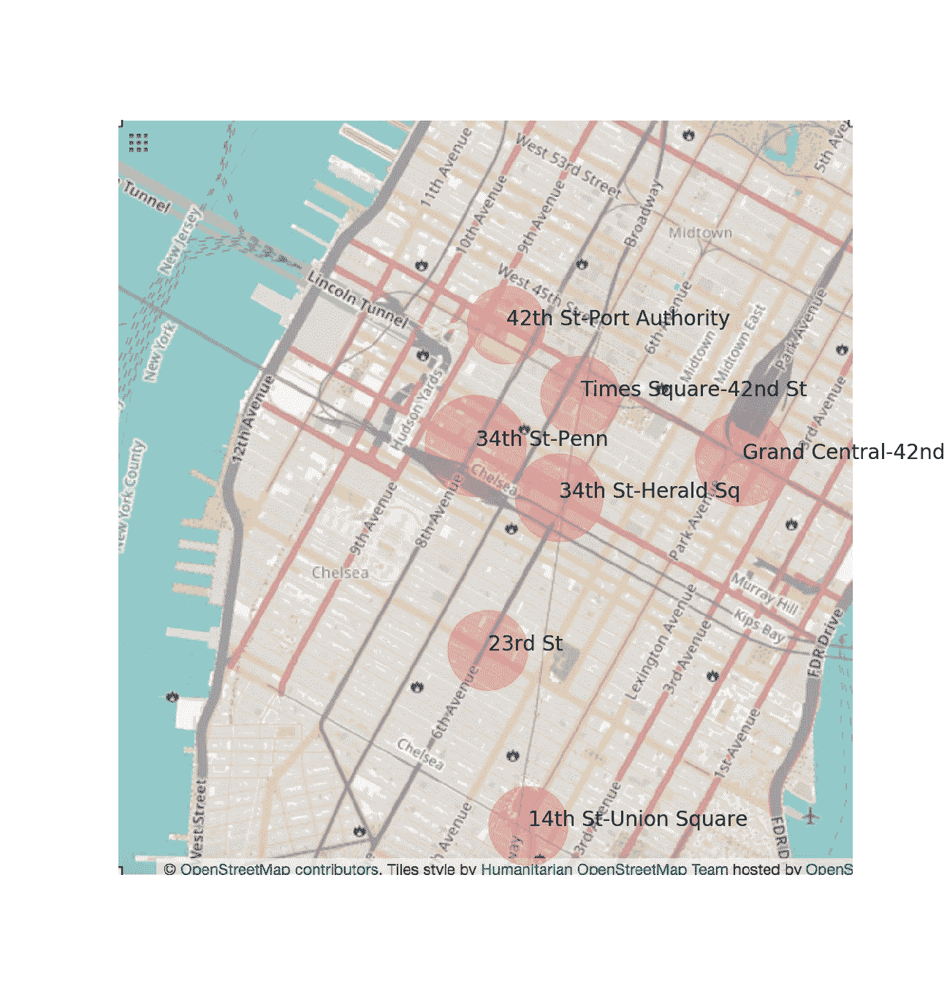

# MTA 十字转门数据:简单的探索性数据分析

> 原文：<https://medium.com/analytics-vidhya/mta-turnstile-data-simple-exploratory-data-analysis-a46324d3ca96?source=collection_archive---------17----------------------->

WTWY (WomenTechWomenYes)团队希望在纽约市举办他们的年度晚会并吸引参与者。但是，他们在部署街道小组方面存在资源限制，并请求我们帮助确定有效的部署策略。我们选择了 MTA 十字转门数据作为开始，并使用简单的 EDA 技术提出了三个主要建议。

## **准备:数据清洗**

从 MTA 网站获取数据后，像任何真实世界的数据一样，MTA 十字转门数据需要一些清洗，过滤和处理，以提供分析。

首先，我们注意到十字转门的计数是以累积的方式记录的。人们会认为数据会不断增加。但是，我们发现了一些问题:

1.  十字转门的计数可以在任何时间重置为任何数字。人们会认为重置行为意味着重置为零。然而，在观察了几个例子之后，有一些十字转门似乎被“重置”为一个低于先前计数的随机数。
2.  有时十字转门会倒计数。人们会观察到数据条目略有下降。我们取这种异常数据点的绝对差值。

唯一标识符很重要，但它们并不总是可读的。人们可能认为使用站名作为每个站的标识符就足够了，但是站名并不总是以标准方式报告(人为错误！).此外，为每个十字转门分配一个唯一的 ID 将有助于识别每个十字转门的运行情况，因为我们从上面的观察中知道有一些异常行为。

在获得干净的数据后，我们准备好进行一些分析。

## **结果:分析！**

**建议 1:如果资源有限，关注前 10 家电视台**

我们希望通过绘制直方图对数据有一个总体的感觉。我们绘制了 10 个人口最多的车站以及总客流量的累计百分比。

图表显示，关注排名前十的车站意味着关注纽约大约 20%的乘客。这是一个良好的开端，我们希望更深入地挖掘数据集。

建议 2:关注工作日而不是周末

我们也想了解这些电视台是否受游客欢迎，因为他们不太可能参加 WTWY 的晚会。为了快速识别车站是否挤满了游客，我们将放大工作日或周末的客流量。

我们发现大多数车站游客不多。提取旅游站点列表后，我们确认它没有与我们刚刚确定的前 10 个站点重叠。因此，我们将继续探索刚刚确定的前 10 个站点。

流量最大的五个车站如下图所示。有一个有趣的观察，车站在工作日比周末更拥挤。一个可能的原因是这些车站位于商业中心附近，人们利用它们上下班。

**建议 3:尽可能考虑重新分配资源**

下面的热图显示了每个站点在一天中的某段时间有多忙。我们观察到不同的站点有不同的高峰期。例如，第 34 街宾州车站在下午比中午更繁忙，而中央车站第 42 街车站在中午比下午更繁忙。我们可以考虑在资源有限的情况下，下午将中央 42 街车站的部分队伍重新部署到 34 街宾州车站。

时间段内的交通热图；早上:早上 6 点到 10 点；中午:上午 10 点到下午 2 点；下午:下午 2 点到 6 点；晚上:下午 6 点到 10 点

为了更好地说明这一发现，我们还查看了站点的地理位置，以了解这种重新部署是否可能。人口最多的车站大多位于曼哈顿中城，这使得重新部署几乎没有成本。

纽约市客流量最大的前 7 个车站；气泡图的大小代表总交通流量