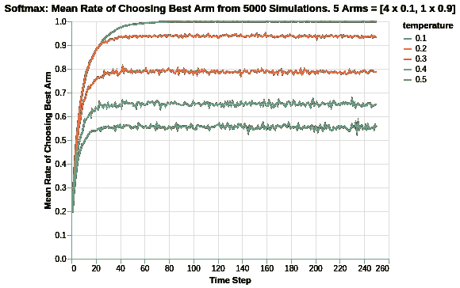

# Softmax 算法的多臂土匪分析

> 原文：<https://medium.com/analytics-vidhya/multi-armed-bandit-analysis-of-softmax-algorithm-e1fa4cb0c422?source=collection_archive---------6----------------------->

超越了[ε贪婪算法](/@kfoofw/multi-armed-bandit-analysis-of-epsilon-greedy-algorithm-8057d7087423)，Softmax 算法提供了进一步的优化，以提高探索期间的奖励机会。

为了获得更好的直觉，考虑 2 个伯努利臂的以下两种情况:

*   第一只手平均奖励 0.1，而另一只手平均奖励 0.9。
*   第一只手平均奖励 0.1，而另一只手平均奖励 0.11。

在两种情况下都使用 Greedy，对于指定的ε百分比的探索试验，算法将在两种情况下在两个分支之间随机选择，而不管两个分支之间的平均回报有多不同。

这就是 Softmax 算法可以提供的优化解决方案的机会所在。对于任何给定的回合，不是统一地探索所有的武器，而是根据它们当前平均奖励的差异提供不同机会的武器。

总之，Softmax 建议在每个给定回合选择每个手臂的概率分布如下:


其中`r_i`代表当前回合每只手臂的当前奖励回报平均值。

`tau`参数是一个超参数，最终决定随机化的程度。

*   当`tau`很大时，所有分支的总指数元素接近合成值 1，因此探索任何特定分支的机会是 1。
*   当`tau`较小时，每个分支的总指数元素与它们的当前回报成指数比例，因此，具有较高平均回报的分支将有较高的机会在探索阶段被选中。

值得注意的是，Softmax 算法的结构化探索结合了利用和探索两个方面。Softmax 不是将试验分为勘探和开采阶段，而是通过使用它来增加选择较高回报臂的机会，同时也使选择较低回报臂成为可能(这是某种形式的勘探)。

下面的分析是基于约翰·迈尔斯·怀特的书[《网站优化的强盗算法》](https://www.oreilly.com/library/view/bandit-algorithms-for/9781449341565/)。为了进一步理解代码，我加入了一些注释以便于理解。

下面是创建 SoftMax 算法设置和逐步更新 arm 的计数和值的代码。

*   计数:代表手臂被拉动的记录时间。
*   值:代表已知的平均报酬。在伯努利臂的情况下，值代表奖励的概率，范围从 0 到 1。

```
import math
import random# Arm selection based on Softmax probability
def categorical_draw(probs):
    z = random.random()
    cum_prob = 0.0

    for i in range(len(probs)):
        prob = probs[i]
        cum_prob += prob

        if cum_prob > z:
            return i
    return len(probs) - 1# Softmax algorithm
class Softmax:
    def __init__(self, tau, counts, values):
        self.tau = tau
        self.counts = counts # Count represent counts of pulls for each arm. For multiple arms, this will be a list of counts.
        self.values = values # Value represent average reward for specific arm. For multiple arms, this will be a list of values.
        return

    # Initialise k number of arms
    def initialize(self, n_arms):
        self.counts = [0 for col in range(n_arms)]
        self.values = [0.0 for col in range(n_arms)]
        return

    def select_arm(self):
        # Calculate Softmax probabilities based on each round
        z = sum([math.exp(v / self.tau) for v in self.values])
        probs = [math.exp(v / self.tau) / z for v in self.values]

        # Use categorical_draw to pick arm
        return categorical_draw(probs)

    # Choose to update chosen arm and reward
    def update(self, chosen_arm, reward):
        # update counts pulled for chosen arm
        self.counts[chosen_arm] = self.counts[chosen_arm] + 1
        n = self.counts[chosen_arm]

        # Update average/mean value/reward for chosen arm
        value = self.values[chosen_arm]
        new_value = ((n - 1) / float(n)) * value + (1 / float(n)) * reward
        self.values[chosen_arm] = new_value
        return
```

根据之前在 Epsilon Greedy 文章中的讨论，我们将使用伯努利分布来表示每条手臂的奖励函数。

```
class BernoulliArm():
    def __init__(self, p):
        self.p = p

    # Reward system based on Bernoulli
    def draw(self):
        if random.random() > self.p:
            return 0.0
        else:
            return 1.0
```

为了进行任何进一步的分析，需要一个操作脚本来处理模拟。以下代码有助于为 epsilon 值的特定运行创建模拟。

*   num_sims:表示独立模拟的数量，每个模拟的长度等于“地平线”。
*   horizon:表示每轮模拟的时间步长/试验次数

```
def test_algorithm(algo, arms, num_sims, horizon):

    # Initialise variables for duration of accumulated simulation (num_sims * horizon_per_simulation)
    chosen_arms = [0.0 for i in range(num_sims * horizon)]
    rewards = [0.0 for i in range(num_sims * horizon)]
    cumulative_rewards = [0 for i in range(num_sims * horizon)]
    sim_nums = [0.0 for i in range(num_sims *horizon)]
    times = [0.0 for i in range (num_sims*horizon)]

    for sim in range(num_sims):
        sim = sim + 1
        algo.initialize(len(arms))

        for t in range(horizon):
            t = t + 1
            index = (sim -1) * horizon + t -1
            sim_nums[index] = sim
            times[index] = t

            # Selection of best arm and engaging it
            chosen_arm = algo.select_arm()
            chosen_arms[index] = chosen_arm

            # Engage chosen Bernoulli Arm and obtain reward info
            reward = arms[chosen_arm].draw()
            rewards[index] = reward

            if t ==1:
                cumulative_rewards[index] = reward
            else:
                cumulative_rewards[index] = cumulative_rewards[index-1] + reward

            algo.update(chosen_arm, reward)

    return [sim_nums, times, chosen_arms, rewards, cumulative_rewards]
```

# 模拟手段差异较大的兵种

类似于前面对ε-greedy 的分析，模拟包括以下内容:

*   创造 5 个兵种，其中四个平均奖励 0.1，最后一个/最好的平均奖励 0.9。
*   将模拟输出保存到制表符分隔的文件中
*   为每个`tau`值创建 5000 个独立的模拟，总共 5 个ε值，范围从 0.1 到 0.5。

选择 5000 个独立模拟是因为我们想要确定平均性能。每个模拟可能受随机性质/运行的影响，并且性能可能由于随机机会而有偏差。因此，运行合理的大量模拟来评估平均均值/性能非常重要。

```
import randomrandom.seed(1)
# out of 5 arms, 1 arm is clearly the best
means = [0.1, 0.1, 0.1, 0.1, 0.9]
n_arms = len(means)
# Shuffling arms
random.shuffle(means)# Create list of Bernoulli Arms with Reward Information
arms = list(map(lambda mu: BernoulliArm(mu), means))
print("Best arm is " + str(np.argmax(means)))f = open("standard_results_soft.tsv", "w+")# Create simulations for each tau/temperature value
for tau in [0.1, 0.2, 0.3, 0.4, 0.5]:
    algo = SoftMax(tau, [], [])
    algo.initialize(n_arms)
    results = test_algorithm(algo, arms, 5000, 250)

    # Store data
    for i in range(len(results[0])):
        f.write(str(epsilon) + "\t")
        f.write("\t".join([str(results[j][i]) for j in range(len(results))]) + "\n")
f.close()
```

使用一些数据预处理和基本的 Altair 可视化，我们可以为每个ε值绘制拉最佳臂的概率。



对于不同的`tau`值，选择最佳臂的最终速率有不同的渐近极限。如前所述，`tau`的值越高，挑选武器的随机化程度越高，这解释了渐近线。对于 0.1 的`tau`值，它似乎最终收敛到接近 1。

对于所有的`tau`值来说，收敛到它们相应渐近线的速度似乎是相似的，除了 0.1 似乎需要两倍于其他值的时间。从达到收敛的相反角度来看，似乎存在某种朝向渐近线的指数衰减方式，如开始时几乎相似的梯度所示(从 0 到 10 的时间步长)。


查看累积奖励系统，与 Epsilon Greedy 算法相比，Softmax 算法有明显的不同。我们看到，对于 Epsilon Greedy 算法模拟，值为 0.1 的`epsilon`必须进行追赶，因为它在实验的早期阶段没有进行足够的探索来发现最佳 arm。因此，在 250 个时间步长的大部分时间里，其累积回报低于其他`epsilon`值。

对于 Softmax 算法，我们看到其算法在利用中提供了足够的探索。因此，就累积奖励而言，`tau`的较低值一直保持较高。这很直观，因为`tau`的值越低，随机探索的程度越低。因此，选择较差返回臂的程度较低。

还必须注意的是，对于 Epsilon Greedy，累积奖励值在 140 到 180 之间。在这种情况下，0.1 和 0.2 的 Softmax `tau`值能够达到 200 到 220 的累积奖励范围，这意味着他们不断利用最好的手臂，并且在很早的时候就这样做了。

# 平均差异相对较小的武器的模拟

之前的分析是对回报差异很大的武器的模拟练习。我们将分析扩展到两臂相对较近的情况。

在下面的例子中，我们模拟了 5 个分支，其中 4 个分支的平均值为 0.8，而最后一个/最佳分支的平均值为 0.9。


随着 arm 的回报越来越接近，我们看到 Softmax 算法的性能大幅下降。选择最佳手臂的比率现在在 0.22 到 0.32 之间。有趣的是，观察到 0.2 的`tau`值具有 0.32 的渐近线，而 0.1 的`tau`值具有 0.25 的渐近线(这与`tau`值 0.4 的渐近线相似)。

这似乎意味着奖励函数的差异减小使得更难确定哪个是最好的手臂，特别是相对于`tau`值 0.1。事实上，对于由更高的`tau`值 0.2(或者甚至 0.3)表示的更高程度的随机化，我们获得了选择最佳臂的更高比率。

应当注意，在这种情况下，对于ε贪婪算法，与 Softmax 算法的范围 0.22 至 0.32 相比，选择最佳 arm 的比率实际上更高，如范围 0.5 至 0.7 所示。这似乎意味着 Epsilon Greedy 可能更适合于均值差异小得多的基于多臂的情况。


与我们在 Epsilon Greedy 分析中看到的类似，所有`tau`值的累积奖励在本质上非常接近，以至于无法区分。同样，这很可能是因为各兵种的奖励手段都相当接近。

由于这两个分支的平均回报率很接近，因此验证总体累积遗憾会更有意思。


基于累积遗憾图，我们看到 0.2 的`tau`值在 15.5 左右最好，而 0.5 的`tau`值在 19.2 最差。总的来说，与范围为 12.3 到 14.8 的 Epsilon Greedy 算法相比，Softmax 算法最差。对于表现更好的`tau`值，在图中有一个逐渐变小的趋势，但作为一个整体，Softmax 算法似乎比 Epsilon Greedy 算法更糟糕。

# 摘要

在对 Softmax 算法的分析中，我们涵盖了算法直觉以及应用 Softmax 算法的实验结果。这些结果是根据之前提到的[ε贪婪算法](/@kfoofw/multi-armed-bandit-analysis-of-epsilon-greedy-algorithm-8057d7087423)进行基准测试的。

一个学习收获是，对于具有更近均值的 arm，Softmax 算法在确定最佳 arm 方面似乎不那么稳健，而 Epsilon Greedy 更适合于此。

关于 bandit 模拟分析项目的参考，请参考此 [Github repo](https://github.com/kfoofw/bandit_simulations) 。关于实际代码的快速参考，请参考本 [Jupyter 笔记本](https://github.com/kfoofw/bandit_simulations/blob/master/python/notebooks/analysis.ipynb)。