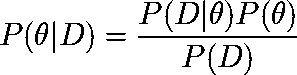
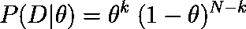
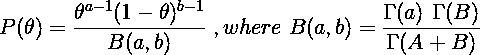
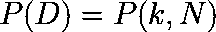
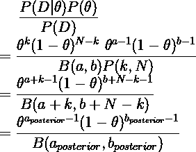
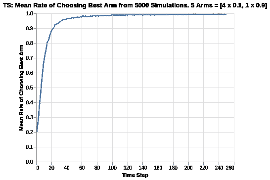
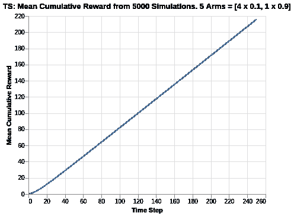
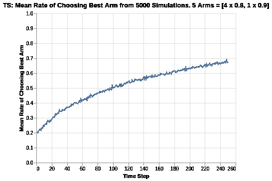
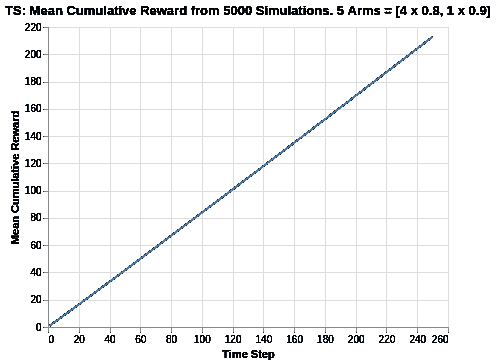
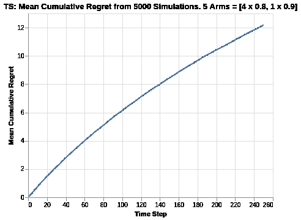

# 汤普森采样算法的多臂土匪分析

> 原文：<https://medium.com/analytics-vidhya/multi-armed-bandit-analysis-of-thompson-sampling-algorithm-6375271f40d1?source=collection_archive---------3----------------------->

汤普森抽样算法利用贝叶斯概率方法来模拟各种武器的报酬分布。作为一个简短的总结，贝叶斯规则简单地表述如下:



其中`D`代表观察到的数据，`P(θ|D)`是我们的后验概率，`P(D|θ)`是观察到给定θ的数据的可能性，`P(θ)`是θ分布的先验信念。

在我们之前的分析([ε-贪婪](/@kfoofw/multi-armed-bandit-analysis-of-epsilon-greedy-algorithm-8057d7087423)、 [Softmax](/@kfoofw/multi-armed-bandit-analysis-of-softmax-algorithm-e1fa4cb0c422) 、[置信上限](/@kfoofw/multi-armed-bandit-analysis-of-upper-confidence-bound-algorithm-4b84be516047))中，我们假设 arm 可以建模为伯努利分布，θ_arm 代表每次试验成功奖励的参数。因此，对于每个臂的 N_arm 试验总数和成功奖励的 k_arm 计数，每个臂可以用由 N_arm、k_arm 和θ_arm 参数化的二项分布来表示。



我们采用贝塔分布作为参数假设来模拟θ的先验分布。贝塔分布是`a`和`b`的函数，代表给定θ的成功和失败次数。在先验的情况下，它代表我们认为 arm 成功和不成功试验的伪计数，这代表我们对特定 arm 的奖励功能的初始观点。



每个臂的后验概率的分母代表数据的分布，可以重写为`k_arm`和`N_arm`的某种分布。



综上所述，后验概率实际上可以用β分布来表示，其参数为:

*   `a_posterior` = `a_prior + k`
*   `b_posterior` = `b_prior + N - k`

为了证明这一点，请考虑以下情况:



因此，我们假设每个手臂的贝塔分布基于它的先验参数和它的播放历史。在每次试验迭代中，我们将从每个臂的后验 Beta 分布中随机取样，并选择为下一轮提供最大值的臂。这允许 Thompson 采样基于每个臂的单独后验贝塔分布在探索和利用之间进行平衡。不像其他武器那样经常探索的武器肯定会有更大的方差，这为根据随机抽样挑选武器创造了机会。

选择最佳手臂后，我们将玩它，并通过该手臂的历史记录(尝试次数和成功奖励)更新游戏。请注意，每次成功的奖励计数将增加`a_posterior`，而每次不成功的奖励计数将增加`b_posterior`。

出于本练习的目的，我们将使用由β(a = 1，b = 1)表示的均匀先验分布。

下面的分析是基于约翰·迈尔斯·怀特的书[《网站优化的强盗算法》](https://www.oreilly.com/library/view/bandit-algorithms-for/9781449341565/)。尽管 Thompson 采样没有在本书中涉及，但我使用他的模板创建了 Thompson 采样的代码，以便更容易参考过去的算法文章。为了进一步理解代码，我加入了一些注释以便于理解。

下面是创建 Thompson 采样算法设置和逐步更新 arms 的计数和值的代码。

*   计数:代表手臂被拉动的记录时间。
*   值:代表已知的平均报酬。在伯努利臂的情况下，值代表奖励的概率，范围从 0 到 1。

```
from scipy.stats import betaclass ThompsonSampling():
    def __init__(self, counts, values, a, b):
        self.counts = counts # Count represent counts of pulls for each arm. For multiple arms, this will be a list of counts.
        self.values = values # Value represent average reward for specific arm. For multiple arms, this will be a list of values.

        # Beta parameters
        self.a = a
        self.b = b
        return # Initialise k number of arms
    def initialize(self, n_arms):
        self.counts = [0 for col in range(n_arms)]
        self.values = [0.0 for col in range(n_arms)] # Uniform distribution of prior beta (A,B)
        self.a = [1 for arm in range(n_arms)]
        self.b = [1 for arm in range(n_arms)]
        return

    # Thompson Sampling selection of arm for each round
    def select_arm(self):
        n_arms = len(self.counts)

        # Pair up all beta params of a and b for each arm
        beta_params = zip(self.a, self.b)

        # Perform random draw for all arms based on their params (a,b)
        all_draws = [beta.rvs(i[0], i[1], size = 1) for i in beta_params]

        # return index of arm with the highest draw
        return all_draws.index(max(all_draws))

    # Choose to update chosen arm and reward
    def update(self, chosen_arm, reward):
        # update counts pulled for chosen arm
        self.counts[chosen_arm] = self.counts[chosen_arm] + 1
        n = self.counts[chosen_arm]

        # Update average/mean value/reward for chosen arm
        value = self.values[chosen_arm]
        new_value = ((n - 1) / float(n)) * value + (1 / float(n)) * reward
        self.values[chosen_arm] = new_value

        # Update a and b

        # a is based on total counts of rewards of arm
        self.a[chosen_arm] = self.a[chosen_arm] + reward

        # b is based on total counts of failed rewards on arm
        self.b[chosen_arm] = self.b[chosen_arm] + (1-reward)

        return
```

根据之前文章的讨论，我们将使用伯努利分布来表示每条手臂的奖励函数。

```
class BernoulliArm():
    def __init__(self, p):
        self.p = p

    # Reward system based on Bernoulli
    def draw(self):
        if random.random() > self.p:
            return 0.0
        else:
            return 1.0
```

为了进行任何进一步的分析，需要一个操作脚本来处理模拟，其中:

*   num_sims:表示独立模拟的数量，每个模拟的长度等于“地平线”。
*   horizon:表示每轮模拟的时间步长/试验次数

```
def test_algorithm(algo, arms, num_sims, horizon):

    # Initialise variables for duration of accumulated simulation (num_sims * horizon_per_simulation)
    chosen_arms = [0.0 for i in range(num_sims * horizon)]
    rewards = [0.0 for i in range(num_sims * horizon)]
    cumulative_rewards = [0 for i in range(num_sims * horizon)]
    sim_nums = [0.0 for i in range(num_sims *horizon)]
    times = [0.0 for i in range (num_sims*horizon)]

    for sim in range(num_sims):
        sim = sim + 1
        algo.initialize(len(arms))

        for t in range(horizon):
            t = t + 1
            index = (sim -1) * horizon + t -1
            sim_nums[index] = sim
            times[index] = t

            # Selection of best arm and engaging it
            chosen_arm = algo.select_arm()
            chosen_arms[index] = chosen_arm

            # Engage chosen Bernoulli Arm and obtain reward info
            reward = arms[chosen_arm].draw()
            rewards[index] = reward

            if t ==1:
                cumulative_rewards[index] = reward
            else:
                cumulative_rewards[index] = cumulative_rewards[index-1] + reward

            algo.update(chosen_arm, reward)

    return [sim_nums, times, chosen_arms, rewards, cumulative_rewards]
```

# 模拟手段差异较大的兵种

类似于之前对ε-greedy 所做的分析，模拟包括以下内容:

*   创造 5 个兵种，其中四个平均奖励 0.1，最后一个/最好的平均奖励 0.9。
*   将模拟输出保存到制表符分隔的文件中
*   创建 5000 个独立的模拟

在本例中，由于 Thompson 采样算法没有任何超参数(除了我们假设的 Beta(1，1)先验)，我们创建了一组 5000 个模拟。

选择 5000 个独立模拟是因为我们想要确定平均性能。每个模拟可能受随机性质/运行的影响，并且性能可能由于随机机会而有偏差。因此，运行合理的大量模拟来评估平均均值/性能非常重要。

```
import randomrandom.seed(1)
# out of 5 arms, 1 arm is clearly the best
means = [0.1, 0.1, 0.1, 0.1, 0.9]
n_arms = len(means)
# Shuffling arms
random.shuffle(means)# Create list of Bernoulli Arms with Reward Information
arms = list(map(lambda mu: BernoulliArm(mu), means))
print("Best arm is " + str(np.argmax(means)))f = open("standard_ts_results.tsv", "w+")# Create simulations for ThompsonSampling
algo = ThompsonSampling([], [], [], [])
algo.initialize(n_arms)
results = test_algorithm(algo, arms, 5000, 250)

# Store data
for i in range(len(results[0])):
    f.write("\t".join([str(results[j][i]) for j in range(len(results))]) + "\n")
f.close()
```

使用一些数据预处理和基本的 Altair 可视化，我们可以绘制出拉最佳手臂的概率。



汤普森采样算法显示出对最佳 arm 选择的相对快速的收敛。在 40 次试验中，选择最佳手臂的平均比率在 95%左右。与我们迄今为止看到的其他算法相比，这是非常令人印象深刻的。

开始时，所有武器都被认为是平等的，因为它们都有相同的前科。因此，选择最佳臂的比率总是从 20%开始，这是从 5 个臂中选择最佳臂的随机机会。随着试验的进行，该算法让手臂的播放历史接管，并通过后验 Beta 分布的每次更新快速识别最佳手臂。注意，与我们在 UCB1 算法中观察到的情况相比，该进展也是平滑的。

就性能而言，似乎没有任何渐近线限制，因为随着试验的进展，该图继续向选择最佳臂的 100%机会收敛。



鉴于汤普森采样算法设法在早期识别最佳手臂的选择，它开始快速积累奖励。在 250 步的时间范围结束时，它平均达到大约 215 个累积点，这意味着它超过了几乎所有其他算法，如 Epsilon Greedy、Softmax 和 UCB1(除了 Softmax `tau` = 0.1，它大约有 218 个点)。

与我们在 UCB1 中看到的类似，在试验的早期阶段，累积奖励图中有一个轻微的弯曲。这很快被拉直为一条直线(根据最佳手臂的平均奖励，它应该接近 0.9)。

# 平均差异相对较小的武器的模拟

之前的分析是对回报差异很大的武器的模拟练习。我们将分析扩展到两臂相对较近的情况。

在下面的例子中，我们模拟了 5 个分支，其中 4 个分支的平均值为 0.8，而最后一个/最佳分支的平均值为 0.9。



在这个实验中，所有分支的回报之间的差异减少了，Softmax 和 UCB 算法都经历了严重的恶化，因为它们选择最佳分支的比率下降到了 0.20 到 0.30 的范围。然而，对于 Thompson 采样，选择最佳臂的比率现在接近 0.68，这是迄今为止最好的结果(即使与 Eps-Greedy `epsilon` = 0.2 相比，后者大约为 0.65)。

尽管随着实验的进行，梯度看起来确实有某种形式的减小，但似乎没有一条硬渐近线。我的假设是，在更长的时间范围内，汤普森抽样算法将继续向 100%增长。



由于这两个分支的平均回报率很接近，因此验证总体累积遗憾会更有意思。



我们观察到，汤普森抽样是表现最好的，累积遗憾为 12.1。与 UCB1 和 Softmax 算法相比，这要优越得多，同时也略微超过了最好的 Epsilon Greedy 算法(其范围为 12.3 到 14.8)。随着图中相对较高的逐渐减少，这可以解释为什么汤普森采样优于其他算法。

# 摘要

在 Thompson 采样算法的分析中，我们从 Baye 规则开始，并对先验使用 Beta 分布的参数假设。每只手臂的回报函数的总体后验概率是二项式可能性和贝塔先验的组合，可以表示为另一个贝塔分布。

与其他算法相比，Thompson 采样算法在性能上提供了鲁棒性，而不管平均回报接近的 arms 和平均回报差异大的 arms。

关于本项目对 bandit 模拟分析的参考，请参考本 [Github repo](https://github.com/kfoofw/bandit_simulations) 。关于实际代码的快速参考，请参考这个 [Jupyter 笔记本](https://github.com/kfoofw/bandit_simulations/blob/master/python/notebooks/analysis.ipynb)。