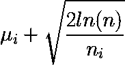
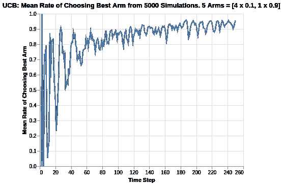
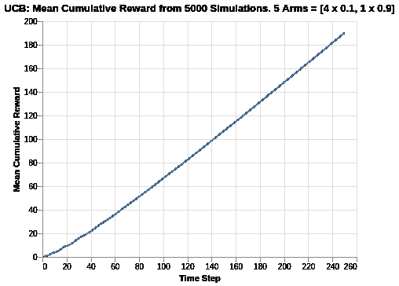
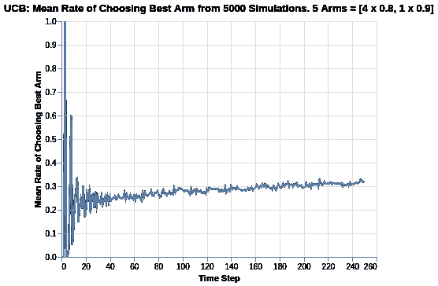
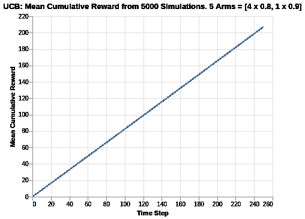
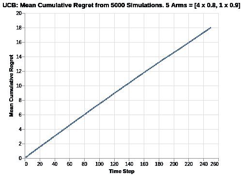

# 置信上限算法的多臂 Bandit 分析

> 原文：<https://medium.com/analytics-vidhya/multi-armed-bandit-analysis-of-upper-confidence-bound-algorithm-4b84be516047?source=collection_archive---------2----------------------->

置信上限(UCB)算法通常被称为“面对不确定性的乐观主义”。为了理解为什么，考虑在给定的回合中，每个手臂的奖励函数可以被理解为基于观察到的平均奖励率的点估计。从置信区间得出直觉，对于每个点估计，我们也可以在点估计周围加入某种形式的不确定性边界。从这个意义上说，我们对每条手臂都有上边界和下边界。

UCB 算法之所以被恰当地命名，是因为我们只关心上界，因为我们试图找到报酬率最高的手臂。

UCB 算法有不同的变体，但在本文中，我们将研究 UCB1 算法。在每一轮给定的`n`试验中，所有兵种的 UCB 奖励如下所示:



其中`mu_i`代表当前回合中手臂 *i* 的当前奖励回报平均值，`n`代表试玩通过的次数，`n_i`代表试玩历史中手臂 *i* 的拉动次数。

上面的公式很简单，但是有几个有趣的含义，如下所述:

*   上限与`ln(n)`的平方根成正比，这意味着当实验进行时，所有手臂的上限都增加了`ln(n)`的平方根倍。
*   这个上界和`n_i`的平方根成反比。特定手臂在过去使用的次数越多，置信边界向点估计值减小得越大。

此后，UCB 算法总是挑选具有最高奖励 UCB 的手臂，如上面的等式所示。

除了公式解释，这里有一个简单的思想实验，收集一些关于 UCB 算法如何结合探索和开发的直觉。

分子和分母之间的时间复杂性造成了探索和利用之间的紧张关系。对于`n`的任何增加，UCB 仅增加对数时间，而对于`n_i`的任何增加，UCB 减少`n_i`。因此，一个没有像其他臂那样经常被探索的臂将具有更大的 UCB 分量。取决于其当前平均，该特定臂的总体 UCB 函数表示可能大于具有较高回报但较小分量的其他臂，并因此使得该臂能够被挑选。

以下分析基于约翰·迈尔斯·怀特的《网站优化的强盗算法》一书。为了进一步理解代码，我加入了一些注释以便于理解。

下面是创建 UCB1 算法设置和逐步更新 arm 的计数和值的代码。

*   计数:代表手臂被拉动的记录时间。
*   值:代表已知的平均报酬。在伯努利臂的情况下，值代表奖励的概率，范围从 0 到 1。

```
class UCB1():
    def __init__(self, counts, values):
        self.counts = counts # Count represent counts of pulls for each arm. For multiple arms, this will be a list of counts.
        self.values = values # Value represent average reward for specific arm. For multiple arms, this will be a list of values.
        return # Initialise k number of arms
    def initialize(self, n_arms):
        self.counts = [0 for col in range(n_arms)]
        self.values = [0.0 for col in range(n_arms)]
        return

    # UCB arm selection based on max of UCB reward of each arm
    def select_arm(self):
        n_arms = len(self.counts)
        for arm in range(n_arms):
            if self.counts[arm] == 0:
                return arm

        ucb_values = [0.0 for arm in range(n_arms)]
        total_counts = sum(self.counts)

        for arm in range(n_arms):
            bonus = math.sqrt((2 * math.log(total_counts)) / float(self.counts[arm]))
            ucb_values[arm] = self.values[arm] + bonus
        return ucb_values.index(max(ucb_values))

    # Choose to update chosen arm and reward
    def update(self, chosen_arm, reward):
        self.counts[chosen_arm] = self.counts[chosen_arm] + 1
        n = self.counts[chosen_arm]

        # Update average/mean value/reward for chosen arm
        value = self.values[chosen_arm]
        new_value = ((n - 1) / float(n)) * value + (1 / float(n)) * reward
        self.values[chosen_arm] = new_value
        return
```

根据之前文章的讨论，我们将使用伯努利分布来表示每条手臂的奖励函数。

```
class BernoulliArm():
    def __init__(self, p):
        self.p = p

    # Reward system based on Bernoulli
    def draw(self):
        if random.random() > self.p:
            return 0.0
        else:
            return 1.0
```

为了进行任何进一步的分析，需要一个操作脚本来处理模拟，其中:

*   num_sims:表示独立模拟的数量，每个模拟的长度等于“地平线”。
*   horizon:表示每轮模拟的时间步长/试验次数

```
def test_algorithm(algo, arms, num_sims, horizon):

    # Initialise variables for duration of accumulated simulation (num_sims * horizon_per_simulation)
    chosen_arms = [0.0 for i in range(num_sims * horizon)]
    rewards = [0.0 for i in range(num_sims * horizon)]
    cumulative_rewards = [0 for i in range(num_sims * horizon)]
    sim_nums = [0.0 for i in range(num_sims *horizon)]
    times = [0.0 for i in range (num_sims*horizon)]

    for sim in range(num_sims):
        sim = sim + 1
        algo.initialize(len(arms))

        for t in range(horizon):
            t = t + 1
            index = (sim -1) * horizon + t -1
            sim_nums[index] = sim
            times[index] = t

            # Selection of best arm and engaging it
            chosen_arm = algo.select_arm()
            chosen_arms[index] = chosen_arm

            # Engage chosen Bernoulli Arm and obtain reward info
            reward = arms[chosen_arm].draw()
            rewards[index] = reward

            if t ==1:
                cumulative_rewards[index] = reward
            else:
                cumulative_rewards[index] = cumulative_rewards[index-1] + reward

            algo.update(chosen_arm, reward)

    return [sim_nums, times, chosen_arms, rewards, cumulative_rewards]
```

# 模拟手段差异较大的兵种

类似于之前对ε-greedy 所做的分析，模拟包括以下内容:

*   创造 5 个兵种，其中四个平均奖励 0.1，最后一个/最好的平均奖励 0.9。
*   将模拟输出保存到制表符分隔的文件中
*   创建 5000 个独立的模拟

在本例中，由于 UCB 算法没有任何超参数，我们创建了一组 5000 次模拟。

选择 5000 个独立模拟是因为我们想要确定平均性能。每个模拟可能受随机性质/运行的影响，并且性能可能由于随机机会而有偏差。因此，运行合理的大量模拟来评估平均均值/性能非常重要。

```
import randomrandom.seed(1)
# out of 5 arms, 1 arm is clearly the best
means = [0.1, 0.1, 0.1, 0.1, 0.9]
n_arms = len(means)
# Shuffling arms
random.shuffle(means)# Create list of Bernoulli Arms with Reward Information
arms = list(map(lambda mu: BernoulliArm(mu), means))
print("Best arm is " + str(np.argmax(means)))f = open("standard_ucb_results.tsv", "w+")# Create 1 round of 5000 simulations
algo = UCB1([], [])
algo.initialize(n_arms)
results = test_algorithm(algo, arms, 5000, 250)

# Store data
for i in range(len(results[0])):
    f.write("\t".join([str(results[j][i]) for j in range(len(results))]) + "\n")
f.close()
```

使用一些数据预处理和基本的 Altair 可视化，我们可以绘制出拉最佳手臂的概率。



在实验的早期阶段，UCB 算法在选择最佳臂的速度上有极大的波动，如 0 到 60 之间的时间步长所示。这可以通过在所有兵种中强调探索来解释，因为所有兵种的 UCB 分量在开始时要大得多。

随着试验的进行，所有组的 UCB 分量变得更小，并且每个组的 UCB 函数表示向每个组的平均回报均值收敛。因此，随着试验的进行，具有较高平均值的臂变得更容易被算法区分，并且变得更频繁地被挑选。因此，我们观察到选择最佳臂的速率似乎没有硬渐近线，而是向 1 收敛。向 1 收敛的速度随着接近 1 而减慢，实验时间范围太短，我们无法观察到任何进一步的收敛。



UCB 算法的累积奖励图与其他算法相当。虽然它的表现不如 Softmax ( `tau` = 0.1 或 0.2)的最佳表现(累积奖励超过 200)，但 UCB 累积奖励范围接近该范围(约 190)。

我们还在试验的早期阶段观察到某种形式的弯曲，这可以通过我们在选择最佳武器的比率中看到的极端波动得到证实。同样，当实验进行时，该算法可以区分最佳手臂，并以更高的频率挑选它，累积奖励图具有直线梯度(基于一致选择最佳手臂，其应该接近 0.9 的值)。

# 平均差异相对较小的武器的模拟

之前的分析是对回报差异很大的武器的模拟练习。我们将分析扩展到两臂相对较近的情况。

在下面的例子中，我们模拟了 5 个分支，其中 4 个分支的平均值为 0.8，而最后一个/最佳分支的平均值为 0.9。



基于所有分支的报酬回报之间的差异减少，我们观察到 UCB 算法的性能大幅下降。选择最佳臂的比率现在接近 0.32，这与我们在 Softmax 算法中看到的类似。

与 Softmax 算法进行比较，这似乎意味着奖励函数中的差异减少使得更难确定哪个是最好的臂。请注意，在这种情况下，选择最佳手臂的随机几率是 1/5 或 0.20。

应当注意，在这种情况下，对于ε贪婪算法，选择最佳 arm 的比率实际上更高，如范围 0.5 至 0.7 所示。这似乎也意味着ε贪婪可能更适合于基于多臂的情况，其中与 UCB 或 Softmax 算法相比，均值的差异小得多。



由于两臂的平均回报接近，最终的 UCB 累积回报值约为 210。与选择将返回 0.9 * 250 = 225 的最佳臂相比，我们看到 15 的遗憾。在这种情况下，它可能看起来很小，但作为一个百分比，它可以被认为是重要的(6.67%)，这取决于应用程序的重点。

看一看总的累积遗憾可以提供性能的更好的视角，特别是相对于其他算法。



基于累积遗憾图，我们看到 UCB1 的累积遗憾为 18，这类似于 Softmax 算法。与范围为 12.3 到 14.8 的 Epsilon Greedy 算法相比，它也是最差的。累积后悔线也比较直，也就是说算法会随着时间跨度的变长，继续累积更多的后悔。

# 摘要

在对 UCB 算法的分析中，我们分解了算法的公式，并对不同的 arm 进行了仿真实验，以说明其鲁棒性(或缺乏鲁棒性)。

与 [Softmax 算法](/@kfoofw/multi-armed-bandit-analysis-of-softmax-algorithm-e1fa4cb0c422)类似，一个学习收获是，对于具有更近均值的臂，UCB 算法在确定最佳臂方面似乎不那么稳健，而[εGreedy](/@kfoofw/multi-armed-bandit-analysis-of-epsilon-greedy-algorithm-8057d7087423)更适合于此。

关于土匪模拟分析的这个项目的参考，请参考这个 [Github repo](https://github.com/kfoofw/bandit_simulations) 。关于实际代码的快速参考，请参考本 [Jupyter 笔记本](https://github.com/kfoofw/bandit_simulations/blob/master/python/notebooks/analysis.ipynb)。