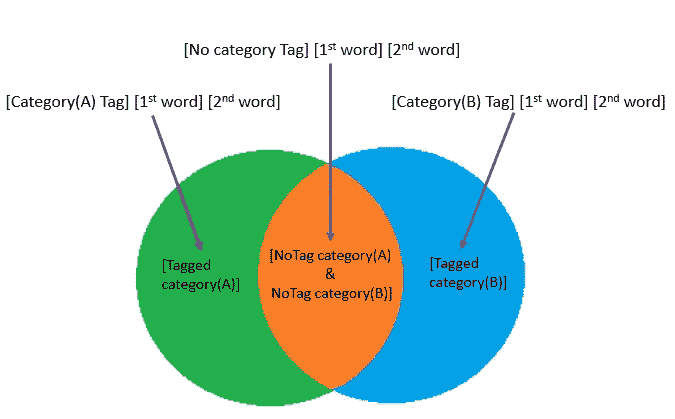
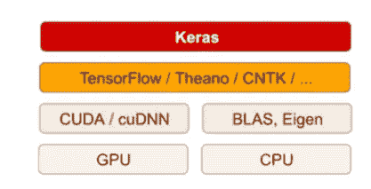
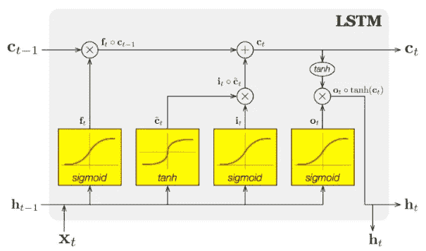
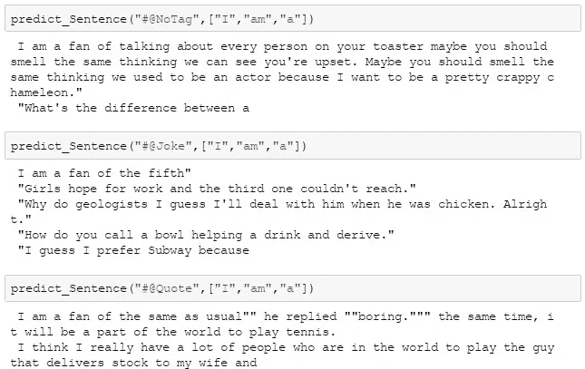
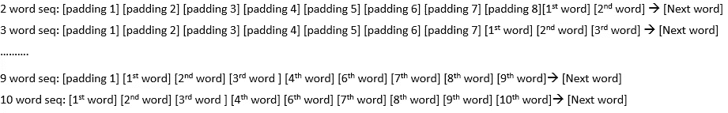

# 使用双向 LSTM 的多域自然语言处理

> 原文：<https://medium.com/analytics-vidhya/multi-category-multi-domain-nlp-90690eda607a?source=collection_archive---------21----------------------->

我开始这个项目是想知道我们是否可以给**下一个单词预测**添加不同的上下文，或者也称为语言建模的任务是预测下一个单词是什么。

大多数**下一个单词预测**只能预测一种类型的上下文。当预测一个句子时，用两个不同类型的数据集一起训练，这个句子通常没有意义。

为了简单起见，让我们从具有 3 种类别双域下一个单词预测器开始。以预测每个类别下一个单词以及混合类别的下一个单词预测。

# 双域(下一个单词预测器)

## 使用的数据集:

数据集 A:笑话(来自？？？添加链接)
数据集 B:报价(来自？？？添加链接)

相似的数据集在做双域(下一个单词预测器)时会失去它的目的。因此，在这种情况下，使用两个非常不同的数据集“笑话”和“引用”数据集。以便人们能够以不同的风格和语调来识别预测的句子。

> 数据集 A: sample →“为什么从来没见过大象躲在树上？因为他们非常擅长这个"
> 数据集 B: sample →"答应我你会永远记得:你比你相信的更勇敢，比你看起来的更强大，比你想象的更聪明"

我们将准备同一个数据集的两个副本，其中一个数据集的**标记为类别**，其他数据集的**标记为无类别。**我们总共将使用 4 组数据集。

> T 总数据集=已标记笑话+未标记笑话+已标记报价+未标记报价。

## 处理数据集

让我们清理数据集并对其进行记号化，为了便于说明，让我们使用长度为 4 的序列。假设 **X1** 总是**类别标签**。

> 例如:[X1] [X2] [X3] [X4]预测[Y1]
> 例如:[类别标签] [第一个词] [第二个词] [第三个词]→[下一个词]

类别为“<joke>”、“<quote>”和“<notag>”</notag></quote></joke>

数据集引用例如:“答应我你会永远记住:你比你相信的更勇敢，比你看起来的更强大，比你想象的更聪明”

> [# @ Quote][答应][我][你会]→[总是]
> [# @ Quote][我][你会][总是]→[记住:]
> [# @ Quote][你会][总是][记住:]→[你是]
> [# @ Quote>][总是][记住:][你是]→[更勇敢]
> [# @ Quote>][记住:][你是][更勇敢]→[比]

# 型号(LSTM 双向)

**使用的库:**
Keras 将是使用的主库。Keras 是用 Python 编写的前端层，运行在其他流行的深度学习工具包之上，如 **TensorFlow、Theano** 和**微软认知工具包(CNTK)** 。您用 Keras 编写的任何代码都可以在这些后端中的任何一个上运行，而无需对代码做任何修改。通过 TensorFlow/Theano /CNTK，Keras 可以在 CPU 和 GPU 上无缝运行。

在 Keras 中，我们可以简单地将多层堆叠起来，为此我们需要将模型初始化为`Sequential()`。

## LSTM 模式:

第一个 sigmoid 激活功能是**遗忘门**。应该从先前的小区状态(Ct-1)中忘记哪些信息。第二个 sigmoid 和第一个 tanh 激活函数是我们的**输入门**。哪些信息应该保存到单元状态或者应该被忘记？最后一个 sigmoid 是**输出门**并突出显示哪些信息应该进入下一个**隐藏状态**。

# 双向 LSTMs

双向递归神经网络(RNNs)的思想很简单。它包括复制网络中的第一循环层，使得现在有两层并排，然后将输入序列原样作为输入提供给第一层，并将输入序列的反向副本提供给第二层。

双向提供序列的使用最初在语音识别领域是合理的，因为有证据表明整个话语的上下文被用于解释所说的内容，而不是线性解释。

Keras 通过[双向](https://keras.io/layers/wrappers/#bidirectional)层包装器支持双向 LSTMs。这个包装器将一个循环层(例如第一个 LSTM 层)作为参数。

它还允许您指定合并模式，即前向和后向输出在传递到下一层之前应该如何组合。这些选项包括:

*   *sum*’:输出相加在一起。
*   *mul*’:输出相乘。
*   *concat* ':输出被连接在一起(默认)，为下一层提供双倍的输出。
*   *ave* ':取输出的平均值。

默认模式是连接，这是双向 LSTMs 研究中常用的方法。

# LSTM 参数选择

## 隐藏节点的数量:

> 隐藏节点数= Ns/(α∫(Ni+No))

Ni =输入神经元的数量。
否=输出神经元的数量。Ns =训练数据集中的样本数。
αα =任意比例因子，通常为 2-10。

[建议](http://www.solver.com/training-artificial-neural-network-intro)将 alpha 设置为 5 到 10 之间的值，值 2 通常不会过度拟合。

## 辍学率:

每个 LSTM 层都应该有一个下降层。该层将通过在训练期间忽略随机选择的神经元来帮助防止过度拟合，并因此降低对单个神经元的特定权重的敏感性。20%通常用作保持模型准确性和防止过度拟合之间的良好折衷。

## 激活层:

要添加的最后一层是激活层。使用哪种激活功能同样取决于应用。对于我们手头的问题，我们有多个类，但一次只能出现一个类。对于这些类型的问题，一般来说， [softmax 激活函数](https://en.wikipedia.org/wiki/Softmax_function)效果最好，因为它允许我们(和你的模型)将输出解释为概率。

# **预测:**

给定 4 个输入，该模型能够预测下一个单词。那么我们如何预测一整句话呢？当生成一个完整的句子时，我们将继续预测下一个完整的句子，直到它形成一个完整的句子。

样本:
1)[# @ Joke][我][am][a]→[fan]
2)[# @ Joke][am][a][fan]→[of]
3)[# @ Joke][a][fan][of]→[talking]

# (多类别+多领域)自然语言处理

让我们再深入一步，一个领域可以有多个类别。让我们将笑话作为域 A。域 A 可以表示为笑话、滑稽、笑声等。域 A 也可以用一个或多个标签来表示，例如[US]+[笑话]，[dark]+[幽默]+[笑话]。

使用上述两域(下一个单词预测器)方法，将创建大量重复的数据集并增加训练成本。
【美国笑话】带域 A 数据集的标签。
【黑色幽默】带域 A 数据集标签。
【黑色幽默笑话】带域 A 数据集标签。

如果有更多领域和更多标签，我们的多类别+多领域 NLP 将变得非常低效且难以训练。

因为我们可以预测下一个单词。对标签到域名做预测怎么样？

> [第一标签] [第二标签] [第三标签] [第四标签]→[域]
> [空][空][空][# @笑话]→[域 A]
> [空][空][空]→[域 A]
> [空][空][# @黑暗][# @幽默]→[域 A]
> [空][空][# @我们][# @笑话]→[域 A]

现在输入将是:
【第一个标签】【第二个标签】【第三个标签】【第四个标签】【第一个字】【第二个字】【第三个字】→【下一个字】

使用在两个域中训练的相同模型(下一个词预测器)
第一步:[第一个标签] [第二个标签] [第三个标签] [第四个标签]→[域]
第二步:[预测的域] [第一个词] [第二个词][第三个词]→[下一个词]

如何达到想要的状态？记住我们之前训练的模型，现在让我们创建一个名为“TaggedDataset”的附加数据集。假设身份域为#D@Domain

> 样本 TagDataSet:
> empty，empty，empty，#@joke，#D@joke
> empty，empty，#@US，#@joke，#D@joke
> empty，empty，#@dark，# @幽默，#D@joke

还记得之前用 4 个特征训练双域(下一个单词预测器)模型来预测下一个工作。现在我们的 TagDataSet 也使用 4 个特征来预测领域。标签数据集可以被训练添加到双域(下一个单词预测器)数据集中。

# 高级(多类别+多领域)自然语言处理

让我们再深入一步，4 个单词序列没有保留下一个单词的一些句子上下文。长期短期记忆或 LSTM 循环神经网络能够学习和记忆长序列的输入。

如何在给定较少输入数据的情况下增加句子上下文，以预测下一个单词。如何求解给定的 10 个特征来预测下一个单词，以及在使用该模型时我们能否使用只有 4 个特征的输入。

答案是填充，让我们用长度达到 10 个序列的序列来训练模型。

