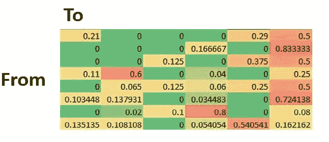
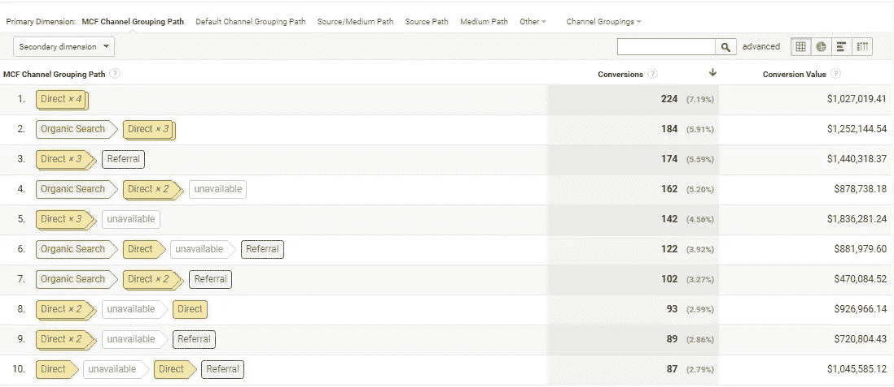
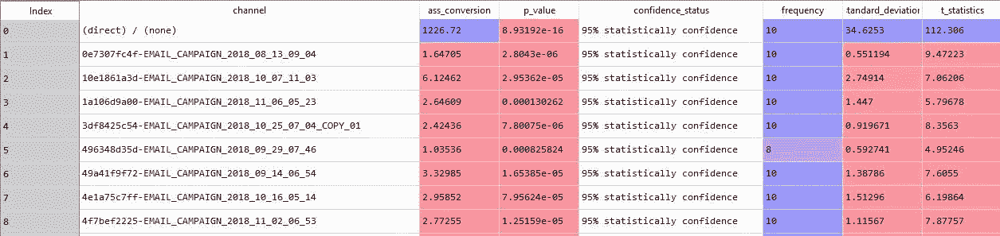

# 基于 Python 的多渠道归因模型

> 原文：<https://medium.com/analytics-vidhya/multi-channel-attribution-model-with-python-adcff6a85829?source=collection_archive---------6----------------------->



一个典型的顾客在网上购物前会经过多个渠道。如果我们知道用户在进行转换之前经过的渠道路径，我们就能够使用渠道属性模型来确定哪个渠道帮助进行了转换。

在本文中，我将使用 google analytics 多渠道漏斗报告来确定哪个渠道帮助进行了转化

Google Analytics 中的多渠道漏斗报告以多种途径展示了客户旅程，如下图所示



多渠道漏斗报告给出了两个转化值，即最后点击转化和辅助转化。

谷歌分析是给予信贷的最后一个渠道的路径作为最后点击转换，除了最后一个渠道的路径被视为辅助渠道

当给予辅助转换时，google 对路径中的每个渠道给予相同的权重。但它可能会在优化广告词和脸书的活动时给出错误的信息。为了克服这个问题，我们可以使用渠道属性马尔可夫模型来寻找渠道的辅助转换。

如果你使用 python 语言来计算信道属性，到目前为止，web 上还没有任何包或库或任何资源。对于这种情况，我编写了 python 代码来查找 python 中的通道属性。

今天我将讲述如何在 python 中找到通道属性的辅助转换

第一步是提取多渠道漏斗报告。要提取多通道报告数据，您可以使用[(使用 python 中的 API 进行 Google Analytics 多通道数据提取)](https://www.linkedin.com/pulse/google-analytics-multi-channel-funnel-data-extraction-gamwasam/)

GitHub 资源库:[https://GitHub . com/sherangaG/多渠道-归属-模型-python](https://github.com/sherangaG/multichannel-attribution-model-python)

这是我用于代码的[数据集](https://docs.google.com/spreadsheets/d/11pa-eQDHEX63uSEA4eWiDTOZ7lbO6Vwt-dHkuhuhbSo/edit?usp=sharing)

*导入下面的库*

```
import time
import pandas as pd
import numpy as np
import collections
from itertools import chain
import itertools
from scipy.stats import stats
import statistics
```

*以下函数用于返回唯一列表*

```
def unique(list1):  
    unique_list = []   
    for x in list1: 
        if x not in unique_list: 
            unique_list.append(x) 

    return(unique_list)
```

*下面的函数用于通过“>分割字符串，并返回排序向量升序*

```
def split_fun(path):
    return path.split('>')def calculate_rank(vector):
  a={}
  rank=0
  for num in sorted(vector):
    if num not in a:
      a[num] = rank
      rank = rank + 1
  return[a[i] for i in vector]
```

*以下函数用于返回转移矩阵*

```
def transition_matrix_func(import_data):

    import_data_temp = import_data.copy()

    import_data_temp['path1'] = 'start>' + import_data_temp['path']
    import_data_temp['path2'] = import_data_temp['path1'] + '>convert'

    import_data_temp['pair'] = import_data_temp['path2'].apply(split_fun)

    list_temp = import_data_temp['pair'].tolist()
    list_temp = list(chain.from_iterable(list_temp))
    list_temp = list(map(str.strip, list_temp))
    T = calculate_rank(list_temp)

    M = [[0]*len(unique(list_temp)) for _ in range(len(unique(list_temp)))]

    for (i,j) in zip(T,T[1:]):
        M[i][j] += 1

    df_temp = pd.DataFrame(M)

    np.fill_diagonal(df_temp.values,0)

    df_temp = pd.DataFrame(df_temp.values/df_temp.values.sum(axis = 1)[:,None])
    df_temp.columns = sorted(unique(list_temp))
    df_temp['index'] = sorted(unique(list_temp))
    df_temp.set_index("index", inplace = True) 
    df_temp.loc['convert',:] = 0
    return(df_temp)
```

*以下功能用于返回模拟路径*

```
def simulation(trans,n):

    sim = ['']*n
    sim[0] = 'start'
    i = 1
    while i<n:
        sim[i] = np.random.choice(trans.columns, 1, p=trans.loc[sim[i-1],:])[0]
        if sim[i] == 'convert':
            break
        i = i+1

    return sim[0:i+1]
```

*以下函数用于返回带有 p 值的辅助转换*

```
def markov_chain(data_set,no_iteration=10,no_of_simulation=10000,alpha=5):

    import_dataset_v1=data_set.copy()
    import_dataset_v1=(import_dataset_v1.reindex(import_dataset_v1.index.repeat(import_dataset_v1.conversions))).reset_index()
    import_dataset_v1['conversions']=1

    import_dataset_v1=import_dataset_v1[['path','conversions']]

    import_dataset=(import_dataset_v1.groupby(['path']).sum()).reset_index()
    import_dataset['probability']=import_dataset['conversions']/import_dataset['conversions'].sum()

    final=pd.DataFrame()

    for k in range(0,no_iteration):
        start = time.time()
        import_data=pd.DataFrame({'path':np.random.choice(import_dataset['path'],size=import_dataset['conversions'].sum(),p=import_dataset['probability'],replace=True)})
        import_data['conversions']=1                           

        tr_matrix=transition_matrix_func(import_data)
        channel_only = list(filter(lambda k0: k0 not in ['start','convert'], tr_matrix.columns)) 

        ga_ex=pd.DataFrame()
        tr_mat=tr_matrix.copy()
        p=[]

        i=0
        while i<no_of_simulation:
            p.append(unique(simulation(tr_mat,1000)))
            i=i+1

        path=list(itertools.chain.from_iterable(p))
        counter=collections.Counter(path)

        df=pd.DataFrame({'path':list(counter.keys()),'count':list(counter.values())})
        df=df[['path','count']]
        ga_ex=ga_ex.append(df,ignore_index=True) 

        df1=(pd.DataFrame(ga_ex.groupby(['path'])[['count']].sum())).reset_index()

        df1['removal_effects']=df1['count']/len(path)
        #df1['removal_effects']=df1['count']/sum(df1['count'][df1['path']=='convert'])
        df1=df1[df1['path'].isin(channel_only)]
        df1['ass_conversion']=df1['removal_effects']/sum(df1['removal_effects'])

        df1['ass_conversion']=df1['ass_conversion']*sum(import_dataset['conversions']) 

        final=final.append(df1,ignore_index=True)
        end = time.time()
        t1=(end - start)
        print(t1)   

    '''
    H0: u=0
    H1: u>0
    '''

    unique_channel=unique(final['path'])
    #final=(pd.DataFrame(final.groupby(['path'])[['ass_conversion']].mean())).reset_index()
    final_df=pd.DataFrame()

    for i in range(0,len(unique_channel)):

        x=(final['ass_conversion'][final['path']==unique_channel[i]]).values
        final_df.loc[i,0]=unique_channel[i]
        final_df.loc[i,1]=x.mean()

        v=stats.ttest_1samp(x,0)
        final_df.loc[i,2]=v[1]/2

        if v[1]/2<=alpha/100:
            final_df.loc[i,3]=str(100-alpha)+'% statistically confidence'
        else:
            final_df.loc[i,3]=str(100-alpha)+'% statistically not confidence'

        final_df.loc[i,4]=len(x)
        final_df.loc[i,5]=statistics.stdev(x)
        final_df.loc[i,6]=v[0]

    final_df.columns=['channel','ass_conversion','p_value','confidence_status','frequency','standard_deviation','t_statistics']       
    final_df['ass_conversion']=sum(import_dataset['conversions']) *final_df['ass_conversion'] /sum(final_df['ass_conversion'])

    return final_df,final
```

由于我们有获得每个通道的辅助转换的函数，我们将导入数据集

```
# import the channel attribution example csv 

import_dataset = pd.read_csv('channel attribution example.csv')
```

执行以下代码以获得与通道相关的辅助转换值。这里有 3 个参数，分别是数据集、迭代次数、模拟次数和 alpha 值

```
data,dataset = markov_chain(import_dataset,no_iteration=10,no_of_simulation=10000,alpha=5)
```

输出如下所示

