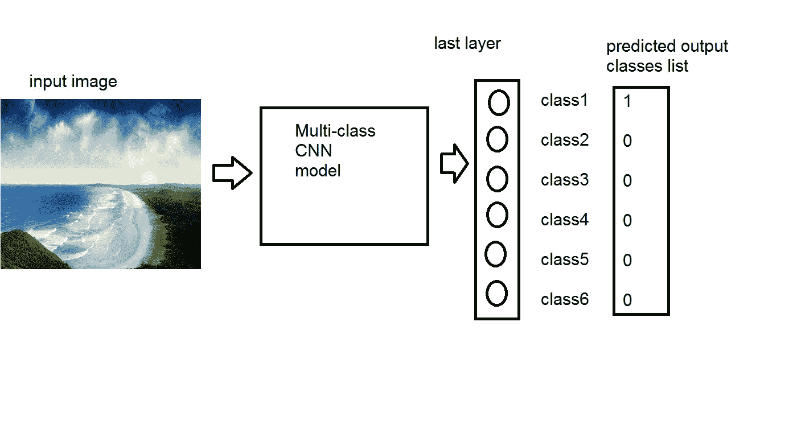
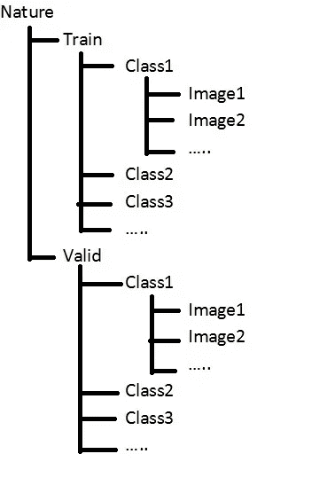
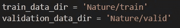
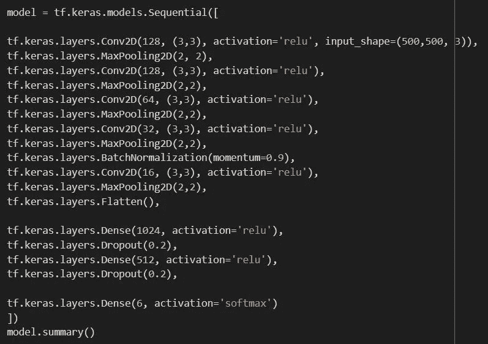
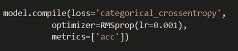
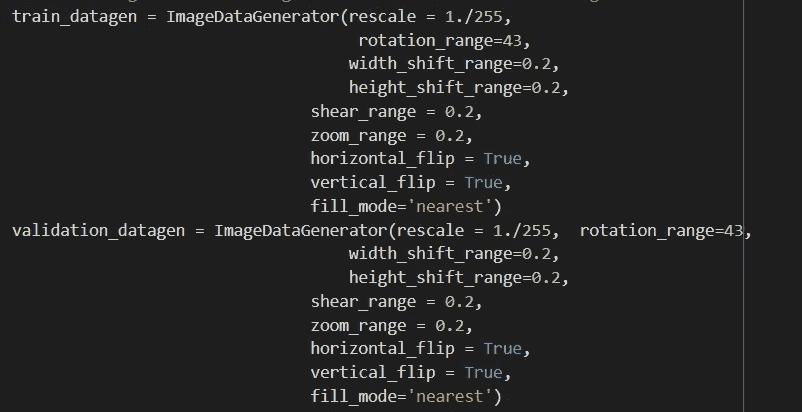
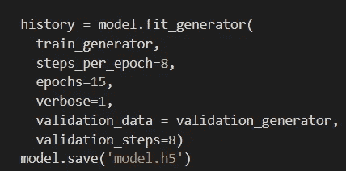
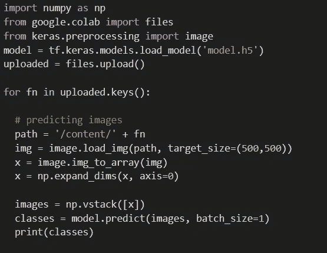

# 使用 CNN 对自定义数据集进行简单的多类分类。

> 原文：<https://medium.com/analytics-vidhya/multi-class-classification-using-cnn-for-custom-dataset-7759865bd19?source=collection_archive---------4----------------------->

使用多类分类类似于二类分类，在代码上有一些变化。

二元分类:-

二元类 CNN 模型包含 **2 类**的分类，例如猫或狗。提供一组**图像(每个类别至少 100 个)**，两个类别被分成**训练和验证文件夹，每个**内有类别文件夹，用作 CNN 模型的输入。CNN 模型的最后一个**密集层使用**sigmoid**激活来处理输出，最终输出层只有一个神经元，Sigmoid 激活将图像分类为 **0 或 1** 猫或狗。**

> **tf.keras.layers.Dense(1，activation='sigmoid')**

二进制类使用**“二进制 _ 交叉熵”损失函数** 进行损失值的计算。

> model . compile(loss = ' binary _ cross entropy '，
> optimizer=RMSprop(lr=0.001)，
> metrics=['acc'])

多级分类:-

类似于二类分类，多类 CNN 模型具有**多个类**让我们考虑下面的例子。提供一组**图像(每类至少 100 张)**两类图像，分为**训练和验证文件夹**，用作 CNN 模型的输入。CNN 模型的最后一个**密集层使用**【soft max】**激活处理输出，最终输出层的**类别数=神经元数**。**

> **tf.keras.layers.Dense(6，activation='softmax')**

多类使用**“分类 _ 交叉熵”损失函数** 进行损失值的计算。

> model . compile(loss = ' categorial _ cross entropy '，
> optimizer=RMSprop(lr=0.001)，
> metrics=['acc'])

训练和验证图像的**分布由两种类型的图像数量决定，不同项目的图像数量不同。通常是 80/20，即 80%的图片在训练文件夹中，20%在有效文件夹中。**

**目录/文件夹的结构**

访问创建的目录，**仅访问列车和有效文件夹。**

这里有一个简单的**卷积神经网络(CNN)** 用于多类分类。我开发了这个**模型**来实现自然图像的多类分类(风景、冰景、日落、瀑布、森林/树林和海滩)。这是一个**简单的 CNN，有一些超参数**调整为更好的结果。我总共拍摄了 200 多张所有 6 个类别的图片(风景、冰景、日落、瀑布、森林/树林和海滩)。

班级图像(海滩)

班级形象(日落)

在本地机器和 google colab 上训练他们，使用 Google colab 获得更好的性能和更多的超参数调整。

我使用的 CNN 模型的代码片段:-

这是一个简单的 CNN 模型，你可以使用**转移学习**和使用预训练模型，如**初始模型**，它已经训练了超过 10000 个类，并且具有可以用来训练你的定制模型的权重。

模型编译的片段:-

这里损失函数**“分类交叉熵”**是多类 CNN 分类的主要变化。

优化器与超参数一起使用，针对自定义学习率进行了调整。

为了获得更好的性能，您可以使用数据扩充将代码中的图像转换成各种转换(**旋转、剪切、缩放、颜色变化、…** )

在所有上述步骤之后，我们最终拟合模型并开始训练。

这里，为上面处理的所有数据训练模型。

如果你愿意，你可以将**模型权重**保存到一个文件中，这样你就可以在以后使用它来预测你的类。

预测类是通过将模型加载到 python 文件中，然后**输入图像** ( **它不应该在模型的训练或有效文件夹**)来完成的，然后预测生成的图像和打印类，这里，在打印后，只有图像中存在的那些类将具有更接近 1 或 1 的**值，这取决于模型的**精度和输入图像上的损失**。**

示例:class predicted= [0，0，1，0，0，0]在这里，根据我的模型，它将预测输入图像是风景图像。

 [## PushprajMaraje/深度学习测试

### 在 GitHub 上创建一个帐户，为 PushprajMaraje/deep learning tests 的开发做出贡献。

github.com](https://github.com/PushprajMaraje/DeepLearningTests.git) 

这是本指南使用的全部代码

以上是简单的多类分类，希望这能帮助你度过难关。