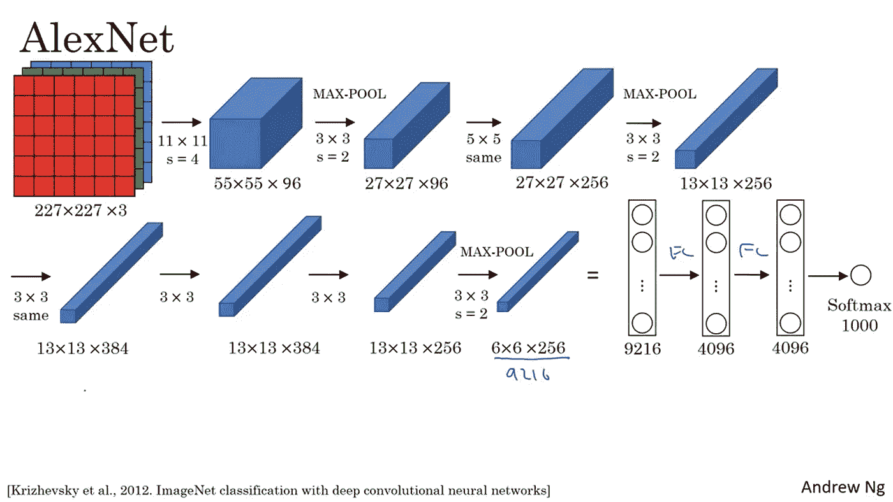
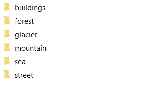
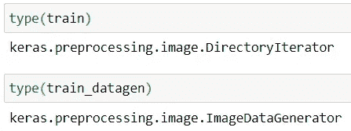
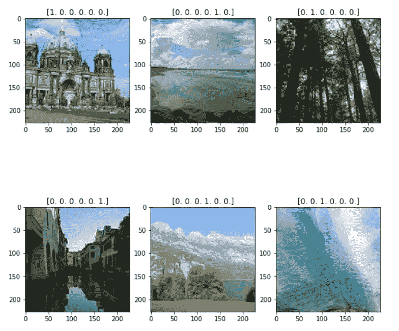
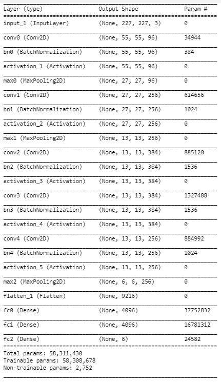
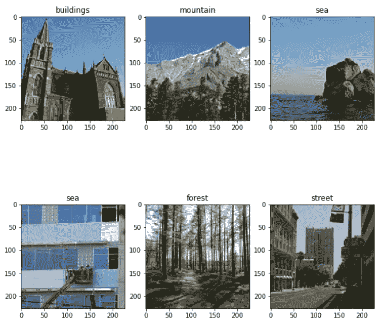

# 用 Keras API 实现的 Alexnet 深度学习网络进行多类图像分类

> 原文：<https://medium.com/analytics-vidhya/multi-class-image-classification-using-alexnet-deep-learning-network-implemented-in-keras-api-c9ae7bc4c05f?source=collection_archive---------1----------------------->

# **简介**

计算机是一台神奇的机器(毫无疑问)，我真的被计算机如何学习和分类图像的事实迷住了。图像分类在很多方面都有自己的优势和应用，例如，我们可以根据哪个物种(猫或狗)接近它来建立一个宠物食品分配器。我知道这是一个奇怪的想法，就像他们最终会吃掉所有的食物，但该系统可以控制时间，只能分配一次。不管怎样，让我们在分心之前继续前进，继续我们的讨论。所以在用深度学习神经网络的知识提升自己之后，我想到了自己建立一个。因此，在这里我将分享建立一个 Alexnet 卷积神经网络的 6 个不同的类从零开始使用 Keras 和 Python 编码。

# **Alex net 概述**

在进入 AlexNet 之前，建议浏览一下维基百科关于[卷积神经网络架构](https://en.wikipedia.org/wiki/Convolutional_neural_network#Architecture)的文章，以理解本文中的术语。让我们深入了解一下 AlexNet 网络的基本概况

[Alex net](http://Krizhevsky, Alex & Sutskever, Ilya & Hinton, Geoffrey. (2012). ImageNet Classification with Deep Convolutional Neural Networks. Neural Information Processing Systems. 25\. 10.1145/3065386.)【1】**是卷积神经网络的经典类型，在 2012 年 ImageNet 挑战赛之后应运而生。网络架构如下所示:**

****

**AlexNet 架构(由吴恩达在 Coursera 上提供)**

****模型解释:**该模型的输入具有 227x227x3 的尺寸，其后是卷积层，该卷积层具有 96 个 11×11 尺寸的滤波器，并且具有“相同的”填充和跨度 4。产生的输出尺寸如下所示:**

***floor(((n+2 *填充-过滤)/步距)+1)* floor(((n+2 *填充-过滤)/步距)+ 1)***

****注:**此公式适用于高度=宽度= n 的方形输入**

**解释具有输入 227x227x3 的第一层和具有 96 个 11x11 的滤波器的卷积层，“有效”填充和步幅= 4，输出 dim 将是**

**= floor((227+0–11)/4)+1)* floor((227+0–11)/4)+1)**

**=下限((216/4) + 1) *下限((216/4) + 1)**

**=地板(54 + 1) *地板(54 + 1)**

**= 55 * 55**

**由于过滤器数量= 96，因此第一层的输出为: **55x55x96****

**接着，我们有跨度为 2 的最大池层(3，3)，使输出大小减小到 27×27×96，接着是另一个卷积层，具有 256，(5，5)个滤波器和“相同”填充，也就是说，输出高度和宽度保留为前一层，因此该层的输出为 27×27×256。接下来，我们再次使用最大池，将大小减少到 13x13x256。具有相同填充的 384，(3，3)滤波器的另一卷积运算被应用两次，给出 13×13×384 的输出，随后是具有 256，(3，3)滤波器和相同填充的另一卷积层，产生 13×13×256 的输出。这是 MaxPooled，维数减少到 6x6x256。此外，将该层展平，并制成各具有 4096 个单位的 2 个完全连接的层，其进一步连接到 1000 个单位的 softmax 层。该网络用于按照我们的要求对大量的类进行分类。然而，在我们的例子中，我们将使输出 softmax 层有 6 个单位，因为我们必须分为 6 类。softmax 层为我们提供了输入图像可能属于的每个类的概率。**

# ****使用 Keras 实施 AlexNet】****

**Keras 是 python 的一个 API，构建于 Tensorflow 2.0 之上，可扩展并适应 Tensorflow 的部署功能[3]。我们将使用 Keras API 在 Python 中从头开始构建这些层。**

**首先，让我们导入基本库**

```
import numpy as np
from keras import layers
from keras.layers import Input, Dense, Activation,BatchNormalization, Flatten, Conv2D, MaxPooling2D
from keras.models import Model
from keras.preprocessing import image
from keras.preprocessing.image import ImageDataGenerator
import keras.backend as K
K.set_image_data_format(‘channels_last’)
import matplotlib.pyplot as plt
from matplotlib.pyplot import imshow
```

**在本文中，我们将使用图像生成器来构建分类器。接下来，我们将使用图像数据生成器导入数据。在此之前，让我们先了解一下数据。数据集可以在这里[找到。](https://www.kaggle.com/puneet6060/intel-image-classification/data#)**

**该数据包含大约 25k 个大小为 150x150 的图像，分布在 6 个类别下，即:“建筑物”、“森林”、“冰川”、“山”、“海”、“街道”。训练集中有 14K 的图像，测试集中有 3K，预测集中有 7K。**

**所有类别的数据图像都被分割到各自的目录中，因此很容易根据 keras 文档推断出标签[4]**

> ****论据:****
> 
> ****目录**:数据所在的目录。如果`labels`是“推断的”，它应该包含子目录，每个子目录包含一个类的图像。否则，目录结构将被忽略。**

**同样，在链接的数据集中，我们有一个目录结构，因此 ImageDataGenerator 将推断标签。数据集目录结构视图如下所示:**

****

**数据集中的目录结构**

**接下来，我们将导入数据集，如下所示:**

```
path = 'C:\\Users\\Username\\Desktop\\folder\\seg_train\\seg_train'
train_datagen = ImageDataGenerator(rescale=1\. / 255)
train = train_datagen.flow_from_directory(path, target_size=(227,227), class_mode='categorical')
```

****输出****

```
Found 14034 images belonging to 6 classes.
```

**如上所述，AlexNet 的输入大小是 227x227x3，因此我们将目标大小更改为(227，227)。默认情况下，批量大小为 32。让我们看看火车的类型和火车 _ 数据根。**

****

**keras . preprocessing . image . directory Iterator 类型是一个迭代器，能够从磁盘上的目录中读取图像[5]。keras . preprocessing . image . image data generator 通过实时数据扩充生成批量张量图像数据。默认的 batch_size 是 32**

**接下来，让我们检查第一批中第一幅图像及其相关输出的尺寸。**

```
print("Batch Size for Input Image : ",train[0][0].shape)
print("Batch Size for Output Image : ",train[0][1].shape)
print("Image Size of first image : ",train[0][0][0].shape)
print("Output of first image : ",train[0][1][0].shape)
```

****输出:****

```
Batch Size for Input Image :  (32, 227, 227, 3)
Batch Size for Output Image :  (32, 6)
Image Size of first image :  (227, 227, 3)
Output of first image :  (6,)
```

**让我们看看数据集中的一些例子:**

```
fig , axs = plt.subplots(2,3 ,figsize = (10,10))axs[0][0].imshow(train[0][0][12])
axs[0][0].set_title(train[0][1][12])axs[0][1].imshow(train[0][0][10])
axs[0][1].set_title(train[0][1][10])axs[0][2].imshow(train[0][0][5])
axs[0][2].set_title(train[0][1][5])axs[1][0].imshow(train[0][0][20])
axs[1][0].set_title(train[0][1][20])axs[1][1].imshow(train[0][0][25])
axs[1][1].set_title(train[0][1][25])axs[1][2].imshow(train[0][0][3])
axs[1][2].set_title(train[0][1][3])
```

> **这些是 harcoded 示例，显示第一批中每个类别的一个 pic，结果可能会根据您的机器所做的洗牌而有所不同。**

****输出:****

****

**来自不同类别的图像，标题作为数据集中每个图像的输出(类别)**

**接下来让我们开始模型的构建。以下代码块将构建您的 AlexNet 深度学习网络:**

```
def AlexNet(input_shape):

    X_input = Input(input_shape)

    X = Conv2D(96,(11,11),strides = 4,name="conv0")(X_input)
    X = BatchNormalization(axis = 3 , name = "bn0")(X)
    X = Activation('relu')(X)

    X = MaxPooling2D((3,3),strides = 2,name = 'max0')(X)

    X = Conv2D(256,(5,5),padding = 'same' , name = 'conv1')(X)
    X = BatchNormalization(axis = 3 ,name='bn1')(X)
    X = Activation('relu')(X)

    X = MaxPooling2D((3,3),strides = 2,name = 'max1')(X)

    X = Conv2D(384, (3,3) , padding = 'same' , name='conv2')(X)
    X = BatchNormalization(axis = 3, name = 'bn2')(X)
    X = Activation('relu')(X)

    X = Conv2D(384, (3,3) , padding = 'same' , name='conv3')(X)
    X = BatchNormalization(axis = 3, name = 'bn3')(X)
    X = Activation('relu')(X)

    X = Conv2D(256, (3,3) , padding = 'same' , name='conv4')(X)
    X = BatchNormalization(axis = 3, name = 'bn4')(X)
    X = Activation('relu')(X)

    X = MaxPooling2D((3,3),strides = 2,name = 'max2')(X)

    X = Flatten()(X)

    X = Dense(4096, activation = 'relu', name = "fc0")(X)

    X = Dense(4096, activation = 'relu', name = 'fc1')(X) 

    X = Dense(6,activation='softmax',name = 'fc2')(X)

    model = Model(inputs = X_input, outputs = X, name='AlexNet')return model
```

**接下来我们将调用返回模型的函数。我们传递的形状是我们已经缩放到 227x227 的图像的形状**

```
alex = AlexNet(train[0][0].shape[1:])
```

**可以使用以下命令对模型进行总结**

```
alex.summary()
```

****输出:****

****

**我们模型的摘要**

**接下来，我们将使用 adam optimizer 编译模型，并选择 loss 作为 categorical _ crossentropy，以及准确性指标。你可以在这里【6】研究 keras 中的损失，在这里【7】快速研究 Keras 中的优化器。**

```
alex.compile(optimizer = 'adam' , loss = 'categorical_crossentropy' , metrics=['accuracy'])
```

**接下来，我们将使用 fit_generator 命令训练模型:**

```
alex.fit_generator(train,epochs=50)
```

****输出:****

```
Epoch 50/50
439/439 [==============================] - 96s 219ms/step - loss: 0.0550 - accuracy: 0.9833
```

**想了解更多关于 fit_generator 及其与 fit 的区别，可以查看这个[网站](https://www.pyimagesearch.com/2018/12/24/how-to-use-keras-fit-and-fit_generator-a-hands-on-tutorial/)。运行我们的模型后，得到了 98.33%的训练准确率。接下来，我们将加载测试数据以获得测试准确性:**

```
path_test = 'C:\\Users\\Username\\Desktop\\folder2\\seg_test\\seg_test'
test_datagen = ImageDataGenerator(rescale=1\. / 255)
test = test_datagen.flow_from_directory(path_test, target_size=(227,227), class_mode='categorical')
```

****输出****

```
Found 3000 images belonging to 6 classes.
```

**接下来，我们将根据测试数据评估我们的模型**

```
preds = alex.evaluate_generator(test)print ("Loss = " + str(preds[0]))
print ("Test Accuracy = " + str(preds[1]))
```

****输出:****

```
Loss = 0.1878412961959839
Test Accuracy = 0.871999979019165
```

**我们得到了 87.2%的测试准确率。接下来，我们将在预测图像上运行该模型**

```
path_test = 'C:\\Users\\username\\Desktop\\folder3\\seg_pred\\'
predict_datagen = ImageDataGenerator(rescale=1\. / 255)
predict = predict_datagen.flow_from_directory(path_test, target_size=(227,227), batch_size = 1,class_mode='categorical')
```

****输出:****

```
Found 7301 images belonging to 1 classes
```

**对其运行 predict_generator**

```
predictions = alex.predict_generator(predict)
```

**让我们测试一些预测的图像:**

```
imshow(predict[700][0][0])
```

****

**向我们的模型输入图像**

**为了得到它的预测，我们将做:**

```
print(predictions[700])
```

****输出:****

```
[9.9999893e-01 1.2553875e-08 7.1486659e-07 4.0256100e-07 1.3809868e-08
 8.5458379e-10]
```

**这是我们模型的输出，因为我们在最后一层使用了 softmax，所以模型会返回这个特定图像输入的每个类别的概率。如上所示，模型预测图像为“建筑物”,概率为 0.99999893**

**现在，我们不想让这成为我们的输出格式，所以我们将创建一个函数，它将给出模型预测的输入图像所属的类别。**

```
import os 
def get_category(predicted_output):
    path ="C:\\Users\\Username\\Desktop\\folder\\seg_train\\seg_train"
    return os.listdir(path)[np.argmax(abc)]
```

**我们将该函数称为:**

```
print(get_category(predictions[700]))
```

****输出:****

```
buildings
```

**因此，一些其他图像的输出如下所示:**

```
fig , axs = plt.subplots(2,3 ,figsize = (10,10))axs[0][0].imshow(predict[1002][0][0])
axs[0][0].set_title(get_category(predictions[1002]))axs[0][1].imshow(predict[22][0][0])
axs[0][1].set_title(get_category(predictions[22]))axs[0][2].imshow(predict[1300][0][0])
axs[0][2].set_title(get_category(predictions[1300]))axs[1][0].imshow(predict[3300][0][0])
axs[1][0].set_title(get_category(predictions[3300]))axs[1][1].imshow(predict[7002][0][0])
axs[1][1].set_title(get_category(predictions[7002]))axs[1][2].imshow(predict[512][0][0])
axs[1][2].set_title(get_category(predictions[512]))
```

****

**这些是我们模型的一些输出样本**

**这个模型的 Python 笔记本可以从我的 github [这里](https://github.com/keshav1245/Image-Classification-using-AlexNet-CNN-Model)克隆/下载。我希望你喜欢这篇文章，我也希望你能够用不同的数据集和/或自定义层建立自己的模型，而不是遵循经典的 CNN 网络。**

**我希望这篇文章能让你对 AlexNet 有所了解。更好的网络如 VGG16、VGG19、ResNets 等也值得一试。我希望你会对这篇文章感兴趣，并且一定会在分类问题上尝试一些其他经典的 CNN 模型。欢迎在评论框中分享你的结果。如果你喜欢这篇文章，请为它鼓掌，因为它激励我写更多的帖子。在和 [Instagram](https://www.instagram.com/apprentice_fotografo/?hl=en) 的【T2 链接】上找到我，分享你的反馈。**

****参考文献****

**[1]克里热夫斯基，亚历克斯&苏茨基弗，伊利亚&辛顿，杰弗里。(2012).基于深度卷积神经网络的图像网分类。神经信息处理系统。25.10.1145/3065386.**

**[https://coursera.org/share/1fe2c4b8b8d1e3039ca6ae359b8edb30](https://coursera.org/share/1fe2c4b8b8d1e3039ca6ae359b8edb30)**

**[https://keras.io/](https://keras.io/)**

**[https://keras.io/api/preprocessing/image/](https://keras.io/api/preprocessing/image/)**

**[5][https://www . tensor flow . org/API _ docs/python/TF/keras/preprocessing/image/directory operator](https://www.tensorflow.org/api_docs/python/tf/keras/preprocessing/image/DirectoryIterator)**

**[https://keras.io/api/losses/](https://keras.io/api/losses/)**

**[https://keras.io/api/optimizers/](https://keras.io/api/optimizers/)**