# 使用 BigQuery ML 实现多类逻辑回归

> 原文：<https://medium.com/analytics-vidhya/multi-class-logistic-regression-using-bigquery-ml-c4a2c8cddad6?source=collection_archive---------1----------------------->

数据科学是当今非常热门的话题。因此，工业界和学术界投入了大量的时间和金钱来研究和发展这一领域。像谷歌、亚马逊和微软这样的公司在人工智能上下了大赌注。这导致了无数开源和专有工具和库的出现，以帮助数据科学项目和实验的整体开发。

即使有大量的机器学习库和工具像 Tensorflow，Keras，MxNet，Pytorch 等。最大的挑战之一是将模型投入生产。机器学习实验只有在部署到生产中时才能为组织带来价值。此外，动态扩展预测过程需要减少规划、工作和基础设施方面的考虑。例如 Kubernetes 上的 docker 容器或 AWS、Google 等上的托管模型部署。BigQuery 承诺简化这些挑战。


BigQuery 是 Google 的一个流行的数据仓库解决方案。它的无服务器架构使它可以轻松地高度扩展。无服务器架构允许最终用户纯粹关注代码中的单个功能。Google functions、Microsoft Azure functions 等服务负责物理硬件、虚拟机操作系统和 web 服务器软件管理。

Google BigQuery 基于类似的原理，最终用户不必担心底层硬件、虚拟机以及节点或实例的数量等。用户只需编写一个 SQL 查询并执行它。BigQuery 的执行算法分析尽可能快地执行查询所需的必要资源，调配资源，执行查询执行，释放资源。

BigQuery 的入门非常简单。用户只需在 Google cloud 中创建一个帐户，并从控制台激活 BigQuery。激活 BigQuery 需要几秒钟时间。然后，用户可以创建新的数据集。数据集在逻辑上等同于数据库。可以在数据集内创建表格。表的模式可以在创建时定义，也可以在接收数据时动态定义。一旦数据被加载到 BigQuery 表中，它的 ML 特性就可以用来准备模型。

谷歌每月免费提供 10 GB 的存储和 1 TB 的数据分析。Google 最近添加到 BigQuery 的一个功能是 BigQuery ML。

# BigQuery ML 的基础

BigQuery ML 允许其用户使用简单的 SQL 直接在数据仓库中开发机器学习模型。它支持符合 ANSI:2011 的标准 SQL 方言。模型是作为培训工作的一部分自动创建和部署的。最大的优势之一是不需要将数据移出数据仓库，从而节省了额外的步骤。传统上，作为训练过程的一部分，数据被移出数据存储，以便为特征工程步骤进行预处理。BigQuery 自动处理现成的特性工程和预处理。由于它的无服务器架构，培训过程是自动扩展的。

截至目前，BigQuery 支持以下模型:

1.  线性回归
2.  二元逻辑回归
3.  用于分类的多类逻辑回归

# 多类分类实践

在这篇文章中，我将演示如何使用 BigQuery ML 进行多类分类。由于在撰写本文时，BigQuery 只支持逻辑回归，因此我们将使用它来构建我们的模型。

我将使用消费者投诉数据库作为示例数据集。数据集可以在[这里](https://catalog.data.gov/dataset/consumer-complaint-database)找到。我将在 Jupyter 笔记本中使用 Python 连接 BigQuery。将使用从 Google access control 获得的服务帐户 JSON 进行身份验证。

## 问题描述

消费者投诉数据库包括收到的关于各种金融产品的投诉。它由消费者金融保护局发布。我将使用逻辑回归，以消费者投诉叙述为特征，对历史消费者投诉模型进行训练。标签将是金融产品名称。模型应该能够根据消费者投诉叙述文本正确预测产品。

## 解决方法

使用 Python 作为客户端库在 BigQuery 中插入数据。一旦数据被接收到一个表中，然后使用 BigQuery ML 来训练模型并获得预测。我将使用 Pandas 从 CSV 加载数据，并使用 BigQuery Python 客户端将数据帧直接接收到 BigQuery 中。

# 在 BigQuery 中加载数据

**步骤 1** :读取熊猫数据帧:
由于我们将直接从熊猫数据帧加载数据到 BigQuery，因此第一步是将 CSV 读入数据帧。应该正确解析日期列，以便 BigQuery 可以在接收时自动将其解析为时间戳。

```
import pandas as pd
from google.cloud import bigquery
import numpy as npconsumer_complaints_df = pd.read_csv("Consumer_Complaints.csv",parse_dates=[0,13])
.set_index("Date received")consumer_complaints_df.head()
```

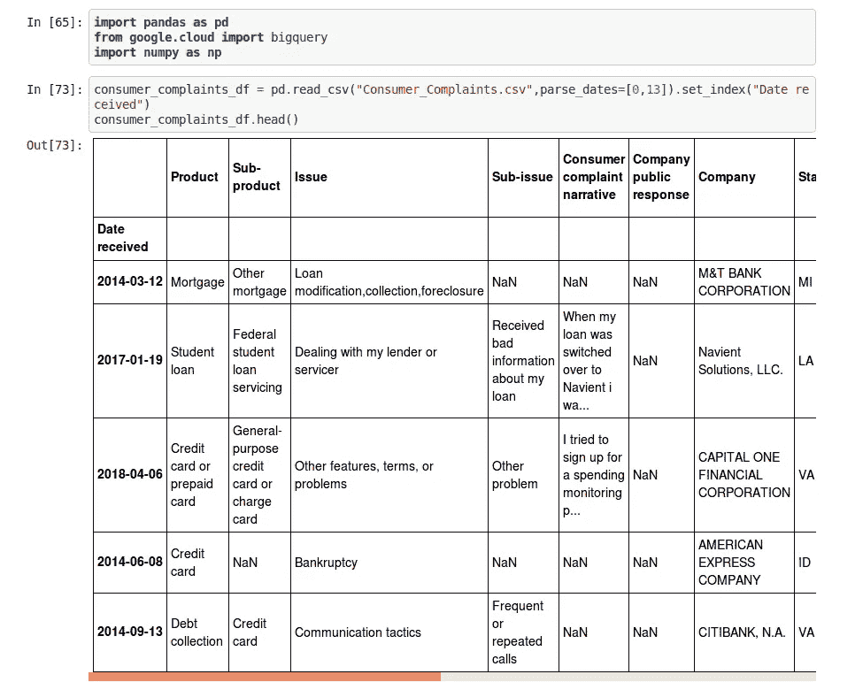

阅读熊猫数据框中的 CSV

**第 2 步**:删除“消费者投诉叙述”列为空值的行。
由于本演示的目的是根据“消费者投诉叙述”文本预测产品名称，因此删除了所有具有空值的记录。

```
print(consumer_complaints_df.shape[0])
print (consumer_complaints_df.index.min())
print (consumer_complaints_df.index.max())
print(consumer_complaints_df.shape[0])consumer_complaints_without_nan_df = consumer_complaints_df[consumer_complaints_df["Consumer complaint narrative"].notnull()]print(consumer_complaints_without_nan_df.shape[0])
consumer_complaints_without_nan_df.head()
```

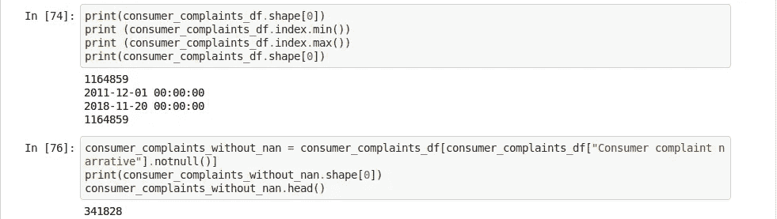

为“消费者投诉叙述”选择非空记录

打印独特的标签，了解数据集中的标签。

```
consumer_complaints_without_nan_df["Product"].unique()
```

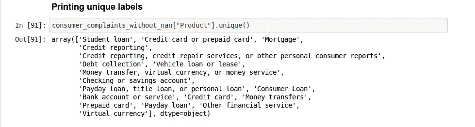

标签列表

**第 3 步**:用前 5 名产品创建一个新的数据框架。
由于沙箱环境和自由层的配额限制，我将把实验限制在前 5 名产品上。

```
top_5_products_df = consumer_complaints_without_nan_df.groupby(["Product"]).size().reset_index(name='count').sort_values(['count'], ascending=False)                                                                       .head(5)top_5_products_df.head(10)
```

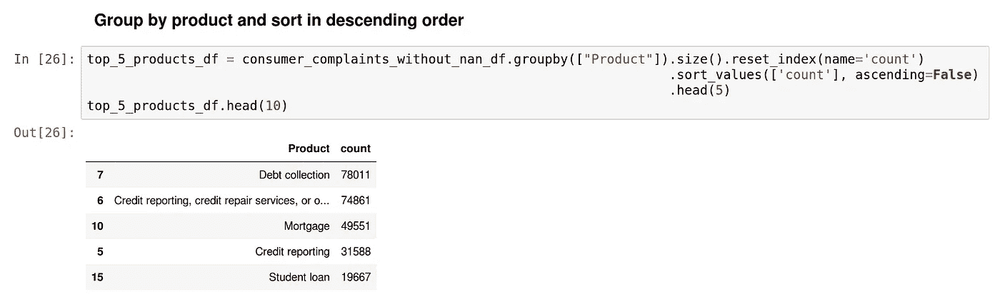

前 5 名产品

**第 4 步**:过滤掉只有产品进入前 5 名的记录。

```
all_records_top5_product = consumer_complaints_without_nan_df.loc[consumer_complaints_without_nan_df["Product"]                                                                  .isin(top_5_products_df["Product"])]all_records_top5_product.shape
```

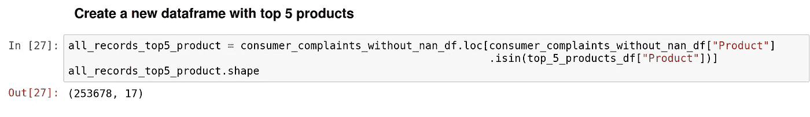

仅包含前 5 大产品的数据集

**第 5 步**:摄取 BigQuery 中的数据
现在我们将使用服务帐户 JSON 文件连接到 BigQuery，并将过滤后的数据帧摄取到 BigQuery 数据集中。

```
client = bigquery.Client.from_service_account_json('<path to service account json>')dataset_id = 'bigquery_demo'
table_id = 'consumer_complaint'dataset_ref = client.dataset(dataset_id)
dataset = client.get_dataset(dataset_ref)
table_ref = dataset_ref.table(table_id)job_config = bigquery.LoadJobConfig()
job_config.source_format = bigquery.SourceFormat.CSV
job_config.skip_leading_rows = 1
job_config.autodetect = Trueprint('Dataset ID: {}'.format(dataset_id))
print('Description: {}'.format(dataset.description))job = client.load_table_from_dataframe(all_records_top5_product, table_ref, location='EU')job.result()
```

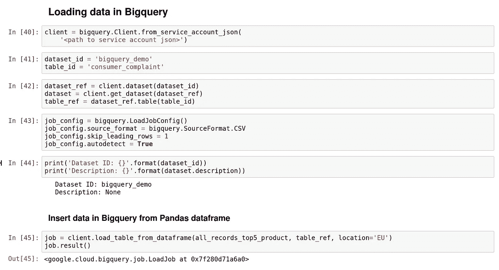

在 BigQuery 中插入数据框架

# 构建逻辑回归多类分类器

**第 1 步**:执行培训任务。
big query 的培训非常简单。从语法上看，这就像在数据库中创建一个视图。关键字*创建或替换模型*定义我们正在创建一个培训工作，这将创建一个新的模型。选项部分需要参数来定义模型。在这种情况下，它是逻辑回归。如果 select 中的某一列没有被命名为“标签”,那么 *input_label_cols* 应该包含应该被视为标签的列的名称。本模块中还应提及其他算法特定的超参数。

```
# Train a model
train_query = """
    create or replace model
    `bigquery_demo.consumer_complaint_model`
     options
      ( model_type='logistic_reg',
        auto_class_weights=true,
        input_label_cols=['Product'],
        max_iterations=10) AS
     select 
     Product, Consumer_complaint_narrative 
     from `bigquery_demo.consumer_complaint`
     where Consumer_complaint_narrative is not null
     and Date_received <= "2017-09-30 00:00:00"
     limit 100000
    """
training_job = client.query(train_query).to_dataframe()print(training_job)
```

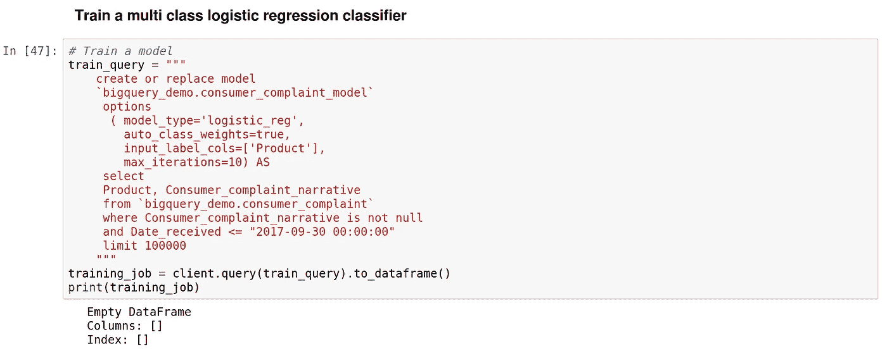

训练逻辑回归分类器

**第 2 步**:查看培训总结。
*ML。对上一步培训模型的*调用返回培训总结。

```
training_info = """
    select
      *
    from
      ML.TRAINING_INFO(MODEL `bigquery_demo.consumer_complaint_model`)
    """

training_info_job = client.query(training_info).to_dataframe()print(training_info_job)
```

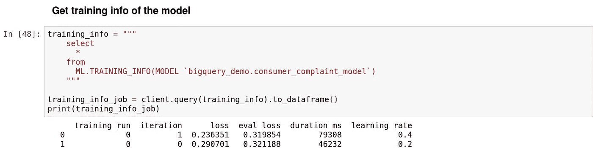

培训总结

**第 3 步**:在测试集上对模型进行评价。
*ML。*对模型的调用与对数据的选择查询将对模型进行评估。在这种情况下，select 查询将表中日期高于 2017 年 9 月 30 日的所有记录作为评估模型的输入。
平均准确率为. 28，不太好。通过一些超参数调整，它可能会变得更好，但这不在本文的范围内。这里需要注意的一点是，用于培训和评估的整个数据预处理都是由 BigQuery 管理的。这也可能对精度产生一定影响。

```
# perform evaluation
query_evaluate = """
    select 
      * 
    from ML.EVALUATE (MODEL `bigquery_demo.consumer_complaint_model`, 
      (
        select 
        Product, Consumer_complaint_narrative 
        from `bigquery_demo.consumer_complaint`
        where Consumer_complaint_narrative is not null
        and Date_received > "2017-09-30 00:00:00"
      ))
    """

evaluation_job = client.query(query_evaluate).to_dataframe()print(evaluation_job)
```

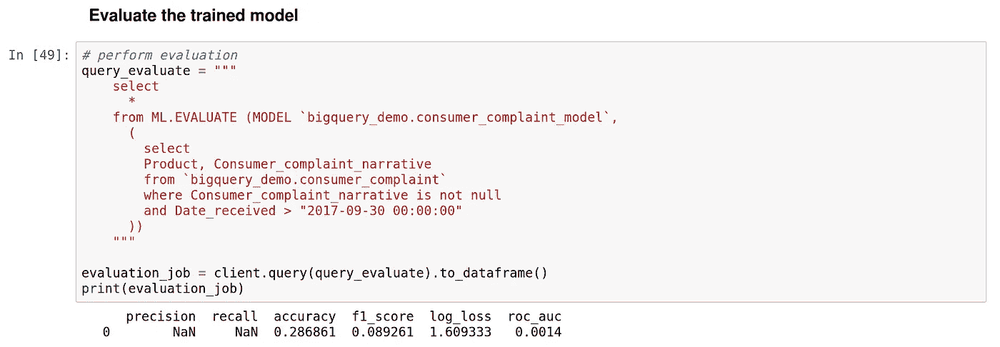

模型评估

**第 4 步**:获取预测
*ML。对模型的*调用将对选择查询传递的数据进行预测。

```
# perform prediction
query_predict = """
    select 
      *
    from ML.PREDICT (MODEL `bigquery_demo.consumer_complaint_model`,
      (
        select 
        Consumer_complaint_narrative 
        from `bigquery_demo.consumer_complaint`
        where Consumer_complaint_narrative is not null
        limit 2))
    """
prediction_job = client.query(query_predict).to_dataframe()prediction_job.head()
```

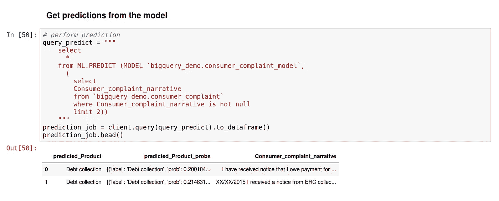

来自模型的预测

第五步:评估响应
预测将返回所有标签上概率分布的数据帧。

```
prediction_job["predicted_Product_probs"][0]prediction_job["predicted_Product_probs"][1]
```

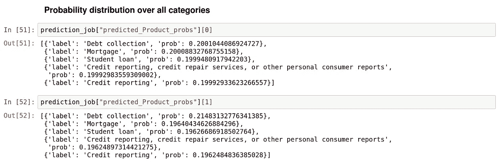

类间概率分布

# 限制:

BigQuery ML 仍处于测试阶段。这是一款相对较新的产品，具有一些非常有前景的特性。然而，它仍然有很长的路要走。到目前为止，它只支持线性回归、二元逻辑回归和多类逻辑回归。多类逻辑回归允许的唯一标签的最大数量是 50。

这个练习的源代码在 [Github](https://github.com/manoveg/ML_with_python/blob/master/bigquery_ml_demo.ipynb) 上。