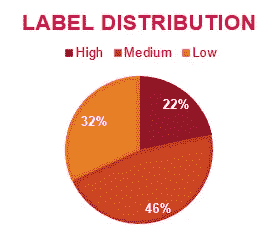
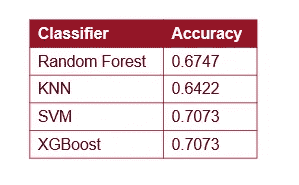
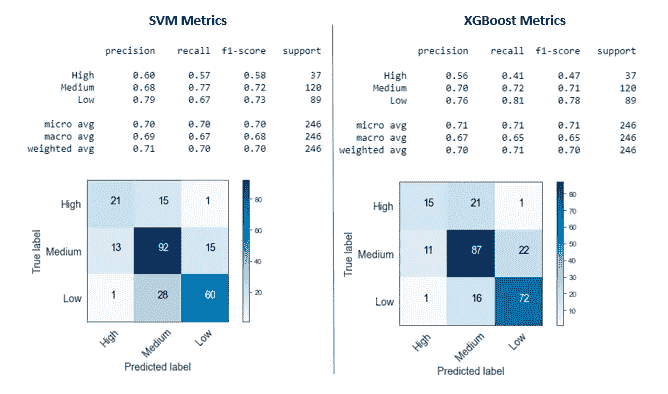
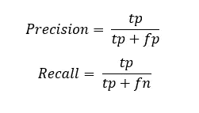

# 多类 ML 模型评估

> 原文：<https://medium.com/analytics-vidhya/multi-class-ml-models-evaluation-103c9fdadb41?source=collection_archive---------5----------------------->

## 评估机器学习分类模型的初学者方法

图片来自[皮克斯拜](https://pixabay.com/?utm_source=link-attribution&utm_medium=referral&utm_campaign=image&utm_content=2996301)

这篇博文有一个初学者的方法，介绍如何使用混淆矩阵度量来评估多类机器学习分类模型的性能。

## **第一步:熟悉你的班级分布**

处理多类数据集时，了解类的分布并意识到是否存在类不平衡非常重要。正如你在下面的图表中看到的，我的班级不平衡。类别不平衡不一定意味着坏消息，它可能只是由于所研究现象的性质，但您需要了解分布情况，以便为您的模型选择正确的方法和评估指标。

我学到了一个直观的经验法则，它帮助我理解了关注数据集的类分布的重要性:选取最频繁的类，并计算将所有预测默认为该类的模型的准确性。如果最频繁的类别代表了全部标签的 85%,这将意味着——就像这样——您将拥有一个准确率为 85%的模型！但是，其他类呢？误导，对吧？

## 单独检查准确性

在我的实验中，我使用不同的方法创建了第一轮分类模型，并比较了它们的准确性。正如你在下表中看到的，SVM 和 XGBoost 有相同的准确度分数，但是如何知道哪个模型是解决我的问题的最佳选择呢？

准确性衡量成功预测的标注数量，但它不会告诉您关于哪些类预测得更好或哪些类可能被忽略的任何信息。这就是混乱矩阵拯救世界的地方！

## 混淆矩阵

网上有很多解释困惑矩阵的资源。请务必花些时间了解这一有用指标的价值。

下面是我用来打印分类报告和绘制混淆矩阵的 python 代码。

你可以在下图中看到 SVM 和 XGBoost 模型的混淆矩阵和分类报告。现在，让我向你介绍一下这些数字是如何帮助我做出决定的。

## 精确度和召回率

**Precision** 告诉您一个类别预测标签实际属于该类别的百分比(当该模型对该类别进行分类时，您可以信任该模型的程度)。

**Recall** 告诉您正确分类的标签占类别总数的百分比(该模型代表该特定类别的程度)。

在我的实验中，我对正确分类“高”标签特别感兴趣。SVM 模型对 57%的“高”标签进行了正确分类(回忆)，当它将一个标签分类为“高”时，我可以 60%确定它实际上是一个好的预测(精度)。XGBoost 模型中“高”标签的精度和召回率较低，因此，我最终选择了 SVM 模型。

## 结论

*   了解类分布有助于您对性能指标持批评态度，尤其是在不平衡的多类分类模型中。
*   混淆矩阵是了解模型如何表示数据集中不同类的详细信息的绝佳工具。