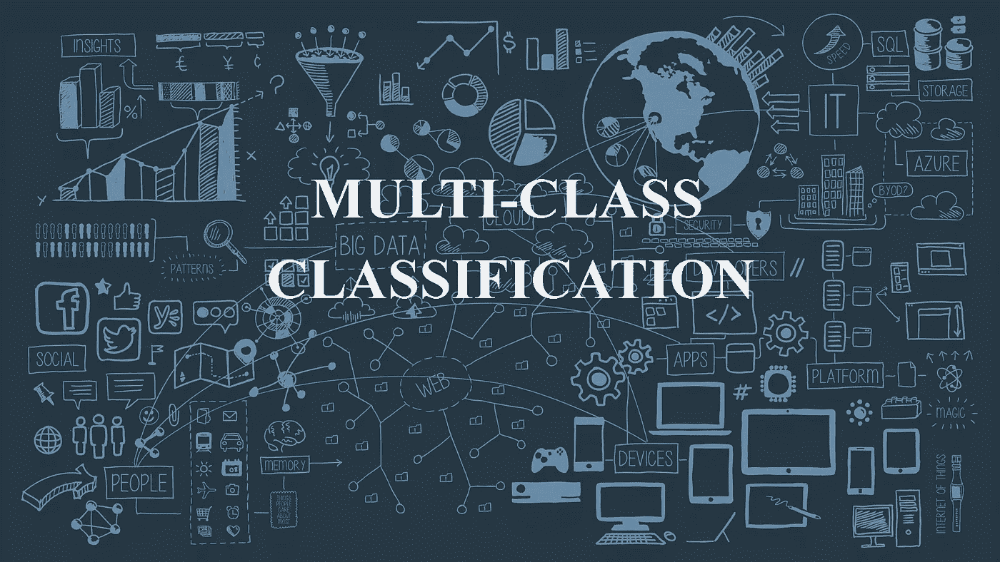

# 多类文本分类|机器学习实用指南

> 原文：<https://medium.com/analytics-vidhya/multi-class-text-classification-practical-guide-to-machine-learning-6002bcadbd51?source=collection_archive---------7----------------------->

在这篇文章中，我将讨论如何在机器学习中以实用的方式执行多类文本分类任务。在这里，我们还讨论了不同的自然语言处理(NLP)技术来执行我们的数据预处理任务，以便生成有意义的数据来构建我们的机器学习模型。你可以尝试一步一步的指导学习和理解…