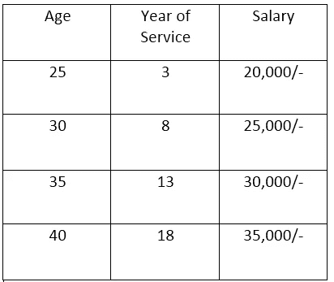
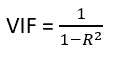
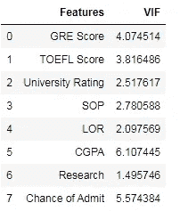
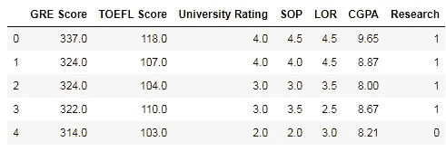
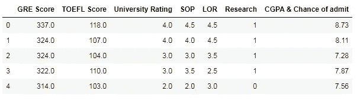

# 多重共线性回归问题的关键方面

> 原文：<https://medium.com/analytics-vidhya/multi-collinearity-key-aspect-of-regression-problem-9918a1a52559?source=collection_archive---------23----------------------->


[来源](https://www.google.com/search?q=people+in+deep+thinking&tbm=isch&ved=2ahUKEwj87Pr_p5btAhWI1XMBHYVrDegQ2-cCegQIABAA&oq=people+in+deep+thinking&gs_lcp=CgNpbWcQAzoECCMQJzoECAAQQzoCCAA6BwgjEOoCECc6BQgAELEDUI4bWOJQYIBSaAFwAHgEgAHOAYgB9R6SAQYwLjI3LjGYAQCgAQGqAQtnd3Mtd2l6LWltZ7ABCsABAQ&sclient=img&ei=_G66X_z-B4irz7sPhde1wA4&bih=657&biw=1366#imgrc=FiXsK4VVn_PhqM)

> **什么是多重共线性？**

多重共线性发生在两个或更多的独立变量(**特征**)高度相关的时候。



图 1

假设您有一个数据集来预测一个人的工资，这个人有独立变量**年龄、服务年限。**这里，两个独立变量都是强相关的，并形成它们自己的关系 **x1=m*x2+c.** 由于相互依赖，这些独立变量与 y 的相关性较小

多重共线性不会影响模型性能，但独立变量(多重共线性)对输出变量的影响会较小，因此会降低可解释性。

> **多重共线性的原因有哪些？**

**一、假陷阱**

假设我们有一个由**单身**和**已婚**列组成的数据集，如果我们已经将**已婚**作为自变量，那么就没有必要将**单身**作为自变量，从而导致数据集中的冗余，导致多重共线性。

重要的是消除从**单热编码**获得的输出的第一列，否则将导致伪陷阱。

**二。数据集中的相同变量**

假设我们在数据集中有两个不同的工资列，一个表示以卢比表示的工资，另一个表示以美元表示的工资。

**三世。创建一个依赖于数据集中其他变量的变量**

假设您已经有了**出生年份**列，并且您已经添加了另一个名为**年龄**的列，这两个列显示了彼此之间的高度相关性，并减少了它们对因变量的个体影响。

> **差异膨胀系数**

方差膨胀因子检查一个独立变量如何与另一个独立变量相关。数学上它被定义为:



**R** 是残差的平方。

**V . I . f 的代码**

我已经使用了**入院预测**数据集来检查 V.I.F。

```
from sklearn.preprocessing import StandardScaler
scaler=StandardScaler()
from statsmodels.stats.outliers_influence import
   variance_inflation_factor
scaler=StandardScaler()
def cal_vif(x):
    x_scaled=scaler.fit_transform(df)
    vif_data=pd.DataFrame()
    vif_data["Features"]=df.columns
    vif_data["VIF"]=[variance_inflation_factor(x_scaled,i) for i in 
                      range(x_scaled.shape[1])]
    return(vif_data)
cal_vif(df)
```



输出

我们将设置一个阈值。如果任何要素的值大于阈值，则被视为多重共线。

我们可以通过两个过程来消除特征之间多重共线性；

**i .删除具有高 V.I.F 的功能**

在上面的输出中，我们有两个具有高 V.I.F 值的特征，因此我们可以通过移除这两个特征中的任何一个来减少它。

```
df.drop("Chance of Admit",axis=1,inplace=True)
df.head()
```



去除录取机会后获得的输出

**二世。将两列合并成一列，然后移除两列**

```
df["CGPA & Chance of Admit"]=df.apply(lambda df:df["CGPA"]- 
                                     df["Chance of Admit"] ,axis=1)
df.drop(["CGPA","Chance of Admit"],axis=1)
df.head()
```



输出

**结论:-**

希望你喜欢这个博客，如果你有任何疑问和建议，请在下面评论。继续探索，继续学习。