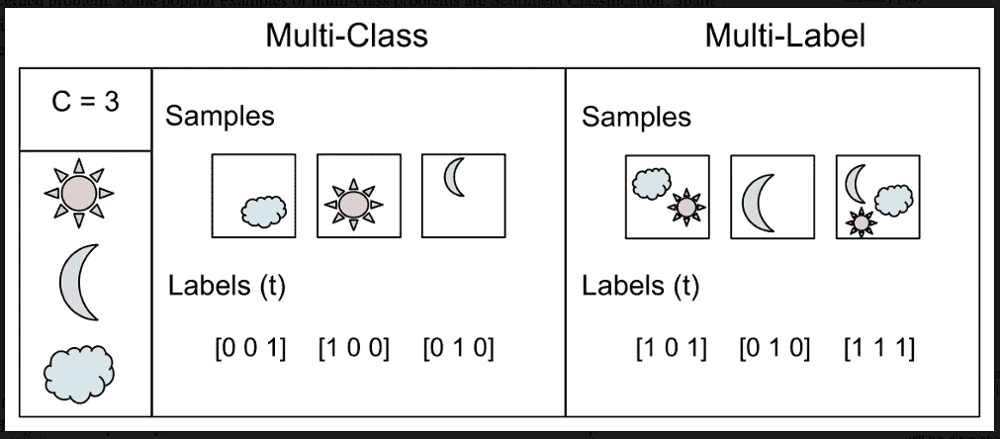
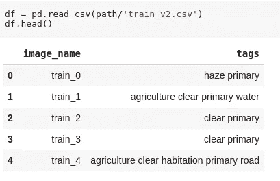
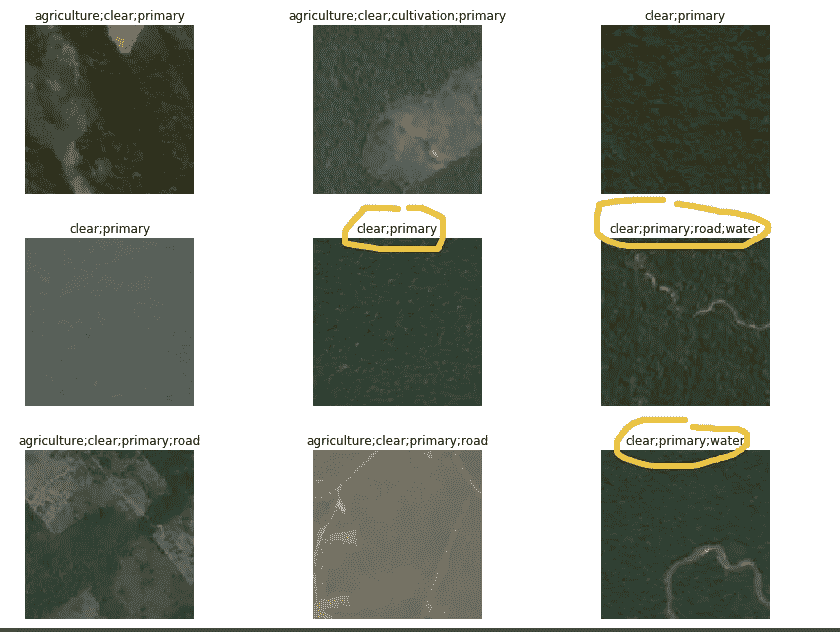
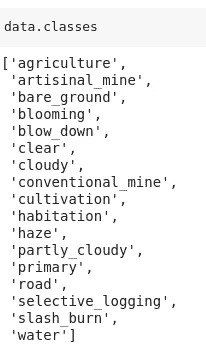
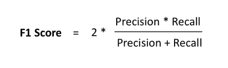
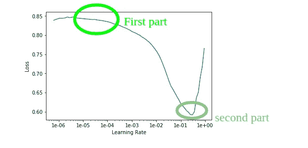

# 使用 fastai 的多标签分类——fastai 数据块 API 浅探

> 原文：<https://medium.com/analytics-vidhya/multi-label-classification-using-fastai-a-shallow-dive-into-fastai-data-block-api-54ea57b2c78b?source=collection_archive---------1----------------------->

## 这是一篇关于多标签分类的简短博文。如果你想了解分类背后的动态，我建议你浏览一下这篇博客文章。



图片来源——谷歌

对于多标签分类，我将解决一个 [Kaggle 竞赛](https://www.kaggle.com/c/planet-understanding-the-amazon-from-space/overview)。您需要将数据集下载到您的本地。网上有很多指南告诉我们如何下载 Kaggle 竞赛数据集。去找那个人吧！

## 😈深入了解数据库

Kaggle 提供的数据集是用一个名为 7zip 的程序压缩的，该程序的扩展名为. 7z。如果你使用的是 conda，那么你需要为 7zip 安装 conda 扩展。

```
! conda install -y -c haasad eidl7zip
```

如果你使用的是基于 Linux 的系统，比如 goggle collab，那么使用下面的命令来安装 7zip。

```
!sudo apt install p7zip
```

现在，数据集不仅被压缩了，还被涂上了焦油。因此，您可以运行下面的命令来完全访问数据集。我是谷歌实验室，所以我的道路将取决于此。你可能会有不同的道路。所以找到你的那一个，写在下面。

```
path = '/content/planet'
path.mkdir(parents=True, exist_ok=True)
path! 7za -bd -y -so x {path}/train-jpg.tar.7z | tar xf - -C {path}
```

这将解压缩 train.tar.7z 文件。标签在中提供。csv 文件，也是压缩的。要解压缩 CSV 文件，请运行以下命令。

```
!unzip -q {path}/train_v2.csv.zip -d {path}
```

**深入数据集**

由于我们必须对数据集进行多重标记，因此 Kaggle 很好地处理了这一点，而不是将图像放在不同的文件夹中进行不同的标记。Kaggle 已经向我们提供了 CSV 文件，其中显示了文件(图像)的名称和相应的标签。你可以用熊猫库来玩 CSV 文件。如果您以前没有使用过 pandas，它是 Python 中处理表格数据的标准方式。我建议你去探索熊猫。

```
from fastai.vision import *
import pandas as pddf = pd.read_csv(path/'train_v2.csv')
df.head()
```



带标签的图像名称

在我以前的分类博客中，我一直使用工厂方法来创建图像数据束，如 image data bunch。但有时我们需要在以下方面做出选择:

*   文件在哪里
*   它们的结构是什么，比如文件夹，CSV 文件
*   标签看起来如何像多标签、单标签
*   你如何吐出验证集
*   你如何改变它

我并不是说你不能从 ImageDataBunch 做任何事情，但是 fastai 提供了一个 API，叫做[数据块 API](https://docs.fast.ai/data_block.html) 。它为我们提供了更多的灵活性。在这篇文章中，我将使用这个 API。

```
tfms = get_transforms(flip_vert=True, max_lighting=0.1, max_zoom=1.05, max_warp=0.)np.random.seed(42)
src = (ImageFileList
       **.from_folder(path)**            
       **.label_from_csv**('train_v2.csv',sep=' ',folder='train-jpg',suffix='.jpg')
       **.random_split_by_pct**(0.2))data = (src.datasets()
        .transform(tfms, size=256)
        .databunch().normalize(imagenet_stats))
```

让我们来理解一下上面的养发码。不是真的！😜

*   。from_folder(path) —我们希望从提供的文件夹中获取数据。您必须定义文件所在文件夹的路径。这里我们的路径是“/内容/星球”
*   。label_from_csv(文件名、分隔符、文件夹名、扩展名)—我们的图像多标签存在于 csv 文件中。我们已经在 from_folder()中提供了所有文件所在的路径。在这个属性中，我们不得不提到 CSV 文件名，CSV 中的东西是如何被分开的。在我们的例子中，这些是通过“”(空格)分开的。然后，我们必须提到数据所在的文件夹名称。最后是文件的后缀。
*   。random_split_by_pct(验证数据集的数量)
*   。datasets()-它用于创建数据集。我们将很快了解更多。
*   。databunch() —现在，您想要使用命令创建图像数据束。它将为您提供培训和验证数据束。

❓什么也看不上”。dataset()" do

数据集是 PyTorch 的东西。它为我们提供了两种 dunder 方法:

*   __getItem__ =它将在您在方法中提供的索引处获取特定的项。如果你有一个名为 data 的数据集，你想获取数据集中的第 4 项，你可能会做一些类似 data[0]的事情。在内部，这个命令将调用 __getItem__ 方法来获取第 4 个项目。
*   __len__ =当我们想要检查数据集的长度时，在内部调用该方法。你可以使用 len(数据)这样的东西。它将调用 __len__ 来计算数据集的长度。

所以当我们打电话时。dataset()，它做上面的事情。此外，它将我们的输入数据转换成数据集的东西。

❓什么是数据捆绑

在理解 databunch 之前，我们需要了解数据加载器。

— ❔什么是数据加载器
数据加载器使用我们的数据集，并为我们提供小批量数据，很像 python 迭代器。简而言之，我们可以说— *为了创建一个小批量，我们使用了另一个 PyTorch 类，称为 DataLoader。*

数据加载器在其构造函数中接受数据集。它做以下事情:

*   从数据集中随机抓取项目
*   创建一批你要求的任何大小
*   在 GPU 上弹出它
*   给你的模特送去

现在回到 **DataBunch，****训练数据集不足以训练模型。我们还需要验证数据集来检查模型的性能。同样的事情。它将我们的训练数据加载器、验证数据加载器和可选的测试数据加载器绑定在一起，并确保相同的转换应用于所有数据加载器。因此，当您创建一个 DataBunch 时，您会提供它，或者它会获取一个训练集数据加载器和一个验证集数据加载器。现在，这是一个你可以发给学习者并开始安装的物体。**

**如果你没有使用你不应该使用的数据块😆，您可以使用 ImageDataBunch 以及下面的。**

```
ImageDataBunch.from_csv(planet, folder='train', size=256, suffix='.jpg', sep = ' ', ds_tfms=planet_tfms)
```

## **解释数据集**

**您可以查看如下数据集:**

```
data.show_batch(rows=3, figsize=(12,9))
```

****

**对于我们的数据集，我们有大量的类，每个图像对于每个数据类都有一个概率。**

```
data.classes
```

****

**我们必须决定某个数字，高于这个数字的概率将被显示为图像的标签。我们将在一分钟内研究这个想法。**

## **创建多标签分类器**

```
arch = models.resnet50acc_02 = partial(accuracy_thresh, thresh=0.2)
f_score = partial(fbeta, thresh=0.2)
learn = create_cnn(data, arch, metrics=[acc_02, f_score])
```

**上面的代码很多。让我们一点一点去了解。**

*   **在我以前的分类器博客中，我使用过 resnet34，但在这里我使用 ResNet 50，因为它很快，使用它效果也很好。您可以先使用 ResNet34，然后使用 ResNet50 来感受不同之处。去吧；你需要的都有了。**
*   **我可以使用任何度量，这是我们的模型在不同训练点的输出。在这里，我使用 accuracy_thresh 来衡量 kaggle 比赛的准确性和 f_score(f_beta)。这不会提高我的模型性能。千万不要这么想，绝对不会影响模型性能。您可以在这里了解指标[。](https://docs.fast.ai/metrics.html)**
*   **因为我们必须对数据进行多重标记，所以我们传递 thresh 属性，该属性用作标记的阈值。**
*   **这里我们使用 python 中定义的部分函数。我建议读者学习 python 中的部分函数。它用一些属性的预定义值调用真正的函数。这里我们已经预定义了 thresh 属性值。**

**在我们继续之前，我想讨论一下 f_score。
**精度** —以真阳性与实际结果之比来衡量。意思是在所有的实际产出中，有多少预测是实际真实的。
**回忆** —它被定义为真阳性与预测结果的比率。这意味着 ao 所有的预测输出，有百分之多少涵盖了真阳性。**

****

**F1 分数或 f_score**

**现在，我们只剩下已知的东西了。所有这些在我的第一篇关于分类的博客中都有详细的提及。[请过目](/@PJrohan/image-classification-using-fastai-5ff5b374d414)。这里我只说方法。**

**第一部分**

```
learn.lr_find()
learn.recorder.plot()
learn.fit_one_cycle(5, slice(lr)) where lr is the learning rate.
learn.save('stage-1-rn50')
```

**第二部分**

```
learn.unfreeze()
learn.lr_find()
learn.recorder.plot()
learn.fit_one_cycle(5, slice(lr-1, lr-2))
learn.save('stage-2-rn50')
```

**❓如何选择学习率**

*   **解冻前-找到最陡的坡度，但不要在底部，并试验其周围的值。**
*   **解冻后——我们使用 slice()，其中第二个参数与冻结前的参数相同，但您可以根据得到的结果将其除以一些值，如 lr/5、lr/10 等。对于第一个论点，你必须很有实验性。就一般意义而言，找到图表中刚好在它被击落之前的部分，并且只对图表中该部分周围的值进行实验。例如:**

****

*   **如上所述，被称为区别学习率的技术是基于我从 fastai 那里学到的。我建议读者尝试一下这些值，如果他们发现其他值更有价值的话，可以使用其他值。**
*   **这是验证码。当我们声明区别学习率时，我们向一组层而不是单个层提供不同的学习率。如果你使用 cnn 来创建学习者，我们通常把层分成 3 层组。第一组由添加的层组成，其余的层分为两个独立的组。这也称为微调。**

**数据集的多分类标注到此结束。
向读者致谢。**

# **参考**

*   **fast.ai**