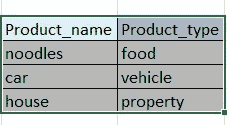
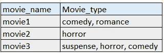
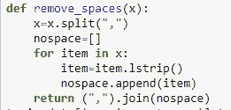
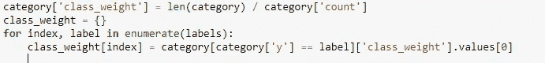
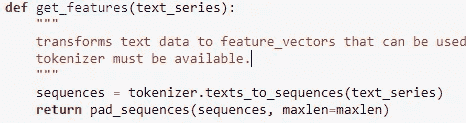
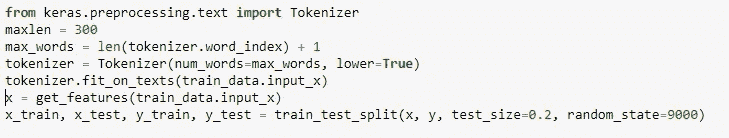
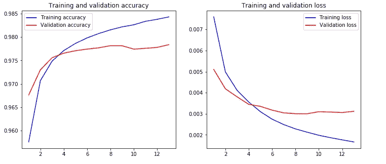
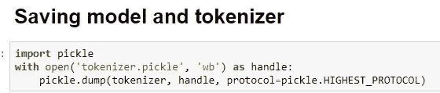
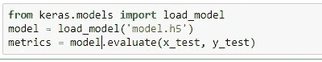

# 在不到五(5)分钟的时间内为初学者进行多标签文本分类

> 原文：<https://medium.com/analytics-vidhya/multi-label-text-classification-for-beginners-in-less-than-five-5-minutes-19502a96cf39?source=collection_archive---------7----------------------->

因此，在我们深入研究多标签文本分类之前，让我们先了解一下

> **什么是多标签文本分类** —

基于维基百科——**多**——**标签分类**是多类**分类**的推广，是将实例精确地归类到两个以上类中的一个的单**标签**问题；在 **multi** - **label** 问题中，对于实例可以被分配给多少个类没有限制。

让我们用一个例子来理解这一点

所以如果我们有一个数据框架或者一个有两列的表格

1.  产品名称
2.  产品类型

如果每个产品只能分配到一个产品类型，那么它是一个多类文本分类(不是多标签)

例子—

多类文本分类

如果每个产品名称可以分配给多种产品类型，那么它就属于多标签文本分类(顾名思义，就是将多个标签分配给输入文本)

多标签文本分类

在这里，您可以看到多个标签被分配到一个类别。一部电影的名字可以是浪漫的，也可以是喜剧的。因此，这类问题属于多标签文本分类

**要遵循的基本步骤—**

输入数据和输出变量的预处理

1.  有很多方法可以做到这一点——删除多余的空格，多余的标点符号，将所有内容转换成小写，删除停用词。等等。移除空格的示例—

移除空格的功能

2.使用多标签二进制化器转换成多标签格式—(蛮好的解释—[https://sci kit-learn . org/stable/modules/generated/sk learn . preprocessing . multilabelberminiazer . html](https://scikit-learn.org/stable/modules/generated/sklearn.preprocessing.MultiLabelBinarizer.html))o =

3.让我们来看看你的目标变量是什么样子的——如果目标变量标签没有适当地平衡，那么给标签分配权重。—

4.标记化、填充(输入数据的预处理)

标记化和填充

5.将您的数据分为训练集和测试集，使您的模型适合训练集，然后在测试集上对其进行评估。

培训和测试数据

6.有一些准确度图是很好的(一定要画出来——训练和测试的准确度)

培训与验证

7.一旦您的模型准备就绪，您可以将标记器保存为*。pickle 并将模型文件保存为*.h5，然后在需要运行预测时，您可以加载您的模型，您已经准备好了:)

链接到我的 GitHub 库—[https://github.com/DeeptiAgl?tab=repositories](https://github.com/DeeptiAgl?tab=repositories)