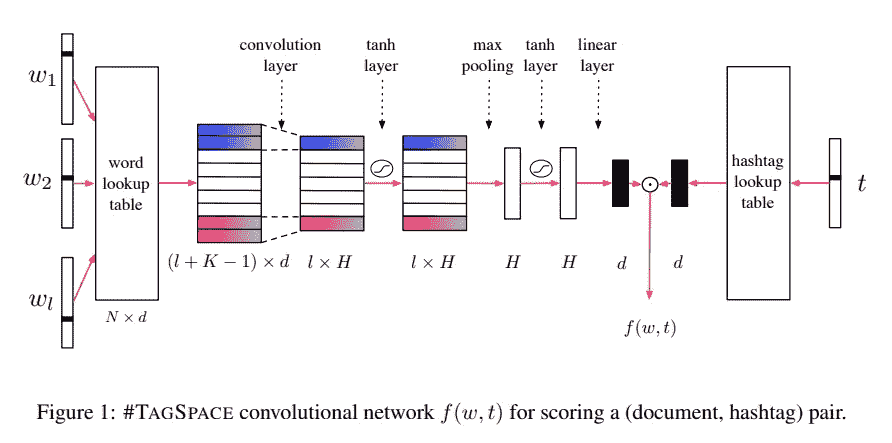

# R 空间中的多标签文本分类

> 原文：<https://medium.com/analytics-vidhya/multi-label-text-classification-with-starspace-in-r-c9d72d7b7146?source=collection_archive---------4----------------------->

丹尼斯·德吉奥安尼在 [Unsplash](https://unsplash.com?utm_source=medium&utm_medium=referral) 上拍摄的照片

在本帖中，我们将根据描述电影情节的文本来预测电影类型。

[数据](http://www.cs.cmu.edu/~ark/personas/)来自每部电影的维基百科页面。我们使用的 R 包是使用脸书人工智能研究团队开发的方法创建的 [ruimtehol](https://cran.r-project.org/web/packages/ruimtehol/index.html) 包( [StarSpace](https://research.fb.com/downloads/starspace/) ， [TagSpace](https://emnlp2014.org/papers/pdf/EMNLP2014194.pdf) )。你可以在这里找到我这个项目[的代码。](https://github.com/BenjaminPhillips22/movie_genres)

何时以及为什么使用标记空间？在这种情况下，我们有文本数据(电影情节)和大量的标签(类型),这些标签并没有完全一致地应用。

看标签空间“引擎盖下”

TagSpace 被设计成使用脸书帖子的自由文本来预测与这些帖子相关的标签。我们可以将他们的用例扩展到我们的。我们在情节描述中有文字，类型很像标签。

StarSpace 类似于 TagSpace，但是更加一般化。标签空间允许我们从单词嵌入创建文档嵌入，而 StarSpace 允许我们为任何东西创建嵌入。例如，网站可能具有从网站上的文本生成的嵌入，而用户可能具有从他们访问的网站生成的嵌入。

**我们开始吧！**

您可以手动下载数据或使用以下代码。

加载必要的库。ruimtehol 包为我们在 r 中使用 StarSpace 算法提供了框架。它是由 Jan Wijffels 创建的，他写道 ruimtehol 是“star space”在西佛兰芒语中的翻译。

在我们开始建模之前，有许多预处理步骤。我们需要将情节描述数据加入到类型数据中，并对它们进行清理。下面是使用的文本清理功能。有关清理和加入数据的更多细节，或项目的其他部分，请参见我的 github repo [这里](https://github.com/BenjaminPhillips22/movie_genres)。

我们使用一些流行的文本处理技术，如[词干](https://en.wikipedia.org/wiki/Stemming)和删除“停用词”(常见的词，如“the”、“a”和“to”)。还有其他常见的技术，如 l [emmatisation](https://en.wikipedia.org/wiki/Lemmatisation) 可以用来代替词干。

电影《回到未来》已经标注了流派；科幻、冒险、喜剧、家庭电影。情节的第一行是“17 岁的马蒂·小飞侠和他暗淡无光、毫无抱负的家人住在加利福尼亚州的希尔谷。”。处理后会是这样的；“17 岁的马蒂·麦克弗莱住在荒凉的加州山谷”

一点探索性的分析不会有坏处，而且经常会有帮助。

**流派**

我们可以看到最受欢迎的类型标签是戏剧、喜剧和浪漫电影。在最不受欢迎的词中，可以看到喜剧和浪漫惊悚片的拼写错误。如果你想知道，浪漫惊悚片中的一部电影是宝莱坞电影，名为“血腥的伊瑟克”。因为有些类型出现的次数很少，所以在这个实验中，我们只预测前 50 个类型。

标签并不完美。考虑与浪漫有关的类型。

电影《公主新娘》有标签；喜剧、喜剧、戏剧、喜剧、爱情电影、家庭电影和青少年电影。它被称为浪漫电影和戏剧，但不是浪漫戏剧。标记空间算法特别擅长处理这种模糊分类问题。

情节描述中的词(删除停用词后)

“杀”似乎是电影情节描述中最常见的词。推断你对人性和/或电影文化的看法。

有很多单词在整个数据集中只出现几次。我们需要在训练模型时考虑到这一点。

**造型**

因为我们想对文本进行分类，所以我们将使用 embed_tagspace 函数。我们来看看参数。

*   x 是模型将用作特征的已清理文本。它应该是一个向量，其中每个元素都是一个字符串。
*   y 是模型将尝试和预测的标签。它应该是一个列表，列表中的每个元素都是流派的向量。
*   dim 是为文本生成的文档嵌入的尺寸大小。每个绘图描述将被表示为长度为 20 的向量。
*   历元是为模型定型的最大历元数。在内部，embed_tagspace 函数创建一个训练和开发集。当开发集的性能在 10 个时期后没有提高时，训练就停止了。我们的模型通常运行大约 15 个时期。
*   lr 是神经网络的学习速率。
*   损失是损失函数。代替 softmax 的另一个选项是“铰链”。
*   negSearchLimit 是抽样的负片标签数。
*   ws 是模型查看文本的窗口大小。
*   minCount 是一个单词在整个语料库中出现的最小次数，以便模型为其创建嵌入并将其用作预测过程的一部分。出现次数少于此数量的单词对模型是不可见的。

**评估模型。**

模型的输出是文本嵌入和每个流派标签之间的相似性得分。相似性得分介于-1 和 1 之间，得分越高意味着相似性越大。有许多方法可以衡量模型的准确性。在这种情况下，我们将采用模型输出，过滤以仅包含该电影最初标记的流派，并计算相似性得分的平均值。这样我们就不会因为不完美的标签而受到惩罚。另一个选择是查看[精度并回忆](https://en.wikipedia.org/wiki/Precision_and_recall)。

不适合我们。

让我们看看我们的模型做得好和不好的地方。clean _ 流派列是真实流派，top _ 5 _ 流派是该情节的前 5 个预测流派。

**下一步。**

为了提高准确性，可能值得尝试模型的不同超参数。我们可以考虑增加嵌入尺寸或减少 minCount。尝试使用铰链损耗而不是 softmax 作为损耗函数，增加窗口大小(ws)或尝试使用不同的 negSearchLimit 值。