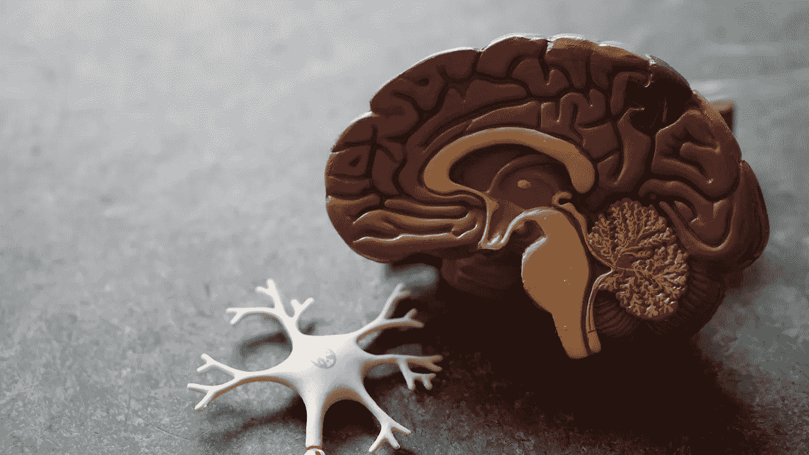
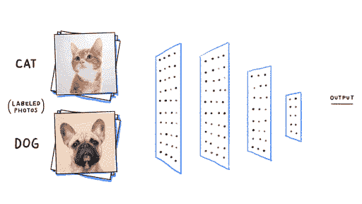
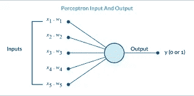
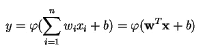
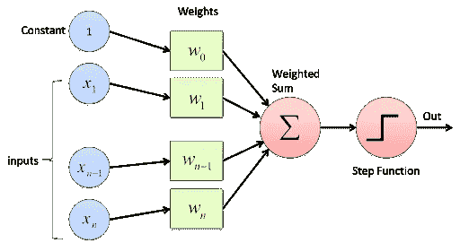
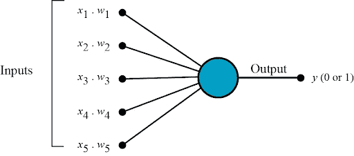
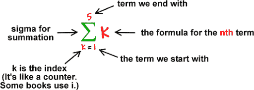
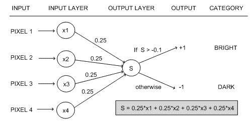
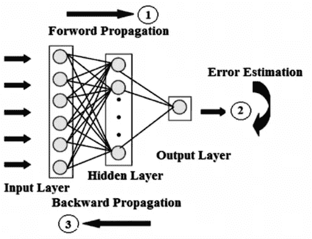

# 多层感知器神经网络算法简介

> 原文：<https://medium.com/analytics-vidhya/multi-layer-perceptron-neural-network-algorithm-and-its-components-d3e997eb42bb?source=collection_archive---------2----------------------->

人类有复制自然的奇妙倾向。

**例如:-** 我们看到鸟儿在天空中飞翔，我们想拥有我们自己创造的像飞机一样的飞行物体，这是第一个能飞的这样的物体，是那次观察的结果，也是复制我们看到并发现有价值的东西的意愿。自然是每一个创新的中心。

但是科学已经试图复制人脑。许多专业人士和研究人员已经开始了解人脑是如何工作的，以及它是如何轻松地容纳一切而不混乱的，还解释和管理广泛的信息。

然后，人工神经网络的想法带来了创新，并且是人脑的生物神经网络的适当代表。众所周知，机器可以复制大脑的工作——不是每一项功能，但至少是几项功能。人工智能给了我们一些机器，它们可以与我们交流，比我们玩得更好，可以对物体进行分类，但不是在所有功能上，而是在某些功能上，它们比人类做得更好。

# 什么是神经网络？

当一组节点或神经元通过突触连接相互连接时，就形成了神经网络。人工神经网络正在评估类似于人类神经系统功能的模型。

每个人工神经网络都有三层——输入层、隐藏层和输出层。输入层由接收输入的几个节点的集合组成，隐藏层位于的输入和输出之间

方法，在该方法中，函数对输入进行加权，并通过激活函数将它们作为输出。输出层给出最终输出。

# 看看正常的神经网络是如何工作的

# 关于感知器

感知器是神经元的计算模型，被分级为神经网络的最简单形式。弗兰克·罗森布拉特于 1957 年在康奈尔航空实验室发明了感知机。

感知器理论在机器学习中有分析作用。它被用作算法或线性分类器，以简化二元分类的监督学习。监督学习算法总是由一个输入和一个正确/直接的输出组成。这个学习问题的目的是使用带有正确标签的数据对未来数据进行更准确的预测，然后帮助训练模型。监督学习的一些常见问题建立在分类之上，以预测类别标签。

简而言之，感知器在机器学习中，感知器是一个术语，或者我们可以说，一种用于[监督学习的算法](https://en.wikipedia.org/wiki/Supervised_classification)旨在执行二进制分类感知器是单层神经网络，多层感知器称为神经网络。感知器是如上所述的线性分类器(二进制)。此外，它还用于监督学习。它有助于对给定的输入数据进行分类

# 什么是二元分类器？

这是机器学习中最常用的问题之一。在最简单的形式中，用户试图将一个单元分成两个可能的类别中的一个。例如，以水果的属性如颜色、果皮纹理、形状等为例。

感知器被分类的线性分类器是一种分类算法，它依赖于线性预测函数来进行预测，并且预测基于包括权重和特征向量的联合。线性分类器为训练数据的分类推荐 2 个类别(意味着我们可以说整个训练数据将落入这两个给定类别)

如上所述，感知器是一种线性分类器——一种通过用直线划分两个类别来对输入进行分类的算法。这里，输入基本上是一个特征向量 x 乘以 w(即权重)并加到 b 上(偏差)

y = w * x + b

在一些框架和机器学习相关的问题中，可以找到感知器学习算法。它可以显示出你所知道的从来不存在的局限性。在某一点上，感知器网络也被发现不足以完成一些基本功能。然而，随着多层感知器网络和改进的学习规则的出现，这个问题就被解决了。

所以感知器今天已经成为一种主要的学习算法，就像在人工智能和机器学习的世界里一样。它检查了一个非常可靠和快速的解决方案，用于对它有可能解决的所有问题进行分类。我们也可以说，如果你掌握了感知机的工作原理。然后你会发现更容易快速理解更复杂网络的方法。

**感知器的主要组成部分是什么？**

1 **。输入值**:感知器算法中，特征作为输入。输入表示为 x1、x2、…。xn，' n '这些功能的总实例。权重:在模型训练期间计算的值。随着每个误差，即训练误差，权值被更新。重量表示为 w1、w2、……wn。

2. **Bias** :允许分类器从初始位置向左右方向(右、左、上、下)移动决策分割线。偏移的目的是将每个点在特定方向上移动指定的距离。偏差允许更高的质量，并且模型的训练更快。

3.**激活/阶跃函数**:激活或阶跃函数用于生成非线性神经网络。

4 **。加权求和:**与权重(wn)的相关值相关联的每个特征或输入值(xn)的乘积给出了一个值的和，称为加权求和。加权求和表示为∑wixi(I->【1 到 n】)

感知器通过使用以数学术语给出的输入权重建立线性组合，基于各种实值输入将单个 O/P 放在一起:

在哪里，

w 代表权重向量

x 是输入的向量

b 称为偏差

φ是有时使用的非线性激活函数。

正如你在给定的图片中看到的，它有多层。

## 感知器主要由四部分组成，它们是:-

1.  输入值或一个输入图层
2.  权重和偏差
3.  净和
4.  [激活功能](/towards-data-science/activation-functions-neural-networks-1cbd9f8d91d6)

神经网络的工作方式类似于感知器。所以，如果你想知道神经网络是如何工作的，首先我们要了解感知器是如何工作的？

# 请看下图，了解感知器的工作原理

借助图表理解感知器的工作原理

**感知器工作在这些简单的步骤上:-**

1.  所有输入值 *x* 乘以各自的权重 *w* 。姑且称之为 *k.*

2.将所有相乘的值相加，称之为加权和。

*3。*将加权和应用于正确激活函数。

对于 Ex *:* 单元步进激活功能。

**权重和偏倚的使用？**

如上所述，权重指示特定节点的强度。

偏差值允许您上下移动激活函数曲线。

**为什么我们需要激活功能？**

简而言之，激活函数用于映射所需值之间的输入，如(0，1)或(-1，1)。

快进到 1986 年，当 Hinton、Rumelhart 和 Williams 发表了一篇论文“通过反向传播误差学习表征”时，发现了反向传播和隐藏层概念，于是多层感知器(MLPs)出现了:

1.  [反向传播](/@jorgesleonel/backpropagation-cc81e9c772fd)，一种反复修改权重以减少实际 O/P 和期望 O/P 之间差异的方法
2.  隐藏层是放在输入和输出之间的神经元节点，允许神经网络学习更复杂的特征。

因此，MLP 被称为深度人工神经网络。它是一个以上感知器的集合。它们由接收信号的输入层、对输入做出选择或预测的输出层，以及在这两层之间的任意数量的隐藏层(MLP 的真正计算引擎)组成

多层感知器在一组 I/O 对上进行训练，并学习对这些输入和输出之间的连接进行建模。训练需要调整框架或权重和偏差，以减少误差。[反向传播](/@jorgesleonel/backpropagation-cc81e9c772fd)用于使那些给定的权重和偏差适应相对误差，而误差本身可以用多种方式来测量，包括通过均方根误差。

*   在上图中，正向传递，信号流运动是从输入层通过隐藏层，然后到输出层，输出层的结论是根据真值标签测量的。
*   在反向传递中，通过使用[反向传播](/@jorgesleonel/backpropagation-cc81e9c772fd)和微积分的链式法则，关于不同权重和偏差的误差函数的偏差导数通过多层感知器反向传播。

在这个乒乓球的网络游戏中继续下去，直到错误可以降低。这种状态被称为收敛。

我希望这篇博客让你对这些常用术语以及它们在更好地理解神经网络、感知器和机器学习相关术语中的用途/作用有了有意义和清晰的理解。

快乐学习:-)

