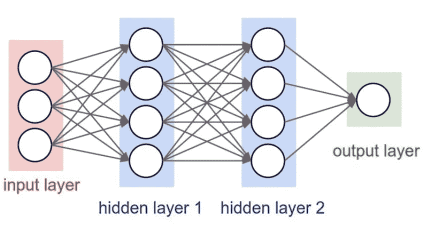
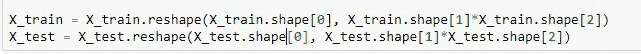

# 基于 MNIST 数据集的多层感知器用于数字分类

> 原文：<https://medium.com/analytics-vidhya/multi-layer-perceptron-using-keras-on-mnist-dataset-for-digit-classification-problem-relu-a276cbf05e97?source=collection_archive---------2----------------------->



## ReLu 激活+退出+批处理规范化+ AdamOptimizer

## **加载 MNIST 数据集**

每个 MNIST 数据点都有两个部分:一个手写数字的图像和一个相应的标签。我们称图像为“x”，标签为“y”。训练集和测试集都包含图像及其对应的标签；例如，训练图像是 mnist.train.images，训练标签是 mnist.train.labels。

```
# the data, shuffled and split between a train and test sets 
(X_train, y_train), (X_test, y_test) = mnist.load_data()
```

如果 Keras 没有使用 TensorFlow 作为后端设置“KERAS_BACKEND=tensorflow ”,请使用以下命令

## **导入库**


## **剧情功能**

#[https://gist . github . com/greydanus/f 6 eee 59 ea f1 d 90 fcb 3b 534 a 25362 CEA 4](https://gist.github.com/greydanus/f6eee59eaf1d90fcb3b534a25362cea4)
#[https://stackoverflow.com/a/14434334](https://stackoverflow.com/a/14434334)
#该函数用于更新每个历元和误差的图形


## **整形输入尺寸:**

如果你观察输入形状，它是一个二维向量。对于每张图片，我们有一个(28*28)的向量。我们将把(28*28)向量转换成 1 * 784 的一维向量。



在将输入图像从 3d 矢量转换成 2d 矢量之后。


接近 255 的数据点像素值的例子是黑色，接近 0 的是白色。中间是灰色的。print(X_train[0])


## **正常化:**

如果我们观察上面的矩阵，每个单元格的值都在 0–255 之间。在我们应用机器学习算法之前，让我们试着将数据标准化。X = >(X-Xmin)/(Xmax-Xmin)= X/255


## **标签:**

让我们把它转换成一个 10 维向量。例如:假设一个图像是 5，把它转换成 5 => [0，0，0，0，0，1，0，0，0，0]。MLPs 需要这种转换。


## 逐步构建 Softmax 分类器

#[https://keras.io/getting-started/sequential-model-guide/](https://keras.io/getting-started/sequential-model-guide/)

顺序模型是层的线性堆叠。您可以通过将层实例列表传递给构造函数来创建顺序模型:

```
 **model = Sequential([Dense(32, input_shape=(784,)),
  Activation(‘relu’),Dense(10),Activation(‘softmax’)])**# You can also simply add layers via the .add() method: **model = Sequential()
  model.add(Dense(32, input_dim=784))
  model.add(Activation(‘relu’))**
```

#[https://keras.io/layers/core/](https://keras.io/layers/core/)#参数显示在 Keras 层

```
**keras.layers.Dense**(units, activation=None, use_bias=True, kernel_initializer=’glorot_uniform’, bias_initializer=’zeros’, kernel_regularizer=None, bias_regularizer=None, activity_regularizer=None, kernel_constraint=None, bias_constraint=None)
```

**Dense 实现运算:output = activation(dot(input，kernel)+ bias)** 其中 activation 是作为激活参数传递的元素激活函数，kernel 是由层创建的权重矩阵，而# bias 是由层创建的偏差向量(仅当 use_bias 为真时适用)

**输出=激活(dot(input，kernel) + bias) = > y =激活(WT。X + b)**

## 激活:

激活可以通过激活层使用，也可以通过所有转发层支持的激活参数使用。

 [## 激活- Keras 文档

### 激活既可以通过激活层使用，也可以通过所有转发支持的激活参数使用…

keras.io](https://keras.io/activations/) 

```
# from keras.layers import Activation, Dense# model.add(Dense(64))
# model.add(Activation(‘tanh’))# This is equivalent to:
# model.add(Dense(64, activation=’tanh’))
```

有许多激活功能可用**例如:tanh、relu、softmax**

## **建筑模型:**

**第一步:**


模型需要知道它应该期望什么样的输入形状。由于这个原因，顺序模型中的第一层(也只有第一层，因为后面的层可以进行自动形状推断)。它需要接收关于其输入形状的信息。可以使用 input_shape 和 input_dim 来传递输入的形状。output_dim 表示该层需要的节点数量，这里我们有 10 个节点。

**第二步:**

在训练模型之前，您需要配置学习过程，这是通过 compile 方法完成的。它接收三个参数:
1 —一个优化器。这可能是现有优化器的字符串标识符，[https://keras.io/optimizers/](https://keras.io/optimizers/)
2——一个损失函数。这是模型试图最小化的目标。，[https://keras.io/losses/](https://keras.io/losses/)
3—指标列表。对于任何分类问题，您都希望将其设置为 metrics=['accuracy']。[https://keras.io/metrics/](https://keras.io/metrics/)


***注意*** *:* 当使用 categorical _ crossentropy loss 时，您的目标应该是分类格式(例如，如果您有 10 个类，每个样本的目标应该是一个 10 维向量，除了。对于对应于样本类别的索引处的 1)。这就是为什么我们把标签转换成向量。

**步骤 3** : Keras 模型在输入数据和标签的 Numpy 数组上训练。
为了训练模型，通常会使用拟合函数。

```
fit(self, x=None, y=None, batch_size=None, epochs=1, verbose=1, callbacks=None, validation_split=0.0, validation_data=None, shuffle=True, class_weight=None, sample_weight=None, initial_epoch=0, steps_per_epoch=None, validation_steps=None)
```

fit()函数为模型定型固定数量的历元(数据集上的迭代)。

它返回一个历史对象。这是历史。历史属性是连续时期的训练损失值和指标值以及认证损失值和认证指标值(如果适用)的记录。[https://github.com/openai/baselines/issues/20](https://github.com/openai/baselines/issues/20)


## 评估:


```
print(history.history.keys())
dict_keys([‘val_loss’, ‘val_acc’, ‘loss’, ‘acc’])
history = model_drop.fit(X_train, Y_train, batch_size=batch_size, epochs=nb_epoch, verbose=1, validation_data=(X_test, Y_test))
```

只有当您通过参数 validation_data 时，我们才会得到 val_loss 和 val_acc。

1.  val_loss:验证损失
2.  val_acc:验证准确性
3.  损失:培训损失
4.  acc:列车精度


## 构建 MLP + ReLu 激活+退出+批处理规范化+ AdamOptimizer

[](https://stackoverflow.com/questions/34716454/where-do-i-call-the-batchnormalization-function-in-keras) [## Keras 中的 BatchNormalization 函数在哪里调用？

### 如果我想使用 Keras 中的 BatchNormalization 函数，那么我需要只在开头调用一次吗？我读了…

stackoverflow.com](https://stackoverflow.com/questions/34716454/where-do-i-call-the-batchnormalization-function-in-keras) [](https://stackoverflow.com/questions/34716454/where-do-i-call-the-batchnormalization-function-in-keras) [## Keras 中的 BatchNormalization 函数在哪里调用？

### 如果我想使用 Keras 中的 BatchNormalization 函数，那么我需要只在开头调用一次吗？我读了…

stackoverflow.com](https://stackoverflow.com/questions/34716454/where-do-i-call-the-batchnormalization-function-in-keras) 

训练集和测试集的交叉熵损失值在前 2 个历元急剧下降，然后趋于恒定。

## **标绘权重**


层 _1 的中值权重为零，节点之间的变化较小，而层 _2 的变化较大。在输出图层中，权重值具有较小扩散的负值。

================代码===============

[https://github . com/Rana Singh-gkp/Applied _ AI _ O/blob/master/Module % 208 _ NN % 2C % 20 computer % 20 vision % 2C % 20 deep % 20 learning/Keras _ Hyperparameter _ mnist . ipynb](https://github.com/ranasingh-gkp/Applied_AI_O/blob/master/Module%208_NN%2C%20Computer%20vision%2C%20Deep%20learning/Keras_Hyperparameter_Mnist.ipynb)

======================================

## **参考文献:**

1.  维基网
2.  应用人工智能
3.  keras.io