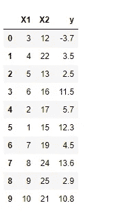
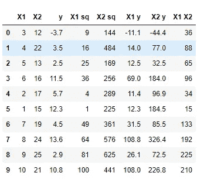
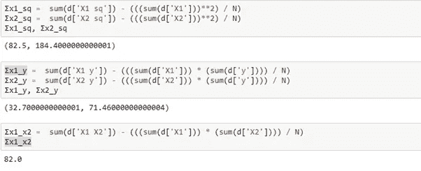
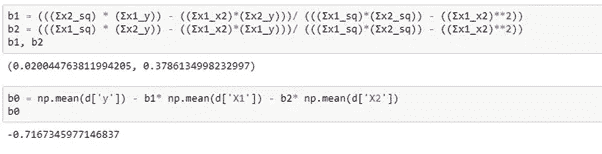
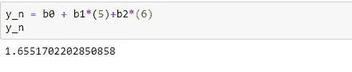
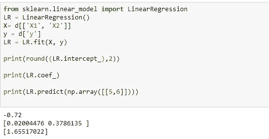

# 多元线性回归

> 原文：<https://medium.com/analytics-vidhya/multi-linear-regression-6ea7a16c9fe7?source=collection_archive---------17----------------------->

## 解码:

## 手工计算

多元线性回归(MLR)，也简称为多元回归，是一种使用几个解释变量来预测响应变量结果的统计技术。这些变量本质上既可以是分类的，也可以是数字的。

**请注意:**分类值应转换为序数尺度或名义尺度，为类别的每个组分配权重。该公式将考虑分配给每个类别的权重。

多元回归是线性回归的延伸，只使用一个解释变量。结果也是一个线性方程，然而现在起作用的变量来自许多维度。多元线性回归也是使用 2 次、3 次或更多次的多项式模型的基础模型。

如果你想了解线性回归的计算。点击这里查看这篇文章。

 [## 解码:简单线性回归

### 公式和计算

medium.com](/@nishigandha.sharma.90/decoding-simple-linear-regression-b3f5528e54b7) 

*𝑦 = b₀ + b₁X₁ + ⋯ + bᵣXᵣ + 𝜀.*

b0 —常数/ y 轴截距

b1、b2-每个变量的系数

X1，X2 —预测值

𝜀 —错误率—这是一个很小的可以忽略的值，也称为ε值。对于这种计算，我们将不考虑误差率

我们采用以下虚拟数据进行计算:

正在考虑的数据

这里 X1 和 X2 是 X 预测值，y 是因变量。根据上面给出的多直线公式，我们需要计算 b0、b1 和 b2。让我们先看看 b0 的公式。

*B0 =ȳ—B1 ****x̄1—B2 ****x̄2***

**如你所见，要计算 b0，我们需要先计算 b1 和 b2。让我们看看公式:**

***B1 =(σx2 _ sq)(σx1 y)—(σx1 x2)(σx2 y)/(σx1 _ sq)(σx2 _ sq)—(σx1 x2)* * 2***

***B2 =(σx1 _ sq)(σx2 y)—(σx1 x2)(σx1 y)/(σx1 _ sq)(σx2 _ sq)—(σx1 x2)* * 2***

**这看起来绝对是一个可怕的公式，但是如果你仔细观察，b1 和 b2 的分母是一样的，分子是两个变量 x1 和 x2 以及 y 的叉积。**

**值得注意的是，这里 x1 和 x2 的值与我们的预测值 X1 和 X2 不同，它是预测值的计算值。在我们找到 b1 和 b2 之前，我们将计算 x1 和 x2 的以下值，以便我们可以计算 b1 和 b2，然后是 b0:**

***(σXi _ sq)***

***(σXi y)***

***(σx1 x2)***

**这里“I”代表 x 的值，比如变量 1 或变量 2，N 是记录的数量，在这种情况下是 10。现在我们可以看看计算系数所需的每个变量的公式。**

***(σXi _ sq)=(σXi2)——(σXi)* * 2/N***

***(σXi y)=(σXi y)——((σXi)(σy))/N***

***(σX1 x2)=(σX1 x2)——((σX1)(σX2))/N***

**看起来我们又有了 3 个固定的公式，但是不要担心，让我们一步一步来计算表中需要的值。**

****

**使用额外的必需列计算的原始数据**

**很好，现在我们有了所有需要的值，当在上述公式中进行估算时，将得到以下结果:**

****

**系数所需的计算**

**现在是时候计算 b1、b2 和 b0 了:**

****

**系数和 y 轴截距计算**

**我们现在有了多线性线的方程:**

***y = b0 + b1*X1 +b2*X2***

***y =(-0.72)+0.02(X1)+0.38(X2)***

**现在让我们尝试计算一个新值，并使用 Sklearn 的库进行比较:**

**假设 X1 = 5，X2 = 6:**

****

**当 X1 = 5 且 X2 = 6 时的 y 值**

**现在和 Sklearn 的线性回归比较。**

****注意:** Sklearn 拥有计算简单和多元线性回归的相同库。**

****

**Sklearn 库中的线性回归**

**耶！！！对于内置的线性回归函数，我们也得到了完全相同的结果。**

**因此，我们可以断定我们的计算是正确的。**

**希望你们都更清楚如何在后端计算多元线性回归模型。**

**欢迎任何反馈。如果你今天学到了新东西，请鼓掌！**