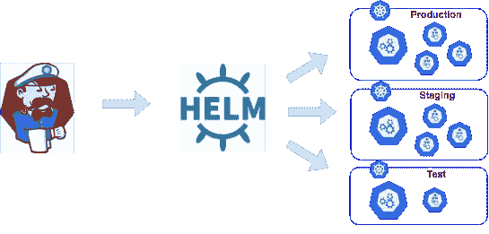

# 在 Kubernetes 中部署多名称空间 Helm

> 原文：<https://medium.com/analytics-vidhya/multi-namespace-helm-deploy-in-kubernetes-26d1baf1ca5c?source=collection_archive---------11----------------------->



## 一些背景

我在网站可靠性方面的生活可以被描述为建筑自动化、反应式解决问题以及在 slack 频道上发布“让我为你谷歌一下”链接的完美组合。其中一个主题是弄清楚我们如何根据客户需求进行扩展。目前，在 [LogicMonitor](http://logicmonitor.com/) ，我们正在运行一个混合环境，在这个环境中，我们的核心应用程序和时序数据库都运行在物理数据中心的服务器上。这些环境与 AWS 中运行的微服务交互。我们称其中一个混合生产环境为“pod”(事后来看，在我们介绍了 [Kubernetes](https://kubernetes.io/) 之后，这是一个糟糕的名称选择)。我们使用亚特兰蒂斯产品竹为 CI/CD。

在过去的一年半时间里，该团队完成了一项艰巨但令人满意的任务，即将 ECS 和 EC2 实例上的所有应用程序转换成 Kubernetes 中的 pod，每个生产“pod”都被视为一个[名称空间](/binbash-inc/when-and-why-use-multiple-k8s-namespaces-237b632bac5)。

## **部署到 k8s**

我们的部署过程是从竹子内部使用头盔。构建的每个应用程序都会产生一个 helm chart 工件和一个 docker 图像。部署后，映像被推送到私有 docker 存储库，并运行 helm install 命令和相应的图表。然而，由于每个生产环境都被视为一个 Kubernetes 名称空间，我们需要在每个集群上部署多个名称空间，这是通过为每个名称空间、每个应用程序制定一个*单独的* Bamboo 部署计划**来设置的。**截至今天，我们有 50 个不同的生产环境和 8 个微服务(对于数学天才来说，这是 400 个单独的部署计划)。有时，仅仅对于一个应用程序点版本，开发人员可能要花一两个小时来部署和验证所有的产品。

## **构建新工具**

因此，这是无法回避的…如果我们想要有效地扩展基础架构，我们需要找到一种更智能的部署方式。目前，我们使用各种 shell 脚本来启动部署过程。为了构建新工具，它需要:

*   能够查询并列出所有生产命名空间
*   集成 helm/kubernetes 库
*   一次部署到多个名称空间。
*   部署进度的集中日志

## **介绍 k8s 部署**

[k8sdeploy](https://github.com/pyang55/k8sdeploy) 是一个基于 go 的工具，目标是创建一个 cli，利用 helm 和 kubernetes 客户端库一次部署到多个名称空间。

**初始化:** 这样就创建了 Helm 客户端和 Kubernetes 客户端**。**下面是 helmv2 的当前示例。helm3 的巨大变化允许 helm 直接通过 kubeconfig 与 k8s api 服务器直接通信。

```
// GetKubeClient generates a k8s client based on kubeconfig
func GetKubeClient(kubeconfig string) (*kubernetes.Clientset, error) {
 config, err := clientcmd.BuildConfigFromFlags("", kubeconfig) 
 if err != nil {  
   panic(err.Error()) 
 }  
 return kubernetes.NewForConfig(config)
}//GetHelmClientv2 creates helm2 client based on kubeconfig
func GetHelmClientv2(kubeconfig string) *helm.Client {
 config, _ := clientcmd.BuildConfigFromFlags(“”, kubeconfig)
 client, _ := kubernetes.NewForConfig(config)// port forward tiller (specific to helm2)
 tillerTunnel, _ := portforwarder.New(“kube-system”, client, config)// new helm client
 host := fmt.Sprintf(“127.0.0.1:%d”, tillerTunnel.Local)
 helmClient := helm.NewClient(helm.Host(host))
 return helmClient
}
```

**共享通知器:** 工具创建客户端后，初始化一个部署观察器。这是一个[共享通知器](https://gianarb.it/blog/kubernetes-shared-informer)，它监视 Kubernetes 对象当前状态的变化。在我们的例子中，在部署时，我们将创建一个[通道](https://tour.golang.org/concurrency/2)来启动和停止 ReplicaSet 资源的共享通知程序。这里的目标不仅是记录部署状态(“2 个更新副本中的 1 个可用”)，而且整理一个流中的所有信息，这在一次部署到多个名称空间时是至关重要的。

```
factory := informers.NewSharedInformerFactory(clientset, 0)
//set informer to listen to pod resources
informer := factory.Core().V1().ReplicaSets().Informer()stopper := make(**chan** **struct**{}) 
**defer** close(stopper)// informer catches events when replicaSets are added or updated
informer.AddEventHandler(cache.ResourceEventHandlerFuncs{
   AddFunc:    **func**(obj **interface**{}) { 
     panic("not implemented") 
   },
   UpdateFunc: **func**(**interface**{}, **interface**{}) { 
     panic("not implemented") 
   },
})**go** informer.Run(stopper)
```

**使用 Helm** 安装图表在初始化我们的 deployWatcher 之后，该工具使用 [helm libraries](http://helm.sh/helm/v3) 使用图表初始化安装/更新部署。下面是一个使用 helm2 更新现有部署的示例。[这里的](https://stackoverflow.com/questions/45692719/samples-on-kubernetes-helm-golang-client)是 helm3 的一个

```
resp, _ := helmClient.ReleaseStatus(deployName)
resp.GetInfo().GetStatus().GetCode().String() == "DEPLOYED" {
  fmt.Printf("Found existing deployment for %s...updating\n", deployName)
   helmClient.UpdateReleaseFromChart(deployName, chart)
}
```

**定义成功** 添加了多项检查以确保新部署被视为成功。我们指定我们的舵图表在部署期间更新部署时间，以便告诉通知者只记录新事件。该工具还检查“准备好的副本”和“想要的副本”是否匹配，并确保在多个用户部署不同应用程序的情况下，informer 不会拾取其他事件。该工具将所有成功的部署添加到一个表中

```
build	29-Jul-2020 19:23:20	Starting deployment in namespace=name-space-1 for app=customapp at 2020-07-29 19:23:20 -0700 PDT
build	29-Jul-2020 19:23:20	Waiting for deployment  rollout to finish: 0 of 2 updated replicas are available...
build	29-Jul-2020 19:23:20	Waiting for deployment  rollout to finish: 0 of 2 updated replicas are available...
build	29-Jul-2020 19:23:20	Starting deployment in namespace=name-space-2 for app=customapp at 2020-07-29 19:23:20 -0700 PDT
build	29-Jul-2020 19:23:20	Waiting for deployment  rollout to finish: 0 of 2 updated replicas are available...
build	29-Jul-2020 19:23:35	Waiting for deployment  rollout to finish: 1 of 2 updated replicas are available...
build	29-Jul-2020 19:23:35	Waiting for deployment  rollout to finish: 1 of 2 updated replicas are available...
build	29-Jul-2020 19:23:49	Waiting for deployment  rollout to finish: 1 of 2 updated replicas are available...
build	29-Jul-2020 19:23:56	Waiting for deployment  rollout to finish: 2 of 2 updated replicas are available...
build	29-Jul-2020 19:23:56	Successful Deployment of customapp on name-space-2
build	29-Jul-2020 19:23:58	Waiting for deployment  rollout to finish: 2 of 2 updated replicas are available...
build	29-Jul-2020 19:23:58	Successful Deployment of customapp on name-space-2
build	29-Jul-2020 19:24:10	All deployments finished, sutting down watcher gracefully
build	29-Jul-2020 19:24:10	+----------------+--------------+---------+
build	29-Jul-2020 19:24:10	| APP            | NAMESPACE    | STATUS  |
build	29-Jul-2020 19:24:10	+----------------+--------------+---------+
build	29-Jul-2020 19:24:10	| customapp      | name-space-1 | Success |
build	29-Jul-2020 19:24:10	| customapp      | name-space-2 | Success |
build	29-Jul-2020 19:24:10	+----------------+--------------+---------+
```

**将所有这些放在一起** 此时，该工具已经为一个名称空间创建了片段。使用 [go 例程](https://gobyexample.com/goroutines)来并行化部署调用可以很快缓解这一问题。我们使用 [Cobra](https://github.com/spf13/cobra) 创建了一个 cli，用户可以在其中输入逗号分隔的名称空间。

```
k8sdeploy deploy kubeconfig --configpath <full-path-to-kubeconfig> --releasename <name-of-release> --namespace <namespace1,namespace2,namespace3> --chartdir <full-path-to-tgz-chart-file> --set <set-string-values>
```

## 让我们开源吧

目前，该工具与 helm3 兼容。我在这里提供它供使用和公众批评[。](https://github.com/pyang55/k8sdeploy)