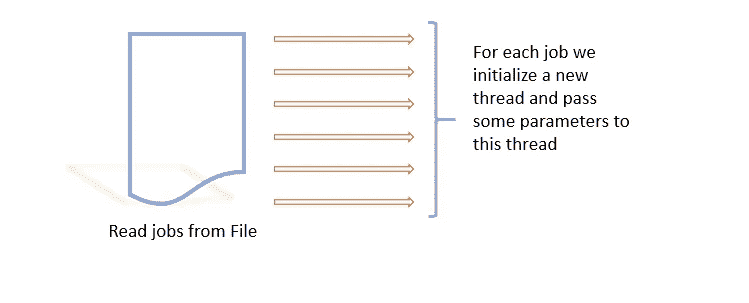
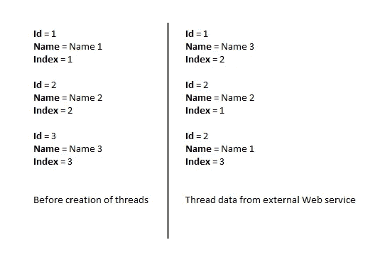
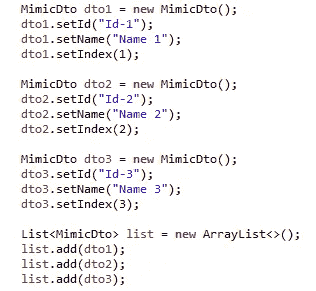
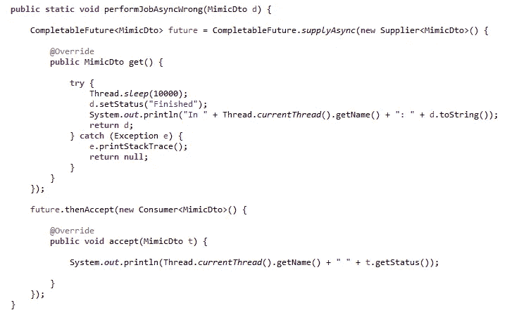
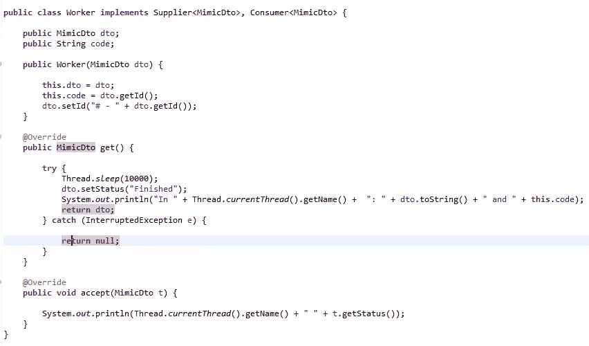
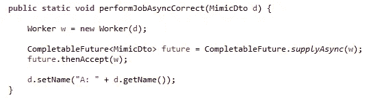

# Java 线程和 Spring Boot 的混乱

> 原文：<https://medium.com/analytics-vidhya/multi-threaded-chaos-69216bb2c45a?source=collection_archive---------7----------------------->

肖恩·林在 [Unsplash](https://unsplash.com?utm_source=medium&utm_medium=referral) 上的照片

如果你是一个 API 开发者或者业余程序员，你一定知道我们称之为**“线程”**的东西。毕竟线程是伟大的…它们允许你写代码，可以同时执行多个任务。它们还允许我们利用 CPU 的全部能力，将我们从 UI 冻结的可怕情况中解救出来。

然而，线程也可能以意外的行为结束。我已经编码超过 10 年，我喜欢和线程一起工作。**并发**和**并发作业**的概念总是让我兴奋不已。是的，这是真的；但是当然，直到两个月前我陷入了怪异的境地！

# 这是怎么回事？

以上是代码在上下文中的图示

> 考虑一个系统，我们需要处理 100 个作业(假设这个数字)。此外，在每个作业的处理过程中，我们需要调用一个外部服务来处理我们的请求并返回一些信息。为了进行类比，让我们说*是*或*现在是*。实现看起来非常简单，直到一段代码被证明是一场灾难！

在每个线程中，我们调用外部 web 服务并等待响应

上面的系统看起来很容易实现。然而，当我们在生产，事情实际上是混乱的，执行是我们从来没有想过的事情！

> 我们从外部服务获得的数据显示，不同的数据片段已经与其他具有不规则模式的数据混合在一起。例如，对象 1 的一个字段变成了对象 2 的同一字段的数据。然而，当我们检查代码时，我们分配正确！下面是混合物的可视化。

Web 服务端点的数据混合

# 代码片段

我们使用的是 Java 8 SDK 中的 CompletableFuture。Web 应用程序基于 **Spring 框架**。API 很棒，因为它提供了开箱即用的线程实现以及**执行器**。 **CompletableFuture** 的一个特性是执行一些执行，然后得到执行的响应。这正是我们所需要的。我们可以在一个线程上发送网络调用，然后接收响应。

以下是我们的数据示例:

数据示例

然后，我们可以对收到的响应执行进一步的业务逻辑。由于代码是专有的，我附加了一个简单的实现:

错误实现 **CompletableFuture** 导致应用程序混乱

很明显，当执行转移到实现 **SupplierAsync** 的内部类时，作为参数传递的数据项会发生变化，导致两个实例的字段混淆。在正常情况下，我们从来没有遇到过这种情况，但当它来到网络调用，这种意外的行为被观察到。

# 解决办法

为了解决这个问题，我们必须重写和重构整个代码。我们必须创建一个新的类来实现**供应商**和**消费者**接口。现在我们可以初始化这个类，并在构造函数中传递所需的数据。这消除了堆栈状态被更改的任何可能性。现在，我们可以将这个新实例化的对象传递给 **Worker** ，这样就可以得到想要的结果。下面是实施的快照:

工人阶级

我们创建一个名为 **Worker** class 的新类。这个类代表任何需要创建和启动的线程。这个线程通过构造函数接收所有需要的数据。因为在创建类的任何新实例时，都会分配一个单独的内存块，这消除了混淆状态的可能性。新创建的实例被传递给 **CompletableFuture** 实例，如下所示:

正确的

> 简而言之，CompletableFuture(文档[此处为](https://docs.oracle.com/javase/8/docs/api/java/util/concurrent/CompletableFuture.html))是一个很棒的 API，它简化了并发代码的编写，并且自己处理了很多场景。它装载了适应多线程代码不同情况所需的所有助手方法。但是应该非常小心地使用这个 API，以便获得期望的性能，而不会遇到上面提到的意外情况。

这个实现的完整代码可以在我的 Github 库[这里](https://github.com/umairk83/Multi-Threaded-Chaos)找到。

# 结论

这篇文章是为了让读者在编写多线程应用程序时要非常小心，以免意外的结果影响生产！

如果你喜欢读这篇文章，请跟我来看更多与开发相关的文章。