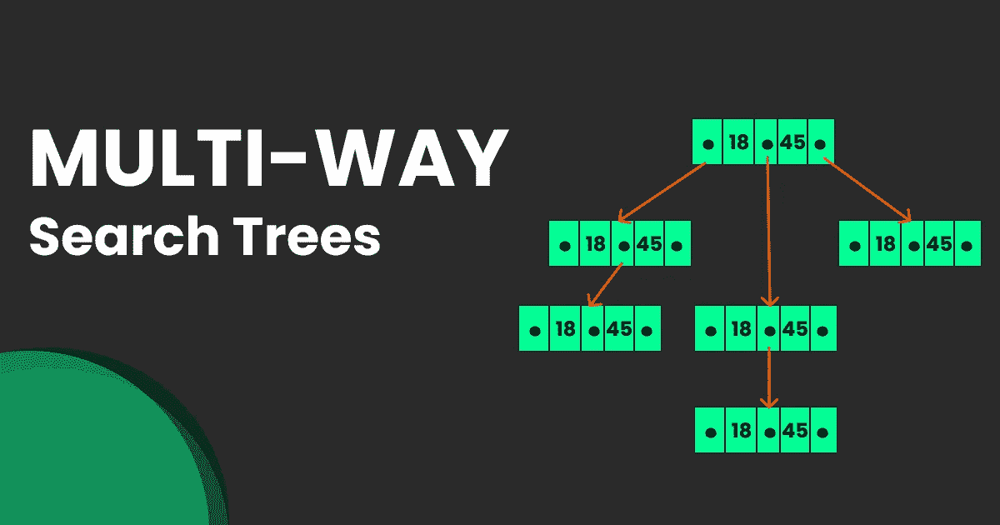
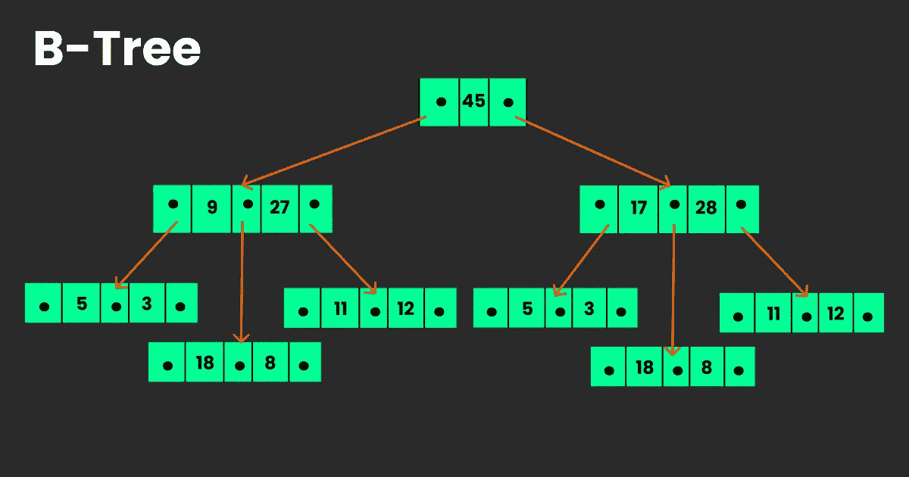
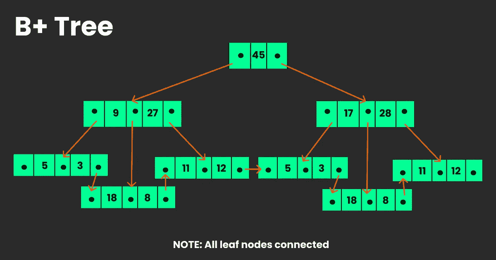

# 多向搜索树

> 原文：<https://medium.com/analytics-vidhya/multi-way-search-trees-c193e2b36998?source=collection_archive---------9----------------------->

## 数据库中使用的数据结构

M 路搜索树具有与二叉树相似的概念，并且每个节点和 M 个子树具有 M-1 个值。在这类树中，M 称为树的度。

图 1 . M 路搜索树的结构

在上面的结构中，P0，P1 …，Pn 是指向节点子树的指针，K0，k1，…，Kn-1 是节点的键值。所有键值都按升序存储。

M 路搜索树的基本属性:

*   P0 < key value K0\. Similar pattern for the rest of the P’s and K’s.
*   Key values in the sub-tree pointed by P1 >键值 K0 所指向的子树中的键值。其余的 P 和 K 也是类似的模式。

# **B 树**

B 树是一种专门的 M 路树，广泛用于磁盘访问。它被设计用来存储分类数据，并允许像搜索、插入和删除这样的操作。除了 M 路树的基本属性之外，B 树还有几个属性:

*   B 树中的每个节点最多有 m 个子节点。
*   B 树中除了根节点和叶节点之外的每个节点都至少有 m/2 个子节点。
*   如果根节点不是叶节点，它至少有两个子节点。
*   所有叶节点都在同一级别。

图 2 . 4 阶 B 树

## B 树的应用

b 树用于磁盘访问，因为指针的索引有助于更快地访问数据。想象一下，如果在一组一百万个关键字中搜索一个关键字，将需要 1，000，000 次比较。现在，对于 10 阶的 B 树索引，在最坏的情况下只需要 114 次比较。通常，我们会使用 127–511 个关键字和 128–512 个指针的 M 向搜索树。因此，通过这种方式，我们可以在一次磁盘访问中获取大量数据。

# **B+树**

B+树是 B 树的一个更好的版本，它可以有效地插入、检索和删除记录，每个记录都由一个键来标识。与 B 树相比，B+树具有以下优点:

*   键用于索引。
*   它支持顺序和随机访问记录。
*   树的高度均衡，少。
*   可以在相同数量的磁盘访问中提取记录。
*   叶节点链接到上一级的节点。

与 B 树相比，B+树的属性如下:

*   B+ Trees 存储冗余的关键字，而 B Tree 有不重复的搜索关键字。
*   在 B+树中，数据只存储在叶节点中，而在 B 树中，数据可以存储在内部节点和叶节点中。
*   在 B+树中，搜索操作比 B 树更快，因为数据只存储在叶节点中。
*   在 B+树中，叶节点数据使用顺序链表排序，而在 B 树中，叶节点不能使用链表存储。

图 2 . 3 阶 B+树