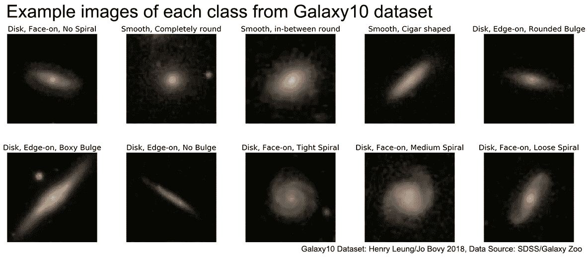
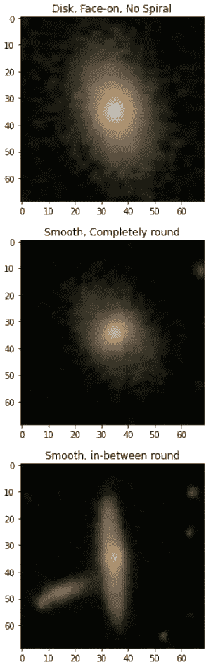
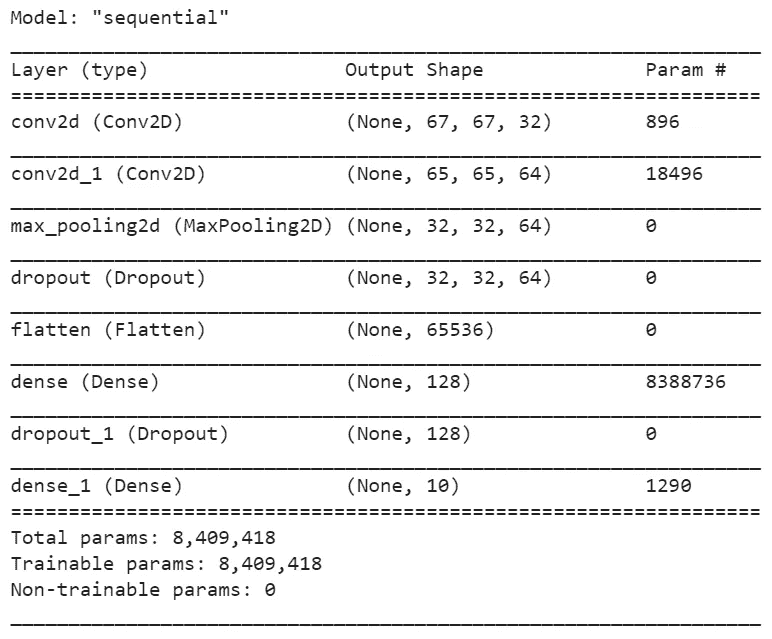
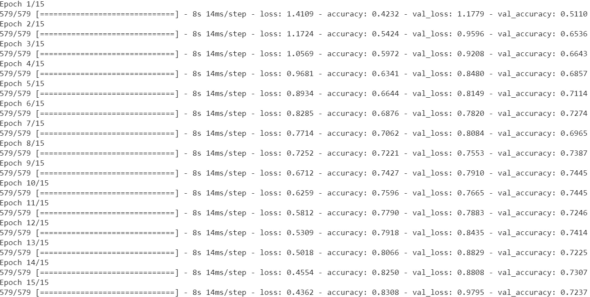
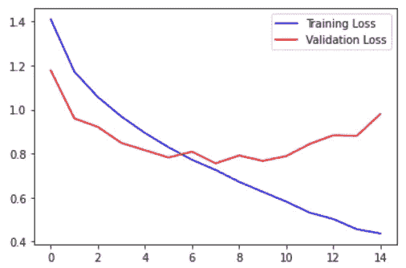
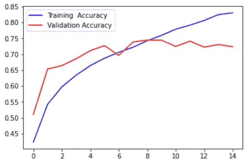

# 星系图像分类——卷积神经网络(CNN)的代码解释

> 原文：<https://medium.com/analytics-vidhya/multiclass-image-classification-problem-convolutional-neural-network-trains-on-galaxy-images-6ca6aa74e5d7?source=collection_archive---------5----------------------->


这是一个多类图像分类问题，使用带有 TensorFlow (Keras api)的卷积神经网络在 Galaxy10 数据集上进行训练。



首先让我们下载数据集。在本教程中，我在 Google Colab 中运行代码。

```
!pip install astroNN
```

接下来，我们导入库。

```
from astroNN.datasets import galaxy10
from astroNN.datasets.galaxy10 import galaxy10cls_lookupimport keras
from keras.models import Sequential
from keras.layers import Dense, Dropout, Flatten
from keras.layers import Conv2D, MaxPooling2D
from keras.utils import to_categorical
from keras.preprocessing import imageimport numpy as np
import pandas as pd
import matplotlib.pyplot as plt
import matplotlib.image as mpimg
from sklearn.model_selection import train_test_split
from tqdm import tqdm
```

现在，我们可以加载数据并对它们进行预处理。每个图像都有一个从 0 到 9 的相应标签。为了使后面的计算更有效，我们可以用`to_categorical()`函数对每个标签进行一次热编码。此外，我们将图像值归一化到 0 和 1 之间，这是加快计算时间的一个好方法。

```
images, labels = galaxy10.load_data()labels = labels.astype(np.float32)
labels = to_categorical(labels)
images = images.astype(np.float32)
images = images/255
```

在这里，我们可以从培训中看到一些带有相应标签的图片。

```
def show_image(image_data,label):
    label = galaxy10cls_lookup(int(label))
    plt.imshow(image_data)
    plt.title(label)
    plt.show()for i in range(3):
    show_image(images[i], i)
```



接下来我们用`train_test_split()`函数从 *sklearn* 中分离出训练集和测试集。

```
X_train, X_test, y_train, y_test = train_test_split(images, labels, test_size = 0.15)print(X_train.shape)
print(y_train.shape)
```

(18517，69，69，3)
(18517，10)

现在我们也知道了训练集的形状。有 18517 个 69×69 像素的图像，具有 3 个(RGB)通道。测试集的形状应该与训练集的形状相同。

# CNN 模型

第一层是具有 32 个输出节点的卷积层。我们还应用了一个 3x 3 滤波器和一个校正的线性单元激活函数。请注意，MaxPooling 层和 Dropout 层有助于防止网络过度拟合。

最后，我们将输出数据展平为 1D 的形状，以便在最后的密集层中，模型可以在 0 和 9 之间进行选择，以确定图像应该属于哪个标签。

```
model = Sequential()model.add(Conv2D(32, kernel_size=(3,3),activation='relu',
input_shape=(69,69,3)))model.add(Conv2D(64, (3, 3), activation='relu'))model.add(MaxPooling2D(pool_size=(2, 2)))model.add(Dropout(0.25))model.add(Flatten())model.add(Dense(128, activation='relu'))model.add(Dropout(0.5))model.add(Dense(10, activation='softmax'))model.summary()
```



## 编译和训练模型

```
model.compile(
loss='categorical_crossentropy',
optimizer='Adam',
metrics=['accuracy'])model.fit(X_train, y_train, epochs=20, 
validation_data=(X_test, y_test))
```



# 结果

## 培训和验证损失

```
plt.plot(model.history.history['loss'],color='b',
label='Training Loss')plt.plot(model.history.history['val_loss'],color='r',
label='Validation Loss')plt.legend()
plt.show()
```



## 培训和测试准确性

```
plt.plot(model.history.history['accuracy'],color='b',
label='Training  Accuracy')plt.plot(model.history.history['val_accuracy'],color='r',
label='Validation Accuracy')plt.legend()
plt.show()
```



# 结论

从精度图中，我们可以看到模型可能过拟合，因为训练精度保持线性上升，而验证精度在早期阶段处于平稳状态。然而，该模型在对图像进行分类时仍有近 75 %的准确率，这远远高于随机猜测的结果(10%)。