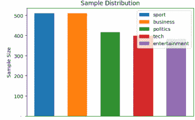
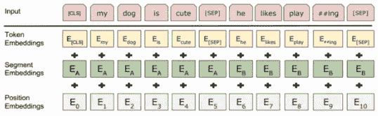

# 多类文本分类。精确度| Bert 模型

> 原文：<https://medium.com/analytics-vidhya/multiclass-text-categorization-97-perc-accuracy-bert-model-2b97d8118903?source=collection_archive---------0----------------------->

> *这是基于* [*的作品 https://www . ka ggle . com/the brownviking 20/Bert-multi class-classification*](https://www.kaggle.com/thebrownviking20/bert-multiclass-classification)

[](https://www.kaggle.com/thebrownviking20/bert-multiclass-classification) [## 伯特多类分类法

### 使用来自科幻小说文本语料库的数据

www.kaggle.com](https://www.kaggle.com/thebrownviking20/bert-multiclass-classification) 

# 1.项目概述

## 1.1 定义:

在当今世界**文本分类/分段/分类**(例如呼叫中心的票据分类、电子邮件分类、日志类别检测等。)是一个常见的任务。面对如此庞大的数据，手动操作几乎是不可能的。让我们尝试使用机器学习和自然语言处理工具来自动解决这个问题。

## 1.2 问题陈述

BBC 文章数据集(2126 条记录)由两个特征文本和相关类别组成，即

1.  运动
2.  商业
3.  政治
4.  技术
5.  其他人

**我们的任务是在上述数据集上训练一个多类分类模型。**

## 1.3 指标

**准确度** —分类准确度是正确预测的数量占所有预测的比例

**精度** —精度(也称为正预测值)是检索到的实例中相关实例的分数

**F1_score** —考虑测试的精确度和召回率来计算分数

**召回** —召回(也称为敏感度)是相关实例在相关实例总数中所占的比例

**为什么要采用这些指标？** —我们将准确度、精确度、F1 分数和召回率作为评估我们模型的指标，因为准确度将给出正确预测的估计。精度将为我们提供一个关于正类别预测值的估计，即我们的模型给出了多少相关结果。F1 分数给出了精确度和召回率的综合评估。回忆将为我们提供与假阴性和真阳性类别识别结果相关的阳性类别预测。

## 1.4 算法和技术:

对于这个用例，我们将使用 **BERT Base 无案例模型**。

[](https://github.com/google-research/bert) [## 谷歌研究/bert

### 用于 BERT 的 TensorFlow 代码和预训练模型。通过创建帐户为 google-research/bert 开发做出贡献…

github.com](https://github.com/google-research/bert) 

伯特从 ELMO 那里获得了洞察力和计划，他怎样才能做得更好？[3]

**简介:** BERT(来自变压器的双向编码器表示)是谷歌 AI 语言的研究人员最近发表的一篇论文。

[](http://ruder.io/a-review-of-the-recent-history-of-nlp/) [## 自然语言处理的近期历史回顾

### 这篇文章讨论了 NLP 的主要最新进展，重点是基于神经网络的方法。这个帖子原本…

ruder.io](http://ruder.io/a-review-of-the-recent-history-of-nlp/) 

塞巴斯蒂安·鲁德的博客中的一些美丽的类比。推荐！！

> 在伯特、ELMO、乌尔姆菲特和 OpenAI transformer 取得最新进展之前，我们曾经使用过 Glove、Word2Vec 等单词嵌入技术。
> 
> 预训练的单词嵌入，如 Glove、Word2Vec 等。它们有巨大的影响力，但有一个主要的局限性:它们只在模型的第一层整合了以前的知识——网络的其余部分仍然需要从头开始训练。使用单词嵌入就像用只对边缘进行编码的预训练表示来初始化计算机视觉模型:它们对许多任务都有帮助，但它们无法捕捉可能更有用的高级信息。ULMFiT、ELMo 和 OpenAI transformer 的最新进展的核心是一个关键的范式转变:从仅仅初始化我们模型的第一层到用分层表示来预训练整个模型。如果学习单词向量就像只学习边缘，这些方法就像学习特征的完整层次，从边缘到形状到高级语义概念。

> **伯特获得了**转移学习的力量

# 2.数据探索:

数据集来源—[https://storage . Google APIs . com/dataset-uploader/BBC/BBC-text . CSV](https://apc01.safelinks.protection.outlook.com/?url=https%3A%2F%2Fstorage.googleapis.com%2Fdataset-uploader%2Fbbc%2Fbbc-text.csv&data=02%7C01%7Csarthak.dargan%40infosys.com%7Cf792e3f3ca574e04d1b208d6fa02b4f3%7C63ce7d592f3e42cda8ccbe764cff5eb6%7C1%7C0%7C636971286858840027&sdata=V%2BLol4CYKz8%2FjJjqaT%2FiwOuOxw9ywDKlwlHqxO0nwsU%3D&reserved=0)

[](https://www.kaggle.com/yufengdev/bbc-fulltext-and-category) [## BBC 文章全文和分类

### 超过 2000 篇 BBC 全文文章的标题、正文和类别。

www.kaggle.com](https://www.kaggle.com/yufengdev/bbc-fulltext-and-category) 

2.1 加载数据集

```
import pandas as pd
datasetpath=r"../input/bbc-text.csv"
data=pd.read_csv(datasetpath)
```

2.2 可视化数据分布

```
data['category'].value_counts()
```

正如我们所看到的，数据均匀地分布在各个类中。没有必要追求统一的数据分布。

```
sport            511
business         510
politics         417
tech             401
entertainment    386
```



跨类的数据集分布

# 3.实施:

## 3.1 使用标签编码器将文本标签映射到数字标签:

作为 NLP 模型，不能将文本作为例如“体育”、“商业”等。我们需要将它们转换成伯特模型能够理解的数字格式。

```
from sklearn.preprocessing import LabelEncoder
df2 = pd.DataFrame()
df2["text"] = data["text"]
df2["label"] = LabelEncoder().fit_transform(data["category"])
```

## 3.2 划分数据集以测试和训练数据集:

将数据集分为测试数据集和训练数据集。我们用 80(训练)20(测试)的比例来划分。

```
from sklearn.model_selection import train_test_split
X_train, X_test, y_train, y_test = train_test_split(df2["text"].values, df2["label"].values, test_size=0.2, random_state=42)
```

## 3.3 下载 Google 的 BERT BASE 无案例模型:

`[BERT-Base, Uncased](https://storage.googleapis.com/bert_models/2018_10_18/uncased_L-12_H-768_A-12.zip)` : 12 层，768 隐，12 头，110M 参数

```
!wget [https://storage.googleapis.com/bert_models/2018_10_18/uncased_L-12_H-768_A-12.zip](https://storage.googleapis.com/bert_models/2018_10_18/uncased_L-12_H-768_A-12.zip)
```

正在解压缩的文件`[BERT-Base, Uncased](https://storage.googleapis.com/bert_models/2018_10_18/uncased_L-12_H-768_A-12.zip)`:

*   vocab.txt
*   伯特配置文件
*   伯特 _ 模型. ckpt

## 3.4 从 Google Github 资源库下载 BERT helper 文件:

```
!wget [https://raw.githubusercontent.com/google-research/bert/master/modeling.py](https://raw.githubusercontent.com/google-research/bert/master/modeling.py) 
!wget [https://raw.githubusercontent.com/google-research/bert/master/optimization.py](https://raw.githubusercontent.com/google-research/bert/master/optimization.py) 
!wget [https://raw.githubusercontent.com/google-research/bert/master/run_classifier.py](https://raw.githubusercontent.com/google-research/bert/master/run_classifier.py) 
!wget [https://raw.githubusercontent.com/google-research/bert/master/tokenization.py](https://raw.githubusercontent.com/google-research/bert/master/tokenization.py)
```

## 3.5 设置 BERT 配置

```
import modeling
import optimization
import run_classifier
import tokenization
```

将下载的 BERT 基本模型解压到 MODEL 文件夹中。配置输出文件夹和预训练模型目录

```
import zipfilefolder = 'model_folder'
with zipfile.ZipFile("uncased_L-12_H-768_A-12.zip","r") as zip_ref:
    zip_ref.extractall(folder)BERT_MODEL = 'uncased_L-12_H-768_A-12'
BERT_PRETRAINED_DIR = f'**{folder}**/uncased_L-12_H-768_A-12'
OUTPUT_DIR = f'**{folder}**/outputs'
print(f'>> Model output directory: **{OUTPUT_DIR}**')
print(f'>>  BERT pretrained directory: **{BERT_PRETRAINED_DIR}**')
```

## 3.6 为训练和测试数据集创建示例

create_examples 函数获取数据集(训练/测试)、set_type("train"/ "test ")和标签(用于训练数据集)，该函数从 InputExample 类(来自[https://github.com/google-research/bert](https://github.com/google-research/bert))调用 run_classifier 函数。它采用 guid(例如唯一的 id，在我们的例子中，我们传递“train”或“test”)、text_a(序列的未标记文本)、label(用于训练数据集)和 text_b(可选)。对于我们的例子，text_b 将是 None。run_classifier 函数返回追加到示例列表的 InputExample 对象。

```
import os
import tensorflow as tfdef create_examples(lines, set_type, labels=None):
*#Generate data for the BERT model*
    guid = f'**{set_type}**'
    examples = []
    if guid == 'train':
        for line, label **in** zip(lines, labels):
            text_a = line
            label = str(label)
            examples.append(
              run_classifier.InputExample(guid=guid, text_a=text_a, text_b=None, label=label))
    else:
        for line **in** lines:
            text_a = line
            label = '0'
            examples.append(
              run_classifier.InputExample(guid=guid, text_a=text_a, text_b=None, label=label))
    return examples
```

## 3.7 配置 BERT 超参数

*   **TRAIN_BATCH_SIZE** -用于训练的总批量。
*   **EVAL _ 批量 _ 大小** -评估的总批量。
*   **LEARNING _ RATE**-Adam 的初始学习速率。
*   **训练次数** -要执行的训练次数。
*   **热身 _ 比例**-执行线性学习率热身的训练比例。0.1 表示 10%
*   **MAX _ SEQ _ LENGTH**——分词后的最大总输入序列长度。长于此长度的序列将被截断，短于此长度的序列将被填充。

```
*# Model Hyper Parameters*
TRAIN_BATCH_SIZE = 32
EVAL_BATCH_SIZE = 8
LEARNING_RATE = 1e-5
NUM_TRAIN_EPOCHS = 3.0
WARMUP_PROPORTION = 0.1
MAX_SEQ_LENGTH = 50
```

## 3.8 配置 BERT 配置

```
*# Model configs*
SAVE_CHECKPOINTS_STEPS = 100000 *#if you wish to finetune a model on a larger dataset, use larger interval*
*# each checpoint weights about 1,5gb*
ITERATIONS_PER_LOOP = 100000
NUM_TPU_CORES = 8
VOCAB_FILE = os.path.join(BERT_PRETRAINED_DIR, 'vocab.txt')
CONFIG_FILE = os.path.join(BERT_PRETRAINED_DIR, 'bert_config.json')
INIT_CHECKPOINT = os.path.join(BERT_PRETRAINED_DIR, 'bert_model.ckpt')
DO_LOWER_CASE = BERT_MODEL.startswith('uncased')
```

## 3.9 使用 TPU 估计器 API 训练模型:

[](/tensorflow/how-to-write-a-custom-estimator-model-for-the-cloud-tpu-7d8bd9068c26) [## 如何为云 TPU 编写自定义估算器模型

### 作者 Lak Lakshmanan (@lak_gcp)，谷歌云平台技术负责人

medium.com](/tensorflow/how-to-write-a-custom-estimator-model-for-the-cloud-tpu-7d8bd9068c26)  [## 在云 TPU |云 TPU |谷歌云上使用 TPU 估算器 API

### 无论您的企业是刚刚踏上数字化转型之旅，还是已经走上数字化转型之路，谷歌云的解决方案…

cloud.google.com](https://cloud.google.com/tpu/docs/using-estimator-api) 

**TPUEstimator 通过处理大量低层次、硬件特定的细节，简化了在云 TPU 上运行的模型**。使用 TPUEstimator 编写的模型可以跨 CPU、GPU、单个 TPU 设备和整个 TPU pods 工作，**通常不需要修改代码**。TPUEstimator 还通过自动为您执行一些优化，使您更容易获得最佳性能。

*   初始化 BERT tokenizer，提供从 BERT 预训练模型压缩文件夹中获得的 vocab 文件，这里我们将“do_lower_case”标记设为 True，因为我们使用的是未封装的模型。
*   train_examples 是上面提到的 InputExample 类的对象列表。

```
label_list = [str(num) for num **in** range(8)]
tokenizer = tokenization.FullTokenizer(vocab_file=VOCAB_FILE, do_lower_case=DO_LOWER_CASE)
train_examples = create_examples(X_train, 'train', labels=y_train)
```

*   TPUEstimatorAPI 需要 run_config。它获取使用的集群、保存检查点的输出目录、经过多少检查点以及每个循环的 TPU 共享内核和迭代次数。

```
tpu_cluster_resolver = None run_config = tf.contrib.tpu.RunConfig(
    cluster=tpu_cluster_resolver,
    model_dir=OUTPUT_DIR,
    save_checkpoints_steps=SAVE_CHECKPOINTS_STEPS,
    tpu_config=tf.contrib.tpu.TPUConfig(
        iterations_per_loop=ITERATIONS_PER_LOOP,
        num_shards=NUM_TPU_CORES,
        per_host_input_for_training=tf.contrib.tpu.InputPipelineConfig.PER_HOST_V2))num_train_steps = int(
    len(train_examples) / TRAIN_BATCH_SIZE * NUM_TRAIN_EPOCHS)num_warmup_steps = int(num_train_steps * WARMUP_PROPORTION)
```

这是伯特模型的核心。模型函数生成器接受特征、标签和模式，并为 TPUEstimator 返回“model_fn”闭包

```
model_fn = run_classifier.model_fn_builder(
    bert_config=modeling.BertConfig.from_json_file(CONFIG_FILE),
    num_labels=len(label_list),
    init_checkpoint=INIT_CHECKPOINT,
    learning_rate=LEARNING_RATE,
    num_train_steps=num_train_steps,
    num_warmup_steps=num_warmup_steps,
    use_tpu=False, *#If False training will fall on CPU or GPU, depending on what is available* 
    use_one_hot_embeddings=True)
```

*   `[TPUEstimator](https://www.tensorflow.org/api_docs/python/tf/contrib/tpu/TPUEstimator)`包装计算(`model_fn`)并将其分配给所有可用的云 TPU 核心。
*   传递从上一步获得的 run_config。

```
estimator = tf.contrib.tpu.TPUEstimator(
    use_tpu=False, *#If False training will fall on CPU or GPU, depending on what is available* 
    model_fn=model_fn,
    config=run_config,
    train_batch_size=TRAIN_BATCH_SIZE,
    eval_batch_size=EVAL_BATCH_SIZE)
```

*   将上述步骤中获得的 InputExample 对象转换为 BERT 输入特征。



伯特输入表示

*   输入功能列表—

1.  **输入标识** —输入标识是根据 BERT vocab 与每个令牌相关联的标识
2.  **input_mask-** input_mask 区分填充和实令牌。
3.  **Segment _ Id**-Segment Id 将是 0 的列表，因为分类任务中只有一个文本。
4.  **标签标识** -标签标识对应于标签编码器类别

```
import datetimeprint('Please wait...')
train_features = run_classifier.convert_examples_to_features(
    train_examples, label_list, MAX_SEQ_LENGTH, tokenizer)
```

创建一个要传递给 TPUEstimator 的“input_fn”闭包。`input_fn`函数对输入管道进行建模。

将`input_fn`和列车步数传递给 estimator.train

```
train_input_fn = run_classifier.input_fn_builder(
    features=train_features,
    seq_length=MAX_SEQ_LENGTH,
    is_training=True,
    drop_remainder=True)estimator.train(input_fn=train_input_fn, max_steps=num_train_steps)
print('>> Finished training at **{}**'.format(datetime.datetime.now()))
```

## 步骤 3.10 使用 TPU 估计器 API 对测试数据集进行预测:

如前所述，首先测试数据集将被转换为 InputExample 类对象，这些对象将被进一步传递，以从中获取特性。输入函数生成器将为 TPU 估计器创建输入管道，并最终作为输入提供给 estimator.predict

结果是应用 argmax 的每个类的概率，即找到具有最大概率的类。

```
predict_examples = create_examples(X_test, 'test')predict_features = run_classifier.convert_examples_to_features(
    predict_examples, label_list, MAX_SEQ_LENGTH, tokenizer)predict_input_fn = input_fn_builder(
    features=predict_features,
    seq_length=MAX_SEQ_LENGTH,
    is_training=False,
    drop_remainder=False)result = estimator.predict(input_fn=predict_input_fn)import numpy as np
preds = []
for prediction **in** result:
      preds.append(np.argmax(prediction['probabilities']))
print(len(preds))
```

# 4.结果

*   准确性报告

```
from sklearn.metrics import accuracy_scoreprint("Accuracy of BERT is:",accuracy_score(y_test,preds))Accuracy of BERT is: 0.9752808988764045
```

*   分类报告

```
from sklearn.metrics import classification_reportprint(classification_report(y_test,preds))precision    recall  f1-score   support 0       0.97      0.96      0.97       101
           1       1.00      0.99      0.99        81
           2       0.94      0.98      0.96        83
           3       0.98      0.99      0.98        98
           4       0.99      0.96      0.98        82 micro avg       0.98      0.98      0.98       445
   macro avg       0.98      0.98      0.98       445
weighted avg       0.98      0.98      0.98       445
```

> ***在这个数据集上提到的过去的工作最多达到 95.22 的准确度。BERT 基本模型相同，没有任何预处理，达到了 97.75 的准确率。***

# 5.未来工作:

*   探索数据的预处理步骤。
*   探索其他模型作为基线。
*   让这个笔记本更具知识性和说明性。
*   在数据探索和特征工程方面做出更大的努力。
*   对 TPUEstimatorAPI 的更好解释。

# 6.参考

1.

[](https://www.kaggle.com/thebrownviking20/bert-multiclass-classification) [## 伯特多类分类法

### 使用来自科幻小说文本语料库的数据

www.kaggle.com](https://www.kaggle.com/thebrownviking20/bert-multiclass-classification) 

2.

[](http://ruder.io/a-review-of-the-recent-history-of-nlp/) [## 自然语言处理的近期历史回顾

### 这篇文章讨论了 NLP 的主要最新进展，重点是基于神经网络的方法。这个帖子原本…

ruder.io](http://ruder.io/a-review-of-the-recent-history-of-nlp/) 

3.

[](https://www.google.com/imgres?imgurl=https%3A%2F%2Fupload.wikimedia.org%2Fwikipedia%2Fen%2Ff%2Ff1%2FBert_and_Ernie.JPG&imgrefurl=https%3A%2F%2Fen.wikipedia.org%2Fwiki%2FBert_%28Sesame_Street%29&docid=CuWLZM9iu4n0aM&tbnid=aVTOsvRPXC0OhM%3A&vet=10ahUKEwjWi-6K84PjAhUQ7XMBHVMmDq8QMwh9KBQwFA..i&w=365&h=273&bih=524&biw=1242&q=bert%20elmo&ved=0ahUKEwjWi-6K84PjAhUQ7XMBHVMmDq8QMwh9KBQwFA&iact=mrc&uact=8) [## https://upload . wikimedia . org/Wikipedia/en/f/f1/Bert _ and _ Ernie 的 Google 图片结果。使用 jpeg 文件交换格式存储的编码图像文件扩展名

### 编辑描述

www.google.com](https://www.google.com/imgres?imgurl=https%3A%2F%2Fupload.wikimedia.org%2Fwikipedia%2Fen%2Ff%2Ff1%2FBert_and_Ernie.JPG&imgrefurl=https%3A%2F%2Fen.wikipedia.org%2Fwiki%2FBert_%28Sesame_Street%29&docid=CuWLZM9iu4n0aM&tbnid=aVTOsvRPXC0OhM%3A&vet=10ahUKEwjWi-6K84PjAhUQ7XMBHVMmDq8QMwh9KBQwFA..i&w=365&h=273&bih=524&biw=1242&q=bert%20elmo&ved=0ahUKEwjWi-6K84PjAhUQ7XMBHVMmDq8QMwh9KBQwFA&iact=mrc&uact=8) 

4.

 [## 在云 TPU |云 TPU |谷歌云上使用 TPU 估算器 API

### 无论您的企业是刚刚踏上数字化转型之旅，还是已经走上数字化转型之路，谷歌云的解决方案…

cloud.google.com](https://cloud.google.com/tpu/docs/using-estimator-api) 

5.

[](/tensorflow/how-to-write-a-custom-estimator-model-for-the-cloud-tpu-7d8bd9068c26) [## 如何为云 TPU 编写自定义估算器模型

### 作者 Lak Lakshmanan (@lak_gcp)，谷歌云平台技术负责人

medium.com](/tensorflow/how-to-write-a-custom-estimator-model-for-the-cloud-tpu-7d8bd9068c26) 

6.

[](https://github.com/google-research/bert) [## 谷歌研究/bert

### 用于 BERT 的 TensorFlow 代码和预训练模型。通过创建帐户为 google-research/bert 开发做出贡献…

github.com](https://github.com/google-research/bert)