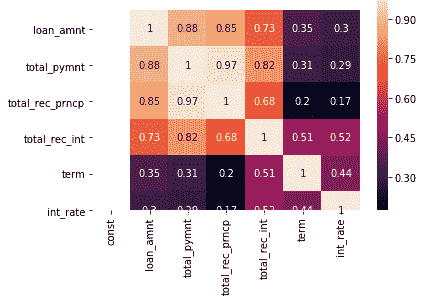
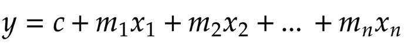
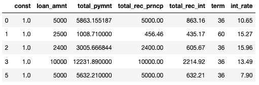
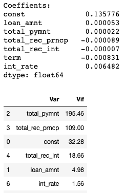
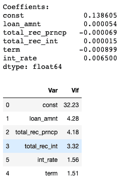

# 多重共线性-如何解决？

> 原文：<https://medium.com/analytics-vidhya/multicollinearity-how-to-fix-it-905b110d1968?source=collection_archive---------15----------------------->



这篇文章将回答诸如什么是多重共线性？多重共线性会产生哪些问题？何时必须修复多重共线性？以及如何修复多重共线性？

回归时我们必须注意的一个重要方面是多重共线性。查看这篇[文章](https://machinelearningmind.com/2019/10/06/introduction-to-linear-regression-e-commerce-dataset/)，找到多元线性回归和因变量/自变量的解释。

只是复习一下，

*   因变量是我们想要预测的变量。
*   自变量是用来预测因变量的变量。
*   我们回归的目标是找出哪些自变量可以用来预测因变量。

## 什么是多重共线性？

让我们看看什么是多重共线性，以及为什么我们应该担心它。

一个变量成为独立变量的条件之一是它必须*独立于其他变量*。也就是说，我们不能用其他独立变量来推导这个变量的值。

正如我们在我以前的文章中看到的，因变量相对于自变量的方程可以写成



我们举一个贷款数据的例子。

如果 X1 =贷款总额，X2 =本金，X3 =利息。

我们可以通过(X2 + X3)求出 X1 的值。这表明 X1、X2 和 X3 之间存在很强的多重共线性。

我们的自变量(X1)不完全是*独立的*。

如果你看一下这个等式，你可以看到 X1 和 m1 在一起，m1 是 X1 的系数。

对于线性回归，系数(m1)代表当你保持*所有其他自变量不变*时，自变量(X1)每变化 1 个单位，因变量(y)的平均变化。

例如，在[上一篇](https://machinelearningmind.com/2019/10/14/feature-elimination-using-p-values/)中，我们看到预测医疗费用的等式为
**【预测费用】** = ( **年龄**x 255.3)+(**BMI**x 318.62)+(**儿童** x 509.21) + ( **吸烟者** x 23240) -( **地区 _ 东南**

在**吸烟者**的情况下，系数为 23240。这意味着如果这个人是吸烟者，预测的费用将增加 23，240 英镑，如果这个人是不吸烟者，预测的费用将减少 23，240 英镑(假设所有其他变量都不变)。

## 多重共线性会产生哪些问题？

在我们的贷款例子中，我们看到 X1 是 X2 和 X3 的总和。由于这种关系，当 X1 发生变化时，我们不能期望 X2 或 X3 的值是 ***常数*** 。
所以，在这种情况下我们不能完全相信系数值(m1)。我们不知道 X1 对因变量的确切影响。

在文章[使用 p 值进行特征消除](https://machinelearningmind.com/2019/10/14/feature-elimination-using-p-values/)中，我们讨论了 p 值以及我们如何使用该值来查看特征/自变量是否具有统计显著性。
由于多重共线性会降低系数的准确性，我们可能无法信任 p 值来识别具有统计显著性的独立变量。

## 何时必须修复多重共线性？

**好消息**是多重共线性仅影响系数和 p 值，但不影响模型预测因变量的能力。

这意味着，如果您只关心预测值，就不必担心多重共线性。但在一些商业案例中，我们实际上必须关注单个自变量对因变量的影响。那么在这种情况下，我们必须减少数据中的多重共线性。

我们了解了什么是多重共线性，以及它会导致什么问题。现在我们来看看如何修复它。

## 如何修复多重共线性？

一旦确定多重共线性对您来说是一个问题并需要解决它，您就需要关注方差膨胀因子(VIF)。VIF 值帮助我们识别独立变量之间的相关性。

开始之前，您必须了解 VIF 的范围以及它表示的多重共线性的级别。

我们通常试图将多重共线性保持在中等水平。因此，我们必须确保自变量具有 VIF 值< 5.

Let’s take the loan data example.

Loan data has the following columns,
**loan_amnt** :批准的贷款金额
**total_pymnt** :迄今支付的总金额
**total_rec_prncp** :迄今支付的本金总额
**total_rec_int** :迄今支付的利息总额
**期限**:贷款期限

```
# Load csv into DataFrame 
data = pd.read_csv("loan.csv") # Data Cleanup 
data.term = data['term'].apply(lambda x:int(x.replace('months',''))) data.int_rate = data.int_rate.apply(lambda x:float(x.replace('%',''))) 
data = data[data['loan_status']!='Current'] 
data['loan_status'] = data['loan_status'].map({'Charged Off':1, 'Fully Paid':0}) # Separating independent variables into X and dependent variable into y 
X = data[['loan_amnt','total_pymnt','total_rec_prncp','total_rec_int','term','int_rate']] 
y = data['loan_status'] 
X = sm.add_constant(X) X.head()
```

****

**为了了解变量之间的相关性，我们使用了 heatmap()**

```
sns.heatmap(X.corr(), annot=True)
```

****

**绝对值越高，相关性越强**

**但是，当列数很高时，这是不可行的。**

**让我们计算每个独立列的 VIF 值。**

```
# Function to calculate VIF
def calculate_vif(data):
    vif_df = pd.DataFrame(columns = ['Var', 'Vif'])
    x_var_names = data.columns
    for i in range(0, x_var_names.shape[0]):
        y = data[x_var_names[i]]
        x = data[x_var_names.drop([x_var_names[i]])]
        r_squared = sm.OLS(y,x).fit().rsquared
        vif = round(1/(1-r_squared),2)
        vif_df.loc[i] = [x_var_names[i], vif]
    return vif_df.sort_values(by = 'Vif', axis = 0, ascending=False, inplace=False)
```

**让我们拟合一个线性回归模型，并检查系数。此外，计算 VIF 值**

```
lm = sm.OLS(y, X).fit() 
print("Coeffients: \n{0}".format(lm.params)) 
calculate_vif(X)
```

****

**现在请忽略“const”列。我们可以看到很低的系数，因为这些变量对因变量的影响很小。但我们不是来讨论这个的。让我们关注 VIF 价值观。**

**我们可以看到 **total_pymnt** ， **total_rec_prncp** ， **total_rec_int** 有 VIF > 5(极端多重共线性)。这是显而易见的，因为**total _ pym nt = total _ rec _ pr NCP+total _ rec _ int****

**为了减少多重共线性，让我们删除具有最高 VIF 的列并检查结果。**

```
# Dropping total_pymnt as VIF was highest 
X.drop(['total_pymnt'], axis=1, inplace=True) lm = sm.OLS(y, X).fit() 
print("Coeffients: \n{0}".format(lm.params))calculate_vif(X)
```

****

**如果你注意到，删除' **total_pymnt** '只改变了与它相关的变量的 VIF 值( **total_rec_prncp** ， **total_rec_int** )。**

**减少多重共线性前后的自变量系数。
两者之间有显著变化。
**total _ rec _ pr NCP:**-0.000089->-0.000069
**total _ rec _ int:**-0.000007->0.000015**

**因此，最终我们成功地将多重共线性降低到中等水平，现在我们的因变量有了 VIF < 5.**

**That’s it for this post!.**

**Here’s my [GitHub](https://github.com/fahadanwar10/LinearRegression) 用于 Jupyter 笔记本的线性回归。请随时查看，并在回复中提出更多减少多重共线性的方法。**

**感谢您的阅读！**

**请在 [Medium](http://www.medium.com/@fahadanwar10) 查看我的其他帖子并关注我。**

***原载于 2019 年 10 月 19 日*[*https://machinelearningmind.com*](https://machinelearningmind.com/2019/10/19/multicollinearity-how-to-fix-it/)*。***