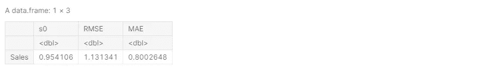

# 使用 R 的多重共线性/岭/套索/弹性网回归

> 原文：<https://medium.com/analytics-vidhya/multicollinearity-ridge-lasso-elastic-net-regression-using-r-6582cbabf7f3?source=collection_archive---------7----------------------->


# 介绍

这篇文章是我的 [**上一篇文章**](/@pranjalpandeysta1999/how-to-proceed-from-simple-to-multiple-and-polynomial-regression-in-r-84b77f5673c5?source=friends_link&sk=b15b49da90c1bece7fe935d6dc443135) 的延续，在这篇文章中，我向您展示了如何准备多元线性回归，以及如何使用从其诊断图中获得的信息，我们如何进行正交多项式回归，并获得给定数据集(我使用了广告数据集)的更好模型。

在上一篇文章中，我创建了正交多项式模型来避免多重共线性问题。但是现在，在本文中**我将首先通过引入预测电视和广播的多项式特征来产生多重共线性问题，然后向您展示如何使用脊、套索和弹性网回归技术来处理这个多重共线性问题**。

本文由以下部分组成-

1.  加载所需的库
2.  加载无异常值数据集
3.  (前一篇文章的)摘要
4.  产生多重共线性问题
5.  拟合多项式回归(注:非正交多项式)
6.  检查假设
7.  使用多项式回归模型进行预测
8.  多项式回归模型的平均性能
9.  多项式与正交多项式模型的比较
10.  为进一步分析准备数据
11.  用岭/套索/弹性网回归处理多重共线性
12.  不同模型的比较(多项式、正交多项式、脊线、套索、弹性网)
13.  获得最佳模型
14.  结论

我将使用 kaggle 在线平台进行分析工作。您可以使用任何软件，如 R-studio 或 R-cran 版本。

# 1.加载所需的库

没有必要一开始就加载所有的库，但是我这样做是为了简单。我正在加载另一个库 **glmnet** 用于山脊/套索/弹性网回归。

```
**# Loading Libraries**
library(tidyverse)
library(caret)
library(car)
library(lmtest)
library(olsrr)
library(glmnet)       **# For Ridge/Lasso/Elastic-Net Regression**
```

# 2.加载无异常值数据集

链接下载已经存储在 R-objects 中的离群值自由数据集-

1.  [**数据**](https://www.kaggle.com/pranjalpandey12/outlier-free-advertising-data-set/download)
2.  [**训练数据 1 和测试数据**](https://www.kaggle.com/pranjalpandey12/traindata1-and-testdata-for-further-analysis/download)

在我之前的笔记本里。

```
**# Loading Outlier free data set**
data = read.csv("../input/outlier-free-advertising-data-set/outlier free advertising data.csv" , header = T)

**# Loading outlier free train and test data already splitted in previous notebook**
train.data1 <- read.csv("../input/traindata1-and-testdata-for-further-analysis/train.data1.csv", header = T)
test.data <- read.csv("../input/traindata1-and-testdata-for-further-analysis/test.data.csv", header = T)
```

**数据集检查-**

看看下面不同的数据集

```
**# Inspection of data sets**
head(data)
head(train.data1)
head(test.data)
```


**输出— 1**

```
**# Structure of different data sets**
str(data)
str(train.data1)
str(test.data)
```


**输出— 2**

**注意，这里还出现了报纸变量。我们将在接下来的步骤中删除它，因为该特征在统计上不显著，在之前的笔记本**中已经讨论过。

# 3.(前一篇文章的)摘要

在上一篇文章中，我们得到的更好的模型是**正交多项式模型**，它捕获了目标**销售**的平均 93.69% 可变性的**。正交多项式模型的训练、测试和交叉验证结果如下表所示**


现在，在这篇文章中，我将向您展示**多项式回归模型**(注意:非正交)的结果以及解决这个问题的方法。

# 4.产生多重共线性问题

现在让我们在数据集中创建预测电视和广播的多项式特征。在我们之前的笔记中，我们已经看到，高达二阶的预测值 TV 和三阶的预测值 Radio 具有统计学意义。因此，创建以下多项式特征-

1.  **预测值 TV 的二阶**
2.  **二阶和三阶预测比值**

另外，为了简单起见，在数据集中创建一列电视和广播的交互效果。否则，我们将不得不在函数 **lm()** 中单独提及这种交互效应。

```
*# Creating Polynomial Features in R-object data*
data["TV2"]<- (data$TV)^2
data["Radio2"]<- (data$Radio)^2
data["Radio3"]<- (data$Radio)^3
data["TVRadio"]<- (data$TV)*(data$Radio)
*# Removing Newspaper Column as it is Statistically non-significant already discussed in previous notebook*
data <- data[-3]

*# Creating Polynomial Features in R-object train.data1*
train.data1["TV2"]<- (train.data1$TV)^2
train.data1["Radio2"]<- (train.data1$Radio)^2
train.data1["Radio3"]<- (train.data1$Radio)^3
train.data1["TVRadio"]<- (train.data1$TV)*(train.data1$Radio)
*# Removing Newspaper Column* 
train.data1 <- train.data1[-3]

*# Creating Polynomial Features in R-object test.data*
test.data["TV2"]<- (test.data$TV)^2
test.data["Radio2"]<- (test.data$Radio)^2
test.data["Radio3"]<- (test.data$Radio)^3
test.data["TVRadio"]<- (test.data$TV)*(test.data$Radio)
*# Removing Newspaper Column* 
test.data <- test.data[-3]
```

**再次检查数据集-**

再看一下不同的数据集，如下所示

```
**# Inspection of data sets**
head(data)
head(train.data1)
head(test.data)
```


**输出— 3**

**电视和广播的所有多项式特性和交互作用已成功添加到不同的数据集中。**

# 5.拟合多项式回归(注:非正交多项式)

因为，我们已经在数据集中存储了电视和广播的多项式特征和交互项。因此，我们将仅使用拟合多元线性回归的代码来拟合多项式模型，使用存储在 R-object **train.data1** 中的训练数据集，如下所示-

```
**# Fitting Polynomial model (Note : It is not Orthogonal Polynomial)**
polynomial_model <- lm(Sales ~ ., data = train.data1)

**# Take a look on summary of the model**
summary(polynomial_model)
```


**输出— 4**

**以上输出显示-**

1.  由于 p 值<<< 0.05 (see in the last line of output)
2.  From the coefficients section, it is clear that all coefficients are statistically significant since p-value <<< 0.05
3.  This polynomial model explains 93.21% variability of target (Sales).
4.  Residual standard error for the model is 1.347

# 6\. Checking Assumptions

Let’s check whether all assumptions of linear regression are satisfied.

**线性假设-** ，创建的多项式模型具有统计显著性

```
**# Residual Plot**
plot(polynomial_model,1)
```


**输出— 5**

**正态假设-**

```
**# Normality Test of Errors**
shapiro.test(polynomial_model$residuals)
```


**输出— 6**

**同方差假设-**

```
**# Hetroscedasticity Test**
ols_test_score(polynomial_model)
```


**输出— 7**

**自相关假设-**

```
**# Auto-correlation Test**
durbinWatsonTest(polynomial_model)
```


**输出— 8**

**多重共线性假设-**

```
**# Detecting Multicollinearity** 
vif(polynomial_model)
```


**输出— 9**

从上面的输出可以清楚地看出，除了多重共线性之外，所有的假设都得到了满足。所以我们要处理多重共线性问题。我们将在几步之后处理它。

> 如果你不知道如何解读上述结果，只需阅读我的 [**上一篇**](/@pranjalpandeysta1999/how-to-proceed-from-simple-to-multiple-and-polynomial-regression-in-r-84b77f5673c5?source=friends_link&sk=b15b49da90c1bece7fe935d6dc443135) 。我已经详细讨论过了。

# 7.使用多项式回归模型进行预测

现在，用这个模型在测试数据集上做预测，看看它在看不见的数据集上效果如何。

```
**# Making predictions using Polynomial model**
prediction = polynomial_model %>% predict(test.data)

**# Checking performance by calculating R2, RMSE and MAE**
data.frame( R2 = R2(prediction, test.data$Sales),
            RMSE = RMSE(prediction, test.data$Sales),          
            MAE = MAE(prediction, test.data$Sales))
```


**输出— 10**

我们得到:R = 0.9526385，这表明更好的拟合。

# 8.多项式回归模型的平均性能

因为，上述结果仅基于一个测试数据集。因此，我们不能确定该模型对所有未知数据都有更好的表现。为了在这方面更有把握，我们将使用重复 10 重交叉验证的方法在不同的测试数据集上测试模型的性能。

这将按如下方式进行

```
**# Repeated 10-fold Cross validation using polynomial model**
set.seed(123)
train.control <- trainControl(method = "repeatedcv", number = 10, repeats = 3)

**# Train the model**
poly_model_cv <- train(Sales ~ ., data = data, method = "lm", trControl = train.control)

**# Summarize the results**
print(poly_model_cv)
```


**输出— 11**

**平均而言，这个多项式回归模型捕捉了目标(销售)中 93.69%的可变性。**

# 9.多项式与正交多项式模型的比较

根据 R 和 RMSE 指标对两个模型进行比较，如下所示-

下表给出了多项式和正交多项式回归模型的训练、测试和交叉验证结果


上表显示两种型号的**性能相同**。

但是请看下表——


上表显示**多重共线性假设被多项式回归模型**违反。

因此，有必要处理多重共线性。

# 10.为进一步分析准备数据

现在，我们将处理多重共线性问题，但在此之前，我们必须准备我们的数据集，以供进一步分析。我们将使用 **glmnet** 库，其中**以矩阵形式**分别要求预测器和目标。因此，只需将预测值和目标值分开，并将其转换成矩阵形式，如下所示-

```
**# Storing Predictors and Target in Matrix form (train data set)**
x_train <- train.data1 %>% select(-Sales) %>% as.matrix()
y_train <- train.data1  %>% select(Sales) %>%  as.matrix()

**# Storing Predictors and Target in Matrix form (test data set)**
x_test <- test.data %>% select(-Sales) %>% as.matrix()
y_test <- test.data %>% select(Sales) %>% as.matrix()
```

# 11.用岭/套索/弹性网回归处理多重共线性

基本上，有三种方法可以处理多重共线性问题-

1.  **岭回归**
2.  **套索回归**
3.  **弹性网回归**

岭回归和套索回归是弹性网回归的特例。弹性网回归中有两个超参数，名为-

1.  **α**—俗称**混合参数**。
2.  **λ**——它被称为**正则化罚**。

找出这些超参数的最佳值是我们的职责。为此，我们使用交叉验证方法。我们将在稍后阶段看到它。

这些超参数的范围-

1.  α位于 0 到 1 的封闭区间内
2.  λ介于 0 到无穷大之间。

还有三点需要记住-

1.  对于**岭**回归:**α= 0**，λ可以取其范围内的任何值
2.  对于 **Lasso** 回归: **alpha = 1** ，Lambda 可以取其范围内的任何值
3.  对于**弹性网**回归:**α位于 0 和 1** 之间，λ可以取其范围内的任何值

现在，我将找出这三种方法中哪一种对给定的广告数据集表现最好。

# 岭回归拟合

在岭回归的情况下，超参数(即α)的值是固定的。我们的目的是找出λ的最佳值。为此，我们使用交叉验证方法，交叉验证的评价标准将是均方误差。

用于上述目的的 r 代码如下-

```
**# Cross Validation for obtaining best value of lambda for ridge regression (alpha = 0)**
cv_for_best_lambda <-  cv.glmnet(x_train, y_train, family = "gaussian", alpha = 0, type.measure = "mse")
```

对于 alpha = 0，上述代码使用训练数据集执行 10 重(默认)交叉验证，并给出 lambda 的最佳值。

按如下方式检查λ值-

```
**# Checking best value of lambda**
print(cv_for_best_lambda)
```


**输出— 12**

**注意上面的输出-**

1.  最后两行输出中有两个λ值( **0.4638** 和 **0.6729** )。我将取值 **0.4638** ，因为 **MSE 是该值的最小值(2.573)** 。**为什么是这两个值？这两个值用于不同的情况。当我们拟合套索回归时，你会更清楚这一点。但是规则是**选择 MSE 最小的λ值**。**
2.  上述输出的最后一列显示，对于λ的两个值，模型中有 6 个非零系数，我们的数据集中也有 6 个预测值。这意味着所有的预测因子对于岭回归都是重要的。

> *实际上，这些方法(脊/套索/弹性网)也用于选择最佳预测值。在这种情况下，上述输出的最后一列起着非常重要的作用。那个时候，我并不倾向于功能选择。只关注多重共线性问题。*

现在，将λ的最佳值，即 **0.4638** 存储在 R-object **best_lambda** 中，如下所示-

```
**# Storing best value of lambda in a R-object best_lambda**
best_lambda = cv_for_best_lambda$lambda.min
```

现在，拟合岭回归模型，并检查其对训练数据集的性能，如下所示-

```
**# Fitting Ridge Regression Model**
ridge = glmnet(x_train, y_train, family = "gaussian",alpha = 0, lambda = best_lambda)

**# Checking its performance on train data set**
predict_train <- ridge %>% predict(x_train)
data.frame( R2 = R2(predict_train, y_train),
            RMSE = RMSE(predict_train, y_train),
            MAE = MAE(predict_train, y_train))
```


**输出— 13**

**从上面的输出，我们得到的是——**

1.  调整后的 R =约 90.9%。
2.  RMSE = 1.5585

现在，检查它在看不见的数据上的表现如下-

```
**# Checking performance of Ridge regression on test data set**
predict_test <- ridge %>% predict(x_test)
data.frame( R2 = R2(predict_test, y_test),
            RMSE = RMSE(predict_test, y_test),
            MAE = MAE(predict_test, y_test))
```


**输出— 14**

那么，我们得到: **R = 0.9526385** 和 **RMSE = 1.4779**

为了对其在未知数据上的表现更有信心，使用重复的 K-fold 交叉验证计算岭回归的平均表现如下-

```
**# Repeated 10-fold cross validation for average performance of Ridge Regression**
set.seed(123)
train.control <- trainControl(method = "repeatedcv", number = 10, repeats = 3)

**# Train the model**
Ridge_model_cv <- train(Sales ~ ., data = data, method="glmnet", trControl = train.control, tuneGrid = expand.grid(alpha = 0, lambda = best_lambda))

**# Summarize the results**
print(Ridge_model_cv)
```


**输出— 15**

**平均而言，岭回归模型捕捉了目标(销售)中 91.34%的可变性，该模型的 RMSE 为 1.538825**

这表明**岭回归并没有比多项式/正交多项式模型**表现得更好。

就此打住，进行套索回归拟合。

# 套索回归拟合

在套索回归的情况下，超参数的值，即α是固定的。我们的目的是找出λ的最佳值。为此，我们再次使用交叉验证的方法和评价标准，交叉验证将均方误差。

用于上述目的的 r 代码如下-

```
**# Cross Validation for obtaining best value of lambda for lasso regression (alpha = 1)**
cv_for_best_lambda <-  cv.glmnet(x_train, y_train, family = "gaussian", alpha = 1, type.measure = "mse")
```

对于 alpha = 1，上述代码使用训练数据集执行 10 重(默认)交叉验证，并给出 lambda 的最佳值。

按如下方式检查λ值-

```
**# Checking best value of lambda**
print(cv_for_best_lambda)
```


**输出— 16**

**请注意，在上面的输出中-**

1.  在最后两行输出中有两个 lambda 值(0.00187 和 0.04859)。我将取值 0.00187，因为 MSE 是该值的最小值(1.916)。另见最后一列的值，即 **6** 表示**所有预测值都是重要的**。
2.  上述输出的最后一行和最后一列中的值，即 **4** 表示，如果我们只包括四个预测值，则λ值= 0.04859，但是我们不选择这个λ值，因为这种情况下的 MSE 略高于前一个λ值(0.00187)。

> *有时，包含较少数量的预测值可能会提供最小的 MSE。在这种情况下，我们选择λ的第二个值，但这不是我们的情况。正如我之前所说，这些方法(脊/套索/弹性网)也用于预测选择。*
> 
> *但是在我们的例子中，这些方法只处理多重共线性问题，正如我们在上面的输出中看到的，如果我们只包括四个预测值，那么λ的值= 0.04859，但是我们不选择这个λ值，因为在这种情况下 MSE 略高于之前的λ值(0.00187)*

现在，在 R-object best_lambda 中存储 lambda 的最佳值，即 0.00187，如下所示-

```
**# Storing best value of lambda in a R-object best_lambda**
best_lambda = cv_for_best_lambda$lambda.min
```

现在，拟合 Lasso 回归模型，并检查其在如下训练数据集上的性能-

```
**# Fitting Lasso Regression Model**
lasso = glmnet(x_train, y_train, family = "gaussian", alpha = 1, lambda = best_lambda)

**# Checking its performance on train data set**
predict_train <- lasso %>% predict(x_train)
data.frame( R2 = R2(predict_train, y_train),
            RMSE = RMSE(predict_train, y_train),
            MAE = MAE(predict_train, y_train))
```


**输出— 17**

**从上面的输出，我们得到的是——**

1.  调整后的 R =约 93.43%。
2.  RMSE = 1.319708

现在，检查它在看不见的数据上的表现如下-

```
**# Checking performance of Lasso regression on test data set**
predict_test <- lasso %>% predict(x_test)
data.frame( R2 = R2(predict_test, y_test),
            RMSE = RMSE(predict_test, y_test),
            MAE = MAE(predict_test, y_test))
```



**输出— 18**

那么，我们得到: **R = 0.954106** 和 **RMSE = 1.131341**

为了更有信心，关于它在看不见的数据上的表现，使用重复的 K-fold 交叉验证计算 Lasso 回归的平均表现如下-

```
**# Repeated 10-fold cross validation for average performance of Lasso Regression**
set.seed(123)
train.control <- trainControl(method = "repeatedcv", number = 10, repeats = 3)

**# Train the model**
Lasso_model_cv <- train(Sales ~ ., data = data, method="glmnet", trControl = train.control, tuneGrid = expand.grid(alpha = 1, lambda = best_lambda))

**# Summarize the results**
print(Lasso_model_cv)
```


**输出— 19**

**平均而言，Lasso 回归模型捕获了目标(销售)中 93.58%的可变性，该模型的 RMSE 为 1.304869**

这表明 **Lasso 回归比岭回归模型表现更好(捕获了 91.34%的可变性)**。

就此打住，进行弹性网回归拟合。

# 弹性网回归拟合

在弹性网回归的情况下，两个超参数的值都是未知的。我们的目标是找出α和λ的最佳值。为此，我们再次使用交叉验证方法。在这里，这种方法以不同的方式使用。因此，看到并注意到在这种情况下使用的代码和在以前的情况下(脊/套索)的区别

用于上述目的的 r 代码如下-

```
**# Cross Validation for obtaining best value of alpha and lambda for elasticnet regression** 

**# Define Training Control**
set.seed(123)
train.control <- trainControl(method = "repeatedcv", number = 10, repeats = 3 , **search = "random"**)

**# Train the model**
cv_for_best_value <- train(Sales ~ ., data = train.data1, method="glmnet", trControl = train.control)

**# Obtaining Best Value of alpha and lambda**
cv_for_best_value$bestTune
```


**输出— 20**

**以上输出给出了α和λ的最佳值。**我们将在弹性网回归拟合中使用这些值。

现在，拟合弹性网回归模型，并检查其在如下训练数据集上的性能-

```
**# Fitting Elasticnet Regression Model**
enet <- glmnet(x_train, y_train, alpha = 0.4089769, lambda = 0.001472246 ,family = "gaussian")

**# Checking its performance on train data set**
predict_train <- enet %>% predict(x_train)
data.frame( R2 = R2(predict_train, y_train),
            RMSE = RMSE(predict_train, y_train),
            MAE = MAE(predict_train, y_train))
```


**输出— 21**

**从上面的输出中，我们得到了——**

1.  调整后的 R =约 93.46%。
2.  RMSE = 1.317211

现在，检查它在看不见的数据上的表现如下-

```
**# Checking performance of Elasticnet regression on test data set**
predict_test <- enet %>% predict(x_test)
data.frame( R2 = R2(predict_test, y_test),
            RMSE = RMSE(predict_test, y_test),
            MAE = MAE(predict_test, y_test))
```


**输出— 22**

那么，我们得到: **R = 0.9538105** 和 **RMSE = 1.134862**

为了更有把握地了解其在未知数据上的表现，使用重复的 K-fold 交叉验证来计算弹性网回归的平均表现，如下所示

```
**# Repeated 10-fold cross validation for average performance of Elastic-Net Regression**

**# Define Training control**
set.seed(123)
train.control <- trainControl(method = "repeatedcv", number = 10, repeats = 3)

**# Train the model**
Elasticnet_model_cv <- train(Sales ~ ., data = data, method="glmnet", trControl = train.control, **tuneGrid = expand.grid(alpha = 0.4089769, lambda = 0.001472246)**)

**# Summarize the results**
print(Elasticnet_model_cv)
```


**输出— 23**

# 伟大的结果！

**平均而言，弹性净回归模型捕捉了目标(销售)中 93.66%的可变性，该模型的 RMSE 为 1.297969**

这表明**弹性网回归比岭和套索回归模型**表现更好。

# 12.不同模型的比较(多项式、正交多项式、脊线、套索、弹性网)

现在，是时候比较不同的模式，并获得最好的一个。

下表包含所有先前安装的模型的训练、测试和交叉验证结果-


**上表的结果-**

1.  正交多项式和多项式模型具有相同的性能，因为这两种模型的 R 和 RMSE 值相同。
2.  弹性网回归比岭/套索回归表现更好，因为弹性网回归的 R 值最大，RMSE 最小。
3.  弹性网回归的表现也优于多项式/正交多项式模型，因为弹性网的 RMSE 最小(1.297969)。
4.  还要注意，Lasso 回归在测试数据集上比其他模型表现更好，但因为这个结果只基于一个数据集。因此，我们不能确定它是否也适用于其他看不见的数据，这就是为什么我们使用交叉验证来计算平均性能，并得出 Lasso 并不比给定数据集的 Elastic-Net 更好。
5.  到目前为止，**弹性网回归模型是给定广告数据集的最佳模型，平均捕获 93.7%的目标(销售)可变性，RMSE = 1.297969**

# 13.获得最佳模型

最后，我们得到**弹性网回归对于给定的广告数据集表现良好**。那么，**这个模型的方程式是什么？**为此，我们必须获得回归系数的值。

用于上述目的的 r 代码如下-

```
**# Obtaining Coefficients of Elastic-Net Regression Model**
enet$beta
```


**输出— 24**

**因此，弹性网回归模型是-**


# 14.结论

最后，我想在这里总结一下，在这本笔记本中，**我从多项式模型的拟合开始，然后向您展示了多项式模型违反了多重共线性假设，为了解决这个问题，我们有三种不同的方法，分别是岭、套索和弹性网回归。我已经向您详细展示了如何拟合这些模型，如何获得这些模型的超参数的最佳值，最后我提到了最佳回归模型，即针对给定广告数据集的弹性网回归**。

仅此而已。

**自己做一次就更好理解了！**

我的 kaggle 笔记本 [**链接**](https://www.kaggle.com/pranjalpandey12/multicolinearity-ridge-lasso-elasticnet-regression) 。

# 感谢阅读我的文章。

如果你发现任何错误，请告诉我。