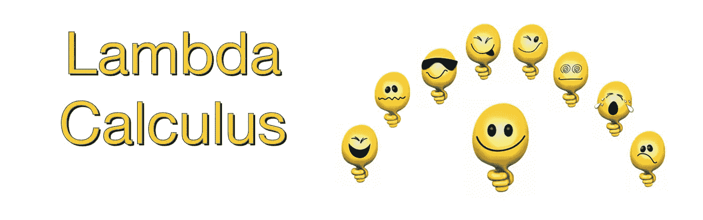
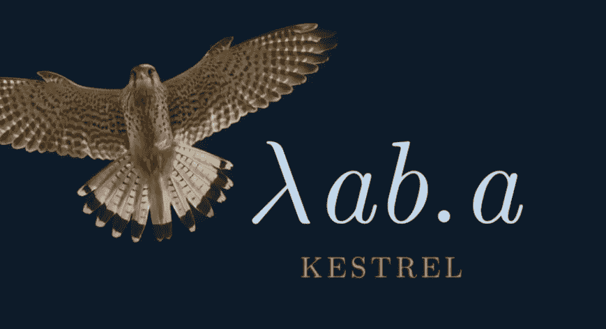
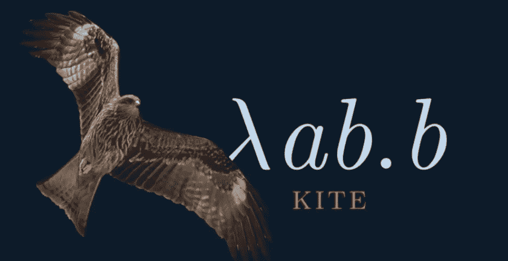

# 多语言 IMK 组合器

> 原文：<https://medium.com/analytics-vidhya/multilingual-imk-combinators-66e03a8ef22c?source=collection_archive---------23----------------------->



## JavaScript ⬡，Haskell λ，Python🐍

当我看的时候

[Gabriel Lebec 在 JavaScript 中谈论 LC](https://youtu.be/3VQ382QG-y4)
[Graham hut ton 在 Haskell 中谈论 LC](https://youtu.be/eis11j_iGMs)
[David Beazley 在 Python 中谈论 LC](https://youtu.be/5C6sv7-eTKg)

我忍不住要试一试。以下是我如何在我的苹果电脑上工作——是的，是 8 年前的苹果电脑。


# λa.a，恒等式组合子

是一个接受输入 a 并返回输出 a 的函数。把`λa.a`想象成类似于`f(a) = a`的东西，这会让你感觉更舒服。

## JavaScript 函数 I

为了好玩，我们把 JS repl 提示符改成⬡。在当前目录下创建一个文件 repl.js。

```
var repl = require('repl');repl.start( {
  prompt: '⬡ ',
  replMode: repl.REPL_MODE_STRICT,
  ignoreUndefined: true,
});
```

使用自定义提示运行节点:

```
👍 node --version
v12.12.0
👍 vim repl.js
👍 node repl.js 
⬡ 
```

创建恒等函数 I，λa.a

```
⬡  const I = a => a
⬡ I
[Function: I]
⬡ I(1)
1
⬡ I(2)
2
⬡ I(I)
[Function: I]
⬡ I(I)(I)
[Function: I]
```

## 哈斯克尔函数 I

为了好玩，我们把 GHCi 提示改成λ。

```
👍 cat ~/.ghci 
:set prompt "λ: "
:set +m
:set prompt-cont " | "
👍 ghci
GHCi, version 8.2.1: [http://www.haskell.org/ghc/](http://www.haskell.org/ghc/)  :? for help
Loaded GHCi configuration from /Users/zhijunsheng/.ghci
λ:
```

创建恒等函数 I，λa.a

```
λ: let
 | i :: a -> a
 | i x = x
 | 
λ: i 1
1
λ: i 2
2
λ: i i 1
1
λ: :t i i
i i :: a -> a
λ: :t i
i :: a -> a
λ: i i i 2
2
λ: :t i i i
i i i :: a -> a
```

Haskell 有一个函数`id`,类似于我们的函数 I

```
λ: :t id
id :: a -> a
λ: :t i
i :: a -> a
λ: id 1
1
λ: i 1
1
```

## Python 函数 I

让我们将 python3 repl 提示符改为🐍为了好玩。

```
👍 python3
Python 3.7.4 (default, Oct 24 2019, 10:36:19) 
[Clang 11.0.0 (clang-1100.0.33.8)] on darwin
Type "help", "copyright", "credits" or "license" for more information.
>>> import sys
>>> sys.ps1 = "🐍 "
🐍 sys.ps2 = ".. "
🐍 def f(x):
..   return 3*x
.. 
🐍 f(8)
24
```

创建恒等函数 I，λa.a

```
🐍 def I(a):
..   return a
.. 
🐍 I(1)
1
🐍 I
<function I at 0x1013a5290>
🐍 I(I)
<function I at 0x1013a5290>
🐍 I(I)(I)
<function I at 0x1013a5290>
🐍 I(I)(I)(I)
<function I at 0x1013a5290>
🐍 I(I)(I)(I)(2)
2
```

# λf.ff，模仿鸟组合子

是一个有趣的功能。它接受一个函数作为输入，并调用传入自身的函数。这是自我应用组合子。

## JavaScript 函数 M

```
👍 node repl.js
⬡ const I = a => a
⬡ const M = f => f(f)
⬡ M
[Function: M]
⬡ M(I)
[Function: I]
```

## 哈斯克尔函数 m

不幸的是，我们不能在 Haskell 中这样做。:-(

参见[模仿一只知更鸟](https://mail.haskell.org/pipermail/beginners/2010-September/005271.html)获得解释:

> ghci >设 m z = z z
> 
> 这是 Smullyan 的模仿鸟功能。Haskell 不允许
> 函数具有像这样的所谓“无限类型”，尽管它们
> 可能有用(Haskell 提供了其他方法来获得无限类型
> 会给你的东西)。

## Python 函数 M

```
👍 python3 
>>> import sys
>>> sys.ps1 = "🐍 "
🐍 sys.ps2 = ".. "
🐍 def I(a):
..   return a
.. 
🐍 def M(f):
..   return f(f)
.. 
🐍 M(I)
<function I at 0x10ca8f320>
```



# λab.a，红隼组合子

接受 a 和 b 并返回 a。

## JavaScript 函数 K

```
👍 node repl.js
⬡ const I = a => a
⬡ const M = f => f(f)
⬡ const K = a => b => a
⬡ K(I)(M)
[Function: I]
⬡ K(K)(M)
[Function: K]
⬡ K(1)(2)
1
```

## 哈斯克尔函数 k

```
👍 ghci
GHCi, version 8.2.1: [http://www.haskell.org/ghc/](http://www.haskell.org/ghc/)  :? for help
Loaded GHCi configuration from /Users/zhijunsheng/.ghci
λ: let
 | i :: a -> a
 | i x = x
 | 
λ: let
 | k :: a -> b -> a
 | k x _ = x
 | 
λ: k 1 2
1
λ: k "first" k
"first"
λ: k "first" i
"first"
λ: :t k i k
k i k :: a -> a
λ: :t k k i
k k i :: a -> b -> a
```

Haskell 的函数`const`类似于我们的函数 I。

```
λ: :t const
const :: a -> b -> a
λ: :t k
k :: a -> b -> a
λ: const "first" k
"first"
λ: k "first" k
"first"
```

## Python 函数 K

```
👍 python3 
>>> import sys
>>> sys.ps1 = "🐍 "
🐍 sys.ps2 = ".. "
🐍 def I(a):
..   return a
.. 
🐍 def M(f):
..   return f(f)
.. 
```

`def`不带`lambda`:

```
🐍 def K(a):
..   def f(b):
..     return a
..   return f
.. 
🐍 K
<function K at 0x10ca8f5f0>
🐍 K(I)(M)
<function I at 0x10ca8f320>
🐍 K(M)(I)
<function M at 0x10ca8f440>
🐍 K(K)(M)
<function K at 0x10ca8f7a0>
```

`def`同`lambda`:

```
🐍 def K(a):
..   return lambda b: a
.. 
🐍 K(I)(M)
<function I at 0x10ca8f320>
🐍 K(M)(I)
<function M at 0x10ca8f440>
🐍 K(K)(M)
<function K at 0x10ca8f7a0>
```



# λab.b，风筝组合子

接受一个 a 和一个 b，然后返回 b。

## JavaScript 函数 KI

```
👍 node repl.js
⬡ const I = a => a
⬡ const M = f => f(f)
⬡ const K = a => b => a
⬡ K(I)(M)
[Function: I]
⬡ K(K)(M)
[Function: K]
⬡ K(1)(2)
1
⬡ K(I)(1)(2)
2
```

## 哈斯克尔函数 KI

```
👍 ghci
GHCi, version 8.2.1: [http://www.haskell.org/ghc/](http://www.haskell.org/ghc/)  :? for help
Loaded GHCi configuration from /Users/zhijunsheng/.ghci
λ: let
 | i :: a -> a
 | i x = x
 | 
λ: let
 | k :: a -> b -> a
 | k x _ = x
 | 
λ: k 1 2
1
λ: k i 1 2
2
λ: :t k i k
k i k :: a -> a
λ: :t k i i k
k i i k :: a -> b -> a
```

## Python 函数 KI

```
👍 python3 
>>> import sys
>>> sys.ps1 = "🐍 "
🐍 sys.ps2 = ".. "
🐍 def I(a):
..   return a
.. 
🐍 def M(f):
..   return f(f)
..
🐍 def K(a):
..   def f(b):
..     return a
..   return f
.. 
🐍 K(I)(M)
<function I at 0x10ca8f320>
🐍 K(M)(I)
<function M at 0x10ca8f440>
🐍 K(I)(I)(M)
<function M at 0x10ca8f440>
```