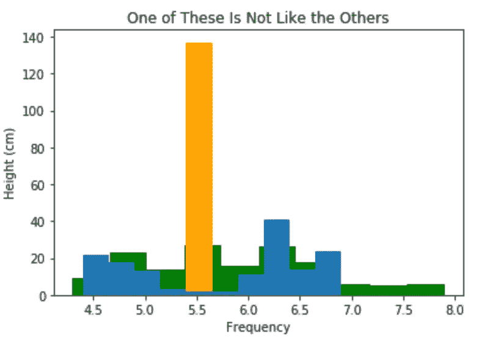
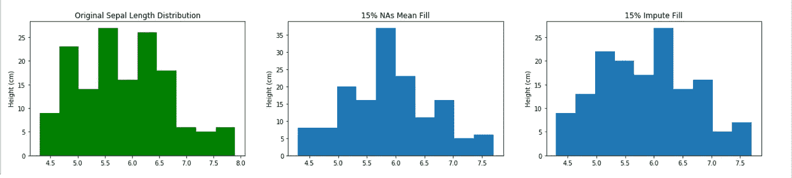
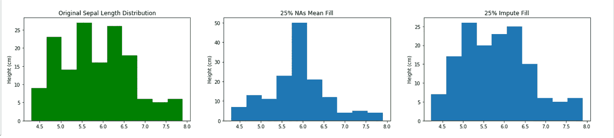
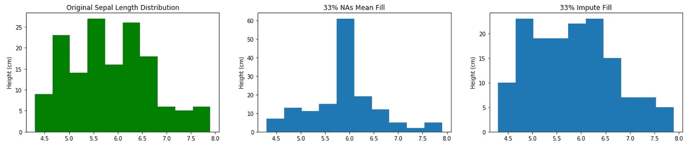
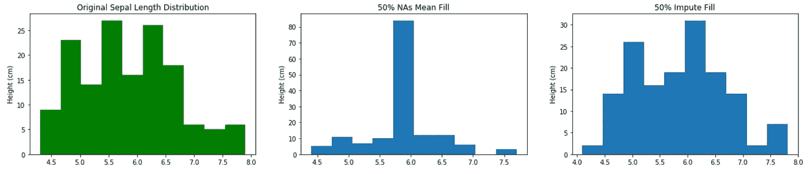
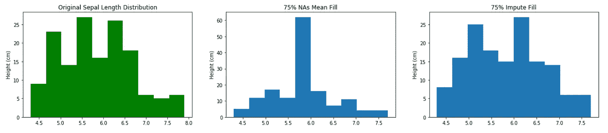
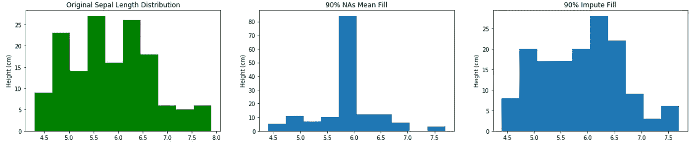
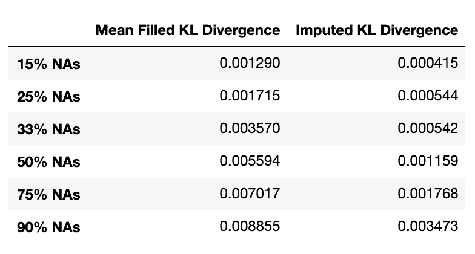
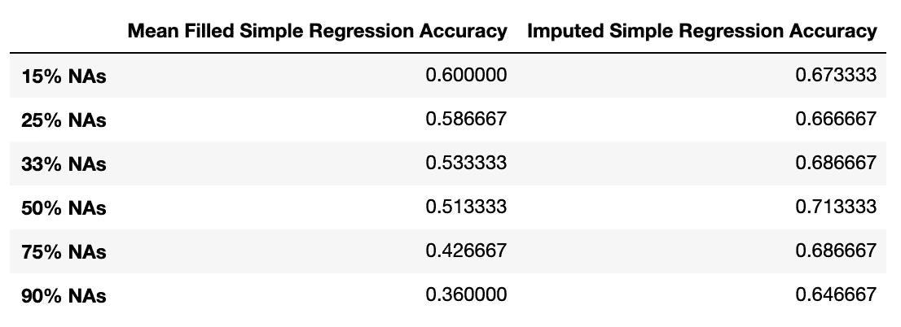
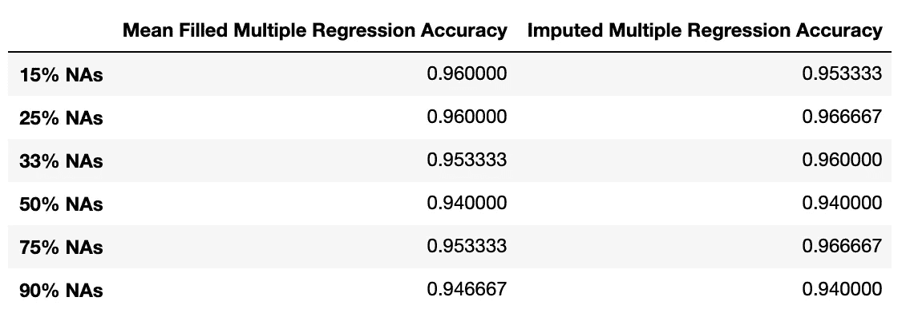

# 多重插补:填补 NAs 的更好方法

> 原文：<https://medium.com/analytics-vidhya/multiple-imputation-a-better-way-to-fill-nas-a8b9ec811e1f?source=collection_archive---------12----------------------->

缺失值是数据科学生活中的一个事实，处理它们总是需要判断。是时候放弃功能了。删除行是有时间的。粗分类是有时间的。是否真的有时间用平均值/中值/众数填写多个 NAs？我从未被说服:它扭曲了变量的分布——拜托，我们是数据科学家！一定有更好的方法。

当然，这是一个反问句——这不是一个新问题，还有其他方法。今天，我将讨论一种这样的方法，即多重插补，由格雷厄姆和斯查费在[小样本研究的统计策略](https://www.amazon.com/gp/product/0761908862/ref=ppx_yo_dt_b_asin_title_o02_s00?ie=UTF8&psc=1)中提出(这是有意义的，当你有 100 个数据点要处理时，NAs 可能是一个生死攸关的问题)。

前提是使用您必须使用的变量来对 NAs 的功能进行建模，但是，正如作者所指出的，在此止步会有两个问题:

1.  你的估算模型可能完全不可信。
2.  其输出将是完全同质的/缺乏实际数据的自然变化。

关于问题一，有两件事需要考虑:偏差和方差。如果模型有偏差，除了尝试不同的估计量之外，你没有什么可以做的，但方差是另一回事-我们知道该怎么做:装袋(即，取用替换绘制的数据集子集的几个模型的输出的平均值)。

装袋中使用的模型数量是数据集缺失百分比的函数，也是真实分布和估算分布之间的相似性百分比的函数，您可以使用以下公式找到它:

> **百分比 _ 缺失/((1/Var _ 偏差 _ 公差)-1)**

没有必要在容忍水平上走极端，边际效应递减肯定是有效的——我倾向于 0.97。

至于同质性问题，解决方法很简单:添加噪声。具体来说，根据插补模型为该要素的非缺失值生成的残差，向插补模型的输出添加随机残差。如果你觉得残差的分布看起来有道理，那就计算一下，然后随机给每个输出加一。否则，如果看起来有一些奇怪的事情正在发生，并且分布看起来可疑(例如，它意外地是双峰的，可能因为缺失不是随机的)，则根据它们的均值和方差从高斯分布中提取它们。

之后，还有两件小事需要考虑:

1.  只取整数值的舍入变量。
2.  裁剪具有最小值和/或最大值的变量范围。

瞧啊。理论上听起来很合理吧？让我们通过在经典的 Iris 数据集上测试这个方法来看看它在实践中是如何做的。

让我们比较一下在不同 NAs 级别上通过填充平均值和插补来处理萼片长度列中缺失值的情况:

缺少 15%的值

25%的值缺失

33%的缺失值

50%缺失值

75%的缺失值

90%的缺失值

眼球测试说明了一切。简单地填充平均值会扭曲分布，使其在 15%缺失值的相对适中的水平上看起来像人工高斯分布，并且事情会从那里变得更糟，而估算的分布在每个水平上都保持原始分布的总体特征。

统计数据证实了这一点:我们可以使用 Kullback-Leibler 散度来确定两个分布之间的相似性(越高越不相似)，在每种情况下，原始分布和均值填充分布之间的 KL 散度都是其估算对应物的倍数(准确地说，是 2.6 到 6.6 倍)。

然而，有趣的是，这两列的值都很低——这是否意味着这两种方法的性能在实践中不会有实质性的差异？让我们以鸢尾属物种为目标，通过在五重交叉值的简单逻辑回归中使用它来找出答案。

(作为参考，在一个简单的回归中，没有 NAs 的原始“萼片长度”列给出的准确度为 0.6867。)

虹膜类型分类准确度

多重插补得到证实。对于每一级 NAs，估算列的准确性更高，并且随着缺失百分比上升，它更多地停留在原始的水平，而平均填充下降到比机会好不了多少。

游戏，设置和匹配…有点。完全公开:当我们将数据集中其他可用的特性用于多重逻辑时，会发生一些奇怪的事情。

这两者之间没有明显的区别。这是怎么回事？为了找到答案，我对原始(即无 NA)数据进行了回归，得到了 0.9600 的准确度分数。把“萼片长度”一栏完全去掉，你仍然得到 0.9533。

现在，这是有意义的(并且，我希望，在看起来像一个灌篮结果之后包括这一部分的事实也是有意义的——我正在说明一个观点)。我们已经接近了这些数据所能告诉我们的上限，多重插补并不是对缺失值的神奇修复:你不是在丰富你的数据集——只是在填充它。因此，当你有其他好的预测时，可能是时候放弃列了。然而，如果你确实需要依赖 NA 列，我认为选择是明确的:每次都进行多重插补。

干杯！如果我已经向你推销了这种方法，这里有到我的 python 实现的链接。它已经完全加载，能够处理数值和分类特性，只是要确保在数据帧中保持分类列为字符串。