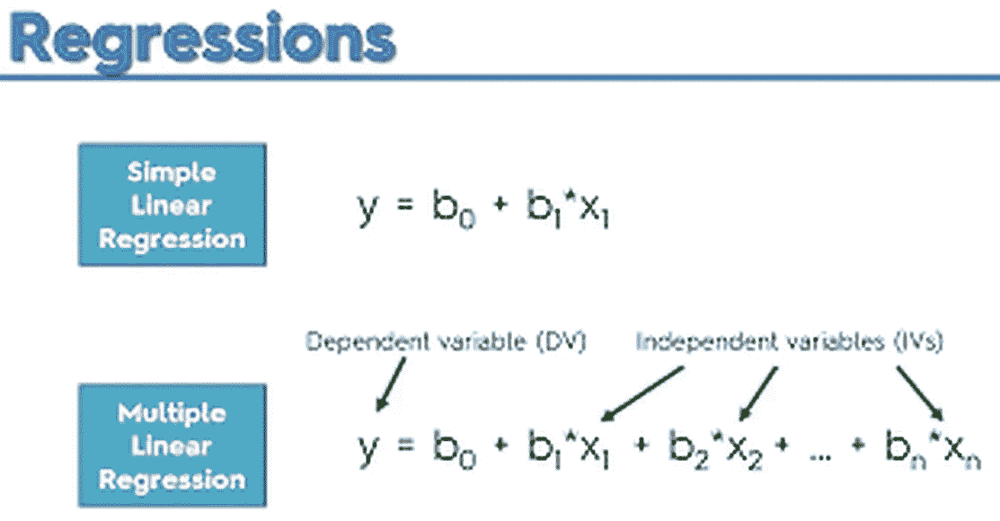

# 多元线性回归— 8

> 原文：<https://medium.com/analytics-vidhya/multiple-linear-regression-2f28ad463e68?source=collection_archive---------13----------------------->

> 如果您还没有阅读 R 数据分析系列的第 7 部分，请仔细阅读下面的文章，其中我们讨论了 [*简单线性回归—*](/analytics-vidhya/simple-linear-regression-7-655537eee4c5) *7* 。
> 
> 这篇文章的内容是我在 IIM-B 时代得到介绍的几本书的要点。
> 
> 人人为我——贾里德·p·兰德
> 
> 实用数据科学与 R — Nina Zumel 和 John Mount
> 
> 文中讨论的所有代码块都以 R markdown 的形式出现在 [Github 链接](https://github.com/viveksrinivasanss/Data_Science_Using_R)中。
> 
> 要查看我写的所有文章，请使用链接 [Vivek Srinivasan](/@viveksrinivasan) 。



T`simple linear regression`的逻辑扩展是`multiple regression`，它允许多个预测器。想法还是一样的；我们仍在对反应进行预测或推断，但我们现在有了更多的多种预测形式的信息。数学需要一些矩阵代数，但幸运的是，`lm` 函数的使用非常简单。

在这种情况下，响应和`p`预测值(P1 预测值和截距)之间的关系建模为


其中`Y`是`nx1`响应向量。


x 是`nxp`矩阵(n 行和 P1 预测值加上截距)


β是系数的 px1 向量(每个预测值和截距一个)


ε是正态分布误差的 nx1 向量。


随着


这看起来比简单的回归更复杂，但代数实际上变得更简单。系数的解简单地写成


为了看到这一点，我们使用了纽约市 2011-2012 财年的公寓评估，通过纽约市公开数据获得。纽约市开放数据是纽约市的一项倡议，旨在使政府更加透明，工作更好。原始数据按区分开，曼哈顿、布鲁克林、皇后区、布朗克斯和斯塔滕岛各有一个文件，包含我们不会使用的额外信息。

于是我们把五个文件合并成一个，清理了栏目名称，发布在 [*housing.csv*](https://github.com/viveksrinivasanss/Data_Science_Using_R/blob/master/data/housing.csv) 。要访问数据，要么从那个 URL 下载并在现在的本地文件上使用`read.table`，要么直接从`URL`中读取。

```
housing <- read.table("../data/housing.csv",
                      sep = ",", header = TRUE,
                      stringsAsFactors = FALSE)
```

关于这段代码的一些提醒:sep 指定使用逗号来分隔列；header 表示第一行包含列名；并且`stringsAsFactors` 保持字符列不变，不将它们转换成`factors`，这加快了加载时间，也使它们更容易操作。查看数据，我们看到有许多列和一些错误的名称，因此我们应该对它们进行重命名

```
names(housing) <- c("Neighborhood", "Class", "Units", "YearBuilt",
                    "SqFt", "Income", "IncomePerSqFt", "Expense",
                    "ExpensePerSqFt", "NetIncome", "Value",
                    "ValuePerSqFt", "Boro")
head(housing)
```


对于这些数据，响应是每平方英尺的值，预测是其他一切。然而，我们忽略了收入和支出变量，因为它们实际上只是基于一个晦涩难懂的要求的估计，即为了估价的目的，要将公寓与租金进行比较。第一步是在一些探索性的数据分析中将数据可视化。自然的起点是`ValuePerSqFt`的`histogram` 。

```
require(ggplot2)
ggplot(housing, aes(x=ValuePerSqFt)) + geom_histogram(binwidth=10) + labs(x="Value per Square Foot")
```


`histogram` 的`bimodal` 本质意味着还有一些东西有待探索。将颜色映射到 Boro 并在 Boro 上刻面显示，布鲁克林和皇后区构成了一种模式，曼哈顿构成了另一种模式，而布朗克斯和斯塔滕岛没有太多数据。

```
require(gridExtra)
p1 <- ggplot(housing, aes(x=ValuePerSqFt, fill=Boro)) +
        geom_histogram(binwidth=10) + 
        labs(x="Value per Square Foot") + 
        theme(axis.text.x = element_text(angle = 90))
p2 <- ggplot(housing, aes(x=ValuePerSqFt, fill=Boro)) +
        geom_histogram(binwidth=10) + 
        labs (x="Value per Square Foot") +      
        facet_wrap(~Boro) + 
        theme(axis.text.x = element_text(angle = 90))
grid.arrange(p1, p2, nrow = 1,widths=c(3, 5))
```


## 异常值分析

现在让我们试着想象另外两个重要的预测值 ValueperSquareFoot 和 units，看看是否有任何可能影响我们回归分析的异常点。

```
p3 <- ggplot(housing, aes(x=SqFt)) + geom_histogram()
p4 <- ggplot(housing, aes(x=Units)) + geom_histogram()
grid.arrange(p3, p4, nrow = 1)
```


从上图可以看出，有不少建筑的单元数和平方英尺面积都令人难以置信。它们可能是潜在的异常值，让我们用箱线图来证实这一点。

```
p5 <- ggplot(housing, aes(y=SqFt,x=1)) + geom_boxplot()
p6 <- ggplot(housing, aes(y=Units,x=1)) + geom_boxplot()
grid.arrange(p5, p6, nrow = 1)
```


所以从`boxplots` 可以很明显的看到，有相当多的点有极值。在我们的回归分析中有这些点可能会`skew` 我们的回归估计，并将导致较差的预测能力。毕竟，回归只是数据的一个`mean estimate`，如果我们的数据中有极值，它就会受到影响。因此，我们将会看到我们可能需要删除多少这样的点，以使`regression` 分析更好。从表中我们可以看到有 6 行数据具有极值`Units` 和`SqFt` 值。因此，我们将这些数据点，并继续我们的分析。

```
housing[housing$Units > 1000, ]
```


```
housing <- housing[housing$Units <   1000, ]
```

既然我们已经以几种不同的方式查看了数据，那么是时候开始建模了。我们已经从`histograms` 中看到，考虑不同的行政区很重要，随后的`histograms` 和`boxplots` 表明`Units` 和`SqFt` 也很重要。

拟合模型使用`lm`中的公式界面。既然有多个`predictors`，我们在公式的右边用加号`(+)`将它们分开。

```
house1 <- lm(ValuePerSqFt ~ Units + SqFt + Boro, data=housing)
summary(house1)
```


首先要注意的是，在某些版本的`R`中，有一条消息警告我们`Boro` 被转换为因子。这是因为`Boro` 被存储为`character`，并且为了建模的目的`character` 数据必须使用指示器变量来表示，这就是`factors` 在建模函数中被处理的方式。

## 模型总结和解释

`summary` 函数打印出关于模型的信息，包括函数如何被调用，每个变量的`quantiles for the residuals`、`coefficient estimates`、`standard errors`和`p-values`，以及模型的`degrees of freedom`、`p-value`和`F-statistic`。`Bronx` 没有系数，因为它是`Boro`的基线水平，所有其他`Boro` 系数都与该基线相关。

`coefficients` 表示`predictors` 对`response` 的影响，而`standard errors`是系数估计中的不确定性。系数的`t value` (t-statistic)和`p-value`是具有统计显著性的数值度量，尽管应谨慎看待，因为大多数现代数据科学家不喜欢查看单个系数的统计显著性，而是从整体上判断模型。

模型`p-value`和`F-statistic`是其拟合优度的度量。回归的`degrees of freedom`计算为观察值的数量减去系数的数量。在这个例子中，有`nrow(housing) − length(coef(house1)) = 2613`个自由度。

我们在上一篇文章中详细解释了 t 值和 F 值的重要性。

[*简单线性回归—*](/analytics-vidhya/simple-linear-regression-7-655537eee4c5) *7*

简而言之, `t-value`测量单个变量的显著性，另一方面 F 统计测量模型的总体显著性。由于`t-statistics`和`F-Score`的`p-value`小于 5 %(一般经验法则),我们可以有把握地得出结论，我们建立的模型是好的，模型中使用的`predictors` 足够显著。此外，在我们的回归分析中，我们有相当不错的`0.6034` 的`R-Square`值，这表明我们的总方差的`60 percent`是由模型解释的。

## 系数分析

从模型中获取系数的一个快速方法是使用`coef` 函数，或者使用模型对象上的`$`操作符从模型中获取系数。

```
coef(house1)
```


比起信息表，我们更喜欢可视化，可视化回归结果的一个好方法是系数图。我们没有从头开始构建，而是使用方便的`coefplot` 包，其中每个系数被绘制为一个点，粗线代表`one standard error` 置信区间，细线代表`two standard error` 置信区间。有一条垂直线表示 0。

一般来说，一个好的经验法则是，如果两个标准误差的置信区间不包含 0，则它在统计上是显著的。

```
library(coefplot)
coefplot(house1)
```


不出所料，位于`Manhattan` 对`value per square foot`的影响最大。令人惊讶的是，建筑中的单元数或平方英尺数对价值几乎没有影响。这是一个带有纯加法项的模型。变量之间的相互作用同样强大。

## 带有交互项的模型

要在公式中输入它们，用 `*`而不是`+`分隔所需变量。这样做的结果是单个变量加上相互作用项被包含在模型中。为了只包括交互项，而不包括单个变量，使用`:` 代替。`Units` 和`SqFt` 交互的结果是

```
house2 <- lm(ValuePerSqFt ~ Units * SqFt + Boro, data=housing)
house3 <- lm(ValuePerSqFt ~  Units : SqFt + Boro, data=housing)
```

我们已经拟合了许多模型，我们需要从中挑选“最好”的一个。模型选择和模型诊断是完全不同的主题，将在我们的下一篇文章中讨论。

*模型诊断和模型选择— 8*

同时，我们将使用`coefplot` 包中方便的`multiplot` 函数可视化多个模型的系数。下图显示了型号 house1、house2 和 house3 的系数图。

```
multiplot(house1, house2, house3)
```


## 预言

回归通常用于预测，在 R 中是通过`predict` 函数实现的。我们有多个模型，我们的第一步是在使用它进行预测之前，找出哪个模型最适合数据。如前所述，我们将在下一篇文章中看到更多关于`model diagnostics` 和`model selection`的步骤。现在，我们将后退一步，使用我们的`house1` 回归模型预测`ValueperSquareFoot`我们在[*housing new . CSV*](https://github.com/viveksrinivasanss/Data_Science_Using_R/blob/master/data/housingNew.csv)*获得的测试数据。*

```
*housingNew <- read.table("../data/housingNew.csv", sep=",",
              header=TRUE, stringsAsFactors=FALSE)*
```

*进行预测可以像调用`predict`一样简单，尽管在处理因子预测器时必须小心谨慎，以确保它们具有与构建模型时使用的水平相同的水平。*

```
*housePredict <- predict(house1, newdata=housingNew,
         se.fit=TRUE,interval="prediction", level=.95)#Predictions with upper and lower bounds based on standard errors
head(housePredict$fit)*
```

**

*在本文中，我们讨论了如何用多个`predictor` 变量来拟合`regression` 模型。我们还可视化了我们的`response` 和`predictor` 变量，以便更好地理解它。我们在模型构建过程中添加了一些交互项，并讨论了它如何影响我们的模型。最后，我们使用我们的基本模型，并对新数据集进行预测。*

*虽然我们的 `F-score` 和`R-Square`表明该模型的总体意义是好的。仅仅得出我们建立的模型是健壮和完整的结论是不够的。还有其他几种方法来测试我们的模型性能和健壮性，这将在我们的下一篇文章中讨论。*

> *[模型诊断和模型选择— 9](/@viveksrinivasan/model-diagnostics-and-selection-9-7a79c4d70a24)*
> 
> *一定要通过评论和分享文章来分享你的想法和支持。*