# 多元线性回归

> 原文：<https://medium.com/analytics-vidhya/multiple-linear-regression-47e4b7a0fb1e?source=collection_archive---------8----------------------->

格伦·卡斯滕斯-彼得斯在 [Unsplash](https://unsplash.com?utm_source=medium&utm_medium=referral) 上拍摄的照片

在这篇博客文章中，我们将涉及以下主题

1.  什么是多元线性回归？
2.  多元线性回归的假设。
3.  多元线性回归的实际应用。

**1。什么是多元线性回归？**

多元线性回归或多重回归用于建模因变量和一组自变量之间的线性关系。当一个被称为因变量的变量的输出依赖于许多被称为自变量的其他变量时，就会用到它。在多元线性回归中，y 的值是离散的或数字的。

**例 1**

手机的价格取决于品牌、存储、相机和年龄。价格是因变量，品牌名称、存储、相机和年龄是自变量。

**例 2**

医疗保险的保费金额取决于年龄、工作性质、既往病史和保险期限。保费金额是因变量，年龄、工作性质、病史和保单期限是自变量。

**多元线性回归模型的方程式是–**

Y=B0+B1X1+B2X2+…+BnXn

其中 Y 是因变量，

X1，X2…Xn 是独立变量，

而 B0，B1，B2，…，Bn 是回归系数。

**2。假设**

多元线性回归基于以下假设

1.因变量和自变量高度相关，且因变量和自变量之间存在线性关系。

2.独立变量彼此不相关。

3.残差应该是正态分布的，这意味着误差不包含重要信息。

4.残差不应包含任何模式。

决定系数(R)表明回归模型有多好。R 的值范围从 0 到 1。R 的值越接近 1，回归模型就越好。

**3。多元线性回归在 R 中的实际实现**

为了进行实验，我从 kaggle 下载了一个数据集“insurance . CSV”(https://www . ka ggle . com/noordeen/insurance-premium-prediction)。该数据集包含以下特征-年龄、bmi、儿童、性别、吸烟者、地区和费用。本实验的目的是绘制一个多元线性回归模型，该模型基于几个特征，如年龄、bmi、儿童、性别、吸烟者和地区与他们现有医疗费用的关系，用于预测个人未来的医疗费用。

**安装并加载所需的软件包**

首先，打开 R Studio，然后将所需的包安装并加载到 R Studio 中。

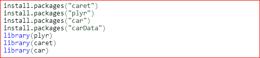

**加载数据**

将“insurance.csv”文件加载到 R Studio 中。

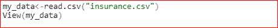

执行上述代码后，我们得到以下输出-

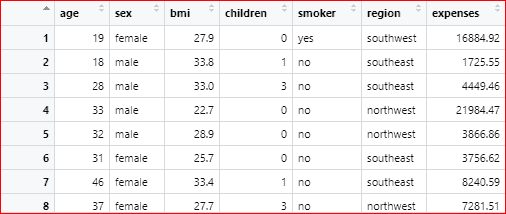

**将分类列转换成数字形式**

要应用多元线性回归，需要将分类变量转换为数字形式。这里，我们通过使用 revalue 函数将分类变量的值更改为数字形式。

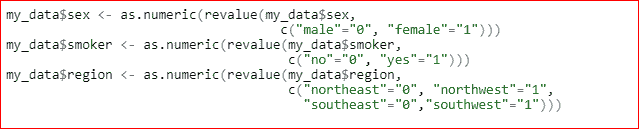

执行上述代码后，我们得到以下输出-

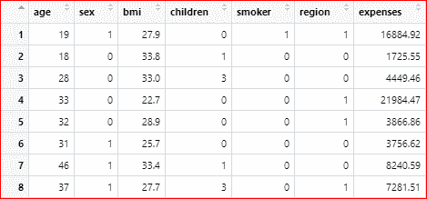

**一、探索性数据分析**

多元线性回归的第一步是探索性数据分析。在这一步中，我们检查散点图和相关矩阵，找出变量之间的关系。

**散点图**

我们希望看到变量的成对散点图，这样我们就可以确定是否有任何成对的预测因子高度相关。

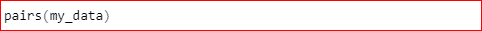

执行上述代码后，我们得到以下输出-

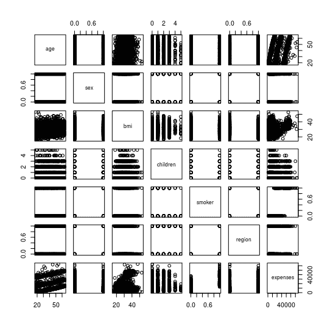

**打印相关矩阵**

绘制变量的相关矩阵以检查变量之间的相关性。

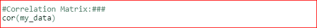

执行上述代码后，我们得到以下输出-

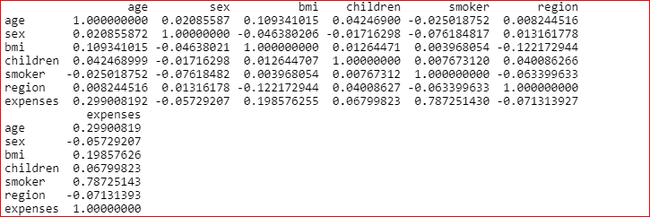

**二。模型构建**

多元线性回归的第二步是建模。

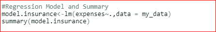

执行上述代码后，我们得到以下输出-

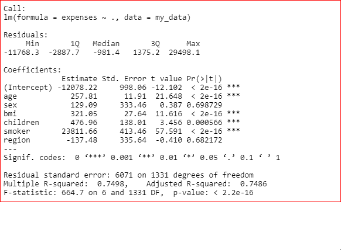

总结表明，年龄、体重指数、儿童和吸烟者是重要的变量，而性别和地区是无关紧要的变量。R 的值是 0.7498。

**三。检查多重共线性问题**

多元线性回归的第三步是检查多重共线性问题。如果存在多重共线性问题，则从数据中删除重复变量。我们将使用方差膨胀因子(VIF)来检查多重共线性问题。

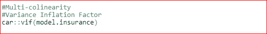

执行上述代码后，我们得到以下输出-

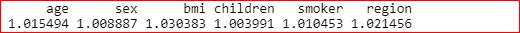

由于所有变量的 VIF 值都小于 20，因此不存在多重共线性问题。

**四。模型验证**

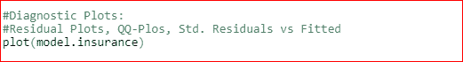

执行上述代码后，我们得到以下输出-

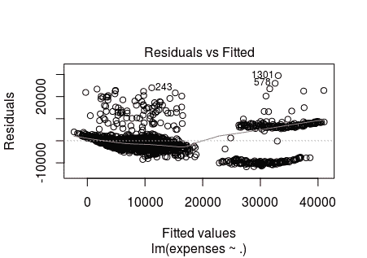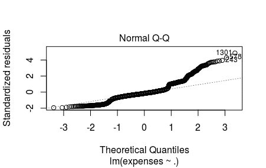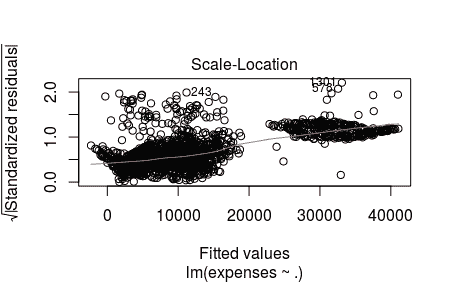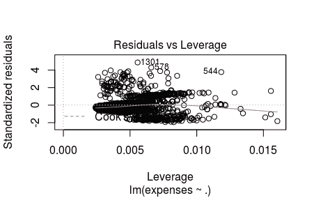

第一个图是剩余图。这表明残差与拟合图中存在一种模式，这意味着误差包含重要信息。

接下来的剧情是 QQ-plot。因为 QQ 图中的大多数点没有落在这条线上，这表明残差不遵循正态分布。

创建的第三个图是比例-位置图。该图类似于残差图，但使用标准化残差的平方根，而不是残差本身。这使得残差的趋势更加明显，从这个图中，我们可以看到残差中有一些模式。

第四个情节是杠杆情节。该图显示了标准化残差与其杠杆率的关系。也包括库克的距离界限。这些边界之外的任何点都将是 x 方向上的异常值。从图中，我们可以看到数据中存在异常值。

**残差与回归量图**

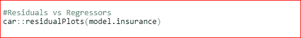

执行上述代码后，我们得到以下输出-

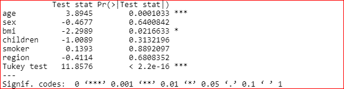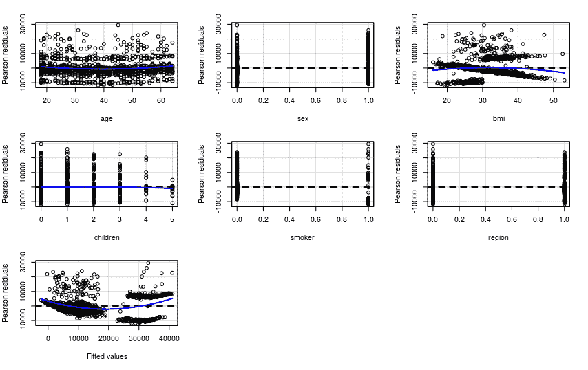

这里，独立变量相对于它们的误差被标绘。从图中，我们可以看到年龄和体重指数呈现出一种模式，或者年龄和体重指数不存在线性关系。因此，应用变换来使关系线性。各种变换可以应用于数据，如二次、多项式、对数和指数等。

**V .模型删除诊断**

可以使用 Cook 距离、Hat 值和 Bonferroni 校正从数据中识别异常值或影响因素。

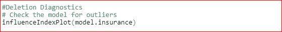

执行上述代码后，我们得到以下输出-

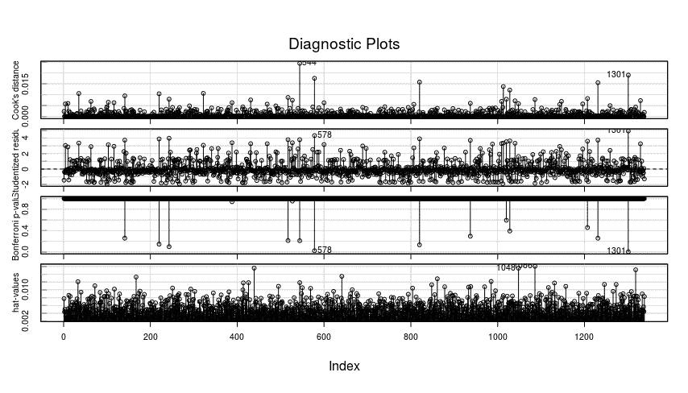

现在，我们将移除异常值，并对模型进行转换，以获得更好的 R 值。

# # # #迭代 1

**#二次模型**

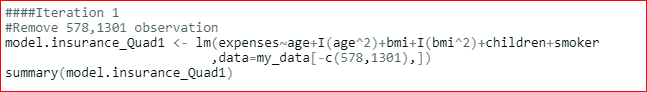

执行上述代码后，我们得到以下输出-

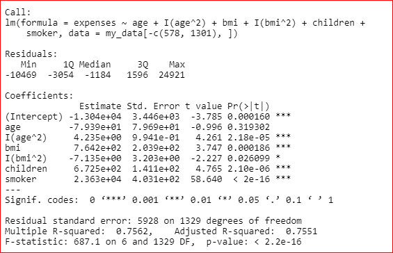

**#聚模式**

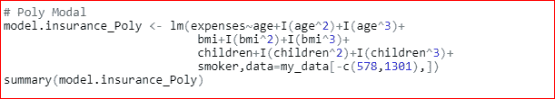

执行上述代码后，我们得到以下输出-

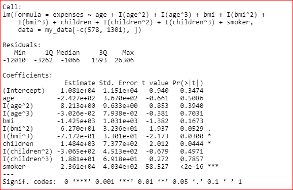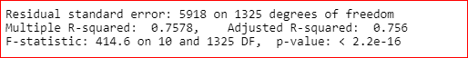

**#互反模式**

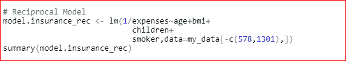

执行上述代码后，我们得到以下输出-

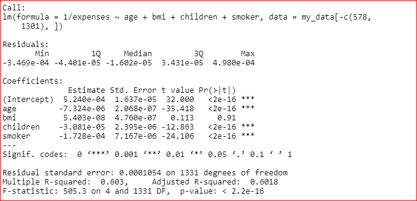

**#指数模型**

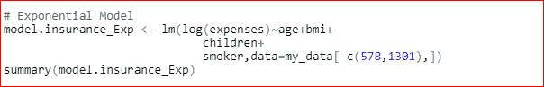

执行上述代码后，我们得到以下输出-

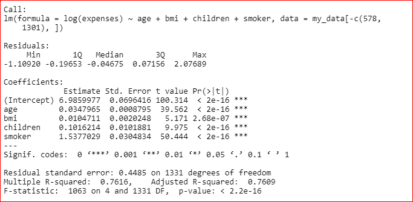

我们对模型进行了各种变换，可以看到指数模型给出了更好的 R 值，即 0.7616。

**#检查模型中有影响的观察值**

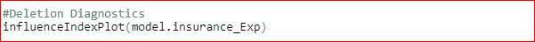

执行上述代码后，我们得到以下输出-

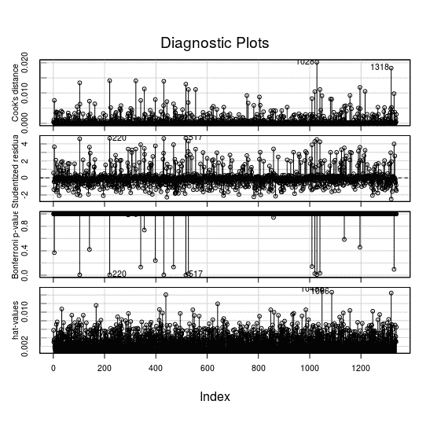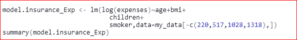

执行上述代码后，我们得到以下输出-

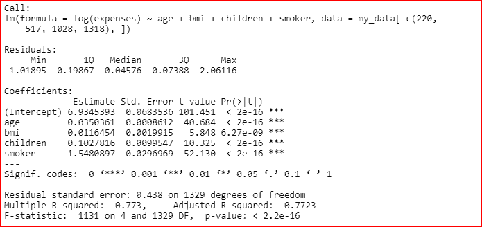

**#检查模型中有影响的观察值**

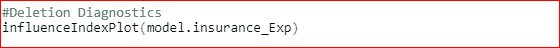

执行上述代码后，我们得到以下输出-

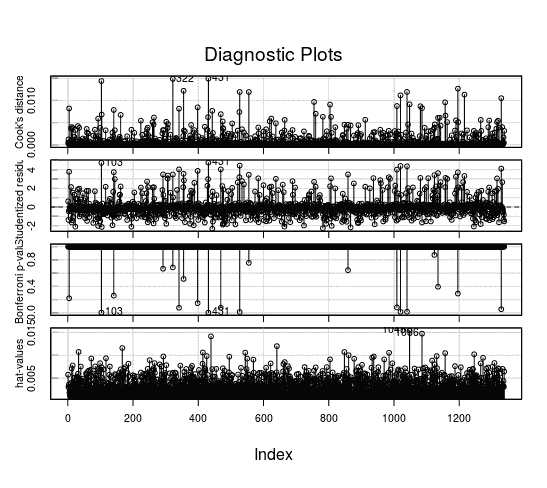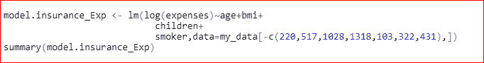

执行上述代码后，我们得到以下输出-

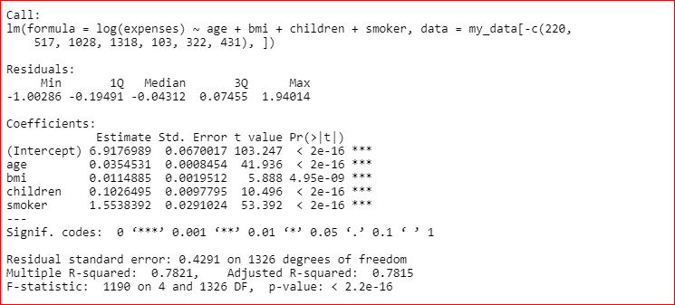

通过剔除有影响的观测值，指数模型的精度从 0.7616 提高到 0.7821。这样，通过从数据中移除异常值，可以提高模型的准确性。