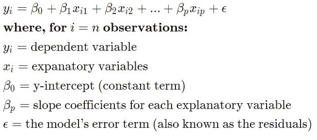
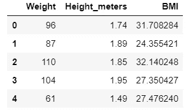
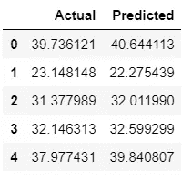
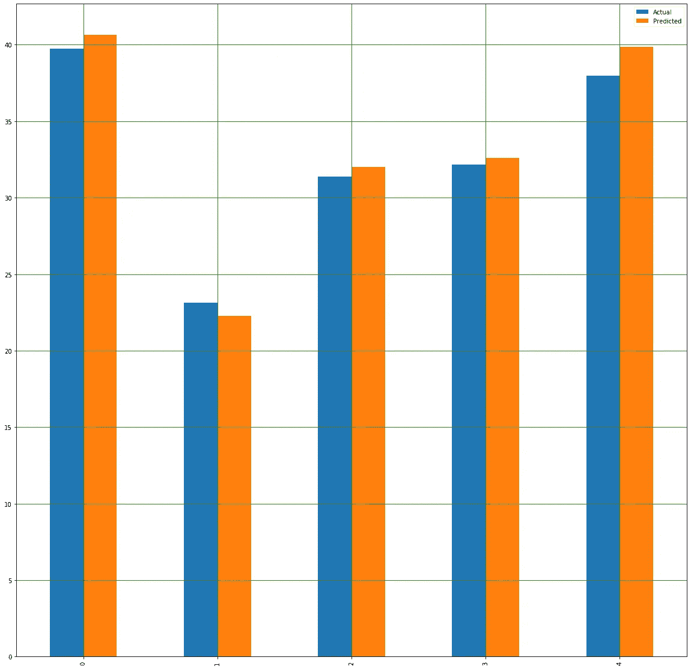

# 多元线性回归解释

> 原文：<https://medium.com/analytics-vidhya/multiple-linear-regression-explained-215f2683cd5a?source=collection_archive---------7----------------------->

## 什么是多元线性回归？

在统计学中，线性回归是一种建模标量响应与一个或多个解释变量之间关系的线性方法。只有一个解释变量的情况称为简单线性回归。对于一个以上的解释变量，这个过程被称为多元线性回归。

从本质上说，多元回归是普通最小二乘(OLS)回归的延伸，涉及一个以上的解释变量。

数学表达式是:

在使用多元线性回归之前，做出以下假设:

1.  因变量和自变量之间存在线性关系。
2.  独立个体之间相关性不高。
3.  因变量是从数据集中随机选取的
4.  [残差](https://stattrek.com/statistics/dictionary.aspx?definition=residual)呈正态分布。

# 让我们举一个可以使用多元回归的例子:

假设您有一个包含身高、体重和身体质量指数的数据集。因此，现在您希望找到数据之间的相关性，并使用身高和体重找到身体质量指数。

身体质量指数的数学公式=体重/(身高米)**2

## 参考上面的 MLR 等式，在我们的示例中:

易 **=** 因变量()

Xi1 =独立变量(以米为单位的高度)

Xi2 =独立变量(以千克为单位的重量)

B0 =时间零点的 y 轴截距

B1 = [回归系数](https://www.investopedia.com/terms/r/regression.asp)，测量 xi1 变化时因变量的单位变化。

B2 =当 Xi2 变化时，测量因变量单位变化的系数值

最小二乘估计 B0，B1，B2…Bp 通常由统计软件计算。回归模型中可以包含许多变量，其中每个独立变量都用数字-1，2，3，4…p 来区分。多元回归模型允许分析师根据多个解释变量提供的信息来预测结果。

尽管如此，该模型并不总是完全准确的，因为每个数据点都可能与模型预测的结果略有不同。剩余值 E 是实际结果和预测结果之间的差异，它被包括在模型中以考虑这种微小的变化。

# 让我们开始编码吧

我们今天使用的数据集在 kaggle 上，这是链接

 [## 500 人性别-身高-体重-体重指数

### 随机生成身高和体重，计算体重指数

www.kaggle.com](https://www.kaggle.com/yersever/500-person-gender-height-weight-bodymassindex) 

实际数据集包含 4 列，它们是性别、身高(厘米)、体重(千克)和指数。

如果您仔细观察数据，就会发现索引列不包含身体质量指数值。它将他们分为

索引:

0 —非常弱

1 —弱

2-正常

3 —超重

4 —肥胖

5 —极度肥胖

所以现在我们有两件事要做

1.  创建新列或将高度更改为米
2.  用身体质量指数值创建新列

在尝试运行上述代码之前，请确保将 csv 数据读入“data”数据帧。

现在让我们选择多元回归所需的列，并将它们存储在另一个数据框中

现在我们有一个从属列(身体质量指数)和两个独立列(体重、身高 _ 米)。

因此，在创建回归模型和数据之前，您必须确保将数据分为训练集和测试集，以便模型不会因数据过多而导致错误的预测。

接下来，创建模型，并将训练数据拟合到模型中。

训练模型后，我们可以预测 X_test 并将其与真实值进行比较。

步骤 1:将预测值存储到一个变量中

步骤 2:用 y_test 和 predcited 值创建一个数据帧

这就创建了一个这样的数据框

现在我们可以在实际值和预测值之间进行可视化

前 5 个值比较

测试数据集上的模型得分为 97 %,这意味着身体质量指数值随着自变量的变化而变化。

## 结论

在本文中，我们研究了最基本的机器学习算法，即线性回归。我们在 Scikit-Learn 机器学习库的帮助下实现了多元线性回归。

我希望你们喜欢这本书。请在评论区告诉我你的疑问/建议。