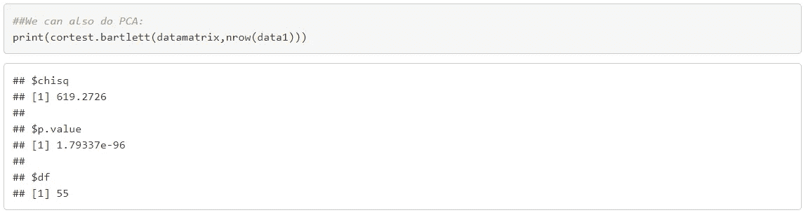

# 多元线性回归和因子分析在 R

> 原文：<https://medium.com/analytics-vidhya/multiple-linear-regression-factor-analysis-in-r-35a26a2575cc?source=collection_archive---------0----------------------->

## “用因子分析对变量进行分组，然后对其进行多元线性回归”

*什么是多重共线性，它如何影响回归模型？当回归模型的独立变量相关时会出现多重共线性，如果独立变量之间的共线性程度很高，则很难估计每个独立变量和因变量之间的关系以及估计系数的总体精度。即使具有高度多重共线性的回归模型可以给出高 R 平方，但几乎没有任何显著变量。*

*目的是使用数据集*[*Factor-Hair-revised . CSV*](https://www.kaggle.com/ipravin/hair-customer-survey-data-for-100-customers)*建立回归模型预测满意度。*

***数据探索:***

***我们导入数据，查看基本的描述性统计。***

数据头(数据)
dim(数据)
str(数据)
人名(数据)
形容(数据)


*变量 ID 是唯一的数字/ID，并且在回归方程中也不具有解释满意度的任何解释能力。所以我们可以安全地从数据集中删除 ID。*

*#删除 ID 变量* data1 < -子集(data，select = -c(1))

***项间相关性分析:*** *现在我们来绘制数据集的相关性矩阵图。*


*从上面的相关矩阵可以看出:
1。CompRes 和 DelSpeed 高度相关
2。订单和价格高度相关
3。WartyClaim 和 TechSupport 高度相关
4。CompRes 和 OrdBilling 高度相关。OrdBilling 和 DelSpeed 高度相关
6。Ecom 和 SalesFImage 高度相关*

*为了检查多重共线性的模式，需要对相关系数进行 t 检验。让我们使用 ppcor 软件包来计算独立变量的偏相关系数以及 t 统计量和相应的 p 值。*


*不出所料，销售人员形象和电子商务之间的相关性非常显著。交付速度和订单计费与投诉解决之间的相关性也是如此。还有，订单&计费和交货速度的相关性。我们可以有把握地假设自变量之间存在高度的共线性。*

***多元线性回归模型按原样使用 data1。***
*作为预测分析，多元线性回归用于解释一个连续因变量和两个或多个自变量之间的关系。
多元线性回归的公式为:*


***回归模型的假设:******线性*** *:因变量和自变量之间的关系应该是线性的。* ***同方差*** *:误差的方差应保持不变。* ***多元正态:*** *多元回归假设残差呈正态分布。* ***缺乏多重共线性:*** *假设数据中很少或没有多重共线性。*

*决定系数(R 平方)是一种统计指标，用于衡量独立变量的变化可以解释多少结果变化。随着更多的预测因子被添加到回归模型* *模型中，R2 (R 平方)总是增加，即使预测因子可能与结果变量无关。因此，R2 本身不能用来确定哪些预测因子应该包含在模型中，哪些应该排除在外。R2 只能在 0 和 1 之间，其中 0 表示结果不能被任何独立变量预测，1 表示结果可以被独立变量准确预测*

```
*#Regression Model*
model0 = lm(Satisfaction~., data1)
summary(model0)
```


*在我们的模型中，调整后的 R 平方为:0.7774，这意味着自变量解释了因变量方差的 78%，11 个自变量中只有 3 个变量是显著的。F 统计的 p 值小于 0.05(显著性水平)，这意味着我们的模型是显著的。这意味着，至少有一个预测变量与结果变量显著相关。
我们的模型方程可以写成:
满意度=-0.66+0.37 * prod qual-0.44 * Ecom+0.034 * TechSup+0.16 * CompRes-0.02 *广告+0.14 prodline+0.80 * sales fimage-0.038 * comp pricing-0.10 * WartyClaim+0.14 * OrdBilling+0.16 * DelSpeed*

***【变量通货膨胀因子(VIF)***
*回归的假设:变量相互独立——多重共线性不应该存在。
高可变通货膨胀系数(VIF)是多重共线性的标志。没有正式的 VIF 值来确定多重共线性的存在；然而，在较弱的模型中，大于 2.5 的 VIF 值可能会引起关注。*


*从 VIF 值中，我们可以推断出变量 DelSpeed 和 CompRes 值得关注。*

***补救措施:***
*处理模型中多重共线性最常用的两种方法如下。
*使用 VIF 或逐步算法去除一些高度相关的变量。
*对相关变量进行主成分分析(PCA)/因子分析等分析设计。*

***因子分析:*** *现在我们来检查数据集中变量的可因子性。首先，让我们从数据中抽取所有独立变量的子集，创建一个新的数据集，并执行凯泽-迈耶-奥尔金(KMO)测试。*


由于 MSA > 0.5，我们可以对该数据进行因子分析。

***巴特利特球度检验应显著***



*Kaiser-Meyer Olkin(KMO)和 Bartlett 对抽样充分性的检验被用来检验因素分析的适当性。55 个自由度的卡方近似为 619.27，显著性水平为 0.05。KMO 统计值 0.65 也很大(大于 0.50)。因此，因子分析被认为是进一步分析数据的适当技术。*

***使用基图的 scree 图&gg 图*** *确定数据矩阵或相关矩阵中因子或分量数量的一种方法是检查连续特征值的“Scree”图。图中的突变表明提取了适当数量的成分或因子。
scree 图绘制了每个因子的特征值。从图中我们可以看出，在系数 4 之后，碎石曲线的曲率有一个急剧的变化。这表明在因子 4 之后，总方差占较小的数量。
从碎石图中选择因子可基于:
1。Kaiser-Guttman 归一化规则说，我们应该选择特征值大于 1 的所有因子。
2。弯管法则*

*现在让我们使用 Psych 软件包的 fa.parallel 函数来执行并行分析，以找到可接受的因子数量并生成 scree 图。*

parallel


蓝线显示实际数据的特征值，两条红线(上下重叠)显示模拟数据和重采样数据。在这里，我们观察实际数据中的大幅度下降，并找出它向右变平的点。
着眼于情节 3 或 4 的因素会是一个不错的选择。


```
*#Plot a Scree plot using base plot:*
Factor = c(1,2,3,4,5,6,7,8,9,10,11)
Eigen_Values <-ev$values
Scree <- data.frame(Factor, Eigen_Values)
plot(Scree, main = "Scree Plot", col= "Blue",ylim=c(0,4))
lines(Scree,col='Red')
abline(h = 1, col="Green")*#Plotting Scree plot using ggplot*
**library**(ggplot2)
ggplot(data = Scree,mapping = aes(x=Factor,y=Eigen_Values))+
  geom_point()+
  geom_line()+
  scale_y_continuous(name="Eigen Values",limits = c(0,4))+
  theme(panel.background = element_blank())+
  theme(plot.background = element_blank())+
  theme(panel.grid.major.y = element_line(colour = "skyblue"))+
  ggtitle("Scree Plot")
```


*因此，根据 elbow 或 Kaiser-Guttman 归一化规则，我们可以继续使用 4 个因素。*

*让我们用 4 个因素来进行因素分析。此外，让我们使用正交旋转(varimax ),因为在正交旋转中，旋转因子将保持不相关，而在倾斜旋转中，结果因子将相关。
有不同方法来计算因子，其中一些是:* 1。*因子分析采用*因子分析法:

```
*#Using* factanal *command:* nfactors <- 4
fit <- factanal(data2, nfactors, scores = c("regression"),rotation = "none")
print(fit)*#Varimax Rotation* fit1 <-factanal(data2,nfactors,scores = c("regression"),rotation = "varimax")
print(fit1)
```

*2。使用 fa 方法的因子分析:*

```
*#If fm=pa, factor analysis using principal axis method:* fanone <-  fa(r=data2, nfactors = 4, rotate="none",fm="pa")
print(fanone)
```


***图形因子加载矩阵***

*因子分析结果通常根据每个因子的主要载荷进行解释。这些结构可表示为载荷表或图形，其中所有具有绝对值的载荷>一些切割点表示为一条边(路径)。*

```
fa.diagram(fanone)
```


`rotate=`“无”因子图

```
fanone$loadings
```


*前 4 个因子有一个特征值> 1，它解释了几乎 69%的方差。我们可以有效地将维数从 11 减少到 4，同时只损失大约 31%的方差。*

*因子 1 解释了方差的 29.20%；因子 2 占方差的 20.20%；因子 3 解释了方差的 13.60%；因素 4 占差异的 6%。所有 4 个因素一起解释了 69%的性能差异。*

```
*#Rotated:* fa1<- fa(r=data2, nfactors = 4, rotate="varimax",fm="pa")
print(fa1)
```


```
fa1$loadings
```


```
#Print the factors diagram
fa.diagram(fa1)
```


`Rotate=`“varimax”FA 图

*红色虚线表示竞争性定价略微低于 PA4 桶，且负载为负。*

***标注和解释的因素***


```
*#Scores for all the rows:* head(fa1$scores)
```


***以因子得分为自变量的回归分析:*** *我们把因变量和因子得分组合成一个数据集，并标注。*

```
regdata <- cbind(data1[12], fa1$scores)
*#Labeling the data*

names(regdata) <- c("Satisfaction", "Purchase", "Marketing",
                    "Post_purchase", "Prod_positioning")
head(regdata)
```


*让我们将数据集分成训练数据集和测试数据集(70:30)*

```
*#Splitting the data 70:30*
*#Random number generator, every time I run this coomand I come* 
*#up with different random numbers.*set.seed(100)
indices= sample(1:nrow(regdata), 0.7*nrow(regdata))
train=regdata[indices,]
test = regdata[-indices,]
```

***我们来训练回归模型。***

```
*#Regression Model using train data*
model1 = lm(Satisfaction~., train)
summary(model1)
```


*在模型中，购买、营销、产品定位因素非常显著，而购后因素不显著。让我们来看看 VIF 的分数。*


根据 VIF 值，我们在模型 1 中没有多重共线性。

*现在让我们检查测试数据集中模型的预测。*

```
*#Model Performance metrics:*
**library**(Metrics)
*#Model 1:*
pred_test1 <- predict(model1, newdata = test, type = "response")
pred_test1
```


```
*#Find MSE and MAPE scores:*
*#MSE/ MAPE of Model1*
test$Satisfaction_Predicted <- pred_test1
head(test[c(1,6)], 10)
```


```
test_r2 <- cor(test$Satisfaction, test$Satisfaction_Predicted) ^2

mse_test1 <- mse(test$Satisfaction, pred_test1)
rmse_test1 <- sqrt(mse(test$Satisfaction, pred_test1))
mape_test1 <- mape(test$Satisfaction, pred_test1)model1_metrics <- cbind(mse_test1,rmse_test1,mape_test1,test_r2)
print(model1_metrics, 3)##      mse_test1 rmse_test1 mape_test1 test_r2
## [1,]     0.438      0.662     0.0864    0.64
```

*由于功能“Post_purchase”并不重要，因此我们将删除该功能，然后让我们再次运行回归模型。*

```
*##Regression model without post_purchase:*
model2 <- lm(Satisfaction ~ Purchase+ Marketing+ 
                Prod_positioning, data= train)
summary(model2)
```


*使用模型 2 预测测试数据集。*

```
pred_test2 <- predict(model2, newdata = test, type = "response")
pred_test2
```


```
test$Satisfaction_Predicted2 <- pred_test2
head(test[c(1,7)], 10)
```


```
test_r22 <- cor(test$Satisfaction, test$Satisfaction_Predicted2) ^2
mse_test2 <- mse(test$Satisfaction, pred_test2)
rmse_test2 <- sqrt(mse(test$Satisfaction, pred_test2))
mape_test2 <- mape(test$Satisfaction, pred_test2)

model2_metrics <- cbind(mse_test2,rmse_test2,mape_test2,test_r22)
model2_metrics##      mse_test2 rmse_test2 mape_test2  test_r22
## [1,] 0.4224132  0.6499332 0.08447357 0.6515163Overall <- rbind(model1_metrics,model2_metrics)
row.names(Overall) <- c("Test1", "Test2")
colnames(Overall) <- c("MSE", "RMSE", "MAPE", "R-squared")
print(Overall,3)
```


*Test1 模型矩阵包含所有 4 个分解特征。
Test2 模型矩阵没有分解特征“购买后”。*

```
*##Model with Interaction:*
names(regdata)
## [1] "Satisfaction"     "Purchase"         "Marketing"       
## [4] "Post_purchase"    "Prod_positioning"model3 <- lm(lm(Satisfaction ~ Purchase+ Marketing+ Post_purchase+
                 Prod_positioning+ Purchase*Post_purchase+
                  Marketing*Prod_positioning+ Purchase* Marketing+
                  Purchase* Prod_positioning*Marketing,data=train ))
summary(model3)
```


```
*##Predict with Interactions:*
pred_int_train = predict(model3, data = train, type = "response")
pred_int_test = predict(model3, newdata = test, type = "response")

mse_train_int <- mse(train$Satisfaction, pred_int_train)
mse_test_int <- mse(test$Satisfaction, pred_int_test)

rmse_train_int <- sqrt(mse(train$Satisfaction, pred_int_train))
rmse_test_int <- sqrt(mse(test$Satisfaction, pred_int_test))

mape_train_int <- mape(train$Satisfaction, pred_int_train)
mape_test_int <- mape(test$Satisfaction, pred_int_test)

r2_train <- cor(train$Satisfaction, pred_int_train) ^2
r2_test <- cor(test$Satisfaction, pred_int_test) ^2

model3_metrics_train <- cbind(mse_train_int,rmse_train_int,mape_train_int,r2_train)
model3_metrics_test <- cbind(mse_test_int,rmse_test_int,mape_test_int,r2_test)

interact_train_test <- rbind(model3_metrics_train,model3_metrics_test)

row.names(interact_train_test) <- c("Train","Test")
colnames(interact_train_test) <- c("MSE","RMSE","MAPE","R-squared")

print(interact_train_test,digits = 3)
```


*包括相互作用模型，我们能够做出更好的预测。尽管相互作用并没有给个体变量带来显著的增加。但是有了相互作用模型，我们能够做出更接近的预测。在某些情况下，当我包含交互模式时，我能够增加模型性能度量。因此，我们可以推断，总的来说，模型是有效的，也没有过度拟合。*

***结论***

*在本文中，我们看到了如何使用因子分析来降低数据集的维度，然后我们对维度降低的列/特征使用多元线性回归进行进一步的分析/预测。本文涉及的主题有:
1。已检查多重共线性
2。运行因素分析
3。命名因素
4。用 Y(因变量)和 X(自变量)变量进行多元线性回归。*

我希望你们喜欢阅读这篇文章。如果您有任何反馈/建议，请告诉我。

*你也可以在*[***LinkedIn***](http://www.linkedin.com/in/jay-narayan-das-43795a79)*联系我。*

如果你觉得这篇文章有用，请鼓掌并与他人分享。

*下次见！*

*谢谢！！*