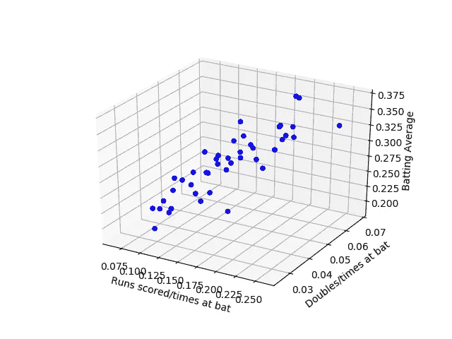

# 用 Python 实现多元线性回归

> 原文：<https://medium.com/analytics-vidhya/multiple-linear-regression-with-python-98f4a7f1c26c?source=collection_archive---------0----------------------->

**多元线性回归**可以通过将线性方程拟合到观察到的数据来模拟两个或多个特征和响应之间的关系。

## **简单与多元线性回归**

简单的线性回归有一个因变量和一个自变量，但在多元线性回归中，因变量是一个，但可能有两个或更多…