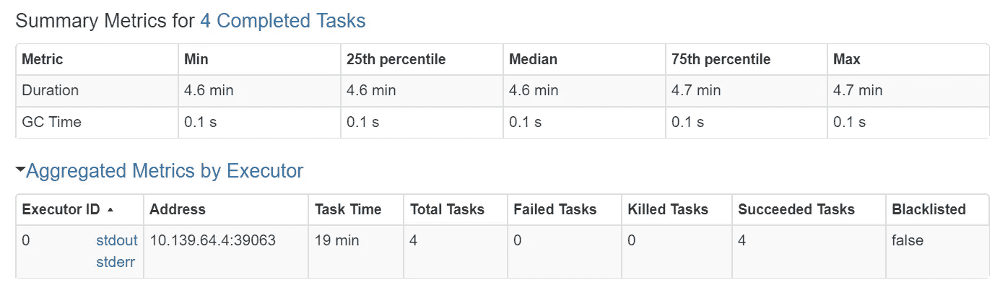
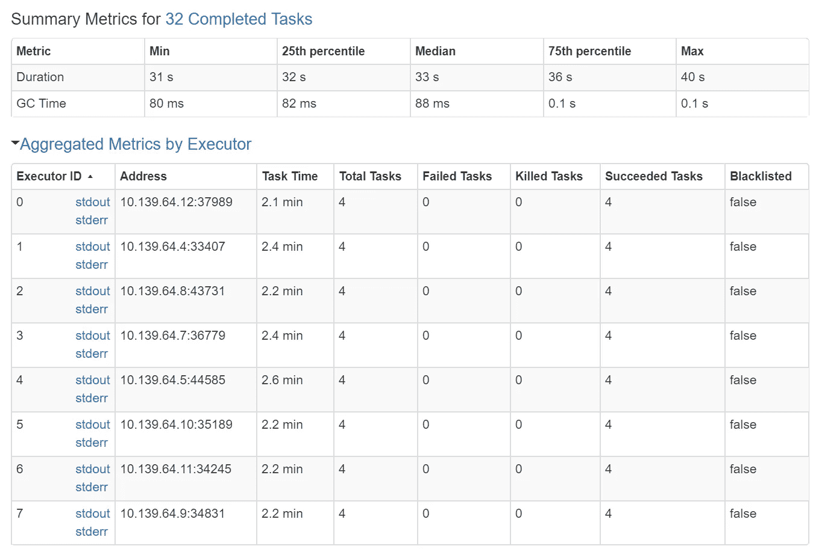

# 数据块简化了多重处理

> 原文：<https://medium.com/analytics-vidhya/multiprocessing-made-easy-ier-with-databricks-bbe9d444ecbd?source=collection_archive---------2----------------------->

我在某处读到过，当处理涉及数十亿事物的计算问题时，将工作分配给多个进程是一个好主意。

> 您也可以使用多线程，但我将坚持使用多处理，因为这更能反映数据块的工作方式。

Databricks 是一个多处理平台。有些问题乍一看似乎不适合数据块，但如果你换个角度思考，它们可能非常适合。

考虑使用蒙特卡罗模拟来估计πT2 的问题。你可以这样想估算方法:

1.  向镖靶投掷飞镖。
2.  如果飞镖落在圆圈内，你得 1 分。
3.  重复步骤 1 和 2，直到你厌倦了。
4.  把你的点数加起来，乘以 4，再除以投掷次数。这将给你一个对*圆周率的估计。*

你投的飞镖越多，估计就越准确。

# 串行实现

下面的代码显示了一个串行实现:

这是我工作站上的执行时间。

执行时间非常线性，这并不奇怪，因为串行算法是 *O(n)。*运行在一个核上，算法在 10 亿投的时候哭大叔。

# 使用多重处理的并行实现

Python 有一个很酷的[多重处理模块](https://docs.python.org/3/library/multiprocessing.html)，它是为分而治之类型的问题而构建的。那么，如何改变串行代码，使它能够在使用多个进程运行时工作呢？

以下是我决定要做的:

1.  用迭代次数除以我想要生成的进程数。这是每个进程投掷的飞镖数量。
2.  产生适当数量的进程。
3.  告诉每个过程投掷飞镖，并记录其分数。
4.  当所有进程都完成后，将命中数加起来，乘以 4，再除以总投掷数，得到 *pi 的估计值。*

以下是 1 ***亿*** 掷的执行次数:

多重处理使得对 10 亿次投掷的估计更加容易处理。注意，收益是线性的，在我的例子中，除了 4 个过程之外没有太多的收益。我的机器有 4 个物理内核(8 个带超线程),这就是为什么 4 是收益递减点。

代码如下:

以下是该准则的要点:

1.  估算算法已经以这样一种方式被重新表述，即多个过程可以执行估算而不会相互干扰。换句话说，没有共享状态。
2.  [池](https://docs.python.org/3/library/multiprocessing.html#multiprocessing.pool.Pool)对象负责收集结果，以便我们能够以安全的方式执行求和。

# 使用数据块的并行实现

多重处理有所帮助，但也有严重的局限性。这段代码只能在一台物理机上运行！如果我们想利用 Azure 的计算能力会怎么样？为什么不考虑 Databricks？

对于一个执行器，估计 10 亿次投掷在 282 秒内完成。注意，Databricks 为此创建了 4 个任务，大概是因为每个执行器有 4 个物理核心。

有了 8 个执行者，Databricks 仅用 33 秒就完成了估算！大约快了 8 倍！您可以用不同数量的执行器自己尝试这个实验，并验证您可以获得速度的线性增长。

以下是 Databricks 笔记本代码:

以下是该准则的要点:

1.  就像多重处理的例子一样，估算算法已经以这样一种方式被重新表述，即多个执行器可以在不互相干扰的情况下执行估算。换句话说，没有共享状态。
2.  Databricks 负责将代码发送给执行器，并确保代码运行。
3.  没有新的 API 需要学习。代码是普通的数据块。
4.  为了适应 Databricks 编程范式，构建了包含每次迭代结果的 RDD。

# 结论

如果您习惯使用数据块，也可以考虑将它用于 CPU 受限的并行计算。你可能会惊喜！

感谢阅读！