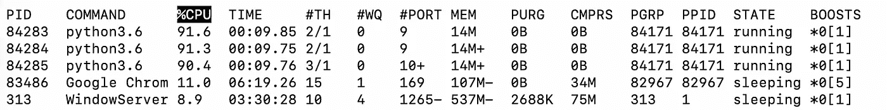
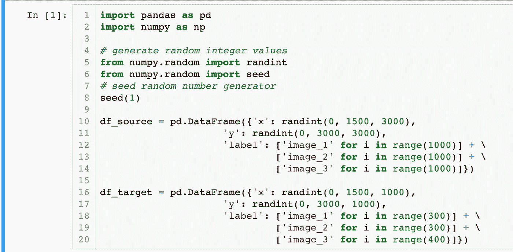
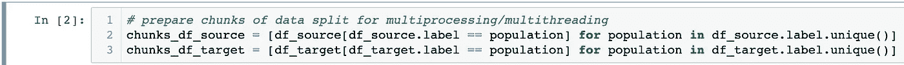
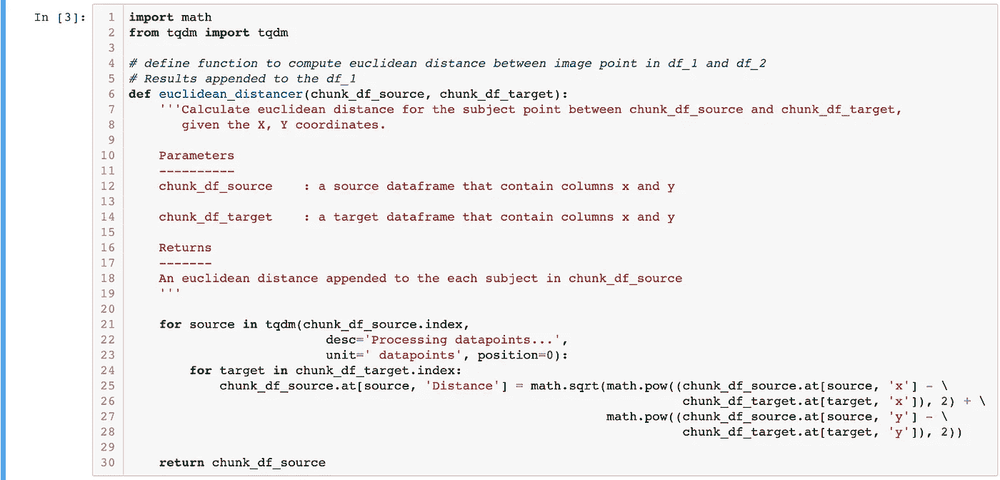
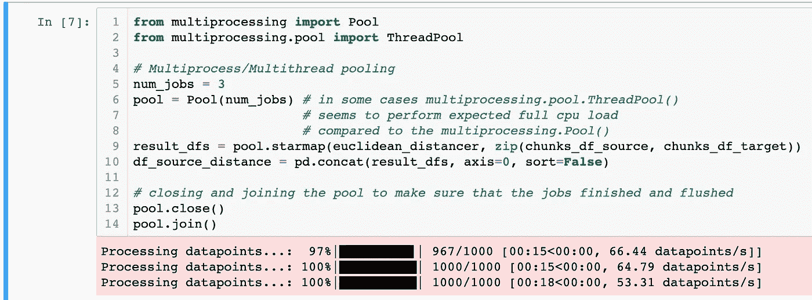
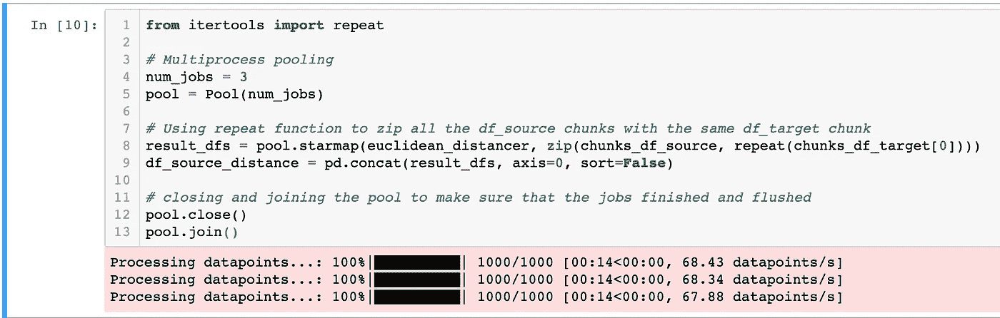
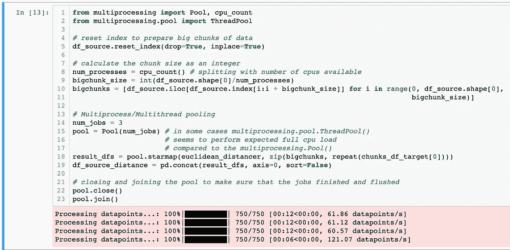

# Python 中涉及 2 个数据帧的多重处理/多线程

> 原文：<https://medium.com/analytics-vidhya/multiprocessing-multithreading-involving-2-dataframes-in-python-1f65e3e748b3?source=collection_archive---------7----------------------->

> 通常，不同的假设检验需要重复的数据争论和涉及 2 个或更多独立数据框架的工程。通常建议从一开始就对数据争论/工程进行并行处理。这将为我们节省大量重复等待时间，并使我们能够快速进行下游描述性/相关性/预测性分析。

这里，假设我们正在使用 pandas DataFrame 处理结构化数据。我们将使用 Python 中的*包来执行并行处理作业。*

1.  *首先，我们生成两个虚拟数据帧，即 df_source 和 df_targets。两者都包含 x 和 y 坐标——这将允许在两个数据帧/数据集之间进行欧几里得距离计算。*

**

*2.接下来，我们为多处理/多线程准备数据块分割。*

**

*3.接下来，我们定义一个函数来计算两个数据帧中各点之间的欧几里德距离。*

**

*4.接下来，我们将拆分的作业星形映射到 3 个 cpu 进程的池中，以便可以同时计算 3 组匹配数据帧的欧几里德距离。这里我们使用***zip()****函数按照列表顺序列出数据帧。我还注意到，有些时候我们不得不使用 ***多重处理。ThreadPool()*** *，也就是多线程，*而不是 ***多重处理。Pool()*** *，即多处理，*具有预期的全部 cpu 负载和真正快速的处理。**

****

**5.最后，我使用终端上的 *top* 函数检查了 CPU 的使用情况。事实上，它们与几乎 3 个满载的 CPU 并行运行。**

****

**可选 1:另外，如果您想计算所有 df_source 组块中的主题与 df_target 组块中的主题之间的距离，您可以使用***intertools . repeat()***以及 ***zip()*** 函数。在这里，当使用 df_source 的不同块压缩时，我们将 df_target 的第一块重复了 3 次。**

****

**可选 2:最后，还有一些额外的代码，我觉得在日常工作中很有用。例如，如果我们想要根据我们想要的作业数量来分割 df_source，而不考虑标签分组，我们可以使用下面的代码。首先，我们必须重置 df_source 的索引。**

****

**如果你觉得上面的教程很有用，你可以考虑在你的浏览器上为这个页面添加书签，以供将来参考。万一需要帮助，可以在下面留言评论；)**