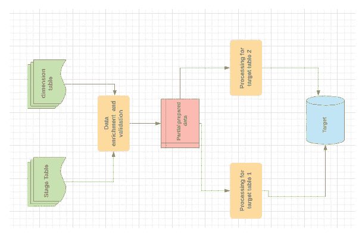
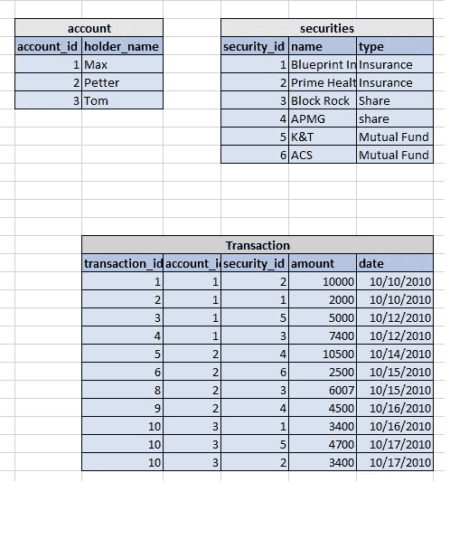
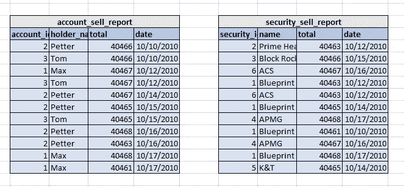
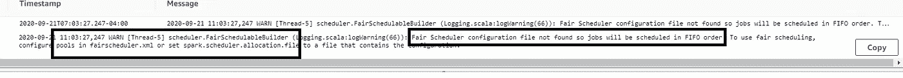
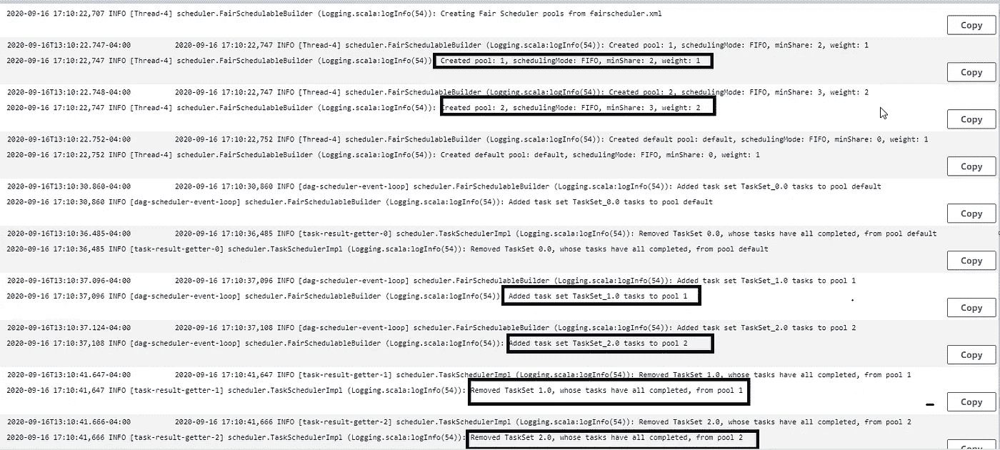

# AWS Glue 中的多线程/并行作业

> 原文：<https://medium.com/analytics-vidhya/multithreading-parallel-job-in-aws-glue-a291219123fb?source=collection_archive---------2----------------------->

在基于 AWS 的数据湖中，AWS Glue 和 EMR 是广泛用于 ETL 处理的服务。AWS Glue 是一个专门针对 ETL 的服务。它有各种组件来帮助我们构建一个健壮的 ETL 系统。

> 在本文中，我将解释 AWS Glue Job 中的多线程方法，以便更快地处理数据。

本文假设您了解以下技术的基础知识:

1 — AWG 胶水

2 —火花

3 — Python

ETL 处理总是会有数据争论作业，这些作业将读取暂存的数据、执行验证、查找并将其写入目标。

有时，作业会读取 stage，执行一些数据浓缩，进行验证，然后将这些半生不熟的数据用于两个不同的目标处理。如下图所示:

这往往会变成一个性能瓶颈。这可以通过以下方法之一来处理:

1-创建两个作业-每个目标一个，并在两个作业中执行部分重复性任务。这可以并行运行，但是这可能是低效的。

2 —将作业拆分为 3，首先将执行所有常见任务并转移数据。然后，其他两个作业将执行目标特定的任务。这将增加 I/O，并在一定程度上将我们带入 MR 时代。

3 —使用多线程向 Spark 并行提交两个作业。

这篇文章将讨论我用过的第三种方法，它非常有效。

> Spark 上下文是线程安全的，setLocalProperty 可用于设置线程本地配置。

出于演示目的，我将使用以下舞台和昏暗的桌子:

阶段和模糊样本数据

目标表

要在公平模式下配置 Spark，我们需要将 spark.scheduler.mode 更新到 FIFO，并在**引用的文件路径**中为池的配置文件位置提供 fairscheduler.xml。

> fairscheduler.xml 是必须的，否则 Glue container 将跳过调度器设置

我试过没有它，并得到以下登录工作。

下面是配置的示例代码:

我使用了下面的 fairscheduler.xml，它创建了两个不同权重的池(队列)。

Glue 将创建 3 个池，2 个配置池和 1 个默认池。这可以在下面的日志中看到。它会将这两个作业分配到不同的池中，从而能够并行处理这两个作业。

> “做学生很容易。学习需要实际工作。”
> —威廉·克劳福德

请分享你对此的想法，快乐学习。