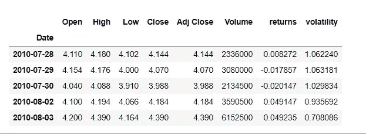
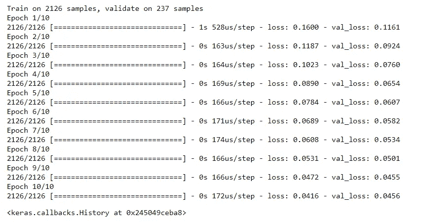
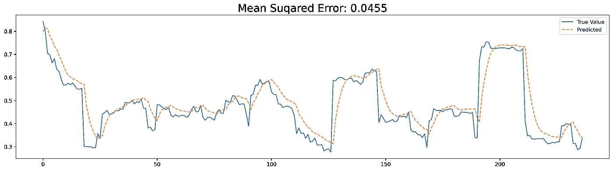

# 基于深度学习的股票数据波动性多元预测

> 原文：<https://medium.com/analytics-vidhya/multivariate-forecasting-for-the-volatility-of-the-stock-data-using-deep-learning-cd560ca63178?source=collection_archive---------8----------------------->

如果有人问及某家公司的增长情况，你能不考虑国家 GDP、电晕、飓风等外部因素就回答吗？,?。那么我们如何能够通过观察以前的数据来预测股票价格的波动性呢？这是我们昨天[开发的](/analytics-vidhya/univariate-forecasting-for-the-volatility-of-the-stock-data-using-deep-learning-6c8a4df7edf9)模型的多元附加概念。


让我们开始一个简单的实际理解，为什么我们需要去多元。假设你在机场开了一家书店，在奥运期间你需要购买几本杂志，你会选择买什么类型的杂志？。你会买 80%和美食有关，只有 20%和运动有关的杂志吗？没有权利…！！！在你的脑海中，你会有一个假设，即大多数人将会为奥运会而旅行，所以我需要在体育杂志上投入更多。所以，在这里，你看着外部因素，如世界各地正在发生的事情，以决定你的购买模式。同样，购买模式会受到许多其他因素的影响，这就是所谓的多元因素。利用多重特征预测未来。

# **数据准备**

我们将使用特斯拉公司股票预测的相同数据，并以这样的方式准备数据，即过去 n 天的多个特征用于预测波动性。

```
import pandas as pd
import numpy as np
import matplotlib.pyplot as plt
import seaborn as sns
from sklearn.preprocessing import Normalizerwindow_size=20
#first download data from yahoo
import yfinance as yf
from yahoofinancials import YahooFinancials
df = yf.download(‘TSLA’, start=’2000–01–01', end=’2019–12–31', progress=False)
#compute daily returns and 20 day moving historical volatility
df[‘returns’]=df[‘Close’].pct_change()
df[‘volatility’]=df[‘returns’].rolling(window_size).std()*(252**0.5)
df =df.dropna()
print(df.shape)
df.head()
```



```
def convert2matrix(X_arr,Y_arr, look_back):
 X, Y =[], []
 #iterating thorough the data with window as look back
 for i in range(len(X_arr)-look_back):
  d=i+look_back 
  # extracting the X as features and target of n days and Y as   target at (n+1)th day
  X.append(np.hstack((X_arr[i:d],Y_arr[i:d])))
  Y.append(Y_arr[d])
 return np.array(X), np.array(Y)X = df.drop(['volatility'],axis=1).values
transformer = Normalizer().fit(X)
X = transformer.transform(X)
y=np.expand_dims(df['volatility'].values,1)
X.shape,y.shape
```

> X 和 y 的形状:(2373，7)，(2373，1)

```
x,y = convert2matrix(X,y,10)
print(x.shape,y.shape)
```

> X 和 y 的形状:(2363，10，8)，(2363，1)

# **模型建筑**

```
from sklearn.model_selection import train_test_split
X,x_valid,y,y_valid = train_test_split(x,y,test_size=0.1,shuffle=False)
print(X.shape,y.shape,x_valid.shape,y_valid.shape)from keras.models import Sequential
from keras.layers import Dense, LSTM
from keras.optimizers import Adam
model = Sequential()
model.add(LSTM(10, input_shape=(X.shape[1], X.shape[2])))
model.add(Dense(1))
model.compile(loss='mae', optimizer=Adam(0.001))
model.fit(X, y, epochs=10, batch_size=32, validation_data=(x_valid, y_valid), verbose=1, shuffle=False)
```



```
from sklearn.metrics import mean_absolute_error
pred = model.predict(x_valid)
plt.figure(figsize=(20,5),dpi=300)
plt.plot(y_valid,label='True Value')
plt.plot(pred,linestyle='--', label = 'Predicted')
plt.legend()
plt.title('Mean Suqared Error: '+str(mean_absolute_error(pred,y_valid))[:6],fontsize=20)
plt.show()
```



为了比较结果，我使用了相同的单变量和多变量模型和测试数据。如你所见，误差从 0.06 降至 0.04。这给出了一个清晰的想法，即多元数据对于这个雅虎财务数据工作得很好。

这篇文章将提供一个关于如何准备多元数据和使用 LSTM 预测波动性的良好实践经验。坚持练习和阅读。

喜欢这篇文章别忘了鼓掌。！！！