# 使用 OLS(普通最小二乘估计器)从头开始多元线性回归

> 原文：<https://medium.com/analytics-vidhya/multivariate-linear-regression-from-scratch-using-ols-ordinary-least-square-estimator-859646708cd6?source=collection_archive---------1----------------------->

几乎所有的机器学习算法都集中在学习函数上，学习函数可以描述输入(特征/自变量)和输出(目标变量/因变量)之间的关系。该函数的形式取决于所使用的算法。线性回归是最简单的机器学习算法之一，它使用线性函数来描述输入和目标变量之间的关系。多元(具有一个以上的变量/输入)线性回归的简单方程可以写成

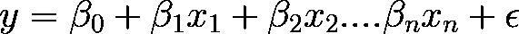

等式 1

其中β1，β2…βn 是与特征 *x1，x2，…相关联的权重。xn* 。β0 是偏差项(所有特征都等于零时的 y 值)。ε是误差。我们的任务是减少这种错误。我们将使用最小二乘法来减少这个误差。上述方程可以用矩阵方程的形式写成如下

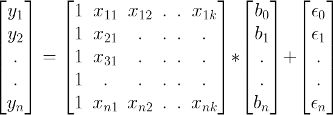

等式:2 线性回归的矢量化方程

请注意输入矩阵中额外的 1 列。增加该列是为了补偿偏差项。另外， *b(权重)*栏中增加了偏置项β0。 *x* 矩阵的每一行代表一个观察或记录，每一列代表一个特征。 *x* 12 表示第二个特征的第一个观察值。给定的ε方程可以写成

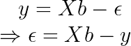

等式:3.4

我们的目标是最小化ε的平方值。普通最小二乘估计器(OLS)的思想包括选择 b，使得误差平方和尽可能小。所以我们必须尽量减少

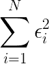

它是误差平方和，也可以写成

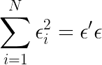

等式 5

如同

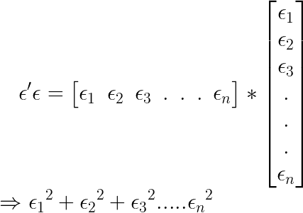

方程式:6.7

现在

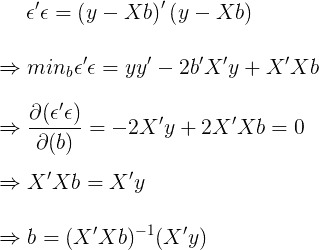

等式:8，9，10，11，12

请注意，我们已经计算了平方误差相对于权重 b 的偏导数，并使其等于零，这意味着我们正在计算误差函数的局部最小值。因为偏导数在函数的最小值和最大值处都为零，我们怎么能确定它是已经计算的函数的最小值呢？嗯，最小二乘法形成一个凸函数，对于偏导数，只返回局部最小值。更详细的推导，可以访问[这个](https://economictheoryblog.com/2015/02/19/ols_estimator/)。

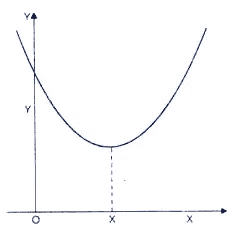

凸函数

现在我们将转向使用 OLS 实现多变量线性回归。我们将使用 Numpy 进行代数运算

```
import numpy as np
import matplotlib.pyplot as plt
import pandas as pddef msee(actual, predicted):
    sum_error = 0.0
    for i in range(len(actual)):
        prediction_error = predicted[i] - actual[i]
        sum_error += (prediction_error ** 2)
        mean_error = sum_error / float(len(actual))
    return mean_error
```

Mse 是评估指标，我们将使用这个函数来评估我们的模型。

```
def Train(X,Y):
    ''' With this function we are calculate the weights   '''
    X.astype(float)
    first=np.dot(X.T,X)
    first.astype(np.float16)
    inverse=np.linalg.inv(first)
    second=np.dot(X.T,Y)

    b=np.dot(inverse,second)
    return b
```

该函数是等式 12 的实现。注意 np.linalg.inv 计算矩阵的逆矩阵。

```
def add_bias(x):
    if (len(x.shape)==1):
        x=x[:,np.newaxis]
    b=np.ones((x.shape[0],1))
    x=np.concatenate((b,x), axis=1)
    return x
```

这个函数将 1 添加到我们的特征中，就像等式 2 中的一样

```
def predict(X,b):
    return (np.dot(X,b))
```

预测函数将根据训练函数返回的矩阵 b(权重)的值预测目标值。数据可以从[这里](https://drive.google.com/file/d/1JWhNDqCLl4tAYWiINFYSQx6580zIw0pM/view?usp=sharing)下载

```
df=pd.read_csv('MpgData_with_Cateogeries.csv')
col=df.columns
we=df.to_numpy()
we=we[:,0:8]
we=we.astype(np.float64)
df.head()
```

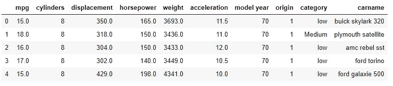

这些数据是关于汽车的不同属性，如 mpg(每加仑英里数)、马力、重量、加速度、制造年份。我们已经删除了 carname 和 category 等分类列(非数字值)。我们将选择 mpg 作为我们的目标变量。

```
xtrain=we[:292,1:8]
ytrain=we[:292,0]
xtest=we[292:,1:8]
ytest=we[292:,0]
```

在总共 392 个观察值中，我们将使用 292 个作为训练数据，其余 100 个作为测试数据。xtrain 是我们的训练输入，ytrain 是我们的训练输出。因此，xtest 是我们的测试输入，ytest 是目标变量的测试部分。此外，第零列是我们的目标变量 mpg。

```
for i in range(2,8):
    x_train=add_bias(xtrain[:,0:i])
    b=Train(x_train,ytrain)
    train_predict=predict(x_train,b)
    train_error=msee(ytrain,train_predict)
    print('Training  Error for Multivariable regression using  {} variables is   {}  '.format(i,train_error))
```

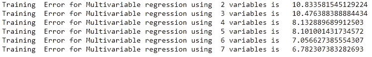

首先，在循环内部的第一行，我们添加了一个偏差项。然后我们用训练函数计算 b。之后，我们使用训练数据预测我们的目标变量。然后我们计算训练误差。注意，对于循环的每一次迭代，我们都在增加我们的训练变量。对于第一次迭代，我们只考虑两个变量。对于第二次迭代，我们考虑 3 个变量等等。随着我们不断增加变量的数量，我们的 MSE(均方误差)继续下降，这很明显。现在我们将根据测试数据评估我们的模型

```
for i in range(2,8):
    x_train=add_bias(xtrain[:,0:i])
    x_test=add_bias(xtest[:,0:i])
    b=Train(x_train,ytrain)
    test_predict=predict(x_test,b)
    test_error=msee(ytest,test_predict)
    print('Testing Error for Multivariable regression using  {} variables is   {}  '.format(i,test_error))
```

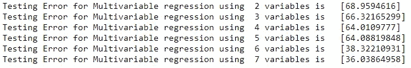

```
x_train=add_bias(xtrain)
x_test=add_bias(xtest)
b=Train(x_train,ytrain)
test_predict=predict(x_test,b)
plt.figure(figsize=(10,5))
plt.title('Multivariate linear regression for Test data',fontsize=16)
plt.grid(True)
plt.plot(ytest , color='purple')
plt.plot(test_predict , color='red'  )
plt.show()
```

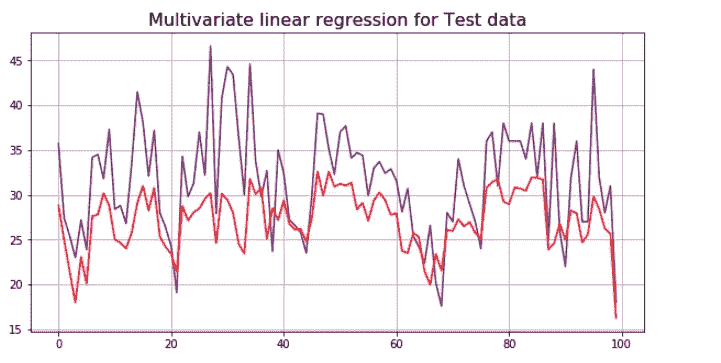

预测测试数据和原始测试数据图

最后，我们绘制了测试目标和模型预测的目标值，即预测数据。你可以找到完整的项目与 CSV 文件[在这里](https://github.com/ImtiazUlHassan/Multivariate-linear-regression-Using-OLS-from-Scratch)