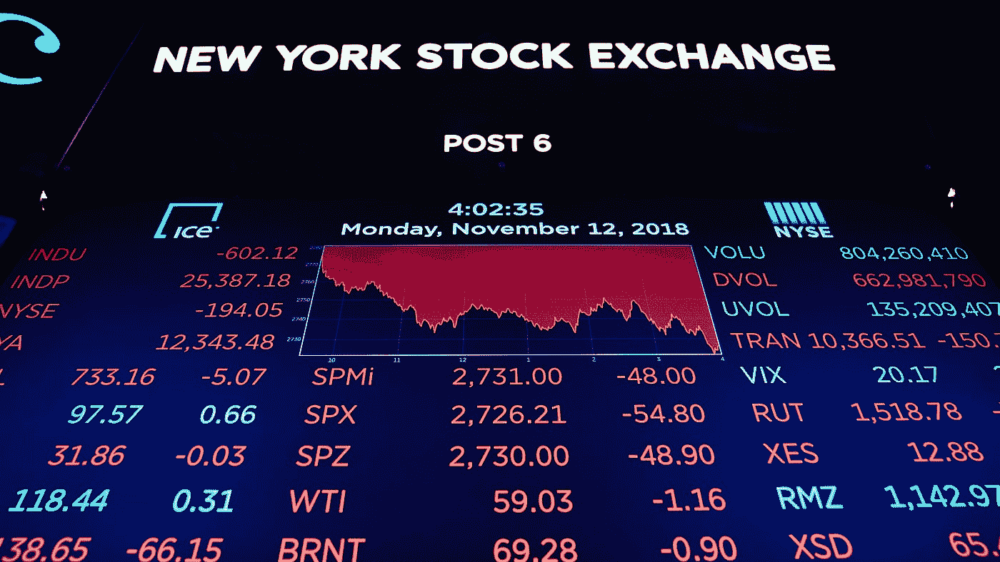
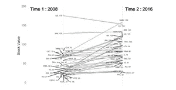
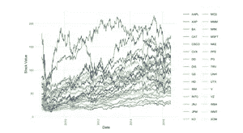
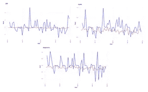

# 多元股市分析——金融+情绪变量。

> 原文：<https://medium.com/analytics-vidhya/multivariate-stock-market-analysis-financial-sentiment-variables-8f34af58e528?source=collection_archive---------29----------------------->

长期以来，股票市场预测一直是一个活跃的研究领域。然而，建立一个考虑到所有因素的模型仍然是一个具有挑战性的问题。除了历史价格之外，当前的股票市场还受到关于公司的新闻文章、一般新闻以及许多其他微观和宏观经济因素的影响。有几种模型可以根据一般的新闻元素或历史价格来预测股票，但没有几个模型考虑了所有特定公司的新闻或所有这些因素。

在这个项目中，我们的目标是了解获取特定公司的新闻如何有助于预测股票价格。

# 步骤 1:数据收集

我们的数据收集分为三大块。第一个是获取各个公司的股票信息。第二个是为我们正在分析的公司收集特定公司的新闻数据，第三个是获取公共新闻数据，包括政治、环境、经济等。

**1)股票数据**

股票市场数据是通过调用 Yahoo finance API 并收集目前作为 DJIA 指数一部分的 30 家公司的股票数据来收集的。我们收集了 2006 年到 2016 年的数据。收集的数据包括当天的开盘价、收盘价、最高价和最低价。

**2)公司新闻数据**

公司层面的新闻数据取自纽约时报网站，使用一个脚本为 2006-2016 年间的公司层面数据生成多个 API 调用。

属于数据集一部分的属性是-

1)创建时间

2)片段

3)标题

4)公司名称

5)新闻——服务台(这是什么样的新闻——商业、娱乐、科技..等等。)

**3)一般新闻数据**

一般新闻数据来自 Kaggle 上现成的数据集。这些数据包含了从 Reddit 上收集的多年来每天 25 大新闻标题的新闻数据。

# 第二步:数据预处理

一旦我们收集了数据，我们必须对 3 个数据集进行预处理，并将它们放在一起，以便我们可以使用它们来分析新闻数据对股票价格的影响。

从新闻数据中，我们希望了解当天新闻的情绪。为了做到这一点，我们将同一天的新闻合并成一个部分，并获取该部分的总体情绪，并将该情绪分配给当天。我们对公司智能数据和普通新闻数据都这样做。

这样，我们从 2006 年到 2016 年每天的数据集都有股票数据和两个情绪得分。每一天的目标价值都变成了第二天的股票价值。

# 第三步:数据分析

**数字:**公司股票价值历年变化。

**图:**红线显示情绪得分，蓝线显示当天的股票价值。我们在一些地方看到，给定数据的情绪得分的变化如何影响股票价格。

# 步骤 4:数据建模

现在来分析我们的情感价值是否会对我们的股票价值产生巨大的影响。我们最初考虑了不同的预测算法，然后最终决定采用递归神经网络和 LSTM(长短期记忆)算法，这是递归神经网络的一个特殊子集。原因是，我们考虑的其他算法不能很好地解释我们数据的时间序列性质。(作为我们课程和指南的一部分，我们被要求不要对数据进行时间序列操作)。

LSTM 算法要求我们将数据处理成一个三维数组进行建模。在执行了这个数据操作之后，我们继续用不同的输入变量组合生成预测。有些包括情感分数，有些不包括。在此之后，我们对两个结果进行了比较。

# 第五步:结果分析

**递归神经网络——只有股票价值和成交量。**

平均绝对误差为 1.28。

**递归神经网络——股票价值、成交量和普通新闻的情绪。**

平均绝对误差为 1.56。

**递归神经网络—仅情感列**

平均绝对误差为 5.78

**递归神经网络—所有列**

平均绝对误差为 1.0002。

**递归神经网络— LSTM(所有列)**

平均绝对误差为 0.45

我们注意到，尽管不显著，但是当加入混合时，情感列肯定有助于增加模型的准确性。然而，鉴于我们还没有执行时间序列数据集所需的所有预处理，因此需要进行大量改进，以从我们的数据集生成更准确的结果和理解。

要获得代码和官方项目报告，请访问我们的 GitHub 项目链接:

[https://github . com/akmenon 1996/Multivariate-Stock-Market-Analysis](https://github.com/akmenon1996/Multivariate-Stock-Market-Analysis)

*原载于 2020 年 6 月 28 日 https://www.abhijitkmenon.com***。**