# 多元时间序列餐饮需求预测

> 原文：<https://medium.com/analytics-vidhya/multivariate-time-series-restaurant-demand-forecasting-1f1633875bc7?source=collection_archive---------10----------------------->


## 什么是需求预测

D emand forecasting 是两个词的组合；第一个是需求，另一个是预测。需求是指产品或服务的外部要求。一般来说，预测意味着为未来发生的事件估计现在。它是一种估计未来对产品或服务的可能需求的技术。它是基于对该产品或服务在当前市场条件下的过去需求的分析。

## 为什么需求预测很重要？

T 需求预测对企业来说是一个必不可少的过程，原因有很多:

需求预测有助于业务规划、预算和目标设定。一旦你对未来的销售有了很好的了解，你就可以开始制定一个明智的采购策略，以确保你的供应与客户需求相匹配。

它允许企业更有效地优化库存，提高库存周转率，并降低持有成本。

它提供了对未来现金流的洞察，这意味着企业可以更准确地预算支付供应商和其他运营成本，并投资于公司的发展。

预测需求意味着知道何时增加员工和其他资源，以保持运营在高峰期平稳运行。

T 这篇文章的目的是做一个数据准备和实施多变量时间序列预测技术的演练。该实现显示了预测多元需求几种方式。

所以让我们开始吧。

## 业务问题和限制-

我们的数据集是周二和周三午餐和晚餐时间的餐馆销售额。

在这个数据集中，很少有像 Uber Eats 这样的“外卖”订单。

典型的午餐时间是上午 11:30-下午 2:00，晚餐时间是下午 6:30-10:00。

数据集只是周二和周三的。我们需要扩展和随机化 min 的数据。6 个月(2019 年 1 月至 2019 年 6 月)中的每一天。

一家典型的餐馆在周三、周末晚餐、随后的周末午餐有较高的覆盖率(顾客数量)，然后在周一至周五午餐有相对较低的覆盖率。

数据扩展/随机化应遵循上述客户数量模式。

## 我们的高尔夫-

预测**午餐**和**晚餐的顶部“菜单项”和“项目数量”。**
这些预测需要针对未来日期(周一至周日，7 月 1 日至 7 月 7 日)

## 实施-

导入必要的库，如用于数据操作的 pandas、用于执行数学函数的 NumPy 以及 matplotlib、seaborn 是数据可视化库。

```
import pandas as pd
import numpy as np
import matplotlib.pyplot as plt
import seaborn as sns
pd.set_option(‘display.max_row’,None)
sns.set_style(‘darkgrid’)
```

在熊猫的帮助下加载数据

```
df = pd.read_excel('R. Data.xlsx')
df.head()
```

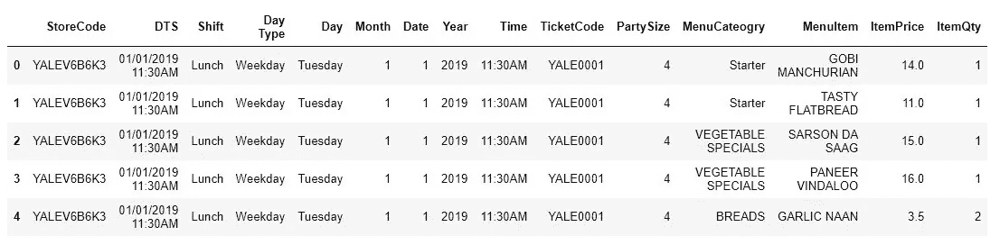

# 1.数据准备和预处理。

如下所示，在删除不必要的列并输入数据集的空值后，我们就可以按照上面提供的模式准备数据了。

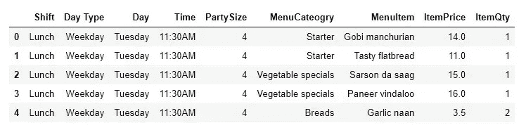

在我们的数据集中，周三是周末，这是唯一可用的周末数据，所以我们使用它作为进一步的数据准备。

现在我们将数据分为两组。第一个是工作日，另一个是周末。

```
weekday = df[df['Day Type']=='Weekday']
weekend = df[df['Day Type']=='Weekend']
```

根据我们所拥有的限制和信息，我们正在为一周中的每一天创建数据。

```
# Monday - WeekDay
monday = weekday.copy()
monday['Day'] = weekday['Day'].str.replace('Tuesday','Monday')# Tuseday - WeekDay
tuesday = weekday.copy()# Wednesday - WeekEnd
wednesday = weekend.copy()# Thusday - WeekDay
thursday = weekday.copy()                                         
thursday['Day'] = thursday['Day'].str.replace('Tuesday','Thursday')# Friday - WeekDay
friday = weekday.copy()                                          
friday['Day'] = friday['Day'].str.replace('Tuesday','Friday')# Saturday - WeekEnd
saturday = weekend.copy()                                        
saturday['Day'] = saturday['Day'].str.replace('Wednesday','Saturday')# Sunday - WeekEnd
sunday = weekend.copy()                                          
sunday['Day'] = sunday['Day'].str.replace('Wednesday','Sunday')# Combining data of days to create one-week data.
week = []
week = pd.concat([tuesday,wednesday,thursday,friday,saturday,sunday,
monday,],axis = 0)
```

现在创建了一周的数据后，我们必须以相同的模式将其扩展 6 个月。所以我们正在为它编写一个函数。

```
months = week.copy()
x = 0
while x < 25:
    months = pd.concat([months,week],axis = 0)
    x = x+1
months.reset_index(drop=True, inplace=True)
```

这是数据准备的最后阶段。这里，我们为各个数据创建了一个新的日期列，并做了一些预处理以获得合适的数据集。

```
# Creating Dates asper range given.
o = pd.date_range(start='1/1/2019', periods=(len(months)/100), freq='D')
date = []
for i in o:
    for j in range(100):
        date.append(i)
date = pd.DataFrame(date,columns = ['Date'])# Concating Dates with our dataset.
final = pd.concat([date,months],axis = 1)# Changing Columns Positions for better understanding.
final = final[['Date', 'Shift', 'Day Type', 'Day', 'PartySize', 'MenuCateogry','MenuItem', 'ItemPrice', 'ItemQty']]
final = final.iloc[:18100,:]
```

我们得到六个月的最终数据集，它有 18100 行和 9 列。

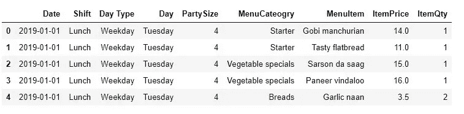

这里我们的数据准备终于完成了。我们维护所有模式，并考虑其他约束来匹配真实世界的数据。

# 2.形象化

现在，我们正在对数据进行一些探索性的数据分析，以确定菜单上的顶级项目。

**1。词云**

```
from wordcloud import WordCloud
wordcloud_sp = WordCloud(width=5000,height=2000).generate(speaker_rev_string1)
plt.axis("off")
plt.tight_layout(pad=0)
plt.imshow(wordcloud_sp)
```

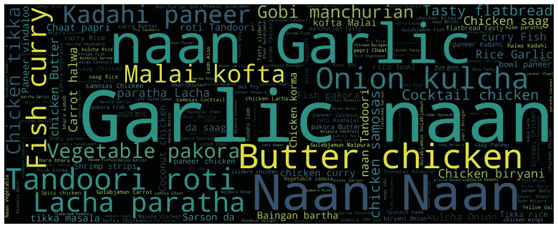

**2。柱状图**

```
p = pd.DataFrame(product_1.groupby(['MenuItem']).sum())
p = p.reset_index()
p.sort_values(by=['ItemQty'], inplace=True,ascending=False)
plt.figure(figsize=(20,8))
chart = sns.barplot(x="MenuItem", y="ItemQty", data=p)
plt.xticks(rotation=90)
```

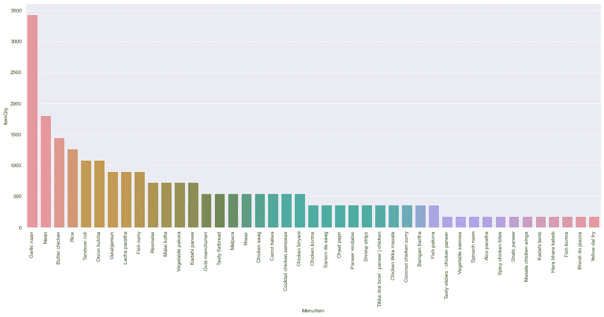

# 3.模型结构

为了建立一个模型，首先，我们修改了表的一些排列，以便于多变量预测。

```
df = final[['Date','Shift','MenuItem','ItemQty']]
new = df.loc[df.index.repeat(df.ItemQty)]
new = new[['Date','Shift','MenuItem']]
table = pd.DataFrame(pd.crosstab(new.Date,[new.Shift,new.MenuItem]))
table.columns = table.columns.map('{0[1]}-{0[0]}'.format)
```

我们为多元预测模型训练得到的数据集是

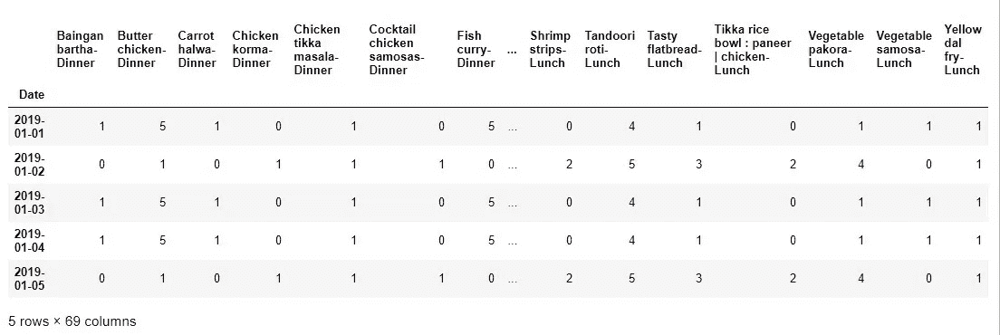

上述数据的外观行为

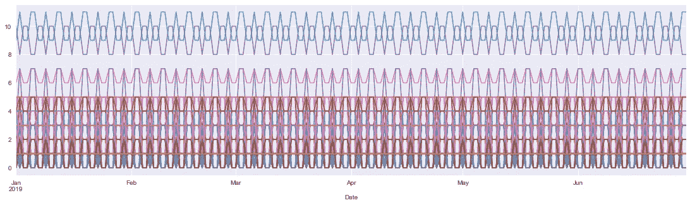

将数据拆分成训练和测试
对于时间序列模型，我们不能随机拆分我们的数据。我们应该在突破时遵循数据的季节性模式。所以我们分如下。

```
Train = table[:int(0.85*(len(table)))]
Test = table[int(0.85*(len(table))):]
```

对于这些数据，我们使用数据驱动的时间序列模型，如平滑技术。

导入建模所需的库

```
from statsmodels.tsa.holtwinters import SimpleExpSmoothing 
from statsmodels.tsa.holtwinters import Holt 
from statsmodels.tsa.holtwinters import ExponentialSmoothing
```

现在，我们正在为菜单的每个项目构建不同的模型，并制作相应 RMSE 的数据框，以检测哪个模型是最好的。

**第一个模型:-** 冬季指数平滑加性季节性和加性趋势模型

```
p = []
for i in table.columns:
 hwe_model_add_add = ExponentialSmoothing(Train[i],seasonal=”add”,trend=”add”,seasonal_periods=7).fit()
 pred_hwe_add_add = hwe_model_add_add.predict(start = Test.index[0],end = Test.index[-1])
 rmse_hwe_add_add = np.sqrt(np.mean((Test[i]-pred_hwe_add_add)**2))
 p.append(round(rmse_hwe_add_add,3))
p = pd.DataFrame(p, columns = [‘Winter_Exponential_Smoothing_RMSE’])
```

**第二个模型:-** 霍尔特方法模型

```
for j in table.columns:
    hw_model = Holt(Train[j]).fit()
    pred_hw = hw_model.predict(start = Test.index[0],end = Test.index[-1])
    rmse_hw = np.sqrt(np.mean((Test[j]-pred_hw)**2))
    q.append(round(rmse_hw,3)) 
p['Holt method Model_RMSE']= pd.DataFrame(q, columns = ['Holt method Model_RMSE'])
```

**第三种模式:-** 简单指数模式

```
r = []
for o in table.columns:
    ses_model = SimpleExpSmoothing(Train[o]).fit()
    pred_ses = ses_model.predict(start = Test.index[0],end = Test.index[-1])
    rmse_ses = np.sqrt(np.mean((Test[o]-pred_ses)**2))
    r.append(round(rmse_ses,3)) 
p['Simple Exponential Mode_RMSE']= pd.DataFrame(r, columns = ['Simple Exponential Mode_RMSE'])
```

每个项目的每个模型的 RMSE 数据框架。

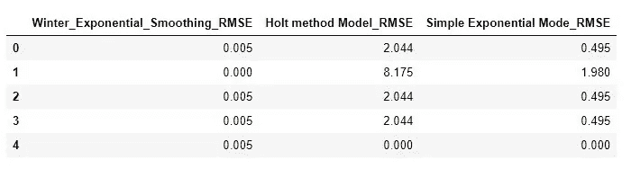

RMSE 模型的总和。

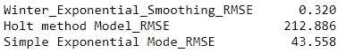

从上面我们可以看到，季节性为 7 的温特斯指数平滑法显示出比其他方法更小的 RMSE 值，所以我们选择它作为我们预测的最终模型。

# 4.建筑功能

我们正在构建两个不同的函数，第一个是预测菜单中所有项目的需求，第二个是预测菜单中前 N 个项目的需求。

**第一功能:-** 预测所有项目的需求，并规范午餐和晚餐格式中的数据框架安排。

输入参数。-
***表*** —修改后的历史数据框。
***start _ date***—我们要预测的周期的第一天。
***end _ date***—我们要预测的期间的最后日期。

```
def Daily_menu_forcasting(table,start_date,end_date):
    da = pd.date_range(start = start_date, end = end_date , freq='D')
    for_pred = pd.DataFrame(da,columns = ['Date'] )
    for_pred = for_pred.set_index('Date')
    for i in table.columns:
        hwe_model_add_add = ExponentialSmoothing(table[i],seasonal="add",trend="add",seasonal_periods=7).fit()
        pred_hwe_add_add = hwe_model_add_add.predict(start = for_pred.index[0],end = for_pred.index[-1])
        for_pred[i]=((round(pred_hwe_add_add)).astype(int))
    final_pred =  for_pred
    p = pd.DataFrame(final_pred.stack())
    p = p.reset_index()
    p[['MenuItem','Shift']] = p.level_1.str.split("-",expand=True,)
    p = p.rename(columns={0: "ItemQty"})
    p = p[['Date','Shift','MenuItem',"ItemQty"]]
    p = p[p['ItemQty'] != 0]
    # Makind Dataframe with dinner and lunch columns
    new = p.loc[p.index.repeat(p.ItemQty)]
    f = pd.DataFrame(pd.crosstab([new.Date,new.MenuItem],[new.Shift]))
    f = f.reset_index()# Shorting Data Frame on the basis top item
    f['Total orders of Day'] = f.Dinner + f.Lunch
    f = f.sort_values(['Date', 'Total orders of Day'], ascending=[True, False]).reset_index(drop= True)
    f
    Daily_req_FiNal_Ans = f.copy()
    return Daily_req_FiNal_Ans
```

**第二个功能:-** 预测前 N 个项目的需求，并标准化午餐和晚餐格式中数据帧的排列。

输入参数—
***表*** —修改后的历史数据画面。
***start _ date***—我们要预测的周期的第一天。
***end _ date***—我们要预测的期间的最后日期。
***N*** —我们想要的前几项的个数。(默认 n=5)

```
def Daily_top_menu_forcasting(table,start_date,end_date,N):
    da = pd.date_range(start = start_date, end = end_date , freq='D')
    for_pred = pd.DataFrame(da,columns = ['Date'] )
    for_pred = for_pred.set_index('Date')
    for i in table.columns:
        hwe_model_add_add = ExponentialSmoothing(table[i],seasonal="add",trend="add",seasonal_periods=7).fit()
        pred_hwe_add_add = hwe_model_add_add.predict(start = for_pred.index[0],end = for_pred.index[-1])
        for_pred[i]=((round(pred_hwe_add_add)).astype(int))
    final_pred =  for_pred
    p = pd.DataFrame(final_pred.stack())
    p = p.reset_index()
    p[['MenuItem','Shift']] = p.level_1.str.split("-",expand=True,)
    p = p.rename(columns={0: "ItemQty"})
    p = p[['Date','Shift','MenuItem',"ItemQty"]]
    p = p[p['ItemQty'] != 0]
    # Makind Dataframe with dinner and lunch columns
    new = p.loc[p.index.repeat(p.ItemQty)]
    f = pd.DataFrame(pd.crosstab([new.Date,new.MenuItem],[new.Shift]))
    f = f.reset_index()# Shorting Data Frame on the basis top item
    f['Total orders of Day'] = f.Dinner + f.Lunch
    f = f.sort_values(['Date', 'Total orders of Day'], ascending=[True, False]).reset_index(drop= True)
    f
    # Finding Topr product for days.
    name =((f['Date'].astype(str)).unique()).tolist()
    t = pd.DataFrame(columns = f.columns)
    for i in name:
        v = pd.DataFrame((f[f['Date']==i]).head(N))
        t = pd.concat([t,v],axis = 0)
    Daily_top_FiNal_Ans = t.reset_index(drop = True)
    return(Daily_top_FiNal_Ans)
```

现在，对未来日期(周一至周日，7 月 1 日至 7 月 7 日)菜单上项目的最终需求预测是。

对于所有项目。

```
all_menu = Daily_menu_forcasting(table,'7/1/2019','7/7/2019')
all_menu.head(10)
```

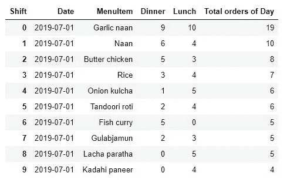

对于前 N 项。

```
# Here N = 8
top_8_menu = Daily_top_menu_forcasting(table,'7/1/2019','7/7/2019'
,8)
top_8_menu.head(10)
```

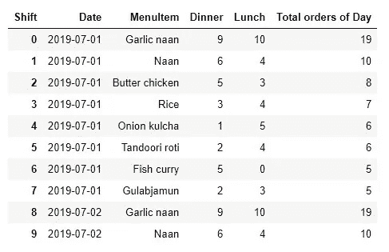

# 结论-

我们成功预测了给定时间段内午餐和晚餐菜单上餐厅食品的需求，并确定了菜单上的热门项目。本文展示了实现需求预测的多种方法之一。在我看来，这是处理多元预测业务问题的最佳方式之一。

完整的代码，请访问我的 Kaggle 页面，如果你觉得有帮助，请投赞成票。-[https://www . ka ggle . com 餐厅-需求-预测](https://www.kaggle.com/nilaydesmukh/restaurant-demand-forecasting)

我的 Linkedin—[https://www.linkedin.com/in/nilaydeshmukh](https://www.linkedin.com/in/nilaydeshmukh/)