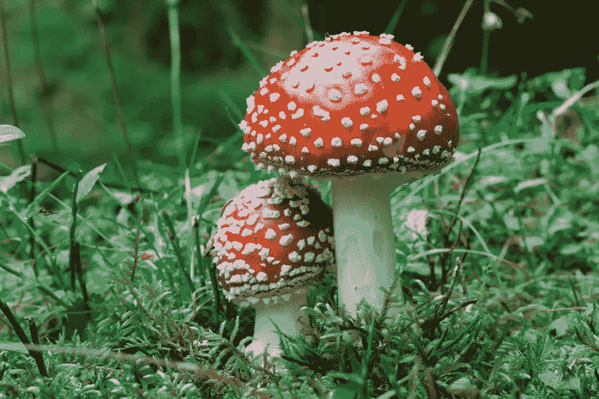
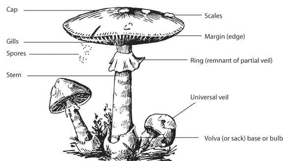
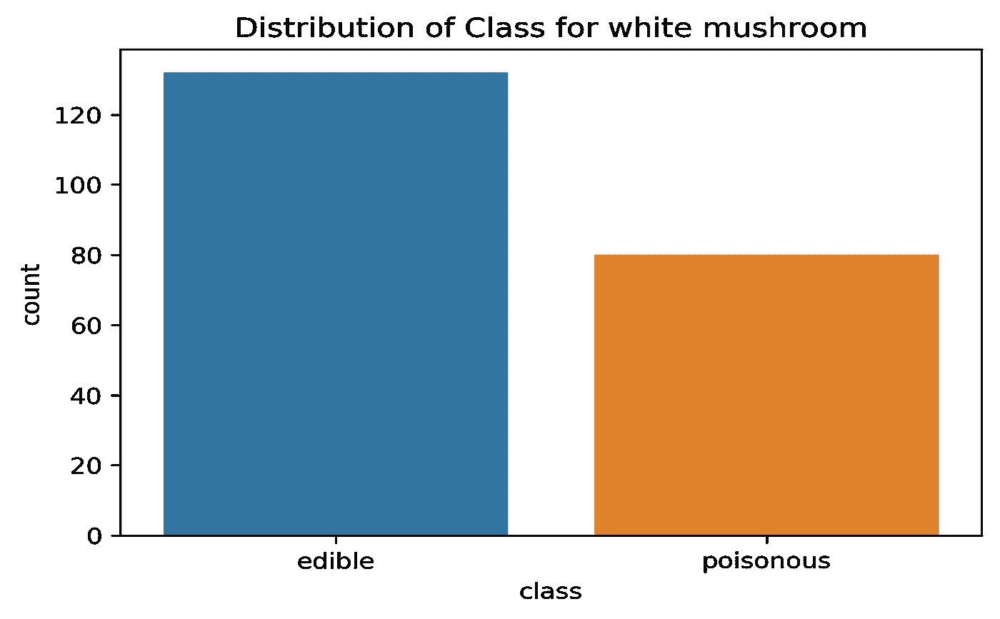
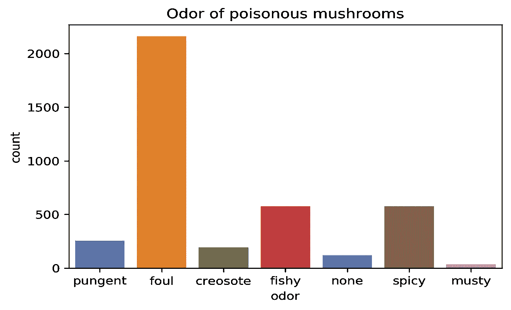
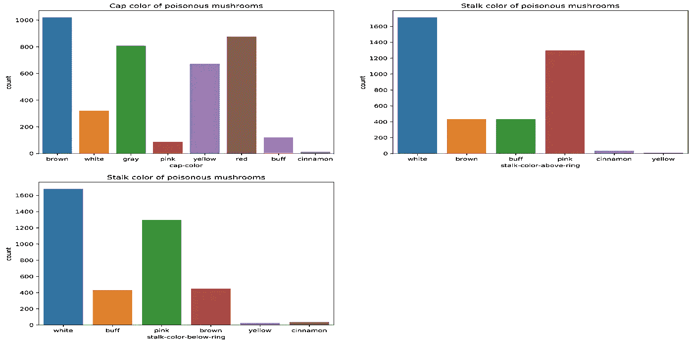
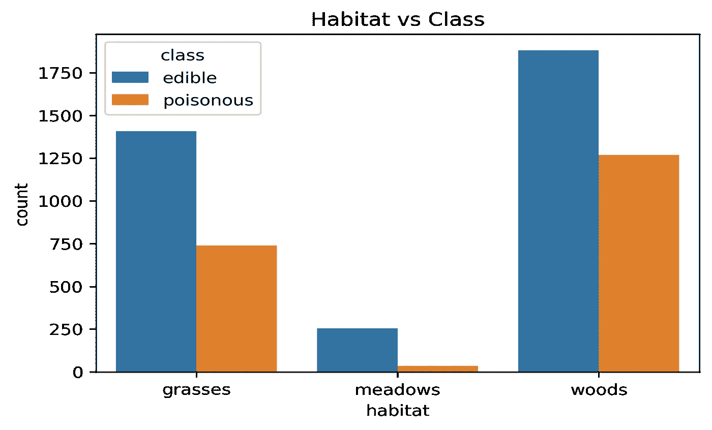
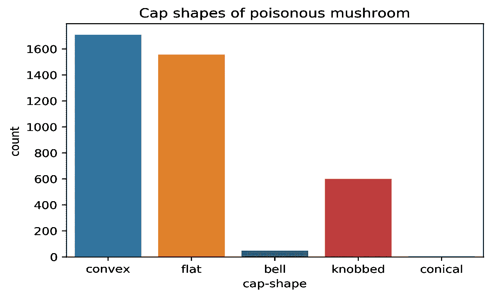
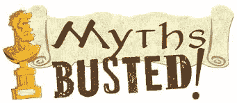

# 使用机器学习的蘑菇分类

> 原文：<https://medium.com/analytics-vidhya/mushroom-classification-edible-or-poisonous-9327a56c6fc9?source=collection_archive---------6----------------------->

一种**蘑菇**或**毒蕈**，是一种真菌的肉质、产孢子的子实体，通常产于地面、土壤或其食物来源上。

你们中的大多数人可能都遇到过可以食用的蘑菇，这些蘑菇现在被种植用于消费，但几十年前，它们中的大多数是野生蘑菇，人们曾经食用过。

即使在今天的世界上，我们有很多地方，人们实践这种食用野生蘑菇的文化，但是有大量的蘑菇是有毒的，并且没有这样的具体特征可以描述蘑菇的可食用性。

上述问题可以通过使用机器学习技术来解决。他们可以找出描述蘑菇种类(可食用/有毒)的特征。为了解决这个问题，我们从 UCI 机器学习知识库中抽取数据集，进行探索性数据分析。

数据集包含图像中可以看到的蘑菇的以下特征。

关于蘑菇和它们的可食用性有很多神话。我们对 python 中的数据集进行了探索性的数据分析，以打破这些神话。

***下面列出了五大神话***

> 所有白色的蘑菇都可以食用。
> 
> 毒蘑菇闻起来和尝起来都很糟糕。
> 
> 毒蘑菇总是有鲜艳、浮华的颜色。
> 
> 所有生长在树林、草地和牧场的蘑菇都可以安全食用。
> 
> 毒蘑菇有尖尖的顶。

1.  所有白色蘑菇都可以安全食用。

这是所有白蘑菇的计数图，我们可以观察到有相当数量的白色毒蘑菇。

**2。毒蘑菇闻起来和尝起来都很糟糕。**

这是所有毒蘑菇及其气味的计数图，有些蘑菇闻起来很香，但仍然有毒。

**3。毒蘑菇总是有鲜艳、浮华的颜色。**

在这里，我们可以找到很少的黄色和肉桂色的毒蘑菇，但这是因为在这些颜色的数据中有很少的数据点，因此我们不能准确地确定类别。

**4。所有生长在树林、草地和牧场的蘑菇都可以食用。**

从图表中可以清楚地看出，这个神话是不真实的，因为所有的地方都有毒蘑菇。

**5。毒蘑菇有尖尖的顶。**

每个帽子形状都有毒蘑菇，这里我们没有圆锥形蘑菇的数据，但不仅仅是尖的，圆的或凸的蘑菇。

此外，还对蘑菇的所有特征进行了详细的双变异和多变异分析。我的朋友 Prabhat 将在他的文章中分享，你可以在这里找到:-[https://medium . com/@ prabhathur/mushroom-class ification-using-visualization-18f 7877 e 1515](/@prabhathur/mushroom-classification-using-visualization-18f7877e1515)

我们还用 python 构建了一个定制的 graph 函数，它可以一次自动绘制任意数据集的图形。

## 自定义图形功能教程及代码链接:-【https://youtu.be/m4Noj-o5UXo 

*感谢*

*什拉万 A*