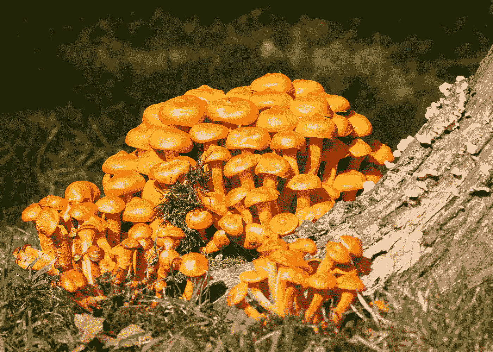

# 使用不同分类器的蘑菇分类

> 原文：<https://medium.com/analytics-vidhya/mushroom-classification-using-different-classifiers-aa338c1cd0ff?source=collection_archive---------1----------------------->

## 机器学习

## 决策树分类简介、逻辑回归、KNN、SVM、朴素贝叶斯、Python 中的随机森林分类器

弗兰克·多尔在 [Unsplash](https://unsplash.com?utm_source=medium&utm_medium=referral) 上拍摄的照片

> "只有自然是古老的，最古老的艺术是蘑菇."~托马斯·卡莱尔