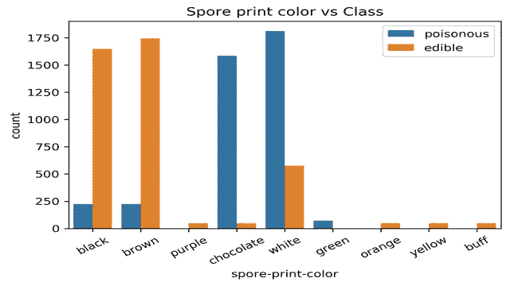
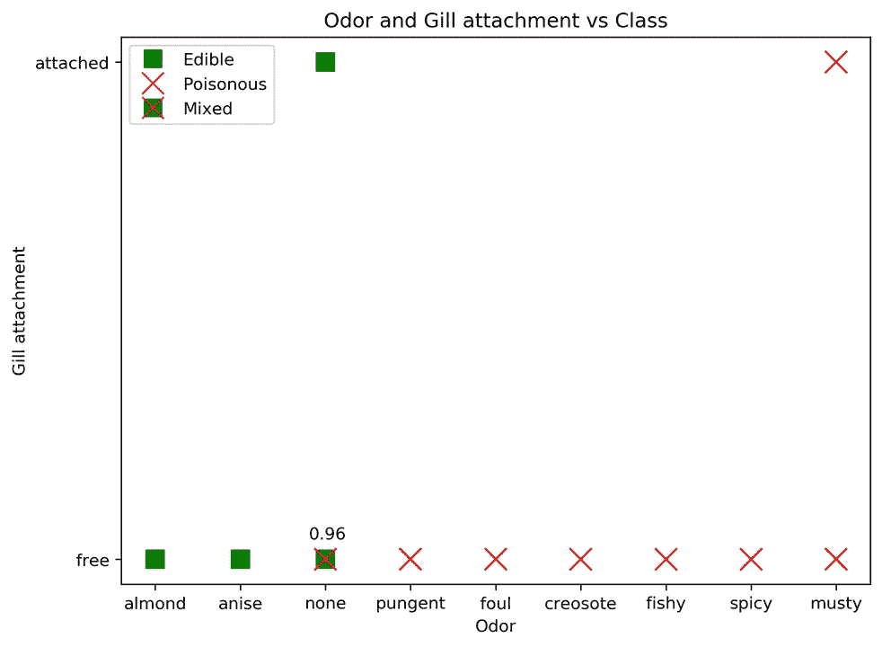

# 使用可视化的蘑菇分类

> 原文：<https://medium.com/analytics-vidhya/mushroom-classification-using-visualization-18f7877e1515?source=collection_archive---------5----------------------->

这篇文章是我的朋友 shra van([https://medium . com/@ shra van . adula puram/mushroom-classification-可食-或有毒-9327a56c6fc9](/@shravan.adulapuram/mushroom-classification-edible-or-poisonous-9327a56c6fc9) )写的文章的延续，他在文章中向我们介绍了这个问题，并着手打破关于蘑菇可食用性的常见神话。随着流言被打破，我们解决了问题的一部分，即阻止人们根据简单的特征识别蘑菇的可食用性。但显然这还不够。我们需要建立一个框架，使用它我们可以根据给定的特征预测蘑菇类/可食用性。通常这是通过使用逻辑回归、随机森林等建模来完成的。但在这里，我们将尝试不使用任何算法来解决问题，而是通过可视化和简单的数据探索。

# **双变量分析**

我们首先根据蘑菇的等级/可食用性检查所有蘑菇特征的卡方统计值，以便找出哪些特征是重要的。

不同蘑菇特征的卡方值和 P 值

不同蘑菇特征的卡方值和 P 值

从表中我们可以看出所有的特征都是显著的(因为 p <0.05). But in order to understand how significant each are we need to take a look at bi-variate cross tabulated plots. While its incorrect to compare Chi square statistic values(to determine which feature is more significant in determining the mushroom class) it was observed that the features having high Chi square statistic had more sub features that would take only one of the mushroom class. Some of the cross tabulated plots are shown below.

Odor vs Class of mushroom

Spore print color vs mushroom class

Gill color vs mushroom class

Ring type vs mushroom class

Stalk shape vs mushroom class

We can see that in the first four graphs certain feature value could identify mushroom class without ambiguity, like if mushroom has foul odor it is poisonous. The stalk shape vs class graph is shown just to demonstrate why it has a lower Chi square statistic than the other 4.

**简单预测器**

有了这个，我们可以制作一个基本的蘑菇类预测器:

1.  指示蘑菇有毒的一组特征:
    a)浅黄色和绿色的鳃色。
    b)绿色孢子印色。c)浅黄色、肉桂色和黄色。刺鼻、恶臭、杂酚油、鱼腥味、霉味和辛辣味。
    e)蘑菇无环。
    f)无环型。
2.  表明蘑菇可食用的一系列特征:
    a)凹陷的帽状。
    b)紫色和绿色帽色。
    c)红色和橙色的鳃色。
    d)紫色、橙色、黄色和浅黄色孢子印色。
    e)生根的茎根
    f)灰色、红色和橙色的茎杆颜色。
    g)杏仁和茴香蘑菇气味。
    h)废弃栖息地中的蘑菇。
    i)众多而丰富的人口特征。

# **三变量分析**

但是蘑菇类在其他所有情况下都无法预测。为了解决这个问题，我们将研究三变量分析，其中我们试图比较蘑菇类与 2 个特征。使用循环生成了所有可能的图(所有可能的特征与类别的组合),下面显示了一些重要的图。

气味和孢子印色 vs 蘑菇类

气味和鳃附着与蘑菇类

面纱颜色和鳃附着 vs 蘑菇类

混合标记上方的值表示蘑菇对于该特征组合是可食用的概率。从上述 3 个图中可以看出，除了一个组合(图 1 中无气味和白色孢子印迹颜色，图 2 中无气味和自由鳃附着，图 3 中自由鳃附着和白色面纱颜色)之外，我们能够毫无问题地预测蘑菇类。但这仍然不够。因此，我们将采用这种情况中的一种(气味为无，孢子印痕颜色为白色，因为在气味和孢子印痕颜色的所有其他可能组合中没有模糊性)并尝试进一步分解它。

为了做到这一点，我们将数据帧切片，使其仅包含无气味和白色孢子印迹颜色的行。对于该数据框架，我们再次绘制了所有可能的特征与类别的组合。结果图之一如下所示。

蘑菇类分布，无气味和白色孢子印颜色

从上图中我们可以推断，如果我们知道蘑菇的种群和栖息地属性，我们可以预测当气味是零，孢子印颜色是白色时的蘑菇类别。

**最终预测值**

通过结合上述所有结果，我们得到了最终的预测框架:

1.  如果气味是杏仁或茴香，那么蘑菇是可以食用的。
2.  如果气味刺鼻、恶臭、辛辣、发霉、有鱼腥味、杂酚油味，那么蘑菇就是有毒的。
3.  如果气味为零，孢子印颜色为绿色，则蘑菇有毒。
4.  如果气味是无，孢子印颜色是白色，那么我们去栖息地和种群属性。
5.  如果群体众多，分散或独居，那么蘑菇是可食用的。
6.  如果群体是几个，栖息地是树叶或路径，那么蘑菇是可食用的。
7.  如果种群是集群的，栖息地是废物，那么蘑菇是可以食用的。
8.  如果种群是群聚的，栖息地是树叶，那么蘑菇就是有毒的。
9.  在所有其他没有气味的情况下，蘑菇是可以食用的。

应当注意，这只是可用于预测蘑菇类的一组特征。从三变量分析开始，我们可以使用其他图表获得其他特征组合。

现在我们有了。一个无需建模即可预测蘑菇类的框架。最终结果实际上看起来像一个分类树的输出，但它是通过一些简单的可视化和数据探索得到的。

以上过程是用 Jupyter notebook 配合 python 完成的。代码可以在:[https://github . com/prabhathur/Data-Science/tree/master/Mushroom % 20 classification](https://github.com/prabhathur/Data-Science/tree/master/Mushroom%20Classification)找到。