# 蘑菇数据集—数据探索和模型分析(OneHot 编码)

> 原文：<https://medium.com/analytics-vidhya/mushroom-dataset-data-exploration-and-model-analysis-onehotvectr-encoded-c7fd304112dd?source=collection_archive---------6----------------------->


克里斯里德在 [Unsplash](https://unsplash.com?utm_source=medium&utm_medium=referral) 上的照片

本文将向您展示分类数据集的不同数据探索技术。我们将演示处理空值(如果有的话)的技术、分类值到数字特征的转换以及数据集的聚类趋势检查。

如果你要找整个代码库，可以在这里找到: [**【分类与模型分析(一热向量)**](https://www.kaggle.com/nvnvashisth/classification-and-model-analysis-one-hot-vector) **。**

为了演示所有的方法，我们考虑了一个著名的 [Kaggle 竞赛](https://www.kaggle.com/uciml/mushroom-classification)的数据集。该数据集的详细描述可在网站(Kaggle)上获得，该网站明确解释了各个特征。数据科学家必须了解数据的背景，才能开始围绕数据构建他/她的假设。

让我们首先读取文件并查看数据的前 5 条记录。

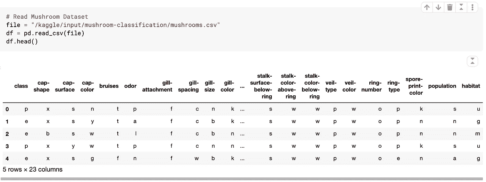

读取蘑菇数据集并显示前 5 条记录

让我们详细研究一下数据(数据清理和数据探索)

## 数据清理和数据探索

通常，数据科学家总是会检查数据集中是否存在“NA”值，我们在这里也是如此。此外，我们还将检查蘑菇需要分类的不同的可用类别。在我们的例子中，这些类是“有毒的”和“可食用的”。

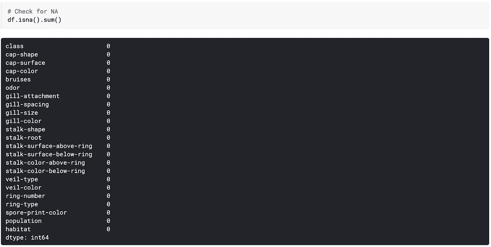

计算每列中可用的“NA”

我们需要对机器学习模型可以接受的数据进行预处理。我们在数据集中有不同的类别，不可能使用这些类别进行可视化和模型分析。因此，我们需要将这些数据转换成数字数据。我们已经使用了来自 sk learn[**label encoder**](https://scikit-learn.org/stable/modules/generated/sklearn.preprocessing.LabelEncoder.html)**的 great 库将所有类别转换为数值。**

**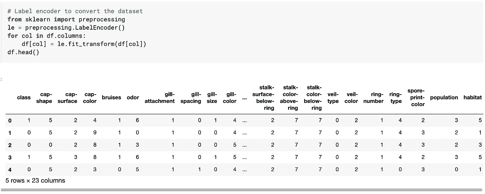**

**LabelEncoder 将所有类别转换成数值**

**现在我们必须进行特征分析，这可以使用相关矩阵来完成。它提供了关于不同特征之间的正相关和负相关的良好信息。我们也可以使用箱线图来检查异常值。**

**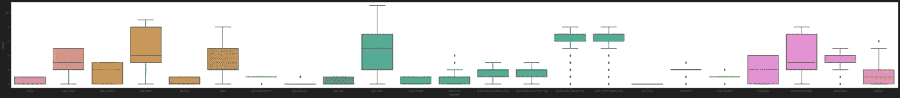**

**蘑菇数据集的异常值盒图**

**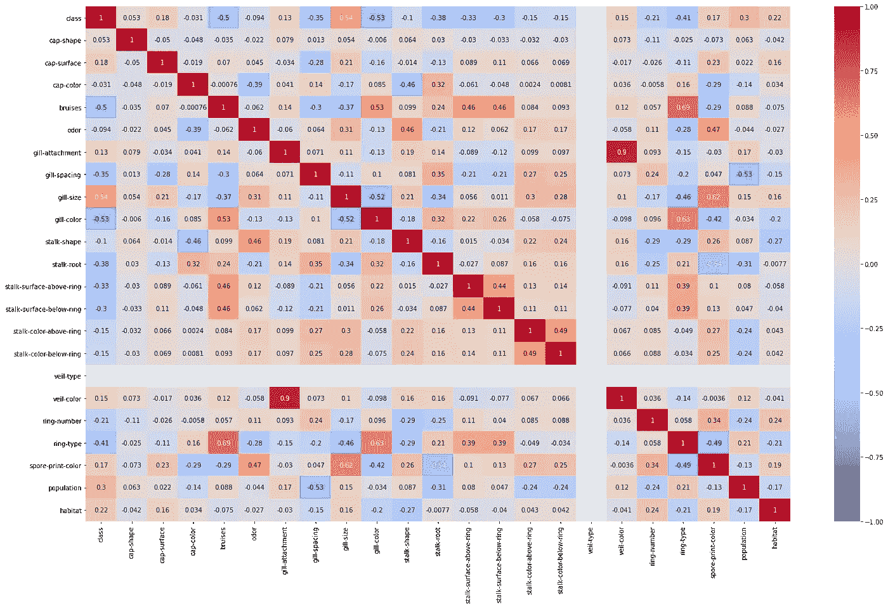**

**描述特征间相关性的相关矩阵**

**在我们绘制了箱线图和相关矩阵之后，它给我们的感觉是数据不能被标记编码。这些方法使用不同方法，如均值、协方差和其他数学技术来寻找特征之间的关系。我们的数据集是分类数据，不需要计算平均值或方差。因此，从这篇[文章](https://scikit-learn.org/stable/modules/preprocessing.html#encoding-categorical-features)来看，这篇文章提供了关于如何根据 dat 将分类特征(名词或序数)转换为数字特征(OrdinalEncoder，OneHotEncoder)的最佳信息**

**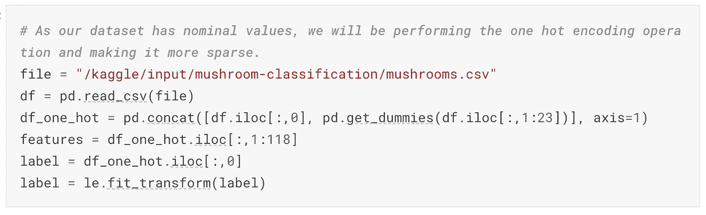**

**名义分类数据的一键编码器**

**但是一键编码器总是有一些缺点。它显著增加了维度。因此，我们需要为我们的数据分析寻找可以减少这些维度的可能方法。我们进行了主成分分析(PCA ),结果如下。这里我们可以看到，最大方差由 45 个组件捕获。**

**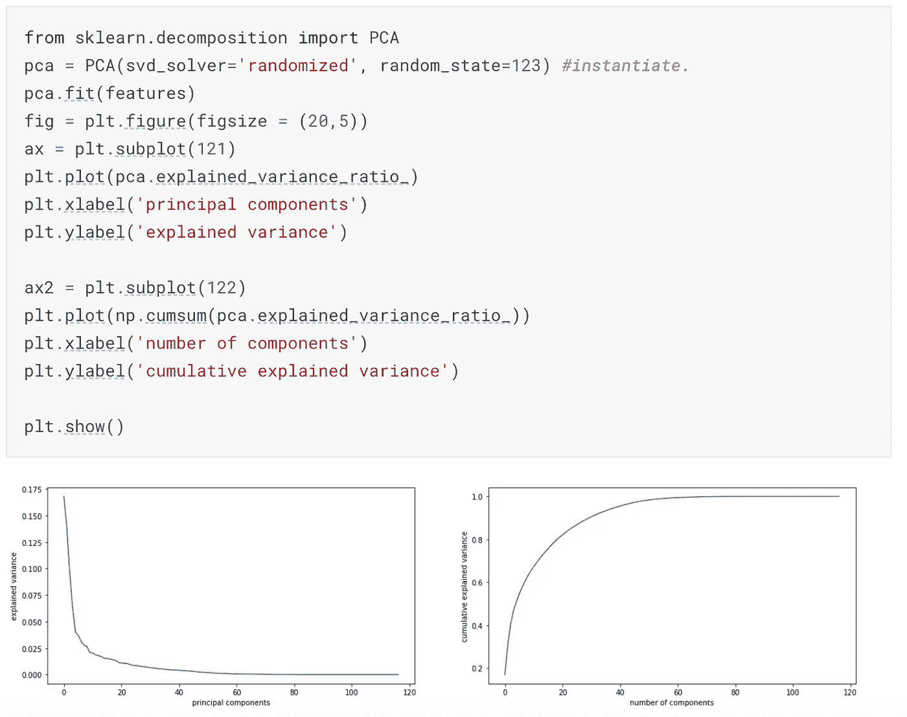**

**主成分分析(PCA)降低维数**

**我们还检查了我们的数据的趋势，这些数据可以在[霍普金的统计数据](https://en.wikipedia.org/wiki/Hopkins_statistic)的帮助下进行聚类(详细内容请点击此处)。可以清楚地看到，数据集确实是高度可聚类的，值为 0.98。**

**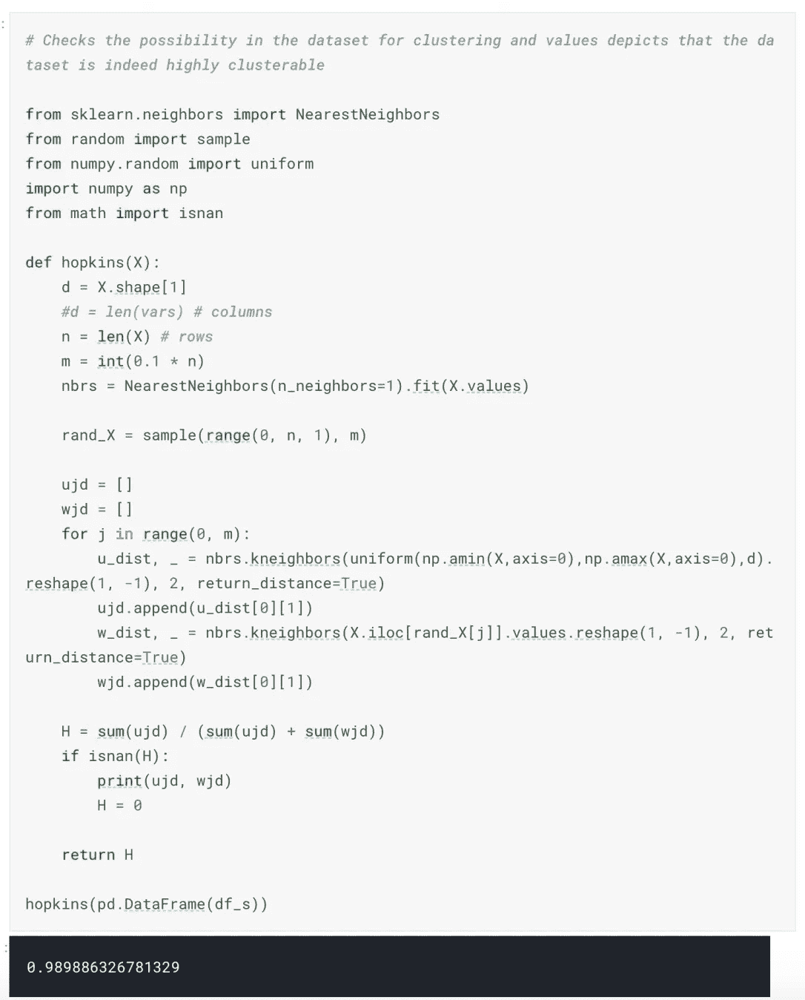**

**蘑菇数据集的霍普金统计量**

**我们还寻找了[侧影得分](https://en.wikipedia.org/wiki/Silhouette_(clustering))(详细阅读请点击此处)，从图中可以清楚地看到，最高峰的值大于 2。可以推断，我们可以有 2 个或更多个集群。我们将执行另一个名为[肘测试](https://en.wikipedia.org/wiki/Elbow_method_(clustering))的测试(要阅读详细内容，请单击此处)，这将为我们提供可能的集群数。**

**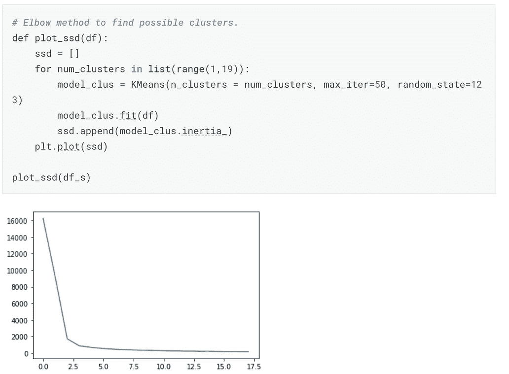****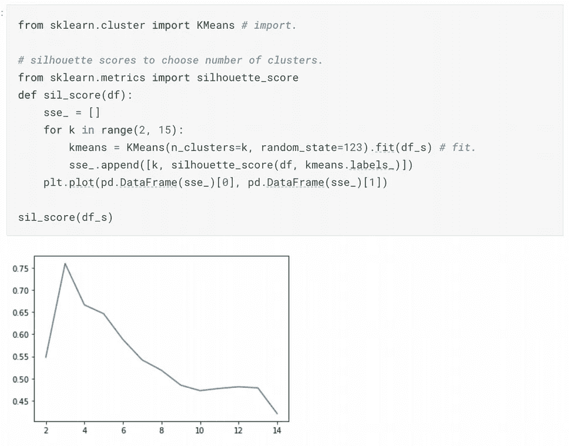**

**肘法(可能聚类 2)和剪影评分(2 或更多聚类)**

**然后，我们使用 [K-means](https://scikit-learn.org/stable/modules/generated/sklearn.cluster.KMeans.html) 算法绘制了 3 个和 5 个聚类。实现如下所示。**

**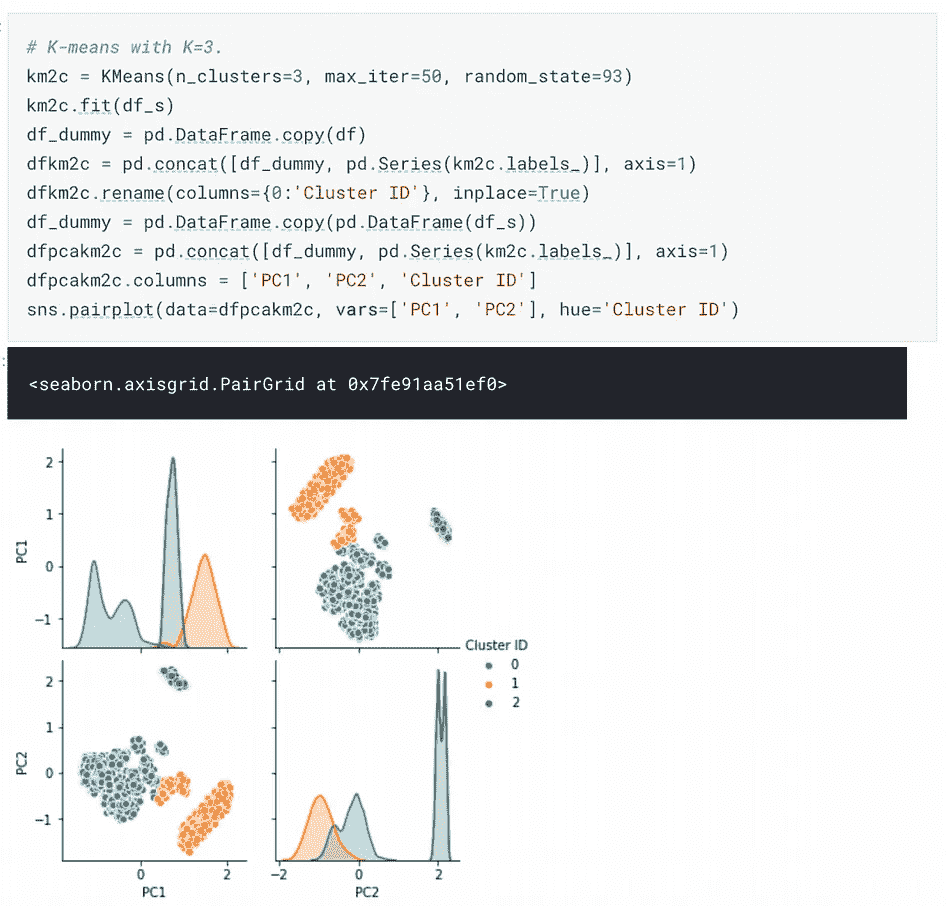****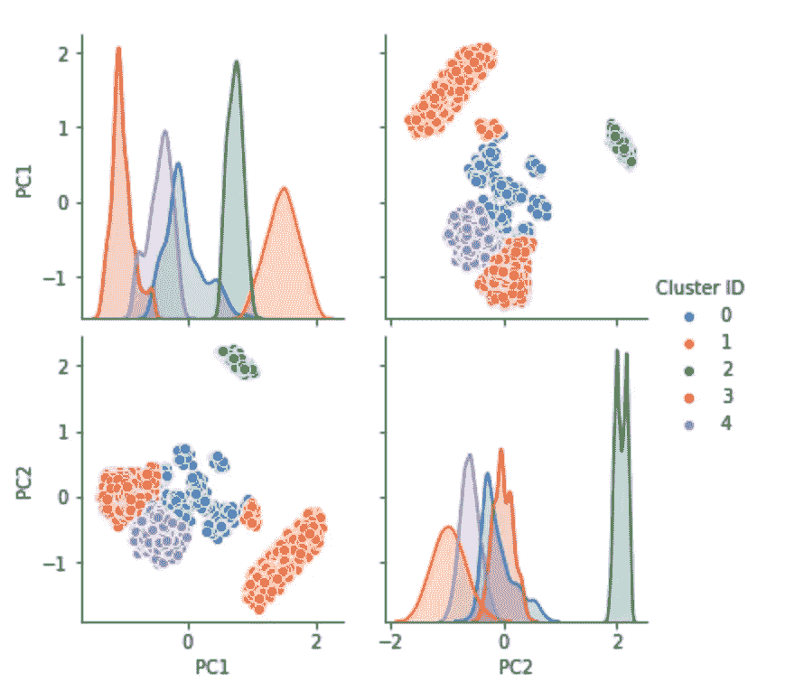**

## **模型分析和比较**

**模型选择是基于流行度进行的，并且经常在实际案例中使用。下面是一些常用的技巧**

*   ****K-fold 交叉验证:**这是一种对有限数据样本进行重采样的方法，有助于评估机器学习模型。该方法有一个参数“K ”,它可以被认为是组的数量，其中 80:20 的比率分别用于训练和测试，并且对不同的组重复该操作。**
*   ****精度和召回:**检查关于假阳性的真实事例比率(TPR/(TPR+FPR))总是明智的，也称为精度值。召回率可以说是算法正确分类的相关结果总数的百分比(TPR/(TPR+FNR))。**
*   ****F1 评分:**人们总是期待拥有精确度和召回率最高的模型。但是当不可能决定的时候，我们必须追求 F1 的分数，它是精确和回忆的调和。(2 *精度*召回/(精度+召回))**
*   ****ROC:** 用 TPR(真阳性率)对 FPR(假阳性率)绘制接收器工作曲线(ROC)，其中 TPR 在 y 轴上，FPR 在 x 轴上。**

**上述标准将用于所有选定的算法，最终算法将从中选出。**

*   **高斯朴素贝叶斯分类器**
*   **逻辑回归分类器**
*   **决策树分类器**
*   **随机森林分类器**
*   **xgBoost 分类器**
*   **线性判别分类器**
*   **高斯过程分类器**
*   **Ada-boost 分类器**

**现在我们已经完成了数据探索，现在让我们继续进行模型分析。我们考虑了许多不同的模型进行分析。下面是用于蘑菇分类的不同机器学习算法的实现。**

```
# Importing required classification algorithmfrom sklearn.linear_model import LogisticRegression
from sklearn.model_selection import cross_val_score
from sklearn.metrics import roc_curve, auc, classification_report
from sklearn.naive_bayes import GaussianNB
from sklearn.ensemble import RandomForestClassifier, AdaBoostClassifier
from sklearn.discriminant_analysis import LinearDiscriminantAnalysis
from sklearn.gaussian_process import GaussianProcessClassifier
import xgboost
from sklearn import tree
from sklearn import metrics# Creating object for each class and storing into the array
classifiers = []
nb_model = GaussianNB()
classifiers.append(("Gaussian Naive Bayes Classifier",nb_model))
lr_model= LogisticRegression()
classifiers.append(("Logistic Regression Classifier",lr_model))
dt_model = tree.DecisionTreeClassifier()
classifiers.append(("Decision Tree Classifier",dt_model))
rf_model = RandomForestClassifier()
classifiers.append(("Random Forest Classifier",rf_model))
xgb_model = xgboost.XGBClassifier()
classifiers.append(("XG Boost Classifier",xgb_model))
lda_model = LinearDiscriminantAnalysis()
classifiers.append(("Linear Discriminant Analysis", lda_model))
gp_model =  GaussianProcessClassifier()
classifiers.append(("Gaussian Process Classifier", gp_model))
ab_model =  AdaBoostClassifier()classifiers.append(("AdaBoost Classifier", ab_model))# Stores all the scores
cv_scores = []
names = []
for name, clf **in** classifiers:
    print(name)
    clf.fit(X_train, y_train)
    y_prob = clf.predict_proba(X_test)[:,1] *# This will give you positive class prediction probabilities* 
    y_pred = np.where(y_prob > 0.5, 1, 0) *# This will threshold the probabilities to give class predictions.*
    print("Model Score : ",clf.score(X_test, y_pred))
    print("Number of mislabeled points from **%d** points : **%d**"% (X_test.shape[0],(y_test!= y_pred).sum()))
    scores = cross_val_score(clf, features, label, cv=10, scoring='accuracy')
    cv_scores.append(scores)
    names.append(name)
    print("Cross validation scores : ",scores.mean())
    confusion_matrix=metrics.confusion_matrix(y_test,y_pred)
    print("Confusion Matrix **\n**",confusion_matrix)
    classification_report = metrics.classification_report(y_test,y_pred)
    print("Classification Report **\n**",classification_report)
```

**在蘑菇数据集上执行上述代码后，我们收到了不同的算法结果，可以用来比较这些算法。最终的算法可以被认为是部署的首选算法。**

**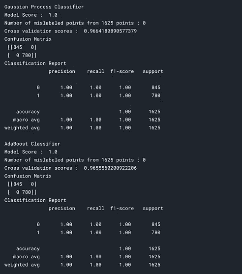****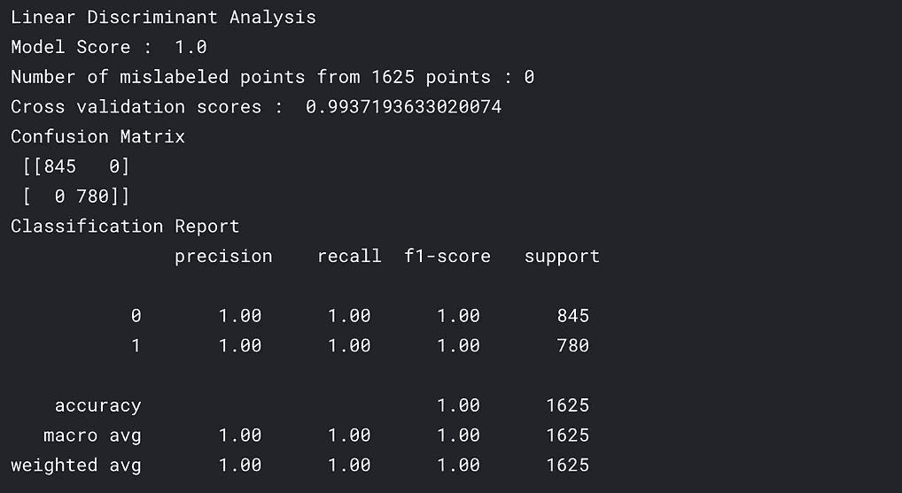****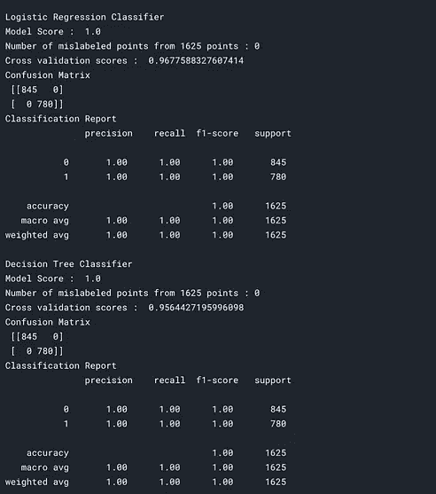**

**高斯过程、Adaboost、LDA、逻辑回归和决策树分类器评估**

**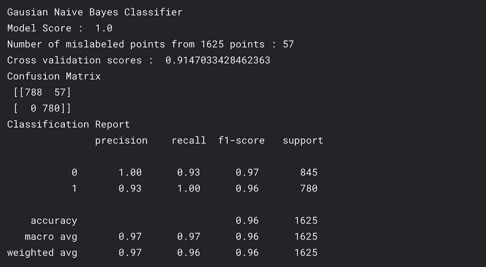****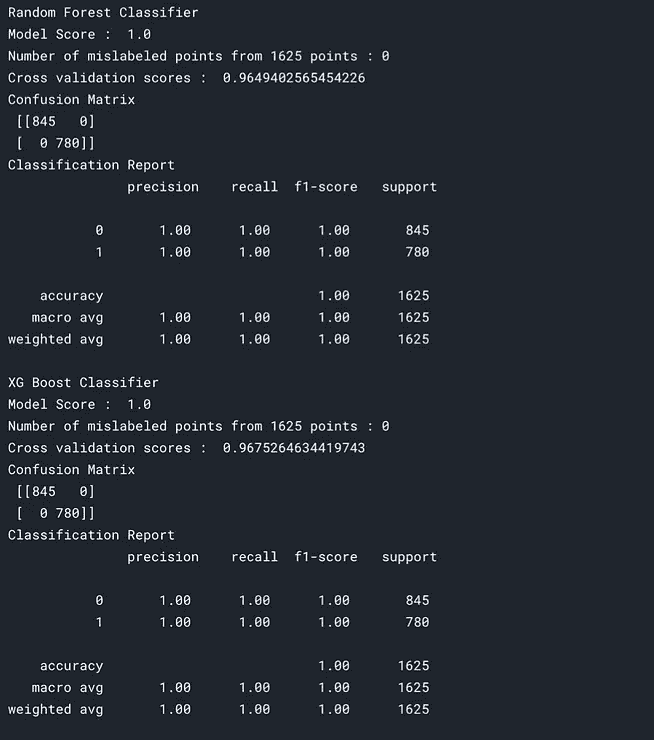**

**朴素贝叶斯、随机森林、XG Boost 分类器评估**

**本文的主要内容是处理分类数据的不同技术，即 LabelEncoder、OrdinalEncoder 和 OneHotEncoder。此外，我们还谈到了主成分分析，其中我们只考虑了 117 个成分中的 2 个成分，因此有效地降低了维度。后来，我们研究了不同的方法，这些方法可以告诉我们数据集中聚类的趋势。霍普金的统计学、剪影评分和肘方法向我们展示了走向聚类的道路。最后使用 K-means 聚类方法。最后，我们使用上述不同的评估方法进行模型分析。**

**如果你喜欢数据探索和模型分析，那么请鼓掌，分享，评论反馈。敬请关注更多博客！**