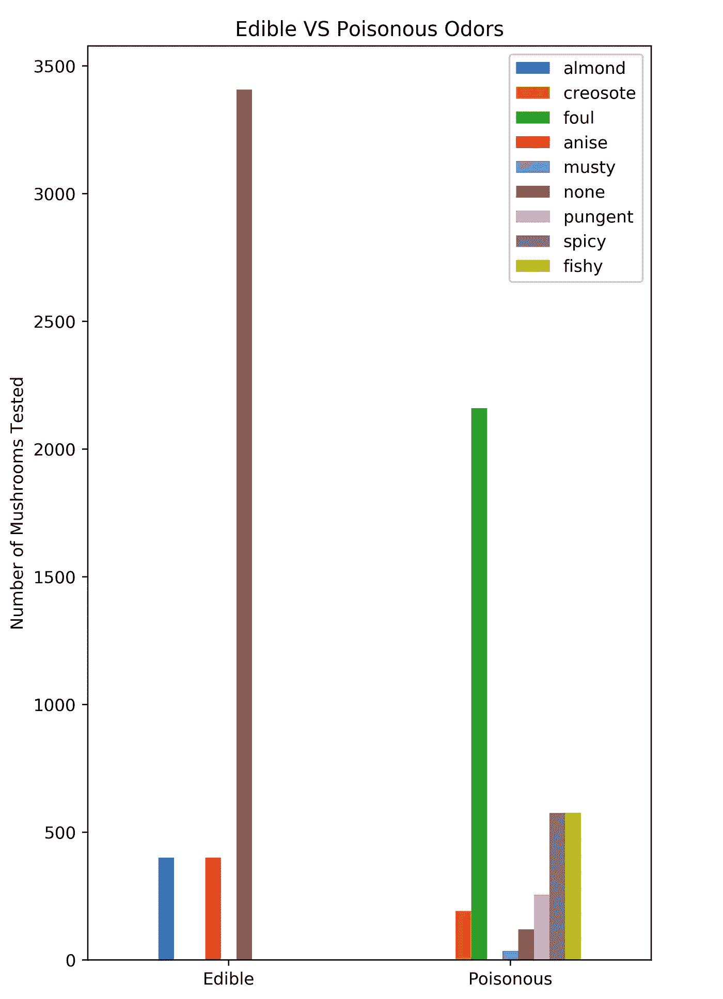

# 蘑菇觅食和数据科学

> 原文：<https://medium.com/analytics-vidhya/mushroom-foraging-is-it-edible-dfdcdf088184?source=collection_archive---------10----------------------->

对许多人来说，寻找蘑菇或“蘑菇狩猎”是一种有趣的爱好。你不能随便吃你找到的旧蘑菇。吃错蘑菇可能会致命。对于未经训练的人或在新地区觅食的人来说，识别蘑菇种类可能是一项棘手而危险的工作。

在这里找到这个数据集:[https://www.kaggle.com/uciml/mushroom-classification](https://www.kaggle.com/uciml/mushroom-classification)之后，我想知道我是否能运用我的数据科学技能。利用 8000 多种蘑菇的数据，我们能在不知道蘑菇是什么的情况下预测它是否有毒或可食用吗？

根据对数据的检查，我可以看到有毒和可食用蘑菇有一些独特的属性。与食用蘑菇相比，某些气味和孢子印痕颜色只在毒蘑菇中常见，反之亦然。

食用蘑菇和有毒蘑菇气味的对比图。

显示食用蘑菇和毒蘑菇孢子印颜色的图表。

我们可以看到有些属性只有在食用蘑菇中才能观察到，有些只有在毒蘑菇中才能观察到。这给了我希望，我们可以根据我们的数据做出预测。是时候进行测试了。

目前，我的数据集被认为是“受监督的”。它有一个类列，告诉蘑菇是 p(有毒)还是 e(可食用)。如果我删除该列，我可以使用“无监督的”数据进行预测，并将其与有监督的数据进行比较，看看它们有多准确。

下面是我执行 PCA 后的结果，只保留具有大量差异的列，并使用 KMeans 将这些条目分成 2 组。根据我们的监督数据集进行检查后，我们的模型能够以 89%的准确率将我们的数据聚类为有毒或可食用的蘑菇！这是基于类别列对点进行颜色编码后的数据散点图。

预计误差为 11%

正如你从图中看到的，模型并不是 100%完美的，有一些物种我们的模型不能挑选出来，所以它们在聚类中被分组错误。但随着数据的进一步清理，我应该能够提高准确性，并最终制作一个程序，它可以输入采集的蘑菇的属性，并返回它是否有毒或可食用，以及这种评估的置信度。

如果你想看整个过程，这里有一个我的代码笔记本的链接:[https://colab . research . Google . com/drive/1 wjrjvmcz 0 kwm 0 a 9 SCA iibt 9 TM 1n 5 Zn 7s](https://colab.research.google.com/drive/1wjRjVmCz0Kwm0A9scAIIbt9tM1n5zN7S)