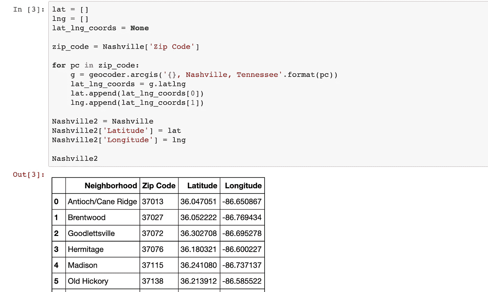
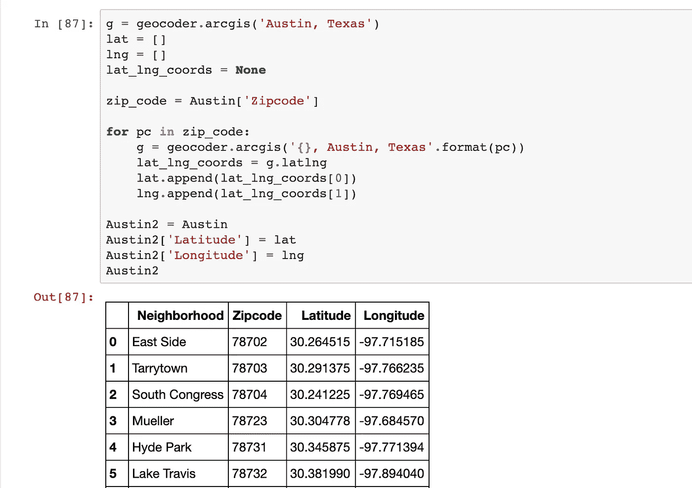
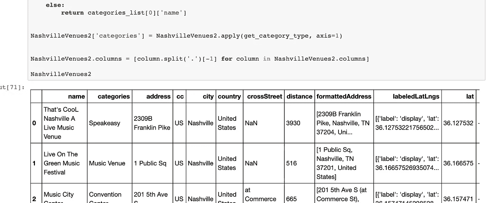
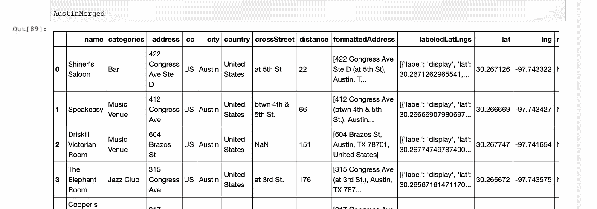
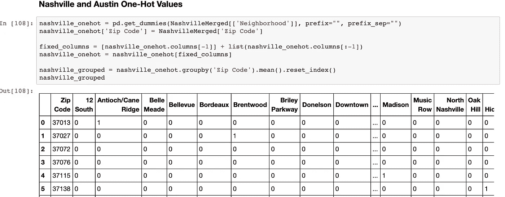
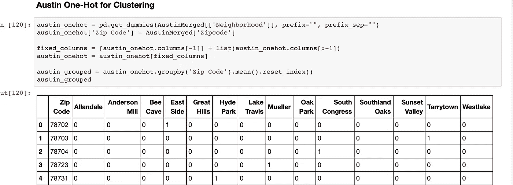
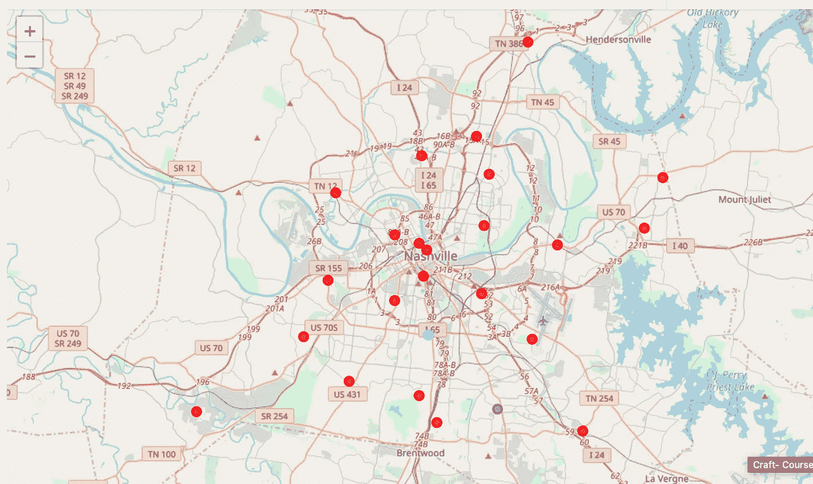
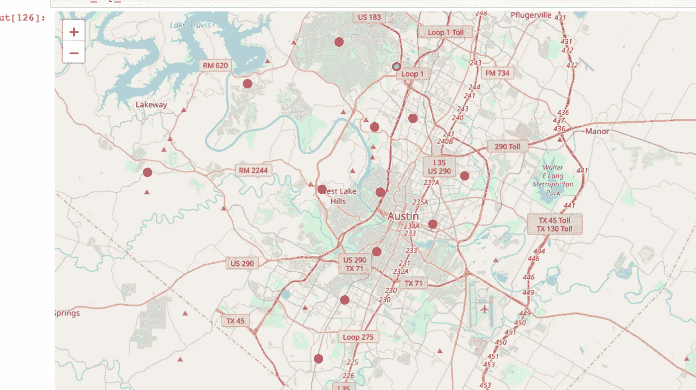

# 音乐之城:纳什维尔 vs 奥斯汀

> 原文：<https://medium.com/analytics-vidhya/music-city-nashville-vs-austin-4ccf1aba81d5?source=collection_archive---------16----------------------->

在 [Unsplash](https://unsplash.com?utm_source=medium&utm_medium=referral) 上 [ActionVance](https://unsplash.com/@actionvance?utm_source=medium&utm_medium=referral) 拍照

田纳西州的纳什维尔被誉为美国音乐之城。在过去的几年里，纳什维尔在许多其他行业都经历了快速发展。许多人将田纳西州的纳什维尔与德克萨斯州的奥斯汀相提并论。这两个城市都是即将到来的南方大都市，也都声称大型音乐场景。我想用数据科学方法论来证明它在世界舞台上的名声。如果纳什维尔能够说它是美国最权威的音乐城市，它将在地图上增加它的声誉，甚至进一步为这个我称之为家的城市带来更多的游客、更多的生意和更多的人。

## 数据来源:

Foursquare API:我将利用 Foursquare 的位置数据来查找城市中每个邮政编码的音乐场所的数量，然后将音乐场所的数量、音乐场所的位置以及每个社区中音乐场所的集中程度与世界上另一个以音乐而闻名的城市(纳什维尔的一个经典对手:德克萨斯州的奥斯汀)进行比较。

纳什维尔街区/邮政编码:

 [## 纳什维尔邮政编码地图

### 37013 安提阿/甘蔗岭 37027 布伦特伍德(见威廉姆森县)37072 古德莱特斯维尔 37076 艾尔米塔什 37115…

nestinginnashville.com](https://nestinginnashville.com/buying-a-home-in-nashville/zip-code-map/) 

奥斯汀社区/邮政编码:

 [## 奥斯汀邮政编码地图-奥斯汀房地产-通过邮政编码搜索房屋

### Realty Austin 的邮政编码地图帮助买家通过邮政编码找到房源。这张地图是一种简单而准确的定位方式…

www.realtyaustin.com](https://www.realtyaustin.com/zip-codes.php) 

## 方法:

我决定使用 Beautiful Soup 从几个网站导入简单的 csv 数据来创建 CSV。这给了我奥斯汀和纳什维尔的邮政编码和社区信息。

Geocoder 允许我更精确地输入奥斯汀和纳什维尔每个邮编的经度和纬度。然后，我使用 leav 来确保我将邮政编码放在了正确的纬度和经度上。

纳什维尔地理编码器

奥斯汀地理编码器

然后，我使用 Foursquare API 获得了奥斯汀和纳什维尔所在纬度和经度范围内所有被归类为“音乐场所”的场所的特定数据框。我决定让搜索非常清晰，这样我就不必整理更多的数据，只包括 Foursquare 认为是真正的音乐场所的地方。我清理了这两个城市的 API 结果，并将这些结果合并到邮政编码和社区数据框中。

纳什维尔 API 数据

奥斯汀 API 数据

一旦我将这两个城市的音乐场所和它们所在的街区都绘制出来，我就使用 K 近邻来识别我的数据中数据集的任何分类。对于奥斯汀和纳什维尔，我按每个街区分组，然后按邮政编码分组——一旦我将它们分组，我就在每个地点旁边放置一个热门变量来分配一个聚类值。

纳什维尔 One-Hot

奥斯汀 One-Hot

用树叶和地理编码器我制作了一个每个城市的地图和他们各自的 KNN 结果。这张地图让我们更好地了解音乐场所在每个城市的位置。

纳什维尔 KNN 地图

奥斯汀 KNN 地图

**结果**

Foursquare API 搜索音乐场所返回了纳什维尔的 24 个音乐场所，奥斯汀的 13 个。

KNN 显示，音乐场所在每个城市的社区中的分布相对相同，两个城市都只有一个社区在音乐场所的数量上脱颖而出。

## **结论**

总的来说，奥斯汀和纳什维尔每个街区的音乐场所的多样性是相同的。他们都有一个街区，最终比其他人有更多的地方可以去看现场音乐。

纳什维尔共有 24 个音乐场所，而奥斯汀有 13 个。“音乐场所”的场所类别可能无法涵盖现场音乐播放的所有地方，但为了这次探索的目的，可以说纳什维尔有更纯粹的“音乐场所”

需要针对音乐场所的整体体验、在那里播放的音乐类型以及该实验没有捕捉到的其他被忽视的价值进行更多的分析。我想说，这可以作为对音乐场所在每个城市的分布情况的介绍性研究，在这个主题上还有更多数据可以探索。

以我完全偏颇的观点，我不得不说纳什维尔仍然是美国的“音乐之城”。