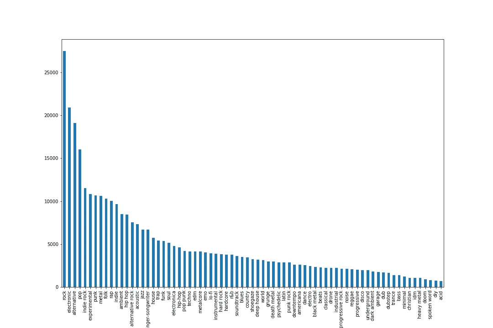
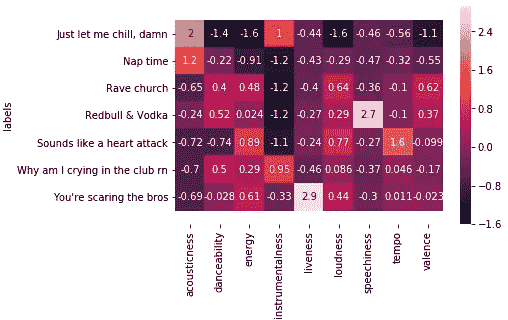

# 21 世纪的音乐发现

> 原文：<https://medium.com/analytics-vidhya/music-discovery-in-the-21st-century-41e5f08246e?source=collection_archive---------25----------------------->

## 使用 MongoDB、Spotipy 和 Streamlit 在无人问津的流派海洋中导航

回到今年 8 月的，我创建了几个 Python 脚本来生成我最喜欢的博客上的 Spotify 播放列表。这是一个充满激情的项目；我喜欢新音乐，但很难跟上它，这对我来说是一种令人兴奋的方式，可以锻炼我在 Flatiron bootcamp 体验开始时学到的新技能。我在训练营中进步得越多，我就有越多的想法来改进这些脚本，并使它们超越我个人的便利。我是怎么做到的？我从我最喜欢的独立发行商(Bandcamp.com)那里建立了一个艺术家数据库，在 Spotify 上找到了他们所有的音乐，使用 Spotify 的音频功能设计了一个模型，根据另一首歌的音频功能生成歌曲列表。在详细说明我是如何做到这一切之前，让我充分解释一下为什么这整件事在我方便的范围之外是有用的。

[流媒体占 2018 年音乐收入的 47%](https://techcrunch.com/2019/04/02/streaming-accounted-for-nearly-half-of-music-revenues-worldwide-in-2018/)，而且它只会越来越受欢迎。就在最近，Serato DJ 允许您连接到您的 SoundCloud 帐户和/或 Tidal 帐户来访问这些库。作为一名艺术家和音乐爱好者，我需要随身携带它，这听起来很棒。然而，[四大唱片公司仅 Spotify 一家就占据了 87%的内容。独立艺术家和唱片公司一直很难与大公司竞争，但正如我们所见，技术让我们更容易创造自己的内容，独立艺术家也更容易坚持自己的立场。根据我自己的经验，以及那些在音乐产业中有同感的人的经验，Bandcamp.com 一直是销售音乐的最大收入来源。但是除了渴望音乐的 DJ 和死忠粉丝，大多数人都在通过流媒体平台听他们喜欢的歌曲。](https://www.thelocal.se/20180302/the-story-of-spotify-swedens-controversial-king-of-music-streaming)

策展站试图做的是帮助独立艺术家从流媒体市场获得更大的份额。我非常理解流媒体收入对泰勒·斯威夫特这样的名字来说是多么少，但对于没有泰勒·斯威夫特资金的艺术家来说，一点点就可以走得更远。在理想的世界中，艺术家应该获得更公平的份额，但版税法律没有跟上这种分发音乐的新方式——很不幸，我是在 2019 年底说这话的。与此同时，我想帮助独立艺术家获得更多的戏剧和更多的曝光，而策展站是我对这一努力的贡献。

我用 MongoDB 创建了一个 Bandcamp.com 和 Spotify 上的艺术家数据库。它包含所有艺术家的 Spotify IDs 和他们的热门曲目，以及他们的受欢迎程度、粉丝数量和我在聚类后分配的类别(稍后将详细介绍)。我发现的一个问题是，对于 Bandcamp 上的许多艺术家来说，Spotify 提供的许多流派信息都不见了。这很麻烦，因为我需要流派来制作更好的播放列表。在数据库中的 50 万多名艺术家中，大约有三分之一的人缺少流派信息。在我写这篇文章的时候，我正在网上搜集那些丢失的数据，目前我已经搜索了大约 100k。如果你正在读这篇文章，并且你是或者知道是 Bandcamp 的艺术家，请随意填写/分享这个 [Google 表单](https://forms.gle/XXeZnS9pmT3mLhh56)——这个抓取过程很长，会加速数据库的建立。

按流派分组的所有艺术家的分布

在清理了数据并建立了数据库之后，我使用 Spotify API 获取了每个乐队成员的热门曲目的歌曲特征。在看了每个流派中艺术家的分布(如上图)后，我决定只把其中一个更流行的流派——电子乐——归为一类。我选择电子音乐的原因是，它不太像是一种流派，更像是一种音乐方式，这使得 Spotify 的音频功能更容易区分。这就是艺术家的职业发挥作用的地方。

我使用 K-Means 聚类将“电子”流派中的所有歌曲分为七个不同的类别(或聚类)。这种聚类算法采用了我使用的所有 Spotify 功能的所有数据(下面热图中的 X)，并通过围绕一组具有类似功能的数据点移动“质心”来确定聚类的中心。质心位于每个点之间的平均距离最小的地方。我选择这种聚类方法主要是因为这是一个时间紧迫的学校项目。数据集有点大，在我的笔记本电脑上运行任何层次聚类都需要很长时间。

这张热图显示了每个聚类中每个要素的中值。“我为什么在 rn 俱乐部哭泣”与其他具有高跳舞性的聚类相比，具有最低的化合价。这个数据集中的大多数音乐都属于那个类别——分布有点向右倾斜，但随机森林分类器仍然以 90%的准确率对聚类进行了分类。真正理解这些类别的最好方法是听一听。下面这首歌属于“午睡时间”类别。这首歌非常大气和空灵，虽然它有一个适合跳舞的节奏，但它没有太多的能量。当然，这都是根据 Spotify 的指标，这也是为什么我想在未来做更多的功能工程。

数据库仍然需要一些清理——有时一首金属歌曲会偷偷进入嘻哈播放列表，或者一首民谣进入电子音乐播放列表——但与此同时， [streamlit 应用程序](https://curation-station.herokuapp.com)可以通过 Heroku 使用。我不是演示如何在 Heroku 上部署 streamlit 应用程序的最佳人选，但我确实遵循了这个[指南](https://towardsdatascience.com/quickly-build-and-deploy-an-application-with-streamlit-988ca08c7e83)。除了混合的流派，在这些播放列表中还可以找到很多瑰宝。正如我之前所说的，数据库每天都在更新，应该会在明年年初完成。继续查看，每天都有新的音乐加入。