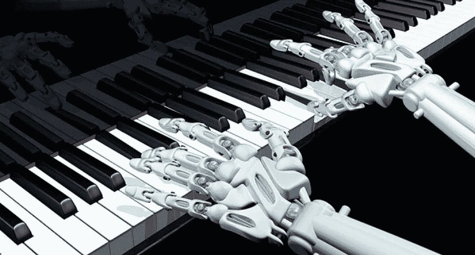
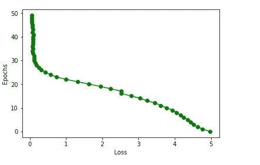

# LSTM 的音乐一代

> 原文：<https://medium.com/analytics-vidhya/music-generation-through-lstm-efd2c6ea9377?source=collection_archive---------8----------------------->

图片来源[此处](https://djmag.com/news/world%E2%80%99s-first-artificial-intelligence-music-producer-has-arrived)

在这篇文章中，我们解释的程序和方法用于建立一个自动音乐生成系统使用长短期记忆(LSTM)。LSTM 是递归神经网络的一种变体，广泛用于基于序列的模型。我们的项目旨在使用 LSTM 单元在现有音乐文件上训练模型后生成新的音乐作品。

# 介绍

音乐生成是一种依赖于时间的艺术形式，就像语音和视频一样。因此，为了生成音乐，我们不得不使用基于序列的模型。递归神经网络具有处理顺序数据的趋势，因此我们选择 RNNs 进行建模。传统的 RNNs 有两个主要问题，即消失梯度和爆炸梯度。为了解决这些主要问题，使用了长短期记忆(LSTM)和门控循环单位(GRU)。在这两项决议中，我们选择了 LSTM。LSTMs 需要学习更多的参数，但大多数情况下，与 GRUs 相比，LSTMs 给出的结果更好。该项目主要分为两个阶段。

第一阶段主要涉及数据预处理，第二阶段围绕模型构建。这两个阶段使用的工具和技术将在后面详细讨论。在第一阶段的数据收集阶段，我们没有遇到太多障碍。音乐文件很容易获得。处理阶段花费了大量的时间，因为我们必须为数据预处理探索新的工具和库。第二阶段，模型构建，也花费了相当多的时间，因为我们必须试验不同的模型，最终得出一个更适合我们数据的模型。

# 数据收集

我们收集的数据是 midi 格式的音频音乐文件。收集的数据类型是爵士乐。为了处理数据，我们使用了麻省理工学院的 music21 图书馆。该库使得从 MIDI 音乐文件中提取音符变得更加容易。根据要求对笔记进行了过滤。提取笔记名称后，笔记被保存在一个文件中供以后使用。音乐文件中的音符序列以一种可以输入模型进行训练的方式进行排列和分割。

# 模型架构

我们尝试了具有不同数量学习参数的不同模型架构，并比较了它们的结果。我们最终选择了最适合我们数据的模型配置。该配置包含两个 LSTM 层，随后是具有 Softmax 激活的完全连接的致密层。模型架构的框图如下所示。

模型架构

# 结果

我们用不同的超参数尝试了我们的最终模型。超参数包括学习率和时期数。最初，我们用 5 个时期训练我们的模型。模型结果非常糟糕。获得的损失值为 4.8656。该模型的性能如下图所示。

后来，我们在 50 个时期上尝试我们的模型，并且我们观察到损失减少到 0.0695。模特开始创作一些非常好听的钢琴曲子。模型性能可以可视化如下。

# 结论

我们关于通过 LSTMs 生成音乐的项目接受 MIDI 文件作为输入，从音乐文件中提取音符，将它们转换成文本表示，然后经过一些训练过程，在给定一些初始种子音符的情况下，生成新的音乐曲调。该模型在运行了 50 个时代后，产生了一些非常有效和流畅的曲调。最后记录的损失值为 0.0436。