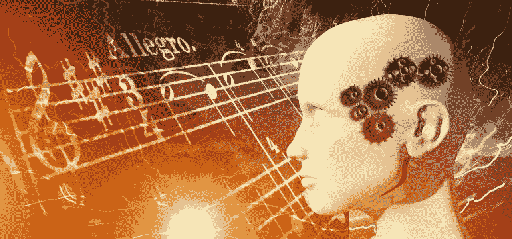
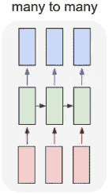
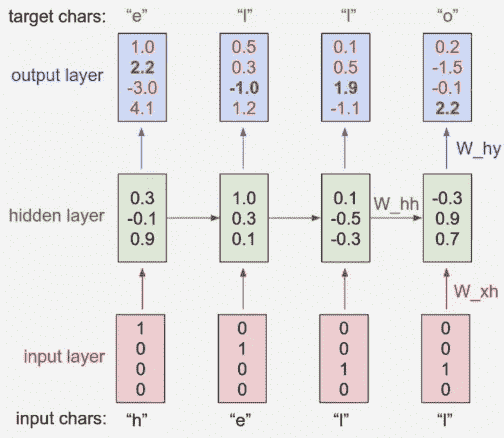
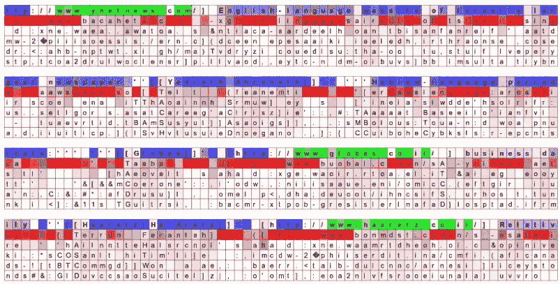
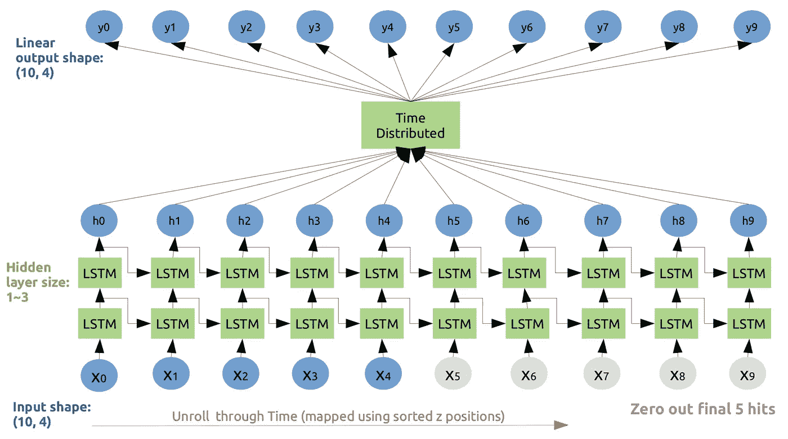
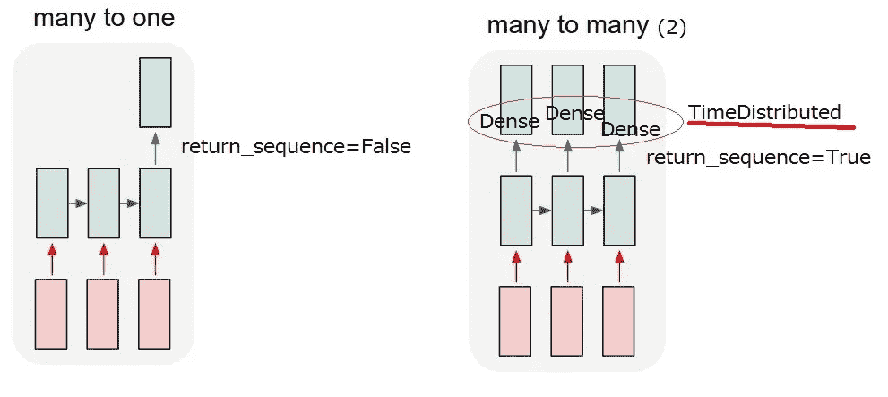
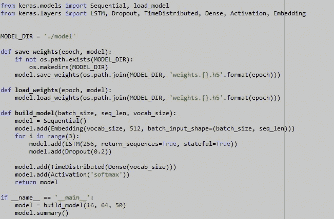
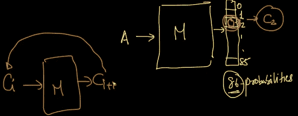

# 使用深度学习的音乐生成

> 原文：<https://medium.com/analytics-vidhya/music-generation-using-deep-learning-a2b2848ab177?source=collection_archive---------2----------------------->

“如果我能再活一次，我会定下规矩，每周至少读一次诗，听一次音乐。”――查尔斯·达尔文

生命存在于吉他锋利的钢丝上。一旦你跳了，它的回声会带给你巨大的无形的快乐。让我们来探索这种无形的快乐…

音乐不过是节点(事件)的序列。这里，模型的输入是一系列节点。

使用 RNNs 生成的一些音乐示例如下所示

 [## 民间 RNN -用递归神经网络生成民间曲调

### 机器民谣是一个社区网站，致力于由机器创作或与机器共同创作的民谣音乐…

folkrnn.org](https://folkrnn.org/) 

## 音乐表现:

1.  活页乐谱
2.  ABC 符号:它有一个字符序列，对于神经网络训练非常简单。https://en.wikipedia.org/wiki/ABC_notation
3.  MIDI:[https://towards data science . com/how-to-generate-music-using-a-lstm-neural-network-in-keras-68786834 D4 C5](https://towardsdatascience.com/how-to-generate-music-using-a-lstm-neural-network-in-keras-68786834d4c5)
4.  mp3-仅存储音频文件。

## 夏尔-RNN

这里我使用了查尔-RNN 结构(多对多 RNN)，其中一个输出对应于一个输入(输入 Ci -。>在每个时间步长(单元)输出 C(i+1))。它可以有多个隐藏层(多个 LSTM 层)。

## 可视化 RNN 的预测和“神经元”放电

在每个字符下，我们可视化(红色)模型为下一个字符分配的前 5 个猜测。根据猜测的概率进行着色(因此深红色=判断为非常可能，白色=不太可能)。输入字符序列(蓝色/绿色)基于 RNN 隐藏表示中随机选择的神经元的*触发*进行着色。把它想成绿色=非常激动，蓝色=不太激动。

 [## 递归神经网络的不合理有效性

### 递归神经网络(rnn)有一些神奇的东西。我仍然记得当我训练我的第一个循环…

karpathy.github.io](http://karpathy.github.io/2015/05/21/rnn-effectiveness/) 

## 流程:

1.  获取数据
2.  预处理(生成批处理 sgd)以馈入 char-RNN

请点击以下链接获取更多数据集。在这里，我只使用了 ABC 格式的[夹具](http://abc.sourceforge.net/NMD/nmd/jigs.txt) (340 首曲子)数据集。

 [## ABC 音乐项目-诺丁汉音乐数据库

### 维护者:詹姆斯·奥尔莱特(主页)下载埃里克维护的诺丁汉音乐数据库的收藏…

abc.sourceforge.net](http://abc.sourceforge.net/NMD/)  [## /~jc/music/book/oneills/1850/X 的索引

### ABC tune finder 页面并输入标题或标题片段。标有星号的曲子是奥尼尔的……

trillian.mit.edu](http://trillian.mit.edu/~jc/music/book/oneills/1850/X/) 

该数据集将使用 16 的批量大小输入到 RNN 训练中。

这里两个 LSTM 单元代表每个输入。输入 X0 进入第一输入层的所有 LSTM 单元。你将得到输出(h0)和信息发送到下一个时间步层。时间步长一的所有输出，LSTM_t1_1，LSTM_t1_2 连接到输出为 h0 的密集层。时间步长一的致密层称为**时间分布致密层**。下一个时间步也是如此。

1.  **Return sequence=True** 在 Keras 中，当您希望在时间戳序列中的每个输入处生成输出时使用。对于每个输入，我们需要输出的序列。相同的输入将到达每个单元，并在一个层中的每个单元产生输出。每一个时间步(I)，我们将得到一个输出向量(给定问题中的 256)。

 [## 重复层- Keras 文档

### 用于递归层的 keras . engine . Base _ layer . wrapped _ fn()基类。Arguments 单元格:RNN 单元格实例。一个 RNN 细胞…

keras.io](https://keras.io/layers/recurrent/#lstm) 

2.T **ime 分布密集层**。为了更好的理解，请跟随上面的讨论。在每个时间步长，它将获取所有 LSTM 输出，并构建大小为 86 的密集层。这里 86 是整个词汇表中唯一字符的数量。

**3。Stateful=True** ，批次中索引 I 处每个样本的最后状态将用作下一批次中索引 I 处样本的初始状态。它用在当你想把一批和第二批连接起来，第二批的输入是第一批的输出。在 stateful=false 的情况下，每个批次对第一个时间步长层的输入为零。

## 模型架构和培训:

这是一个多类分类，其中给定的输入，它将给出一个输出，该输出是字符总数中的任何一个。

训练模型在每次输入字符后生成 86 个字符。基于概率，它将决定最终的输出字符。

接下来，我们将 C(i+1)输入到模型中，它将生成 C(i+2)字符。这将继续下去，直到所有批次的字符饲料的全部数据。

## 输出:

打开下面的链接并粘贴你生成的音乐给定空间以便播放。

 [## abcjs 编辑器

### abcjs 是一个开源的 javascript 渲染引擎，用于解释 abc 格式的曲调。它将呈现活页乐谱…

www.abcjs.net](https://www.abcjs.net/abcjs-editor.html) 

# 对于 Tabla 音乐:

如果你能把每个序列都变成一个字符，那么你可以使用上面的夏尔-RNN 模型。详细了解请阅读以下博客。

 [## 机器学习演奏塔布拉

### 更新:这篇文章现在有第二部分。如果你关注新闻中的机器学习话题，我相信现在你已经…

www.trivedigaurav.com](https://www.trivedigaurav.com/blog/machines-learn-to-play-tabla/)  [## 机器学习玩塔布拉，第 2 部分

### 这是我之前关于机器学习玩塔布拉的后续文章。你可能希望它先看看这个…

www.trivedigaurav.com](https://www.trivedigaurav.com/blog/machines-learn-to-play-tabla-part-2/) 

# MIDI 音乐一代:

这里我们将使用 Music21 python 库来读取 MIDI 文件并能够转换成事件序列。详细了解请阅读以下博客。

 [## 如何在 Keras 中使用 LSTM 神经网络生成音乐

### 使用 LSTM 神经网络创作音乐的介绍

towardsdatascience.com](https://towardsdatascience.com/how-to-generate-music-using-a-lstm-neural-network-in-keras-68786834d4c5)  [## 斯库尔杜尔/古典钢琴作曲家

### 这个项目允许你训练一个神经网络来生成 midi 音乐文件，利用单个乐器…

github.com](https://github.com/Skuldur/Classical-Piano-Composer) 

# 除夏尔 than 之外的模特(最近的博客):

它的调查博客，除了基于神经网络的夏尔-RNN 模型之外，有所有的模型。想探索请跟随。

 [## 用于生成音乐的神经网络

### 算法音乐创作在过去的几年里有了很大的发展，但是这个想法已经有很长的历史了。在一些…

medium.com](/artists-and-machine-intelligence/neural-nets-for-generating-music-f46dffac21c0) 

**谷歌音乐创作项目:**

基于 Tensorflow 和谷歌研究员 LSTM 的项目。

 [## 品红

### 一个开源研究项目，探索机器学习作为一种工具在创作过程中的作用。洋红色是…

magenta.tensorflow.org](https://magenta.tensorflow.org/) 

# 参考:

谷歌图片(图片)休息链接在各自的部分

======= **感谢(爱听你的一面)** ========

在我的 GitHub 帐户上查找详细代码…

 [## Rana Singh-gkp/Music _ generation _ char-RNN

### 受 karpathy/char-rnn 的启发，多层递归神经网络用于从文本中训练和采样。喀拉山…

github.com](https://github.com/ranasingh-gkp/Music_generation_char-RNN)