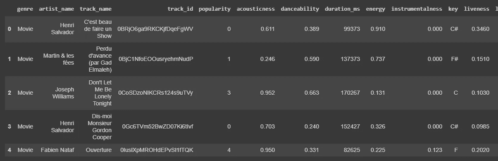
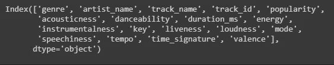
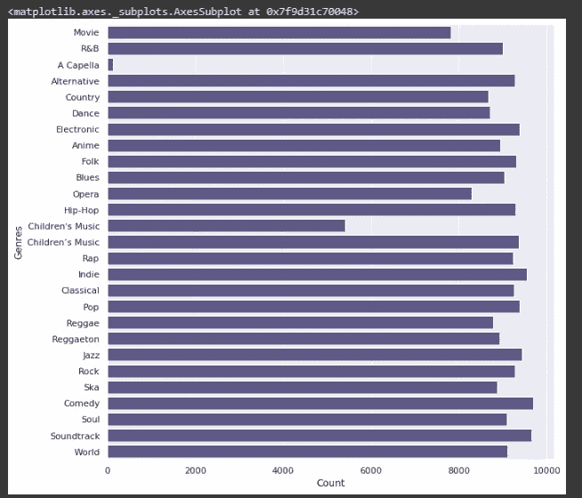
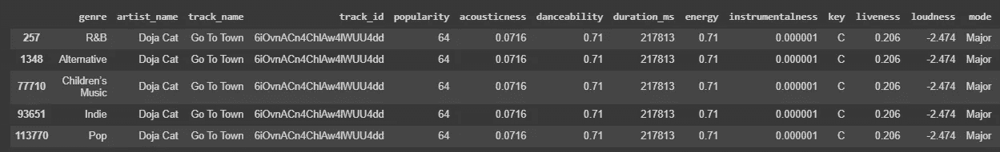

# 音乐流派分类

> 原文：<https://medium.com/analytics-vidhya/music-genre-classification-c9a52d89e07d?source=collection_archive---------19----------------------->


娜塔莉·卡多纳在 [Unsplash](https://unsplash.com?utm_source=medium&utm_medium=referral) 上的照片

在做了关于情感分析和聚类的小项目后，我想做一个关于分类的项目。你会说，在 CNN 的帮助下做一个图像分类。但是我想做一些不同的事情，介入**音乐流派分类。**

在 Kaggle 上搜索数据集后，我找到了[一个](https://www.kaggle.com/zaheenhamidani/ultimate-spotify-tracks-db)，其中包含了从 Spotify 中提取的歌曲特征，如流派、流行度、可跳性、效价、节奏等。



df.head()

数据集中所有列的列表



df.columns

现在分析我们想要预测的流派列。



我们看到，与其他流派相比，“五车二”流派的歌曲非常少。从而造成阶层失衡。我们稍后将删除它，以便它不会影响分类器的性能。

接下来检查是否有任何缺失值和重复值。对缺失值的检查返回 0，这表明数据集是完整的。对于重复值，有一个异常(al)宋。



另一个对分类器性能有严重影响的统计数据。

为了使我们的数据为我们的分类做好准备，我们将执行以下操作:

*   删除诸如艺术家姓名、曲目名称和曲目 id 之类的与预测歌曲流派毫无关系的列

```
unused_col = ['artist_name', 'track_name', 'track_id']df = df.drop(columns=unused_col).reset_index(drop=True)
```

*   从数据集中删除五车二流派

```
df = df[df['genre'] != 'A Capella']
```

*   将分类值更改为数值或布尔值。

```
mode_dict = {'Major' : 1, 'Minor' : 0}key_dict = {'C' : 1, 'C#' : 2, 'D' : 3, 'D#' : 4, 'E' : 5, 'F' : 6,'F#' : 7, 'G' : 9, 'G#' : 10, 'A' : 11, 'A#' : 12, 'B' : 12}df['time_signature'] = df['time_signature'].apply(lambda x : int(x[0])) //converting fraction into whole number since denominator is commondf['mode'].replace(mode_dict, inplace=True)df['key'] = df['key'].replace(key_dict).astype(int)
```

数据现在可以进行分类了。我决定用三个分类器——逻辑回归、随机森林和决策树。对于这些数据中的每一个，都被分成 30%的测试数据和 70%的训练数据。

第一，逻辑回归。这种分类模型更适合二进制分类，但是我仍然决定使用它，因为 Scikit Learn 提供了一个多类分类的选项。

```
lr_model = LogisticRegression(multi_class = 'multinomial', solver='lbfgs', max_iter=500, verbose=1)
```

不幸的是，这仅产生了 11%的准确度(

第二，随机森林分类器。这可以被认为是决策树分类器的变异版本。在大多数情况下，随机树分类器比决策树分类器具有更好的准确性，让我们看看在我们的情况下会发生什么。

```
rfc_model = RandomForestClassifier(n_estimators=50, random_state=5, verbose=1)
```

这给我们带来了 37%的准确率。不够好，但比逻辑回归好得多。

最后，决策树分类器。

```
dt_model = DecisionTreeClassifier(max_depth=10, random_state=20)
```

显然，这也给我们带来了 37%的准确率。因此，对于我们的数据，随机森林和决策树的性能是相同的。

最终，这是我在分类器世界中的一小步。通过调整一些参数可以提高分类器的性能。我稍后会深入探讨这个问题，并写一些其他的帖子，因为这是一个完全不同的话题。